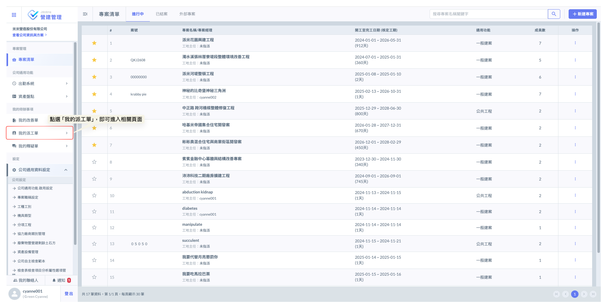
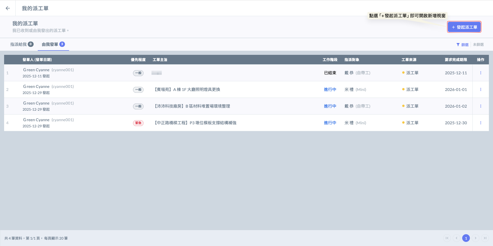
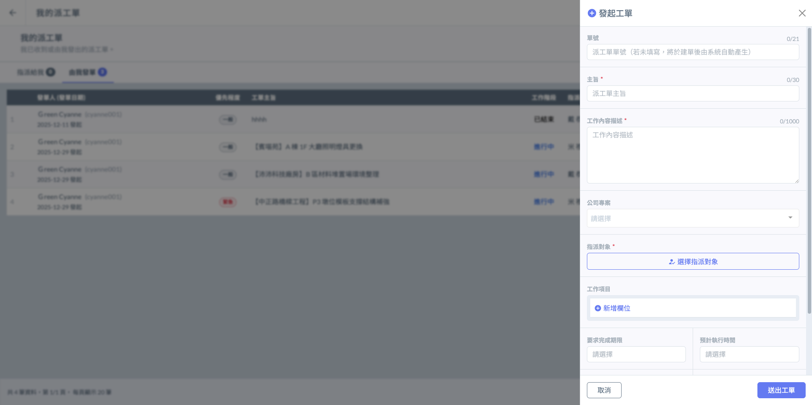
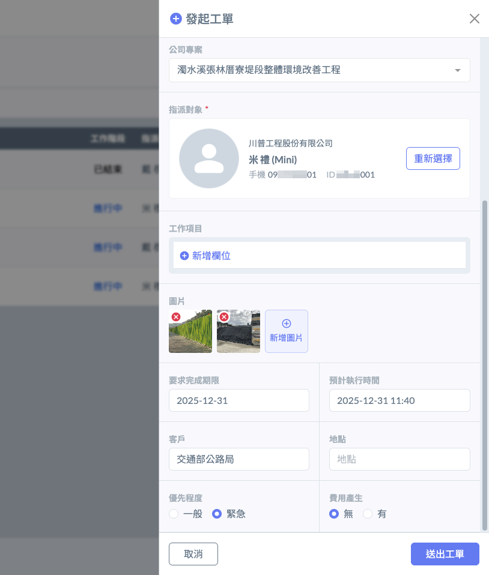
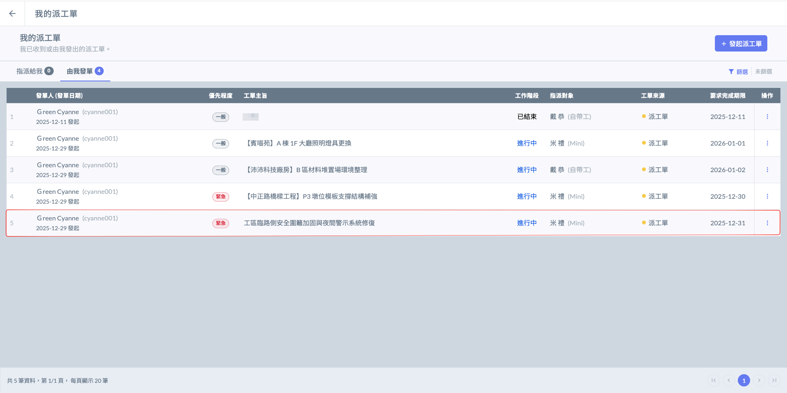
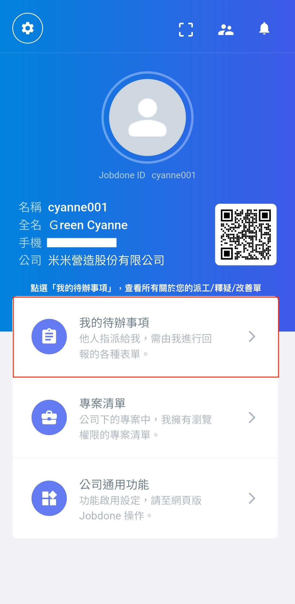
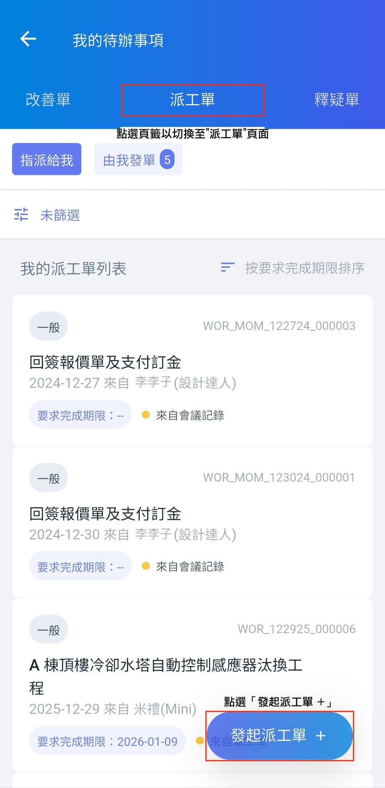
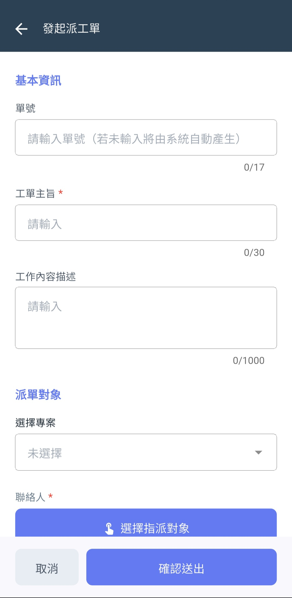

# 發起派工單

### 網頁版

登入系統首頁後，於左側導覽列的<kbd>**我的待辦事項**</kbd>欄位中點選<kbd>**我的派工單**</kbd>，即可進入專屬管理頁面。在此您可以一目了然地查閱所有與您相關的單據，包含待辦工項、由您發起等即時狀態。

如圖二，進入派工單管理頁面後，點擊右上角之<kbd><mark style="color:purple;">**+發起派工單**<mark style="color:purple;"></kbd>按鈕，即可開始編輯派工作業內容。填寫完畢後，指派對應的收單負責人或相關處理人員，確保問題能精準傳遞至權責單位進行回覆。

如圖三，派工單畫面如下：

***

如圖四、圖五，詳細填寫您的派工單資訊並指派人員。資料談寫完畢並確認無誤後，點選下方<kbd><mark style="color:purple;">**送出工單**<mark style="color:purple;"></kbd>。

有關欄位填寫相關說明，請參閱 ➙ [**我的派工單-欄位說明**](..#lan-wei-shuo-ming)

 

如圖六，發單成功後，即會顯示於派工單列表，並可即時追蹤該單執行進度(<kbd><mark style="color:blue;">**進行中**<mark style="color:blue;"></kbd>/<kbd>**已結案**</kbd>)。

***

### App 版

登入 App 首頁後，點選下方的<kbd>**我的待辦事項**</kbd>並切換至<kbd>**派工單**</kbd>頁籤，即可進入個人專屬的管理頁面，讓您一目了然地查閱所有相關單據，包含待處理工項及由您發起的即時進度狀態，確保各項任務不遺漏。

如圖二，切換至派工單頁面後，點選右下角的  圖示，即可開始編輯派工作業內容。填寫完畢後，指派對應的收單負責人或相關處理人員，確保問題能精準傳遞至權責單位進行回覆。

  

