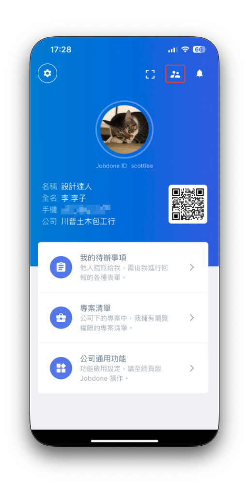
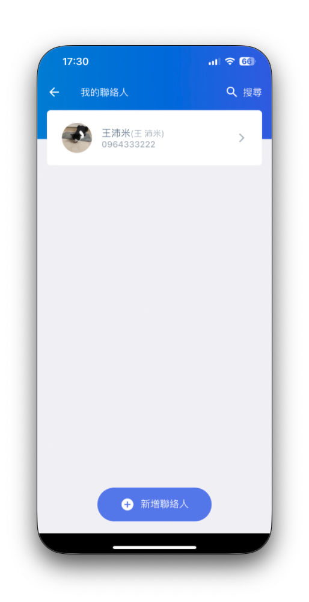
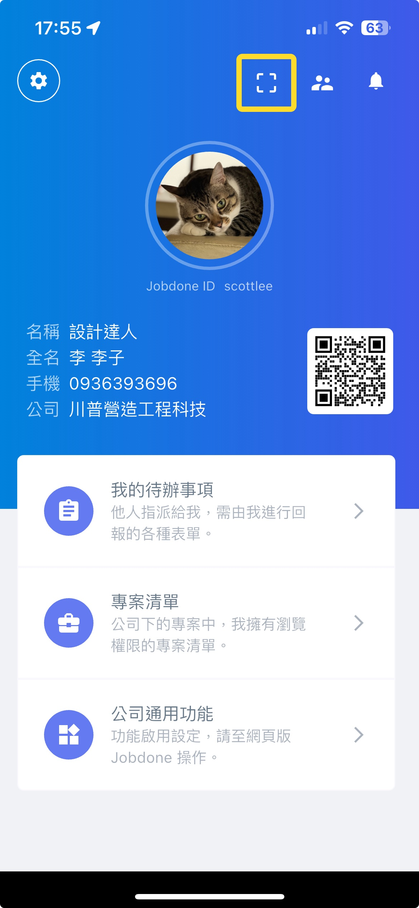

# 我的聯絡人

從APP右上方的圖示進入 「我的聯絡人」 ，可以新增或刪除你的聯絡人列表。

我的聯絡人，跟LINE或電話簿一樣，可以將沒有被列進專案內的其它可能相關的人員，加入到你的聯絡人。方便在各種跨專案的應用中，可以快速的選人。

 

你可以透過搜尋電話。或者若對方在你身邊，可以像LINE一樣，直接打開QR Code掃描。就可以將對方加入聯絡人。但跟LINE不一樣的是，這不是自動加為好友，而是像電話簿的聯絡人，所以若是對方也要加你為聯絡人，他也需要再掃描一次。

