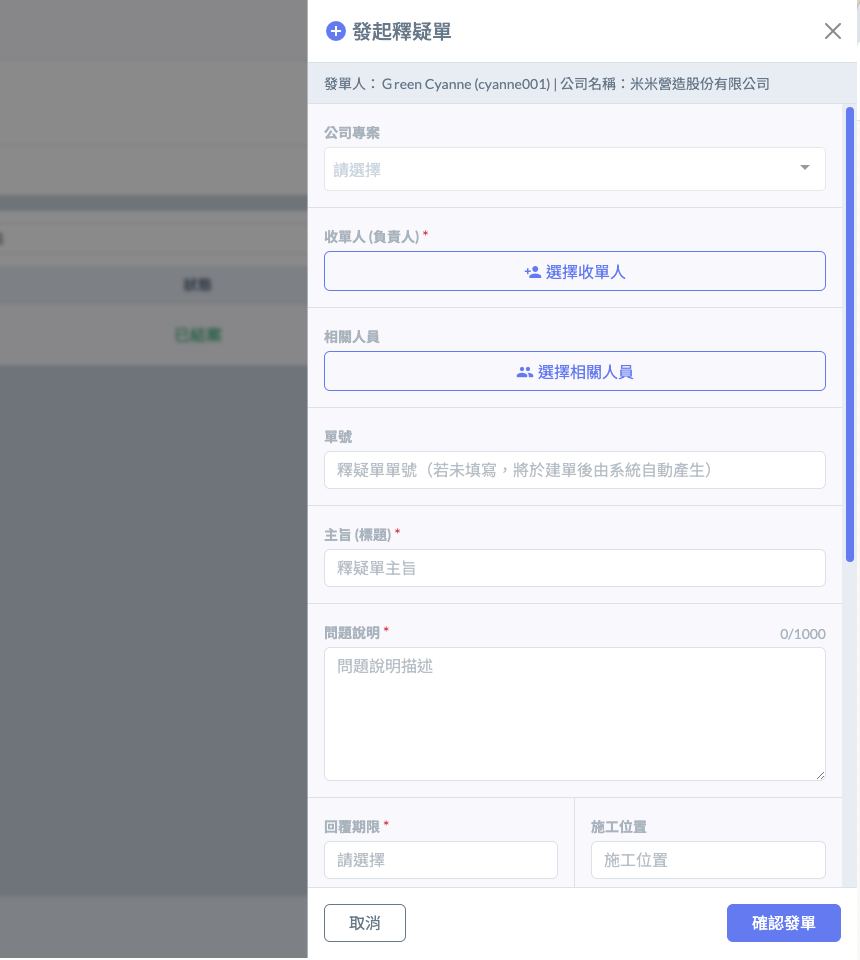
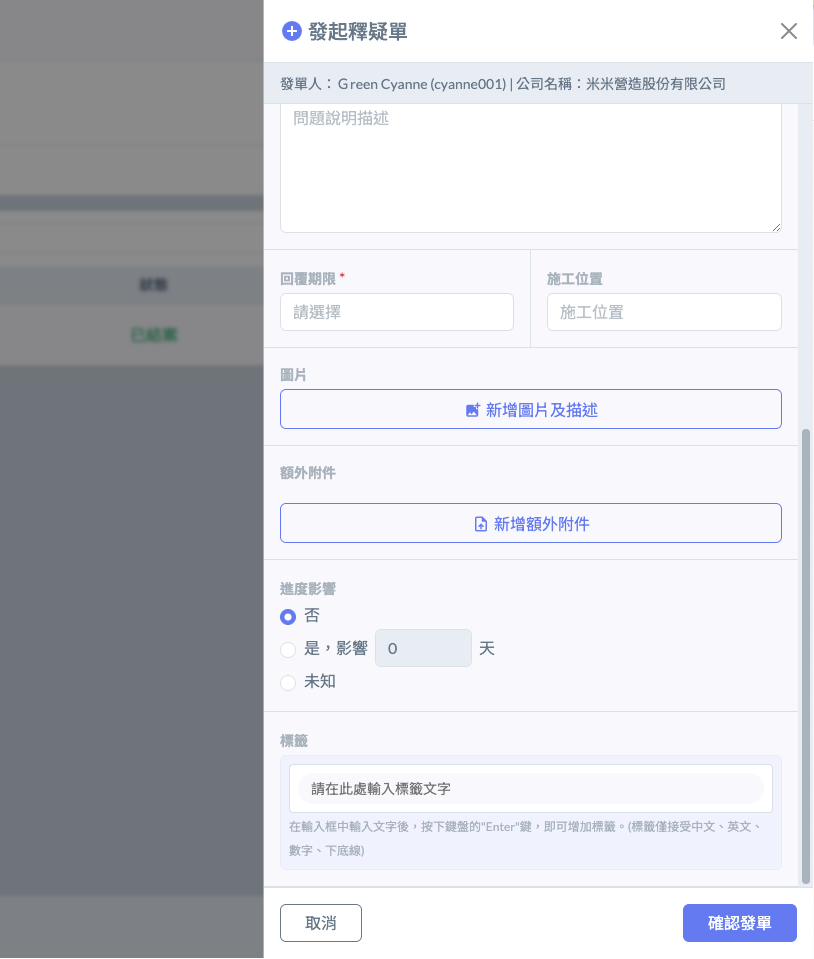

# 我的釋疑單( RFI )

---
description: My Request For Information
---

# 我的釋疑單( RFI )

!!! info
    釋疑單是一個跨團隊組織的功能，任何人都可以發起釋疑單，不必有專案或企業版的授權。

釋疑單（Request for Information, RFI），於業界常稱為「工詢單」。本功能旨在建立一個標準化的溝通管道，處理施工過程中涉及圖說疑義、合約規範矛盾、或現場環境與設計不符之事項。透過數位化管理，確保每一個技術問題都能由具備權責之人員給予正式回覆，並將溝通過程完整紀錄，以作為日後變更設計、工期展延或合約糾紛之佐證。

***

### 欄位說明 

為加速審核流程並減少認知差異，發起釋疑單時應遵循以下結構：



應包含位置與問題類別（例：3F 梁柱接頭鋼筋配置疑義）。



清晰說明現場遇到的物理限制或圖說矛盾點。



為防止溝通延宕影響施工進度，發起人應根據問題的「緊急程度」自行設定回覆期限。



需針對您所發起之釋疑進行回報與說明之人員。

(選擇要發問的對象，可能是上包負責人、業主、設計、監造等，您認為有權限回答該議題之人員)



可上傳關聯之施工照片、標註後之設計圖說或相關規範截圖。&#x20;



!!! info
    1. 若發起人有選擇<kbd>**公司專案**</kbd>，則該釋疑單會顯示在對應之專案紀錄中；若未建立專案，則顯示於個人紀錄中。
    2. 針對<kbd>**單號**</kbd>部份，若您有自訂的編號規則，可填；若空白，則該單號將由系統自動生成。
    3. 若需未來方便管理與歸納，針對不同事項、緣由之釋疑單，您可自定義各釋疑單之<kbd>**標籤**</kbd>。

 

