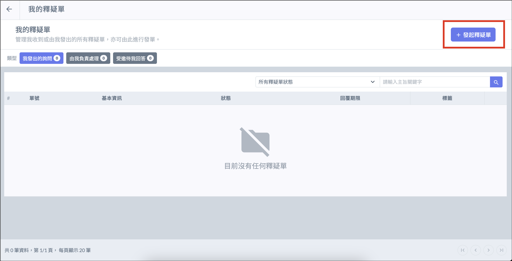
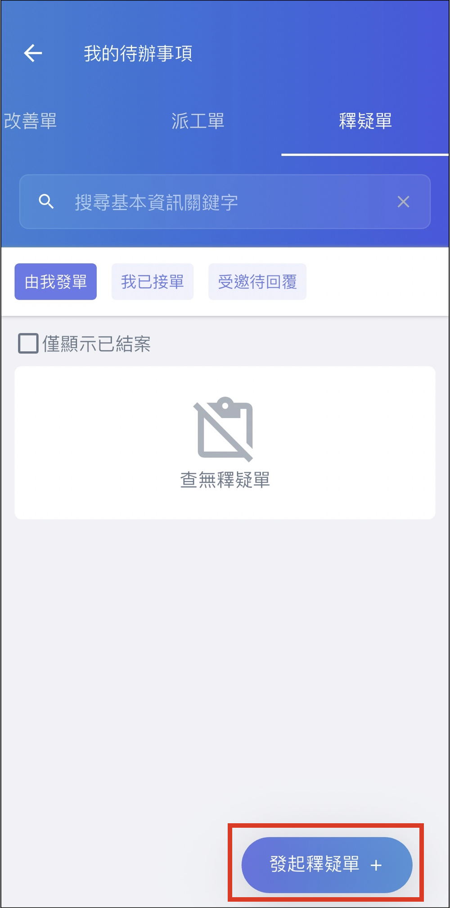

# 發起釋疑單

## 網頁版

登入主頁面以後，點選左側列表中的 「 我的釋疑單 」  進入，列表會出現的是所有與 「 個人有關 」 的釋疑單，若要發起釋疑單，請按右上角的 「 +發起釋疑單 」 按鈕。

## APP 

登入APP後，點選 「 我的待辦事項 」 ，並點選 「 釋疑單 」 ，列表會出現的是所有與 「 個人有關 」 的釋疑單，若要發起釋疑單，請按右下角的 「 發起釋疑單+ 」 按鈕。。

