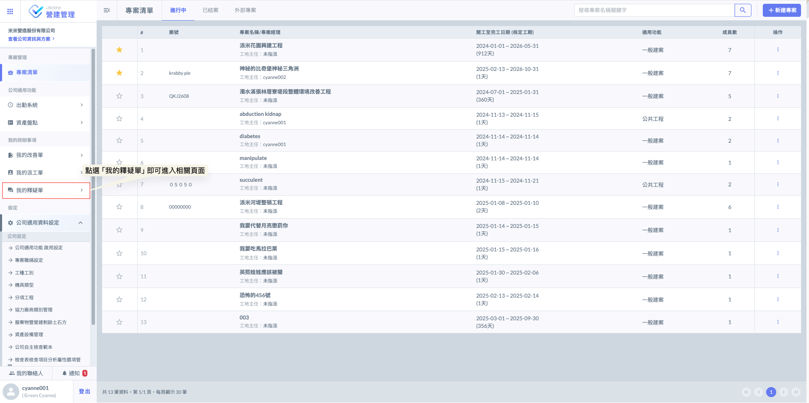
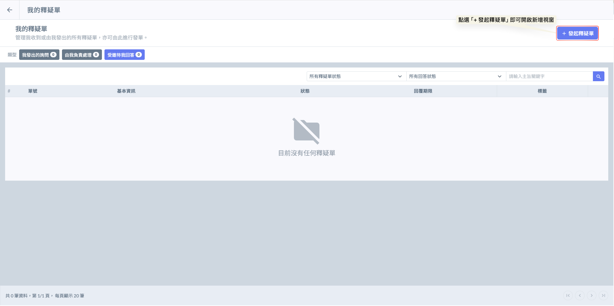
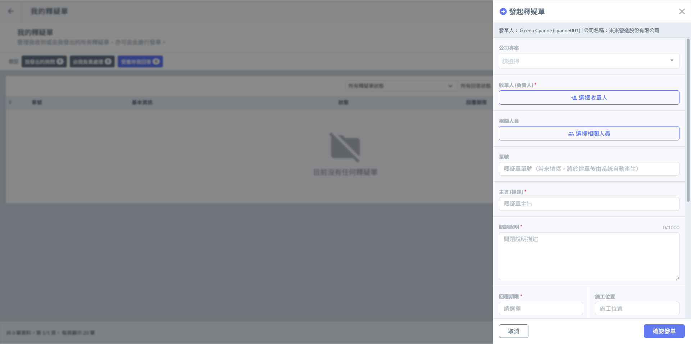
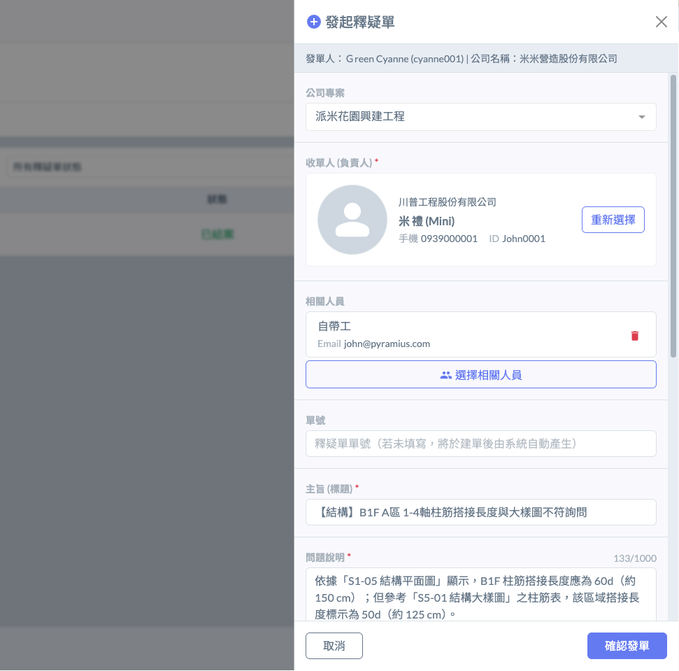
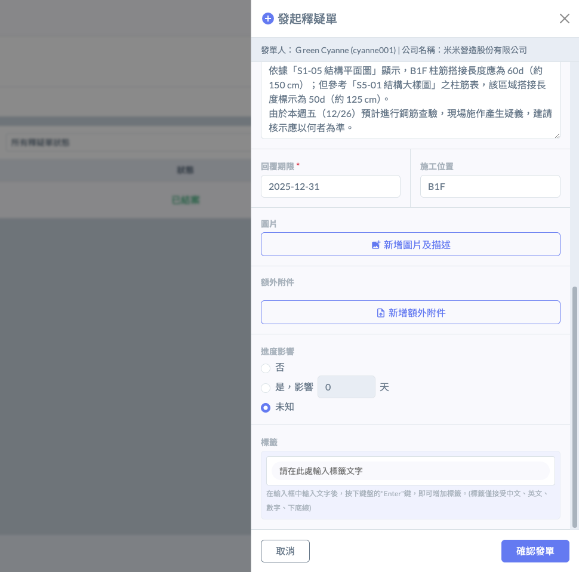
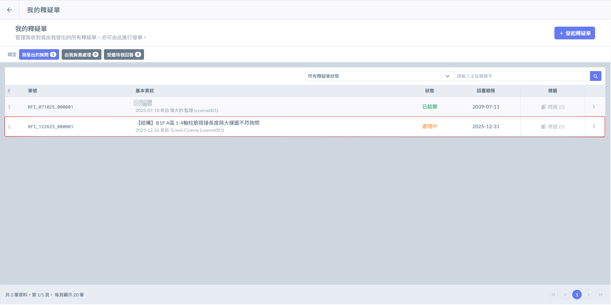
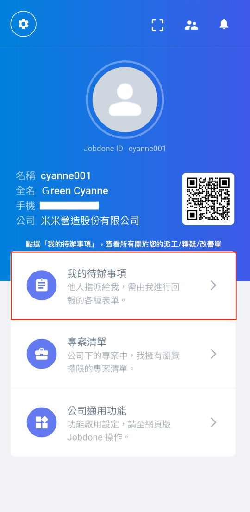
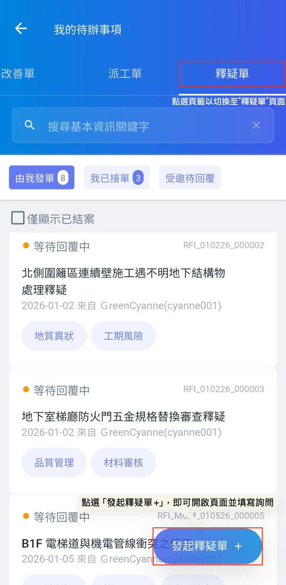
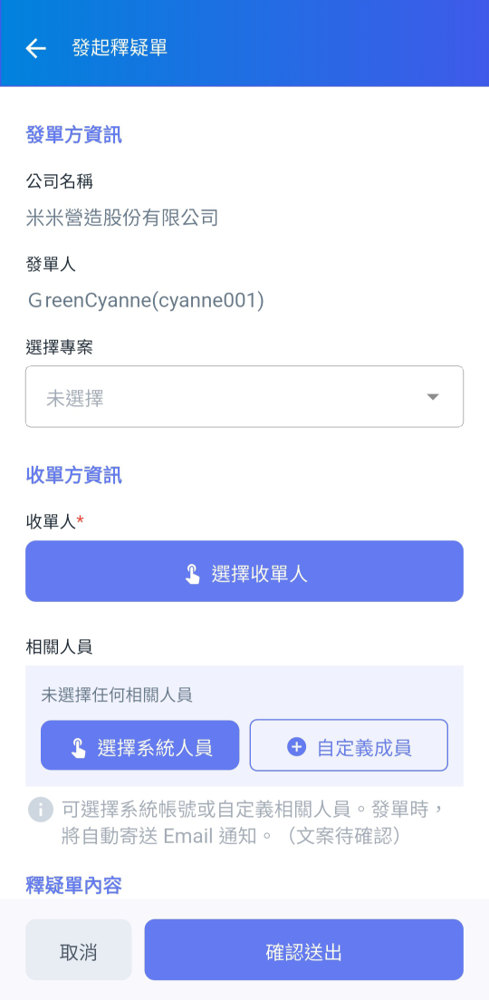

# 發起釋疑單

---
description: RFI
---

# 發起釋疑單

!!! tip
    <kbd><mark style="color:red;">**想問就問！發起/回覆釋疑單完全免費。**<mark style="color:red;"></kbd>
    
    本系統之「釋疑單」功能採極大化協作設計。為確保工程資訊不因權限而中斷，發起功能完全開放。
    
    使用者無須受限於企業版或專案版授權，即便非公司內部成員（如分包單位、點工或專業顧問），亦可直接發起詢問。這確保了現場最前線的聲音能即時傳遞至核心決策者手中，達到真正的「跨組織協作，零成本溝通」。

***

### 網頁版

登入系統首頁後，於左側導覽列的<kbd>**我的待辦事項**</kbd>欄位中點選<kbd>**我的釋疑單**</kbd>，即可進入專屬管理頁面。在此您可以一目了然地查閱所有與您相關的單據，包含待辦回覆、由您發起及由您處理等即時狀態。

如圖二，進入釋疑單管理頁面後，點擊右上角之<kbd><mark style="color:purple;">**+發起釋疑單**<mark style="color:purple;"></kbd>按鈕，即可開始編輯詢問內容。填寫完畢後，指派對應的收單負責人或相關處理人員，確保問題能精準傳遞至權責單位進行回覆。

如圖三，釋疑單畫面如下：

***

如圖四、圖五，詳細填寫您的釋疑單資訊並指派人員。資料填寫完畢並確認無誤後，點選下方<kbd><mark style="color:purple;">**確認發單**<mark style="color:purple;"></kbd>。

有關欄位填寫相關說明，請參閱  ➙ [**我的釋疑單-欄位說明**](..#rfi)

 

如圖六，發單成功後，即會顯示於釋疑單列表，並即時追蹤該單執行進度(<kbd><mark style="color:orange;">處理中<mark style="color:orange;"></kbd>/<kbd><mark style="color:green;">已結案<mark style="color:green;"></kbd>)。

***

### APP 版 

登入 App 首頁後，點選下方的<kbd>**我的待辦事項**</kbd>並切換至<kbd>**釋疑單**</kbd>頁籤，即可進入個人專屬的管理頁面。在此您可以一目了然地查閱所有與您相關的單據，包含待辦回覆、由您發起及由您處理等即時狀態。

如圖二，切換至釋疑單頁面後，點選右下角的  圖示，即可開始編輯詢問內容。填寫完畢後，指派對應的收單負責人或相關處理人員，確保問題能精準傳遞至權責單位進行回覆。

  

