# 釋疑單回覆

### 01｜負責人



#### 查看待處理之釋疑單

進入我的釋疑單頁面後，點選<kbd><mark style="color:purple;">**由我負責處理**<mark style="color:purple;"></kbd>分頁，即可快速查看所有待您回覆與處理的釋疑單。

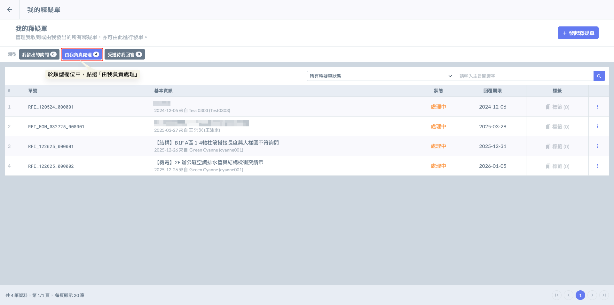



#### 選擇欲回報之釋疑單

如圖二，點選釋疑單，即可開啟該釋疑單，並查看其問題描述及相關資訊等等。

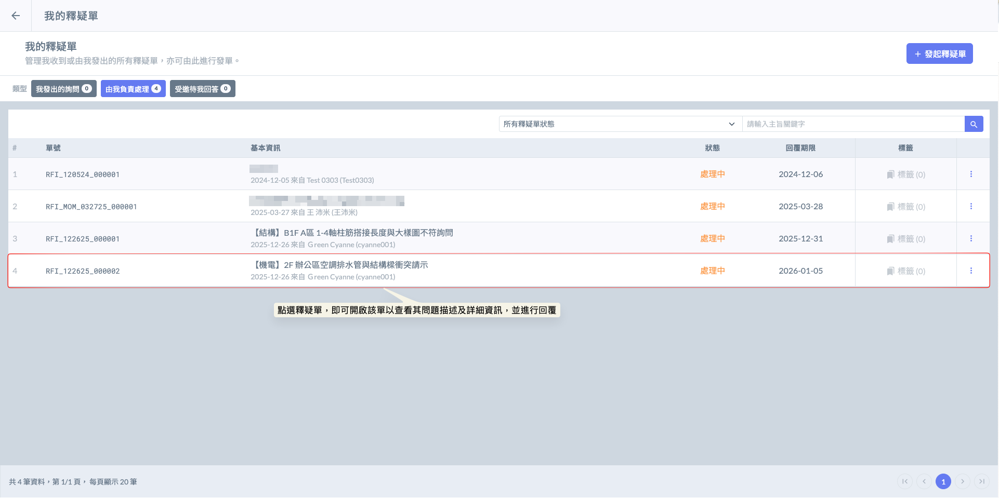



#### 選擇專案

若發起人與負責人隸屬不同公司，負責人在接收單據時，系統將提示是否將此單納入特定公司專案。一旦選定專案，該單據將同步於公司內部共享；若選擇略過此步驟，則該單據僅限負責人本人(及相關人員)查看，其他機構成員將無權檢視，以確保資訊的隱私性或獨立性。



將此單歸檔至公司專案下，授權專案成員共同檢視。



此單將不進入專案清單，僅限您（負責人）本人處理與查看。



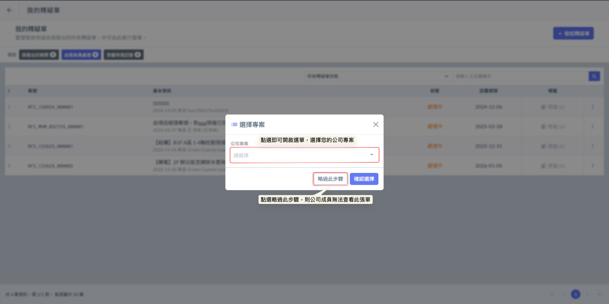



#### 查看問題描述與詳細資訊

如圖三，開啟釋疑單後，您即可查看該單問題描述及詳細資訊。

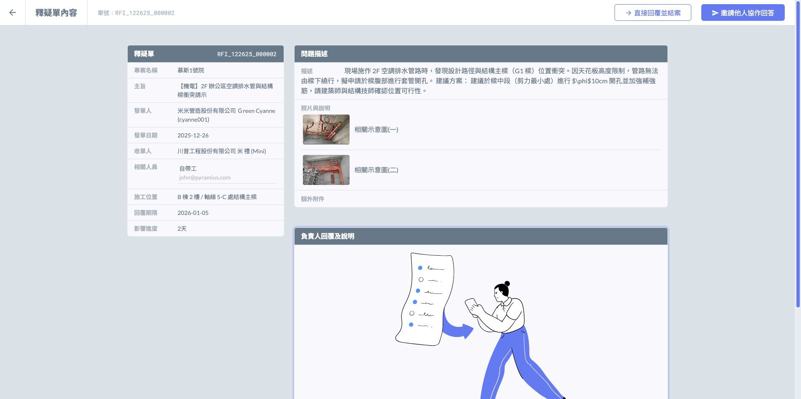



#### 釋疑單操作

接收釋疑單後，負責人可根據問題性質採取以下三種處理方式：



若收單人判斷該問題不在其權責範圍，或應由專案內其他專業工程師辦理，可使用「轉發」功能將單據移交。轉發後，處理權責將同步移轉至新負責人。



若收單人對問題已有明確指示，可直接輸入答覆內容並送出。單據送出後將立即轉為「結案」狀態，發起人亦會同步收到正式回覆通知。



若問題性質複雜，需跨單位或跨領域人員參與討論：

* 責任留存： 原始收單人仍維持為最終「責任人」，負責審核與結案。
* 跨界協作： 可邀請專案外或公司外的專業人士協助。系統支援同時邀請多位人員參與討論，彙整各方意見後，再由責任人統一給予正式回覆。



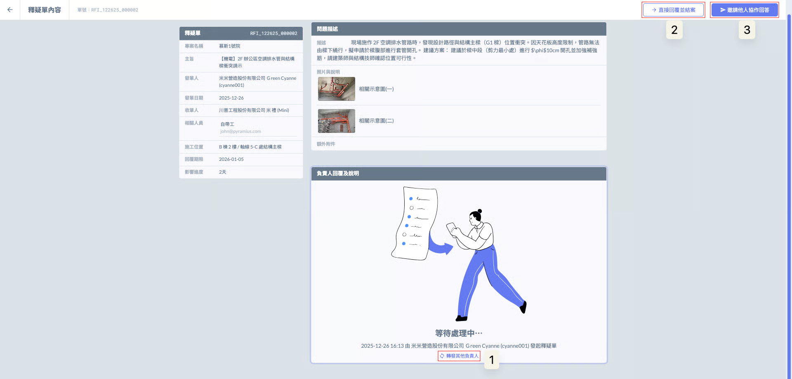

#### 1. 轉發其他負責人

點選<kbd><mark style="color:purple;">**轉發其他負責人**<mark style="color:purple;"></kbd>後，系統將開啟成員選單，您可以從專案成員清單中，選擇合適的人員並將該釋疑單轉派給他。

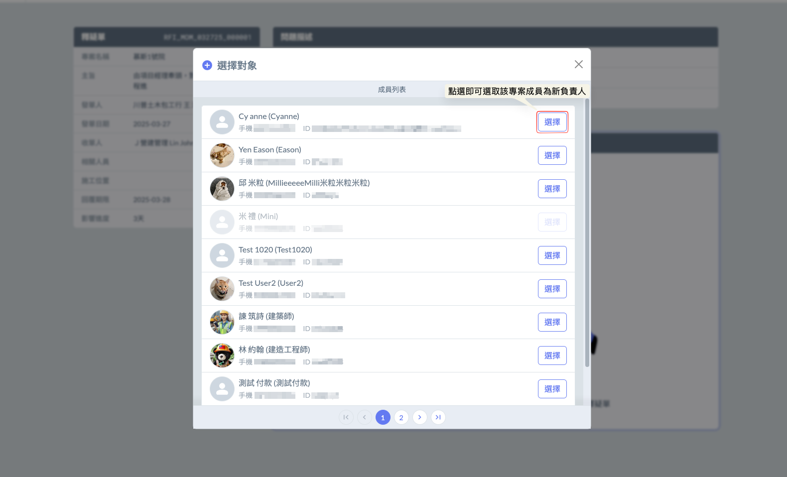

如圖六，確認受派人員無誤後，點選<kbd><mark style="color:purple;">**確定**<mark style="color:purple;"></kbd>即可完成轉派動作。&#x20;

!!! warning
    請注意： 一旦完成轉派，該單據的處理權責將移轉，您將不再擁有該單據的編輯權限。

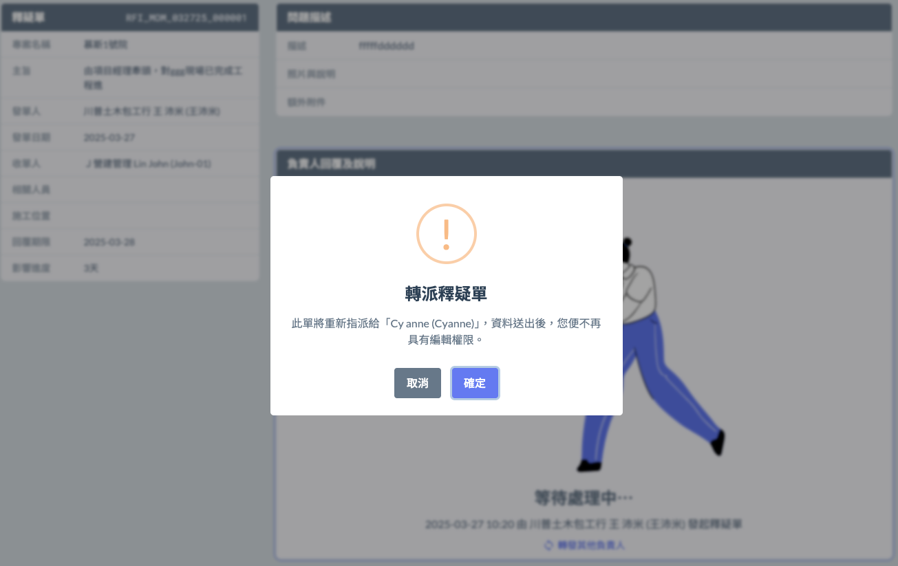

***

#### 2. 直接回覆並結案

點選<kbd><mark style="color:purple;">**直接回覆並結案**<mark style="color:purple;"></kbd>後，即可開啟視窗填寫釋疑單回覆。

(含：解決方式、是否產生設計變動、是否影響時程、是否產生成本變更及是否產生圖面修正等)



針對發起人提出的問題，給予正式且明確的技術指引或處置對策。回覆內容應具備可執行性，必要時請上傳圖標或參考文件作為附件。



是： 代表此釋疑之回覆內容涉及原設計圖說之更動，結案後需通知設計單位進行變更流程。

否： 僅為現況解釋或技術澄清，未改變原設計。



評估此處置方案對工期進度的實際影響。



涉及工程結算的關鍵判斷：

是： 代表此回覆涉及材料變更、工法加價或工項增加，將作為日後追加減金額的基礎。

否： 屬於合約原定範疇或施工廠商應盡責任，無額外費用。



是： 回覆內容與原發布圖說有異，需重新出圖或在竣工圖上進行修正。

否： 依原圖施作即可。



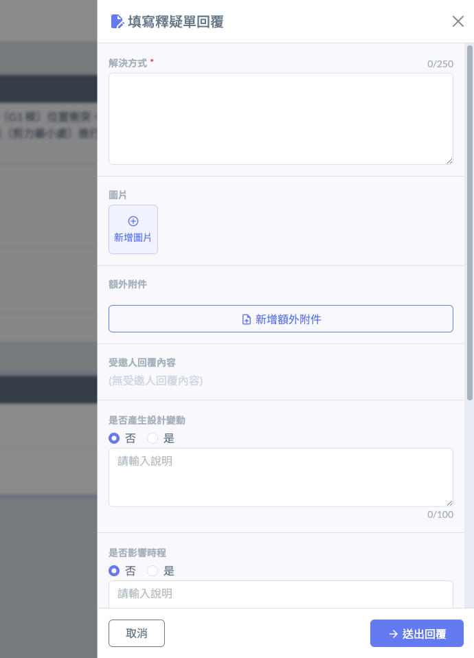 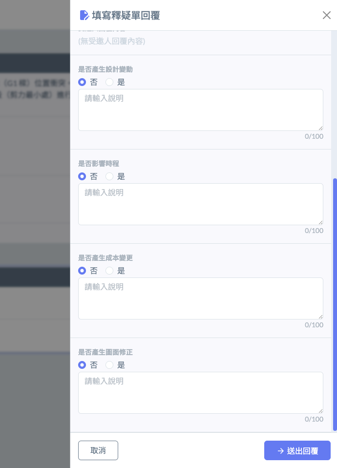

***

#### 3. 邀請他人協作回答

您可參考各方意見，請相關成員提供建議的解決方式。

點選<kbd><mark style="color:purple;">**邀請他人協作回答**<mark style="color:purple;"></kbd>後，即可開啟視窗，再點選<kbd><mark style="color:purple;">**選擇回答人**<mark style="color:purple;"></kbd>，選擇成員。

!!! warning
    一旦啟動「邀請協作」流程，責任人將鎖定為您本人，系統將關閉轉發功能（無法再將單據轉交給其他負責人）。請確認您為該問題之最終負責人後，再啟動協作邀請。

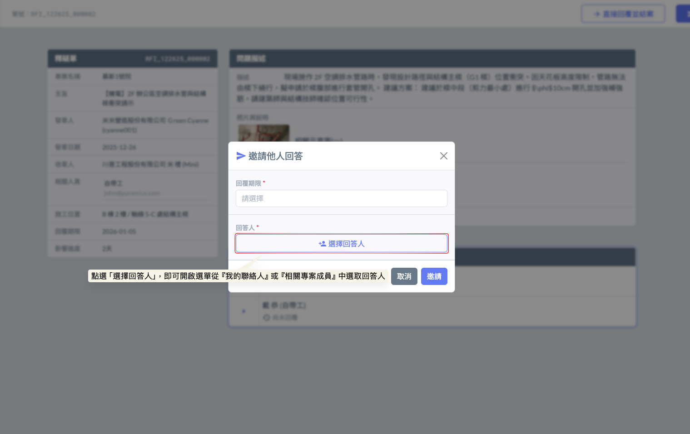

如圖十所示，所有受邀之協作人員將條列於單據下方的『受邀人回覆列表』欄位；負責人可透過此列表隨時追蹤各方的回覆進度，並即時查閱已產生的專業建議內容。

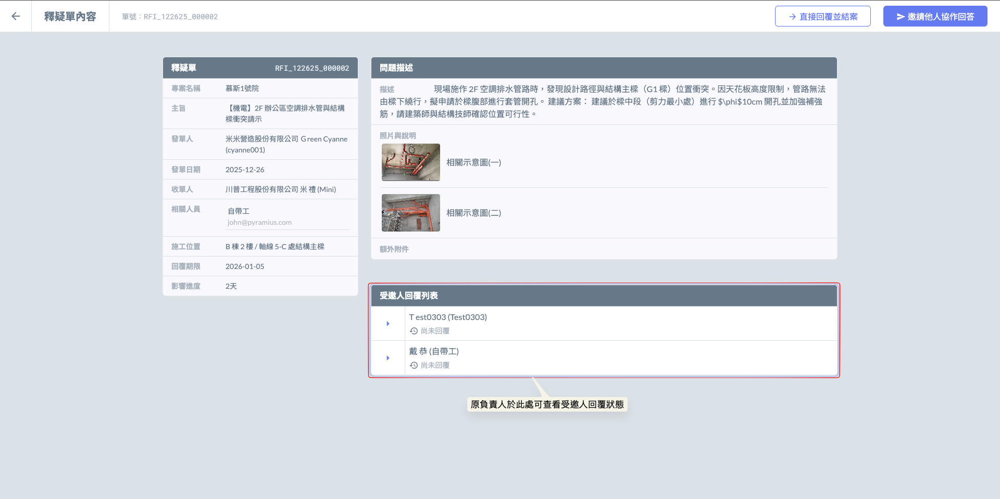

當負責人啟動協作機制後，系統將實時彙整各方意見，負責人可隨時在管理畫面中查閱所有受邀者的回覆結果。

在協作過程中，負責人擁有最終的主導權，可視專業需求隨時「再邀請其他人協作回答」以擴大諮詢範圍；或在資訊充足後，參考各方專業建議作出最終總結，點選「直接回覆並結案」以正式答覆原提問人。

!!! warning
    受邀人僅提供技術性的解決方案，而負責人則負責彙整這些建議並完成後續的變動評估與結案動作。

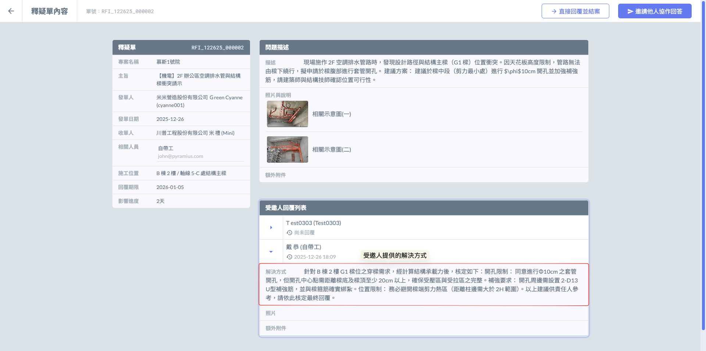

如圖十二，待相關建議及資訊充足後，負責人即可直接整合並填寫相對應之分析。

待資料填寫完成並確認無誤後，即可點選<kbd><mark style="color:purple;">**送出回覆**<mark style="color:purple;"></kbd>以結案。

!!! danger
    #### 請注意
    
    當原提問人接收到正式回覆後，該筆釋疑單流程即宣告終結並自動歸檔。若提問人對回覆內容仍有疑義或產生衍生問題，應視為新事項並重新發起一份釋疑單，以確保每一項決策紀錄的獨立性與追蹤之精確性。

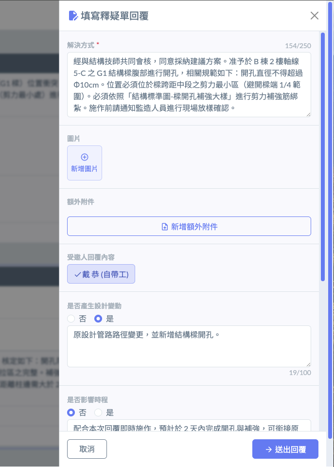 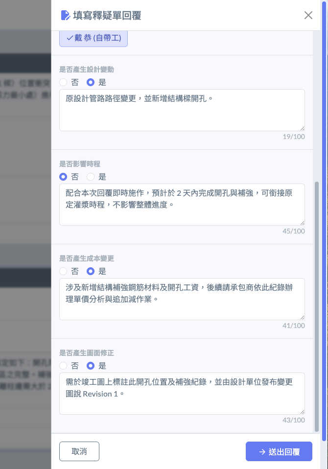




***

### 02｜受邀回答者



#### 查看被邀請之釋疑單

受邀回答者可以於<kbd><mark style="color:purple;">**受邀待我回答**<mark style="color:purple;"></kbd>的頁籤中看到該釋疑單，點選即可打開該釋疑單填寫相關回覆。

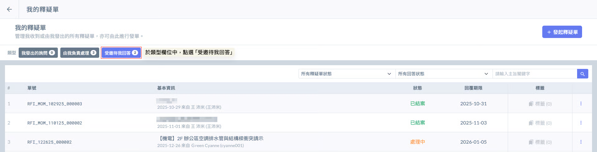



#### 選取欲回覆之釋疑單

如圖二，選擇欲回覆之釋疑單，開啟後即可於右上角點選<kbd><mark style="color:purple;">**+填寫回覆**<mark style="color:purple;"></kbd>作答。

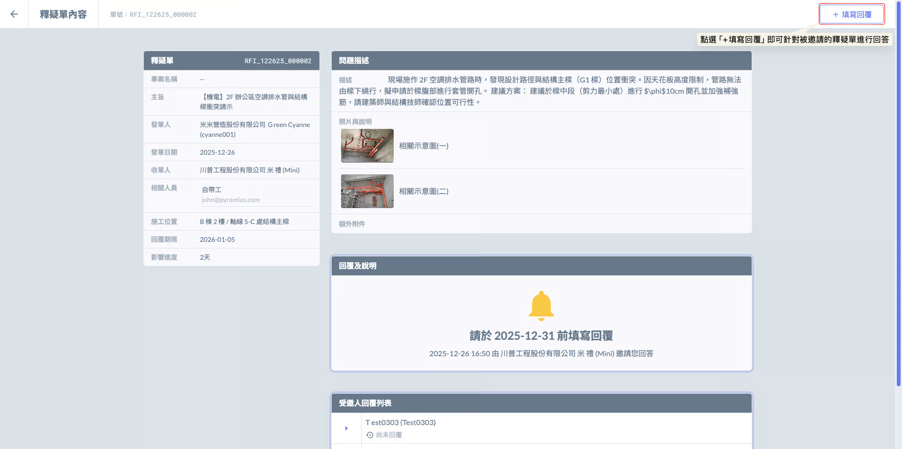



#### 回覆

開啟回覆視窗後，即可開始填寫**解決方式**，並針對相關事項上傳**圖片**及**附件**進行補充。

確認資料填寫完畢並確認無誤後，即可點選下方之<kbd><mark style="color:purple;">**送出回覆**<mark style="color:purple;"></kbd>。

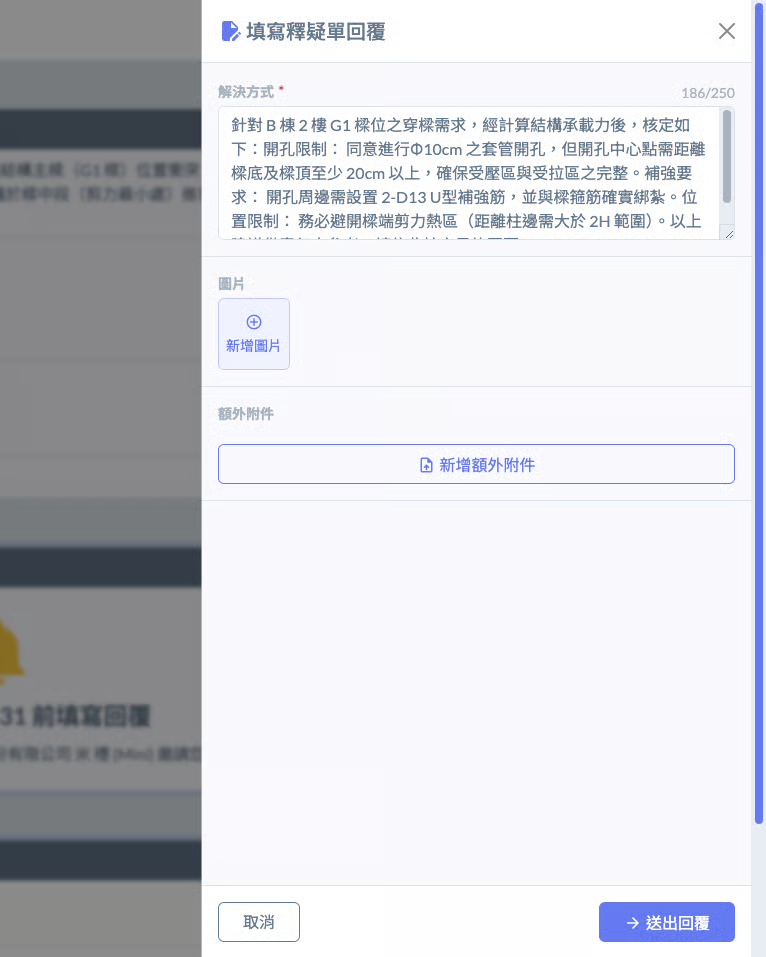


