# 註冊

驗證手機號碼驗證手機號碼Jobdone 的帳號為個人所有，因此必須驗證您的電話號碼。您需要先建立個人帳號，才能建立或申請加入一個公司。

!!! tip
    您可以透過網頁版或 APP 註冊個人帳號。若需同時建立公司資料，請使用網頁版。

## 簡易流程圖

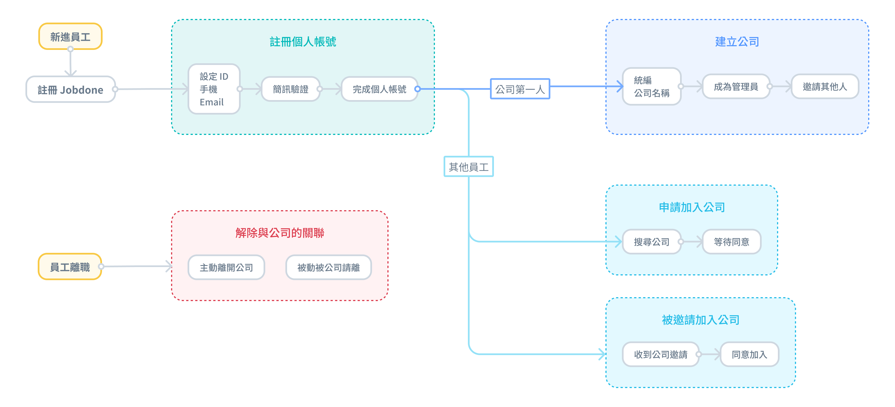

***

## 網頁版



### 建立帳號ID與密碼

如下圖，進入登入頁面後請切換至<kbd>**註冊**</kbd>頁籤，即可開始建立您的帳號ID及密碼。

!!! warning
    請您詳細閱讀：**隱私權條款**、**使用者同意聲明**及**服務條款**，再進行註冊程序。




### 驗證手機

如下圖，輸入您的手機號碼後請點&#x9078;**「驗證手機」**，系統即會發送簡訊驗證碼給您。

**若未收到驗證簡訊，請關閉 Whoscall 等來電與簡訊攔截軟體後再次嘗試。**

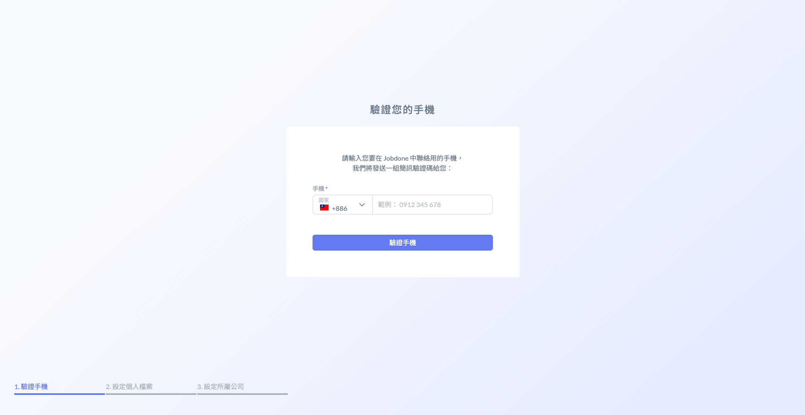 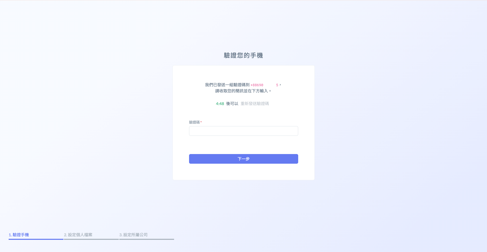




### 設定個人檔案

如下圖，開始填寫您個人資料，包括：**顯示名稱**、**姓名**及**Email**。

!!! warning
    提醒您：請務必填寫有效的個人信箱，以便在忘記密碼時能夠順利重設。




### 設定所屬公司

註冊完畢後，請依照您的情況選擇合適的操作，分別為**首次建立公司**及**加入現有公司**：



若您是 **Jobdone** 系統中首位為您所屬公司進行建立的用戶，請點&#x9078;**「建立公司」**&#x4EE5;完成公司資料的設定。



若您的同事已經在 **Jobdone** 中建立了您的公司，請點&#x9078;**「尋找我的公司」**&#x4E26;完成加入程序。



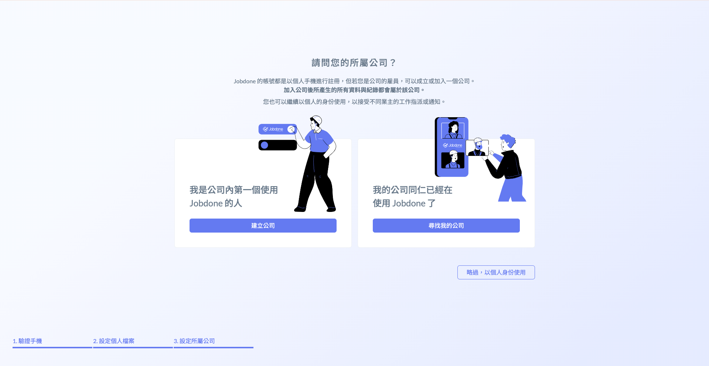

#### 一、尋找我的公司

如果您的公司已經正在使用系統，請點&#x9078;**「尋找我的公司」**。

請&#x60A8;**「擇一」**&#x8F38;入貴公司的**公司名稱**、**統一編號**、**開業證號**以讓您順利加入所屬公司。

!!! tip
    申請成功後，請聯絡該公司之專案經理審核您的加入申請 (於成員清單)。

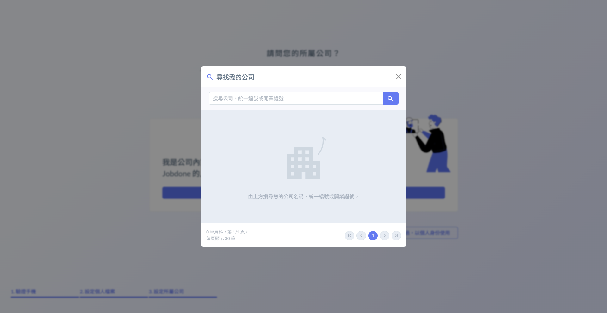 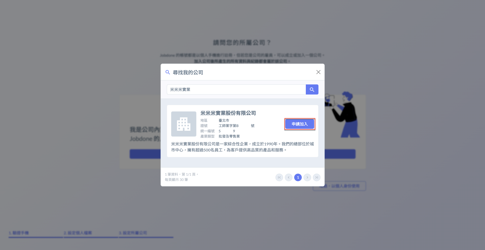

#### 二、建立公司

如果您是公司內的第一位使用者，需為公司建立資料，請點&#x9078;**「建立公司」**。

開始輸入您公司的基本資料，包括：**統一編號**、**證號**、**名稱**、**產業類型**、**地區**、**規模**、**地址**及**簡介**等等。

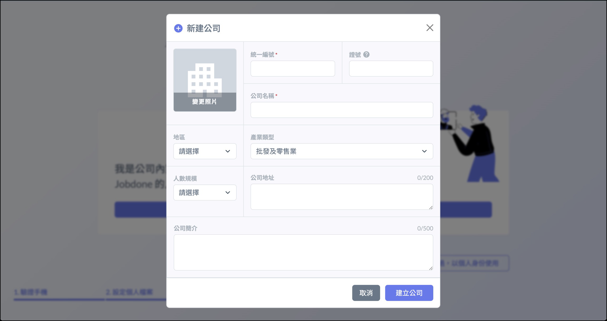

#### 三、特例 (不需使用公司功能)

若您打算以個人身份使用 (無專案功能等)，請點&#x9078;**「略過，以個人身份使用」**。

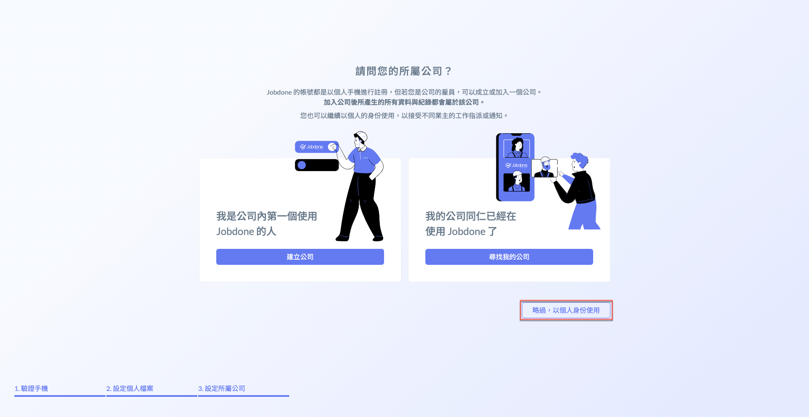



***

## APP 版

!!! info
    APP 僅能註冊個人帳號，如註冊後需加入公司組織，請參考[join\_exit](../company_level/join_exit "mention")



### 建立帳號ID與密碼

如下圖，進入登入/註冊頁面後，請點&#x9078;**「註冊」**。即可開始建立您的帳號ID及密碼。

!!! warning
    請您詳細閱讀：**隱私權條款**、**使用者同意聲明**及**服務條款**，再進行註冊程序。

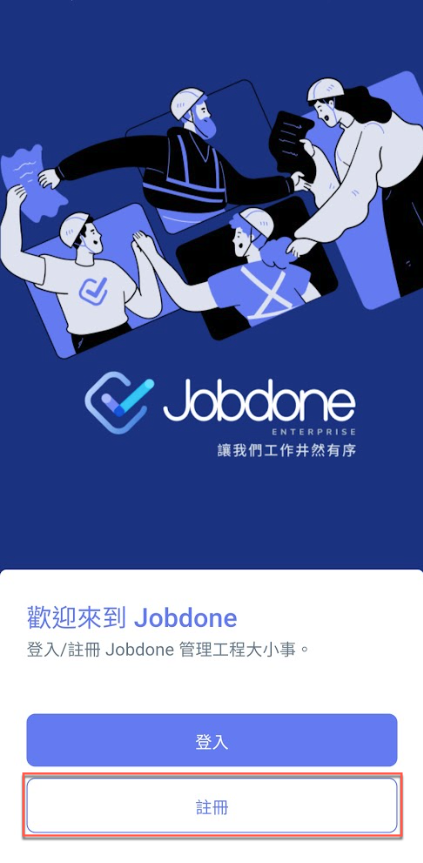 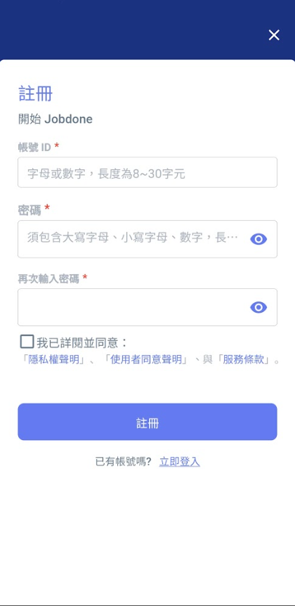




### 驗證手機

如下圖，輸入您的手機號碼後請點&#x9078;**「驗證手機」**，系統即會發送簡訊驗證碼給您。

**若未收到驗證訊息，請關閉 Whoscall 等來電與簡訊攔截軟體後再次嘗試。**

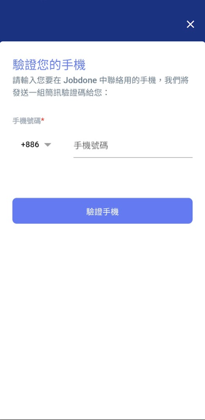 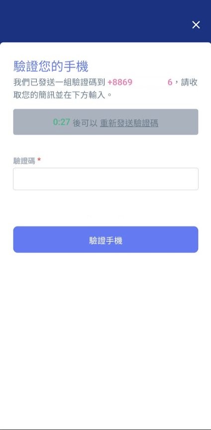



