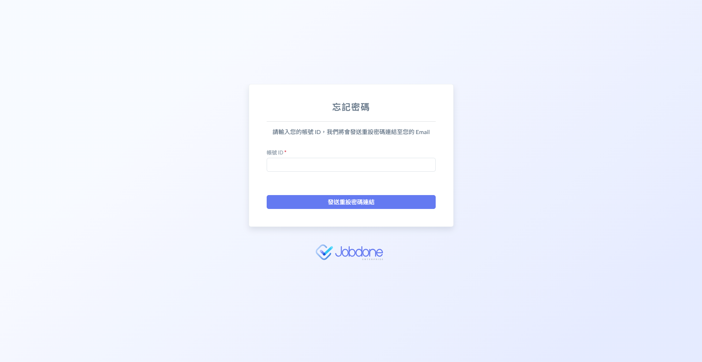
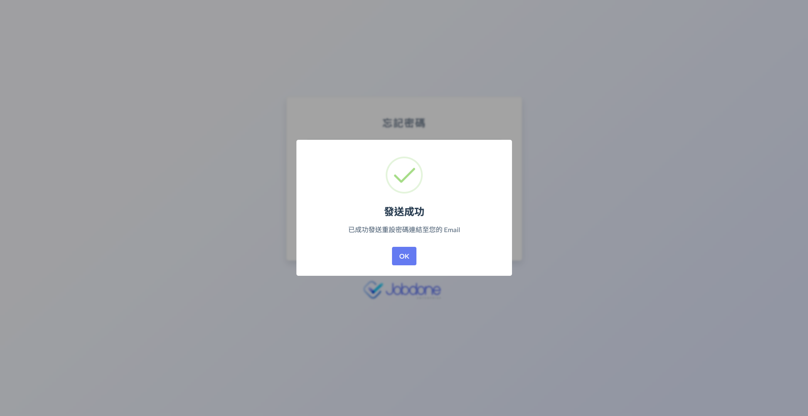
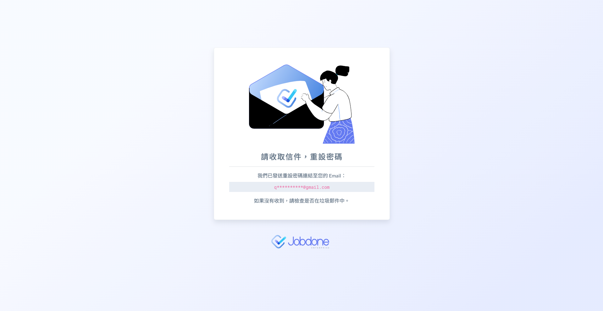
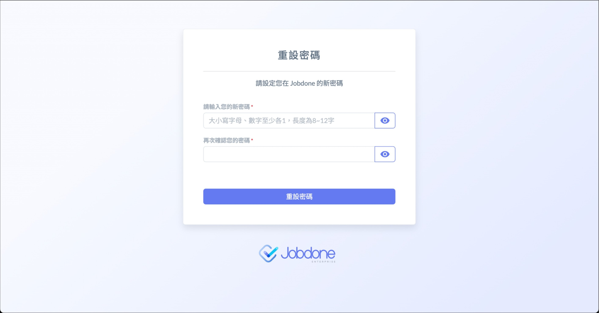
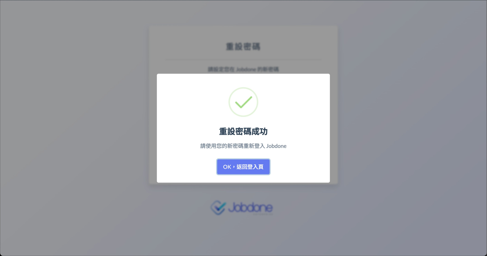
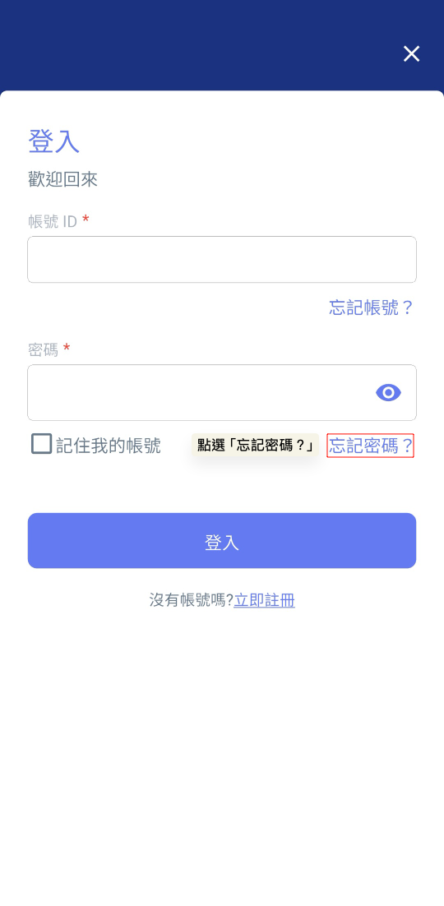
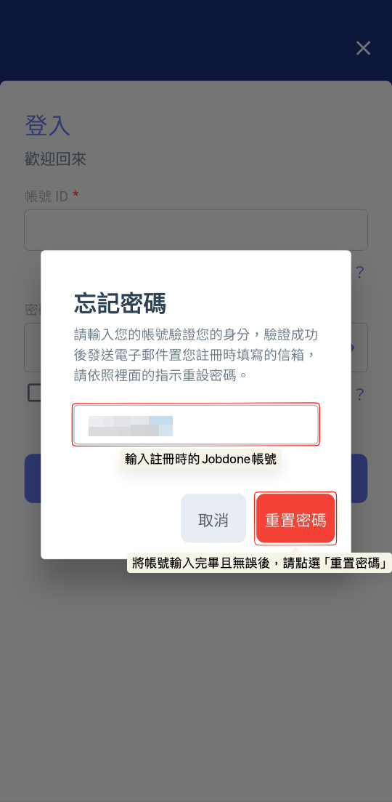
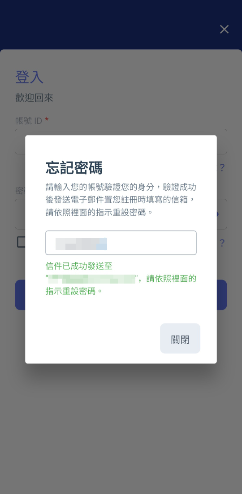

# 忘記密碼

除了找回帳號，若您遺失了密碼，Jobdone 也提供安全的密碼重設機制。系統會透過您帳號所綁定的 Email 信箱來協助您找回。

### 01｜網頁端



#### 點選忘記密碼？

如下圖，進入登入頁面後，請於密碼欄位下方點選 。




#### 輸入帳號ID

如下圖，輸入帳號ID後點選 ，系統即會發送連結至您當初設定的Email。

 




#### 查看信箱

請您於Email信箱中找到發送的信件，並點選內部的連結，即可開始重設密碼。




#### 重設密碼

點選連結後來到下圖畫面，您即可開始重設密碼，重設成功後即可用新密碼登入。

 




***

### 02｜App 端

除了電腦網頁版，Jobdone App 同樣提供便捷的重設密碼功能，操作流程如下：

1. 開啟 App：進入 Jobdone App 的登入畫面。
2. 觸發功能：於『密碼』輸入欄位處，點選 。
3. 輸入帳號：輸入您註冊 Jobdone 時的帳號 ID，並點選 。
4. 查收信件：您即可於電子郵件信箱中找到系統寄送的信件，並重新設定您的密碼。

  

