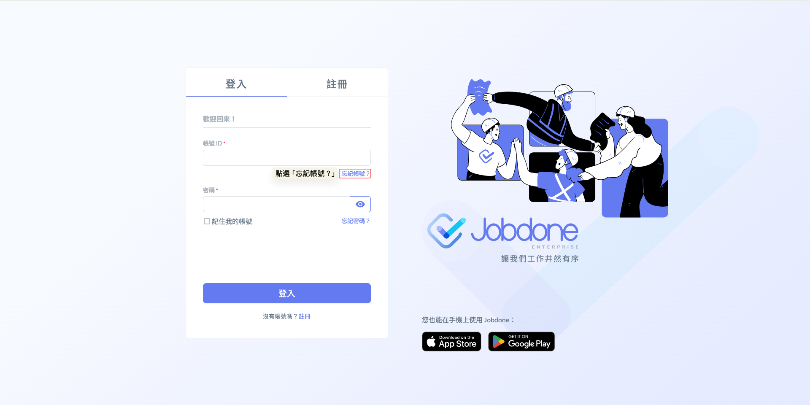
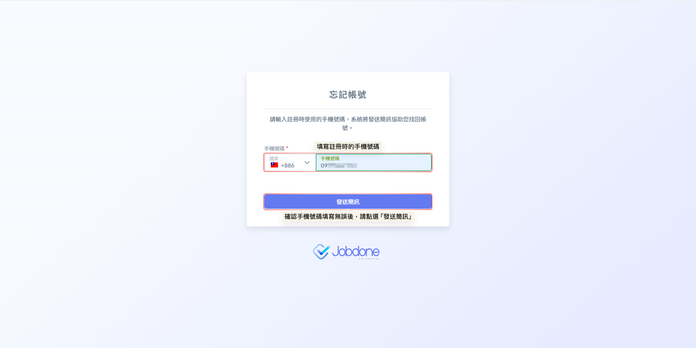
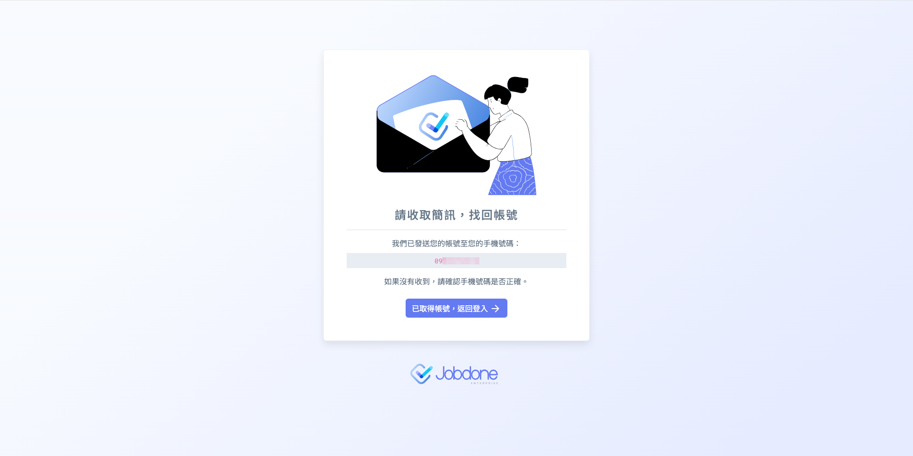
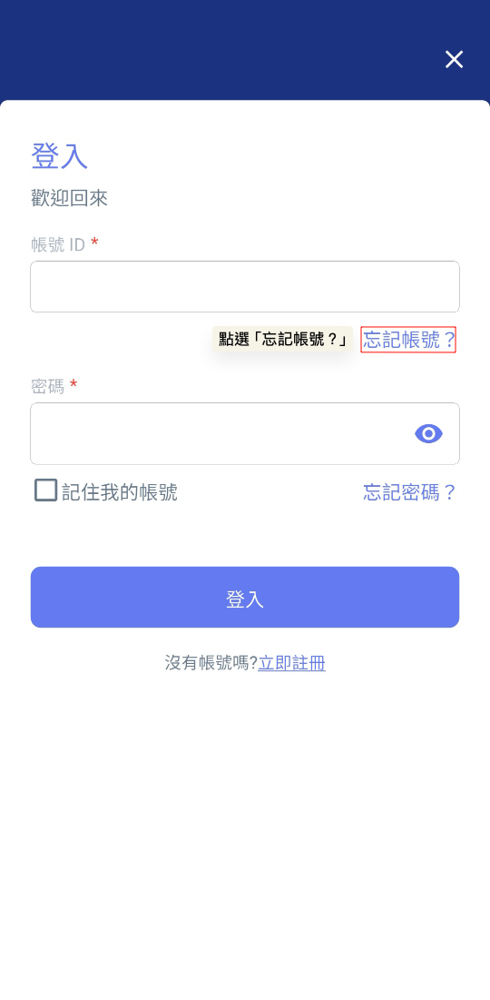
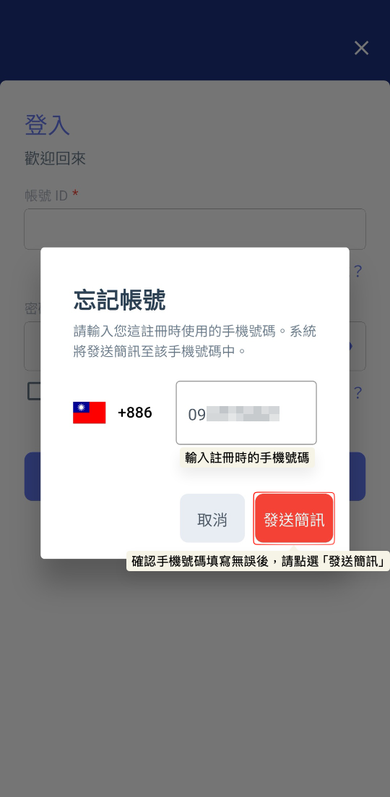
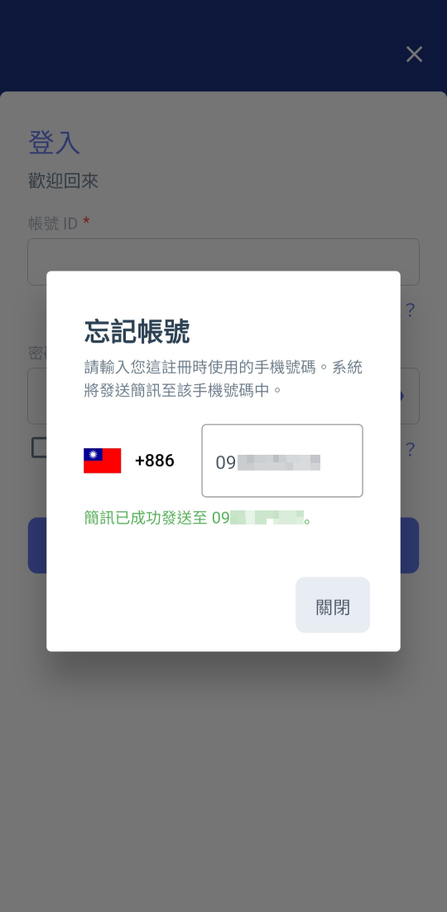
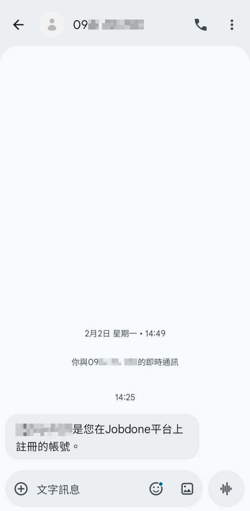

# 忘記帳號

如果您忘記了登入帳號，現在可以透過 Jobdone 系統新推出的『忘記帳號』功能輕鬆找回。

### 01｜網頁端



#### 點選忘記帳號？

1. 進入頁面(圖一)：請於登入註冊頁面，切換至『登入』分頁。
2. 觸發功能：於『帳號 ID』輸入欄位右下方，點選  字樣。




#### 輸入手機號碼

3. 手機驗證(圖二)：請輸入您透過註冊時綁定的手機號碼，並點選 。




#### 接收簡訊

4. 接收簡訊：將手機號碼輸入完畢後，系統會發送含有帳號 ID 資訊的簡訊至您的手機。
5. 重新登入：取得帳號 ID 後，返回登入頁面即可正常登入 Jobdone 系統。




***

### 02｜App 端

除了電腦網頁版，Jobdone App 同樣提供便捷的帳號找回功能，操作流程如下：

1. 開啟 App：進入 Jobdone App 的登入畫面。
2. 觸發功能：於『帳號 ID』輸入欄位處，點選  。
3. 輸入號碼：輸入您註冊時使用的手機號碼，並點選發送簡訊。
4. 查收簡訊：您即可在手機簡訊中直接查看您的 Jobdone 帳號 ID。

   

