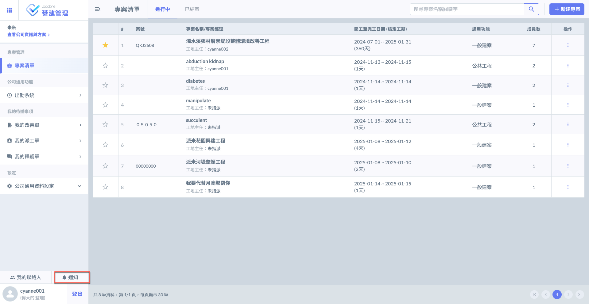
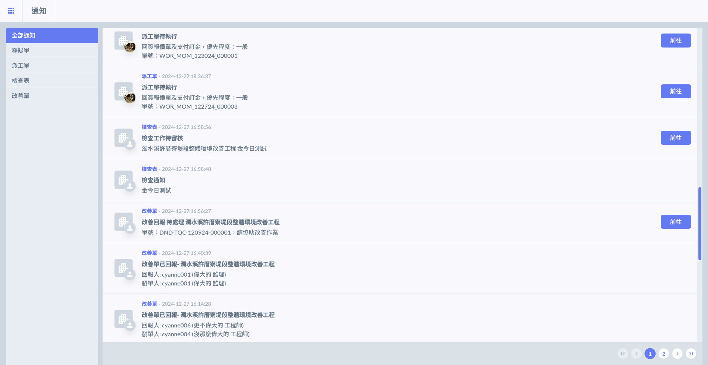
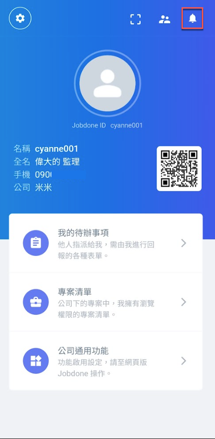
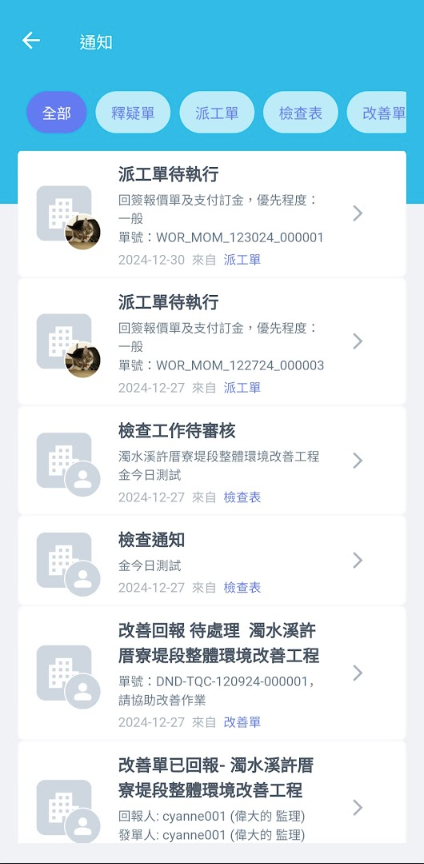

# 通知

---
description: Notification
---

# 通知

通知功能是專為個別使用者設計的，旨在提醒您有與您相關的工作流程、任務或交辦事項。

當您在系統中被指派任務、待處理的工作事項（如檢查表、釋疑單、派工單、改善單及文件中心等等）或有相關流程需您操作時，通知功能會及時提醒您，確保您不會錯過任何需要您處理的事項。

***

## 網頁

若為待處理之工作事項，點&#x9078;**「前往」**&#x5373;可查看詳細內容。

***

## APP

登入APP後，點擊右上角&#x7684;**「通知」**&#x6309;鈕，即可查看所有收到的通知。

點選欲查看的通知，即可查看其詳細內容。

 

