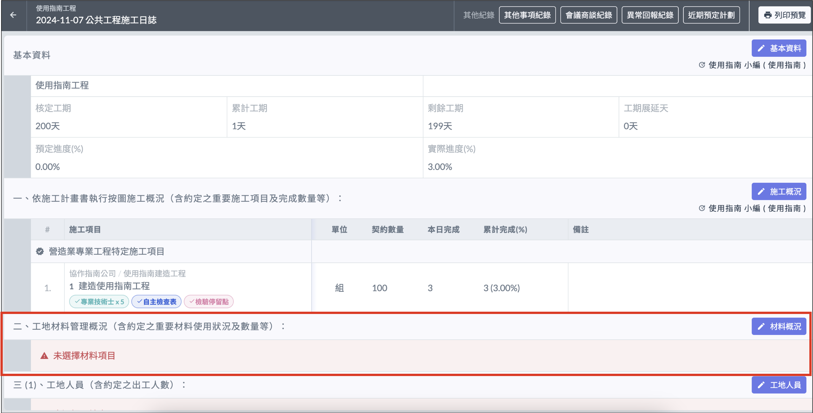
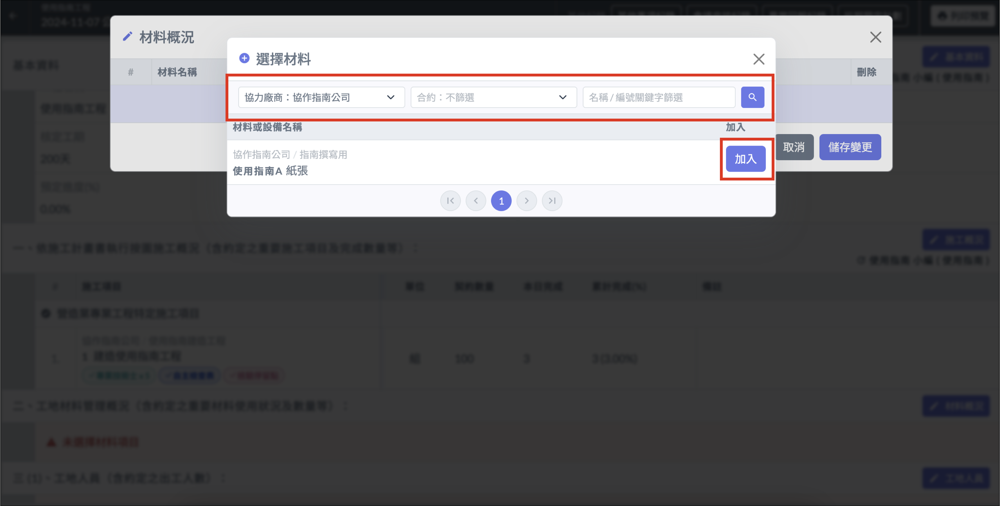
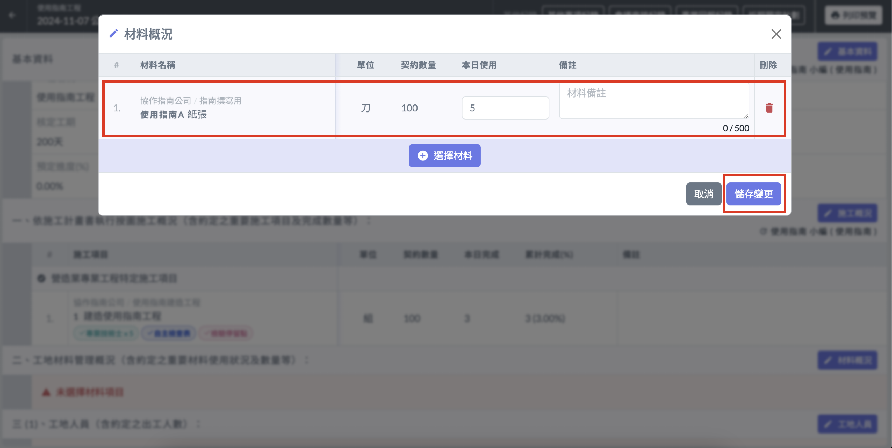

# 日誌 / 材料概況

!!! warning
    填寫日誌其他內容之前，必須先填寫[**基本資訊**](ri-zhi-ji-ben-zi-xun)。

## 編輯材料概況

1. 進入施工日誌詳情後，點選 「 材料概況 」。
2. 選擇協力公司後，用篩選器根據條件選擇材料（條件設定後要按一下放大鏡按鈕！）
3. 填寫 「 本日完成 」 欄位及備註，即可儲存變更。

!!! info
    若尚未設定材料，請先至專案介面設定[**材料管理**](../../../project_level/materials)。

***
