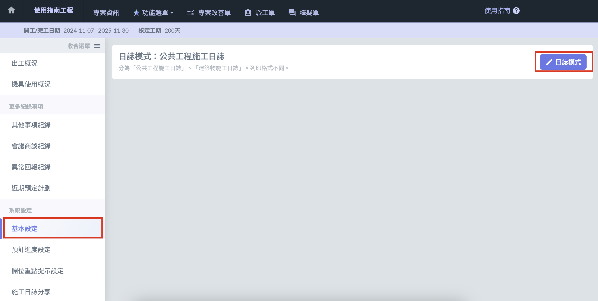
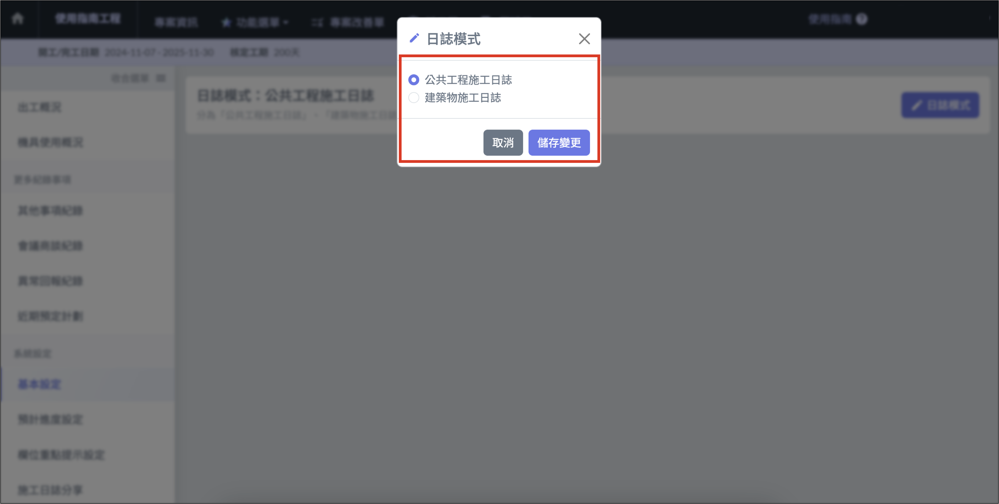

# 基本設定

## 日誌模式設定

Jobdone 提供兩種公共工程日誌模式。分別為 「 **公共工程施工日誌** 」 與 「 **建築物施工日誌** 」 。\
差別在於兩者個 **列印格式不同**。

!!! info
    切換日誌模式並不會造成日誌資料遺失。

### 切換日誌模式

1. 點選左側 「 基本設定 」 進入頁面，點選 「 日誌模式 」 。
2. 選擇想要設定的日誌模式，點選 「 儲存變更 」 即可完成。

