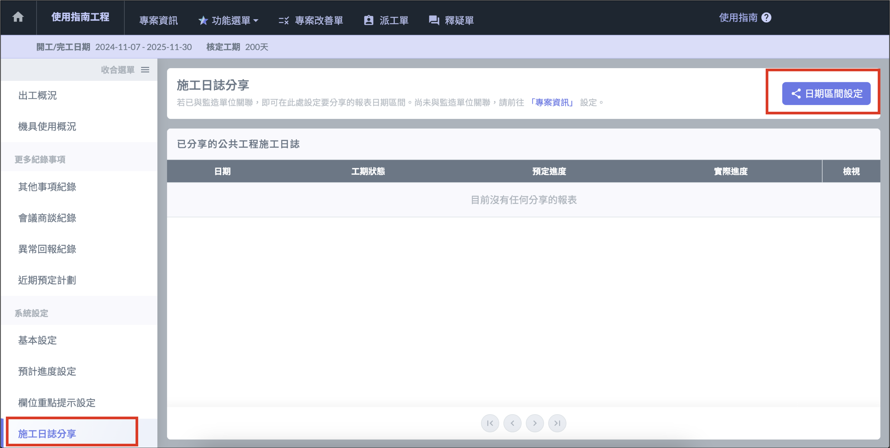
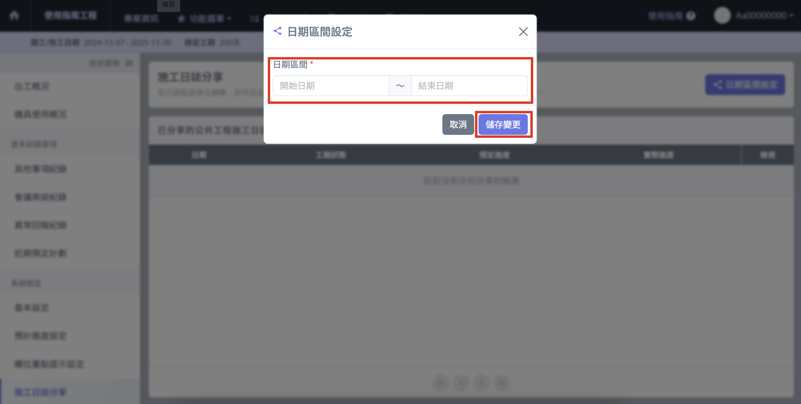
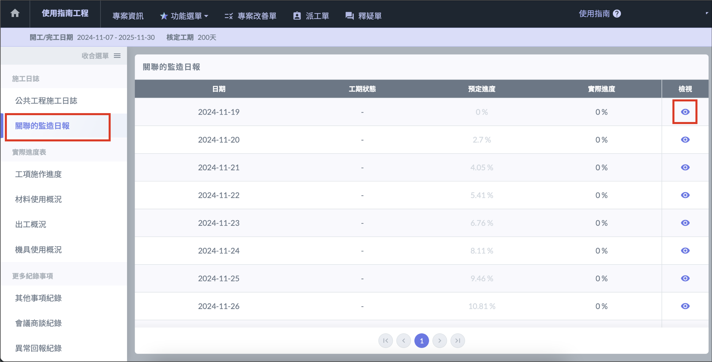
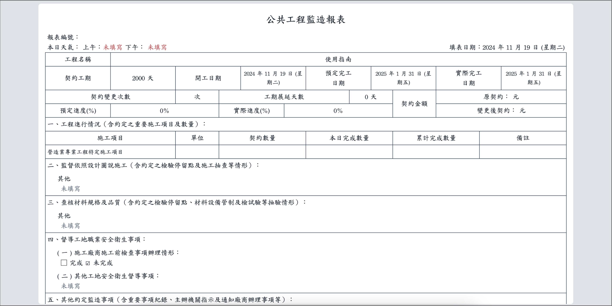

# 施工日誌分享

!!! warning
    設定前，請先將您的專案與監造 / 營造單位的專案進行[**關聯**](../../../../project_level/info#link_project)。

## 分享施工日誌 

1. 點選畫面右上角的 「 日期區間設定 」 ，開啟設定管理介面。
2. 設定想要分享的施工日誌起訖日期，按下 「 儲存變更 」 即可。

## 查看分享的監造日報？

1. 與監造單位關聯後，左側的功能選單會出現 「 關聯的監造日報 」  ，點擊進入關聯的監造日報頁面。
2. 點擊列表最右方的檢視按鈕，即可開啟監造日報的內容。

