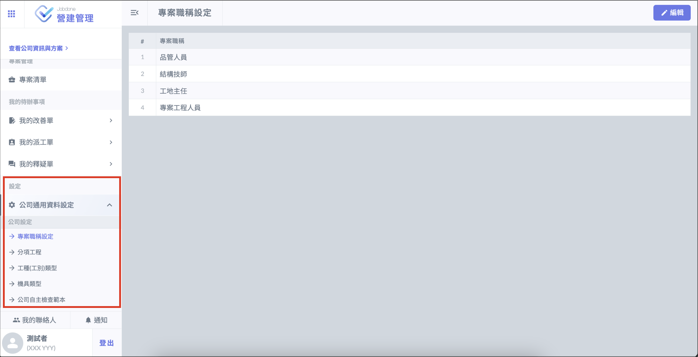

# 建立專案之前

建立專案之前，建議先完成 「 公司通用資料設定」，以利後續專案資料的填寫。

!!! info
    需登入具有 「 專案管理 」 權限之帳號才能填寫，且只能使用網頁版。

* 專案職稱設定

為公司建立職稱資料庫，可為專案下不同的成員設定職稱。

* 分項工程

為公司組織設定工程資料庫，可應用於各個專案。

* 工種 ( 工別 ) 類型

為公司組織設定工程資料庫，作為施工日誌或與人員管制相關功能的選單。可**手動新增**或**匯入指定格式的Excel 檔案**，請參考[新增工種 (工別) 類型](commonsetting/xin-zeng-gong-zhong-gong-bie-lei-xing)。

* 機具類型

為公司組織設定機具類型資料庫，可**手動新增**或**匯入指定格式的Excel 檔案**，請參考[新增機具類型](commonsetting/xin-zeng-ji-ju-lei-xing)。

* 公司自主檢查範本

公司自主檢查範本由公司組織成員共同使用，便於未來套用於各專案下，請參考新增公司自主檢查範本。
