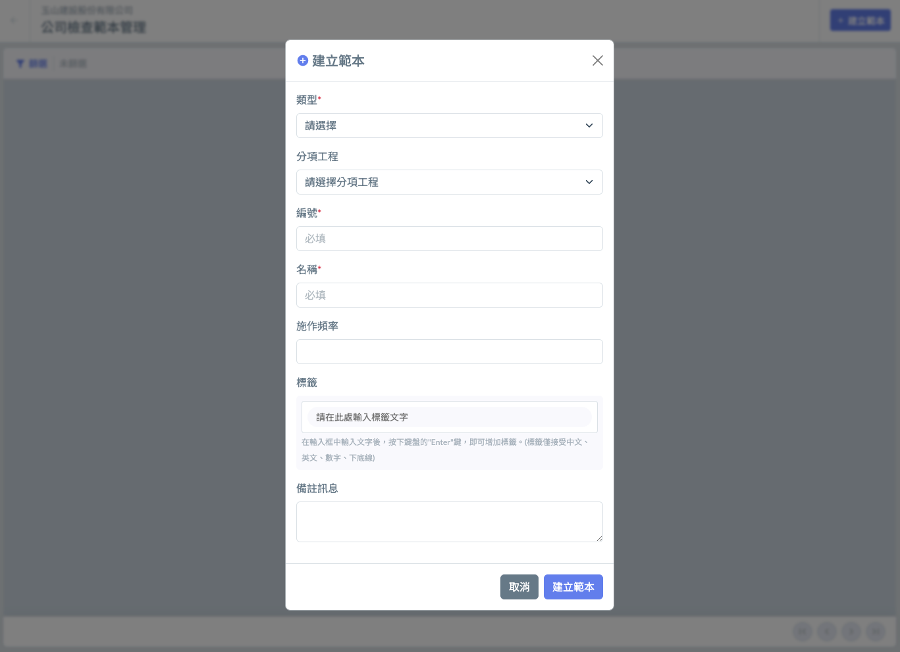
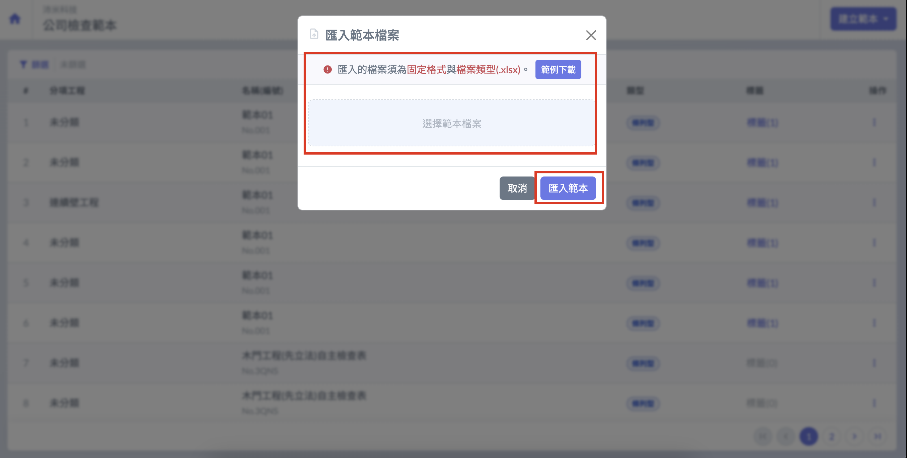
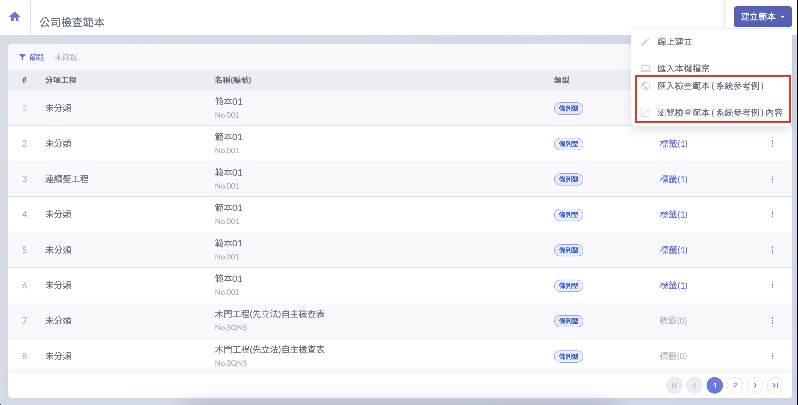
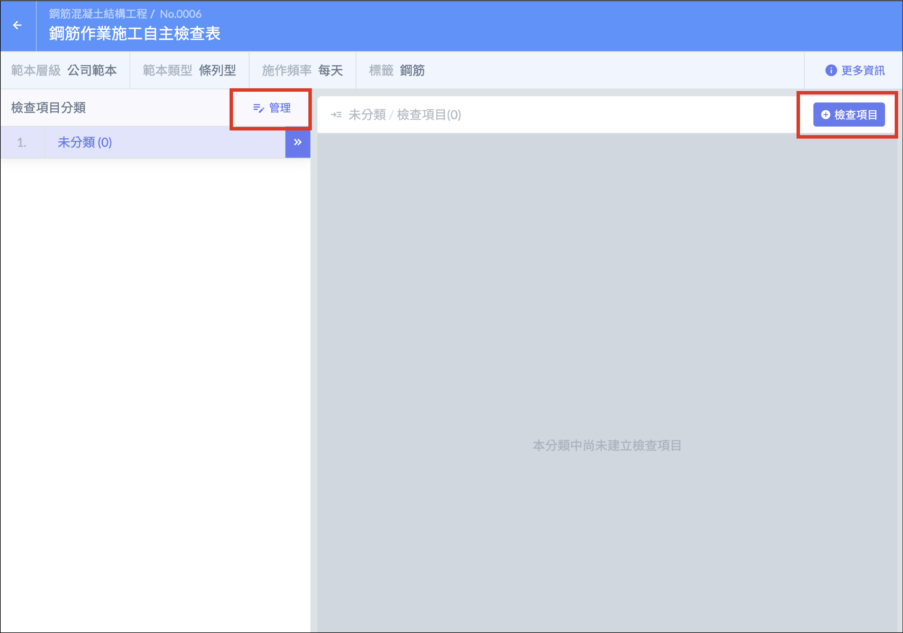

# 新增公司檢查範本

公司檢查範本分為**條列型範本**及**檔案型範本**。

* **條列型範本**可自行新增欄位，添加檢查項目及標準。
* **檔案型範本**可上傳已製作好的檢查表格檔案，供其他成員日後下載使用。

!!! warning
    建立公司檢查範本前，須先進行 「 分項工程 」 設定。

## 線上建立

進入公司檢查範本介面後，點選右上角建立範本中 「 線上建立 」，即可選擇建立條列型或檔案型範本。

## 檔案匯入

點擊建立範本的 「 匯入本機檔案 」，下載範例格式檔案。依格式編輯完畢後，即可上傳檔案，並按下 「 匯入範本 」，範本就會顯示於列表中，可以點選與編輯。

!!! warning
    只有條列型範本能使用檔案匯入建立。

## 匯入 / 瀏覽參考範本

Jobdone 系統也使用生成式 AI 整理出各種常見檢查表的範例，供用戶參考與瀏覽。

點選右上角 「 建立範本 」，選擇 「 匯入檢查範本（系統參考例）」 或 「 瀏覽檢查範本（系統參考例）內容 」，即可匯入或瀏覽參考範本，若有範本合用，可直接點選 「 匯入我的公司 」。

!!! warning
    範例僅供參考示意。請用戶依專案內容及要求項目，自行編輯調整。

## 範本分類管理

範本建立完成後，在清單點選任一範本名稱進入，即可使用 「 管理 」 及 「 + 檢查項目 」 進行項目分類與檢查項目的管理，包括新增、刪除及順序調整。

***
