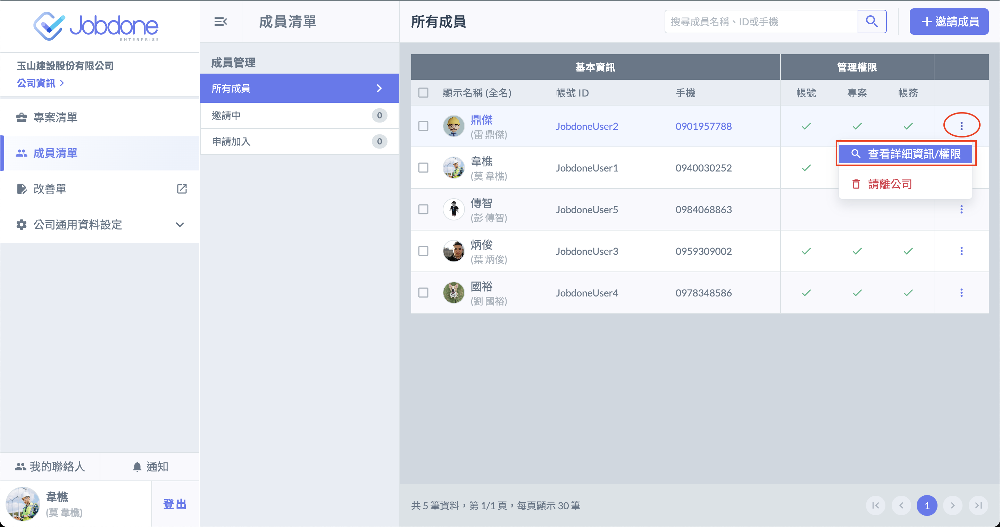
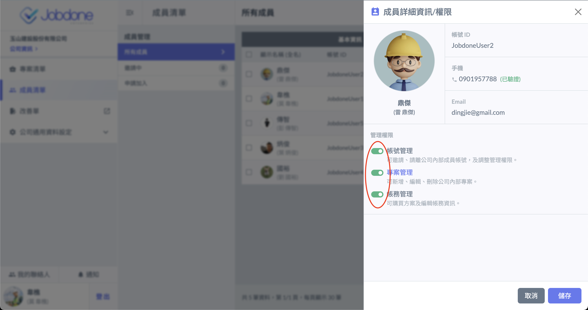
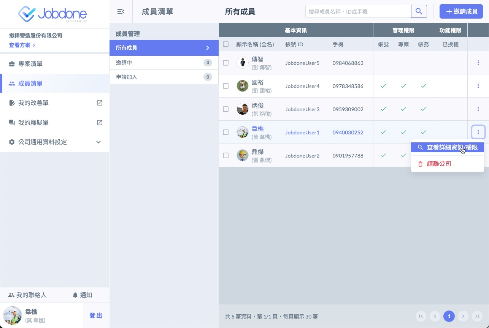
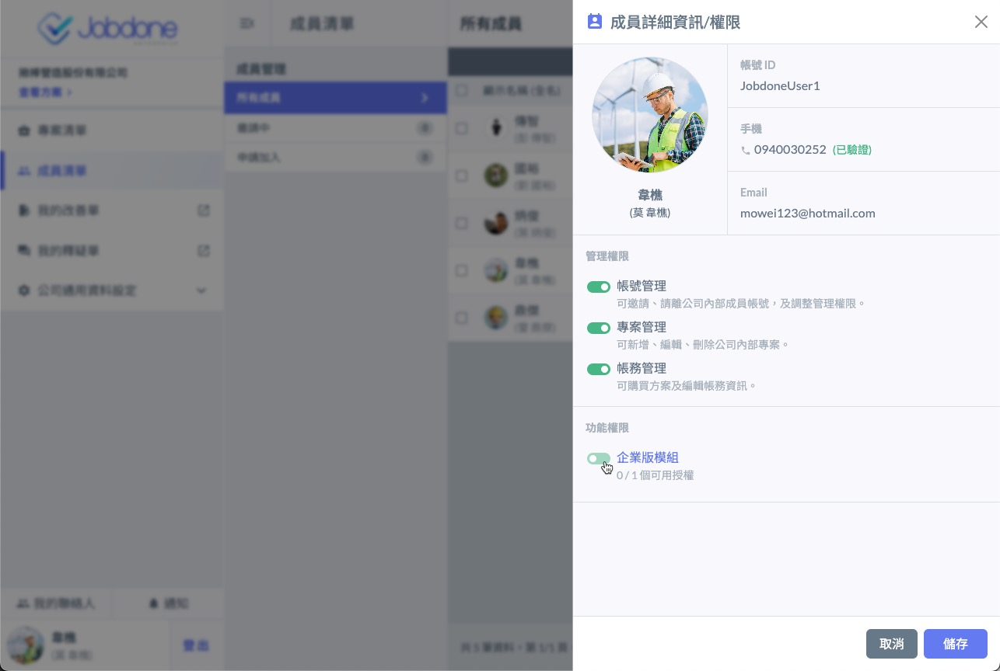

# 成員權限管理

成員權限分為帳號管理、專案管理、帳務管理，一個使用者可擁有多種權限，可於 「 成員清單 」 進行公司成員的權限管理。

* 帳號管理：可邀請、請離公司內部成員帳號，以及調整其他帳號管理權限。
* 專案管理：可新增、編輯、刪除公司內部專案。
* 帳務管理：可購買方案及編輯帳務資訊。

***

## 權限調整

擁有 「 帳號管理 」 權限的使用者可進行下列功能操作：

### 調整管理權限

1. 點選成員帳號右方的選單鈕，選擇 「 查看詳細資訊 / 權限 」。
2. 在管理權限處可調整該成員的權限，調整後按下儲存，即修改完成。

### 指派授權

若您已經購買授權，必須要指派授權人，才能生效。

1. 選擇您要指定授權的人，選擇 「 查看詳細資訊 / 權限 」。

2. 將該成員的 「 企業版模組 」 選項打開，即可獲得授權。

