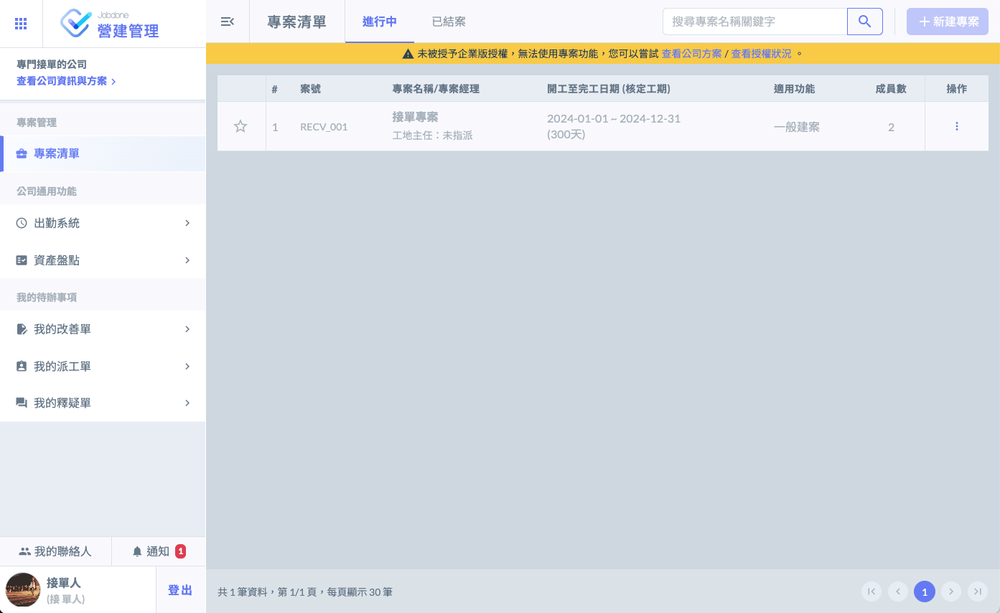
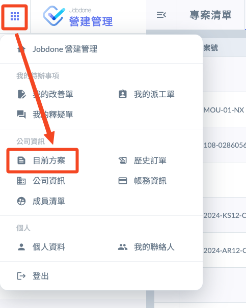
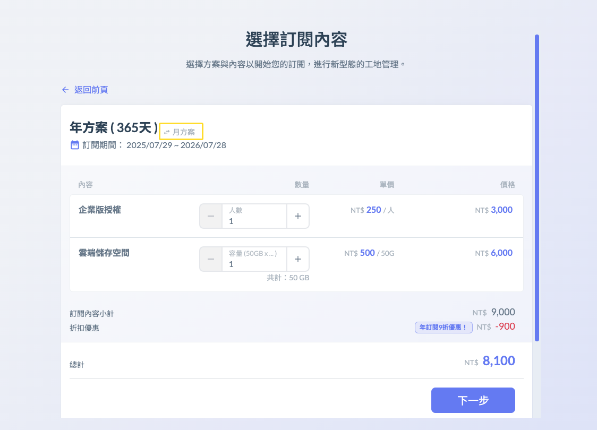
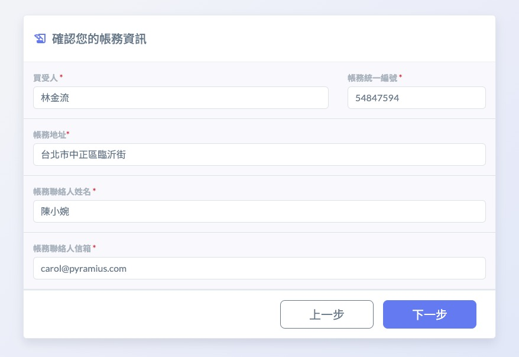
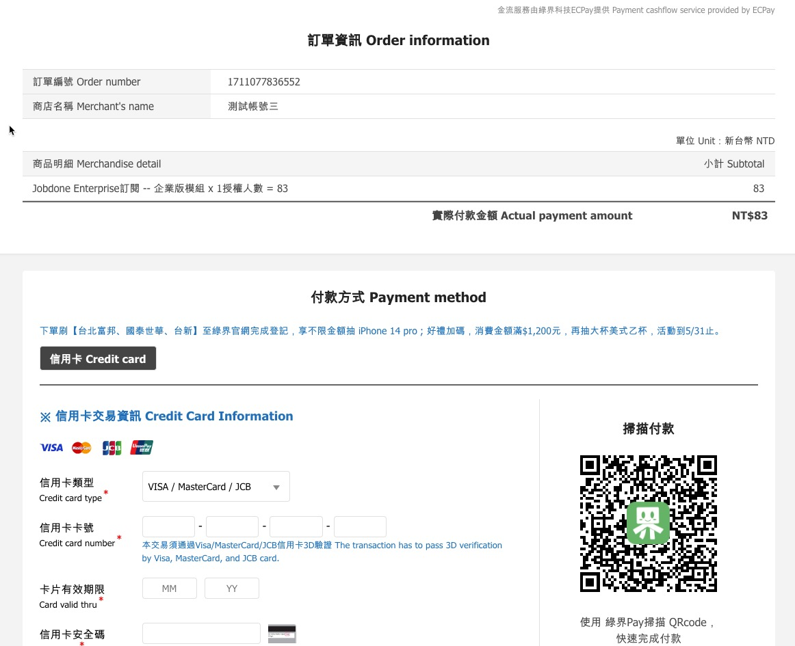

# 付費流程

公開版Jobdone 的費用是以 「 授權數 (License) 」 跟 「 檔案容量 (Capacity) 」 計費。

!!! warning
    請注意，授權數是一種憑證的概念，購買授權後，還需要到成員清單，將授權指派給會需要進入專案的帳號。

若過了試用期間，公司沒有任何企業授權。您的畫面上會出現下圖的<kbd><mark style="background-color:yellow;">黃色<mark style="background-color:yellow;"></kbd>警示條。

### 步驟



進入左上方的九宮格，點進看目前的方案。




### 選擇您的訂閱人數，以及訂閱區間

你可以選擇年度方案或月費方案，年度方案會有10%的折扣。

!!! warning
    請注意：公司只能統一採用月付或年付，更換方案須等合約季度到期。




請填入您的帳務資訊，並閱讀 「 服務條款 」




接下來您會連結到綠界的第三方信用卡支付網頁，請依照畫面說明完成付款程序。




