# 加入公司

---
description: Join a Company
---

# 加入公司

## 注意請以網頁進行

加入公司成員分為 「 公司主動邀請 」 與 「 成員提交申請 」 ，兩者都可以幫員工加入公司組織。

**公司主動邀請**：在Web介面上執行，透過搜尋Jobdone用戶的手機號碼，就可以完成邀請的動作。被邀請加入公司的用戶必須要「同意」加入公司，才能完成加入公司組織的作業。

**成員提供申請**：成員可以在Web上或者手機APP上執行，搜尋公司名稱或統一編號找到後，就可以提交申請。公司必須要「同意」這筆加入公司的申請，才能完成新成員加入組織的作業。

### 公司主動邀請

#### 1. 確認帳號管理權限

以公司成員的帳號登入後，進入 「 成員清單 」 頁面，確認自己是否有 「 帳號管理權限 」。

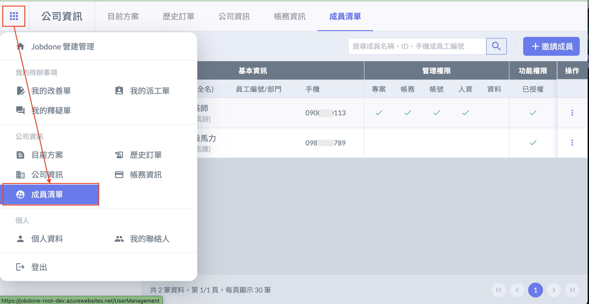

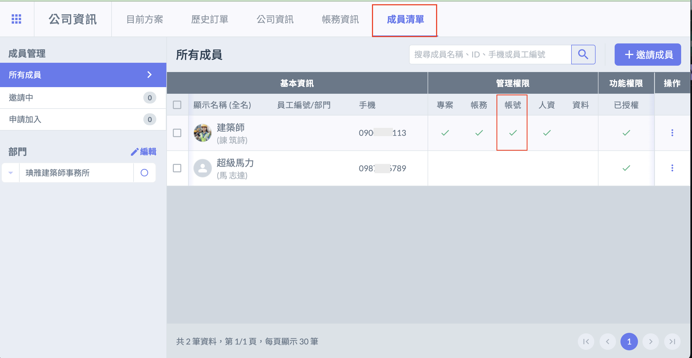

#### 2. 邀請成員

點選右上角 「 ＋邀請成員 」 輸入邀請對象電話後發出邀請，成員同意後即可加入公司。

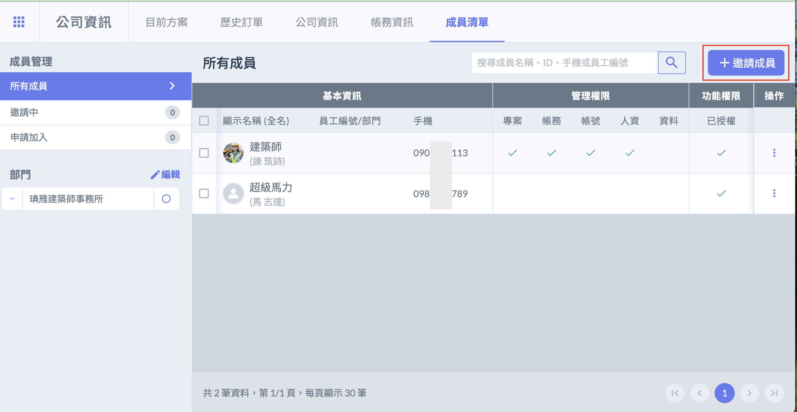

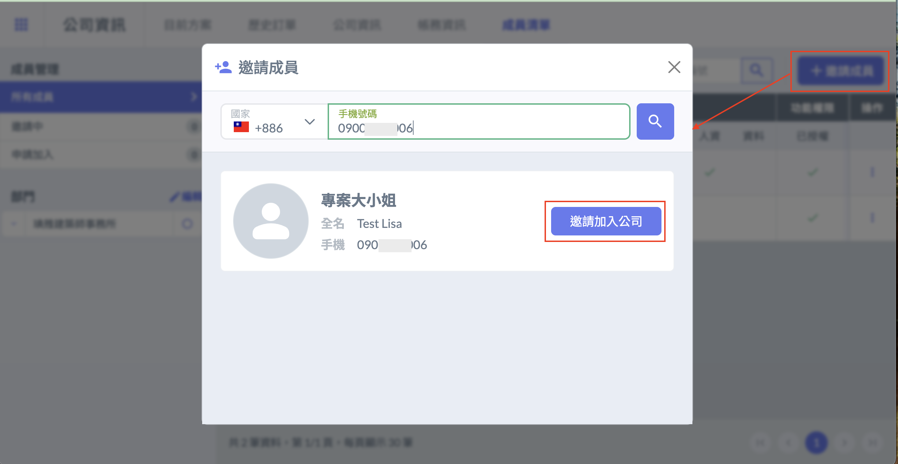

#### 3. 新成員同意加入公司

新成員收到Jobdone系統上的通知之後，可以選擇是否加入這家公司。 (在手機APP上面也可以操作）

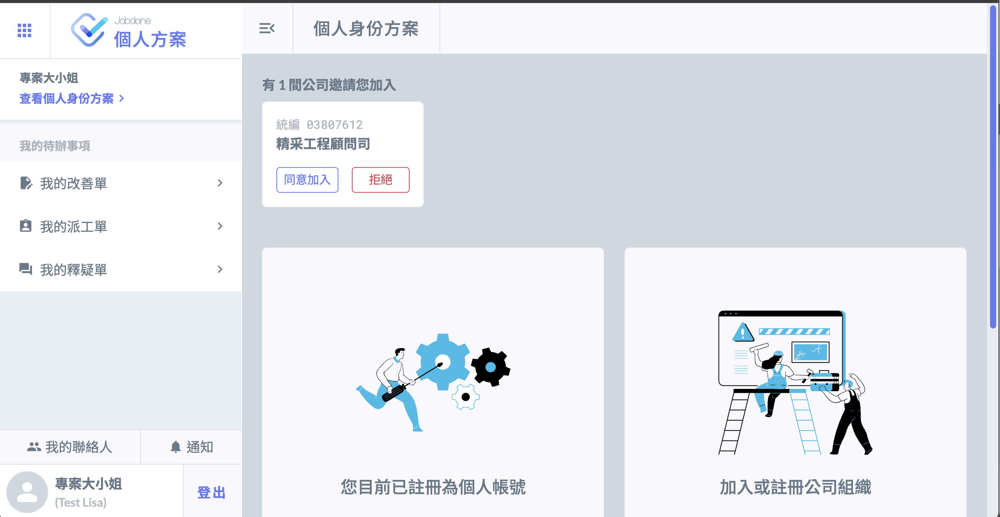

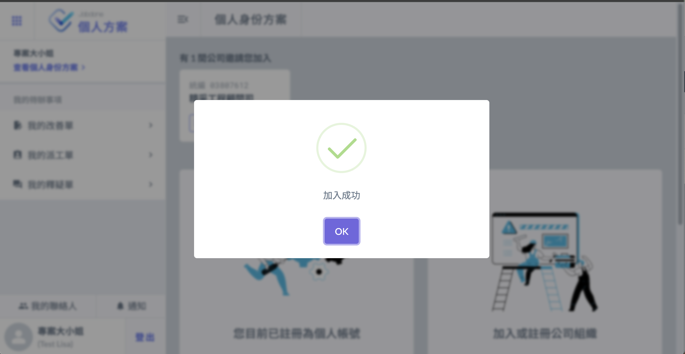

#### 4. 公司授予使用者權限

此時剛加入公司組織的成員，不會有任何權限。此時，需要給她賦予進入「專案」的權限。

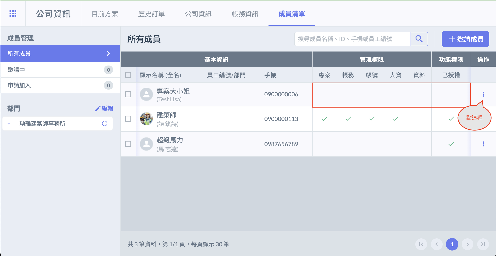

點選「編輯權限/詳細資訊」的按鈕，進入編輯畫面。

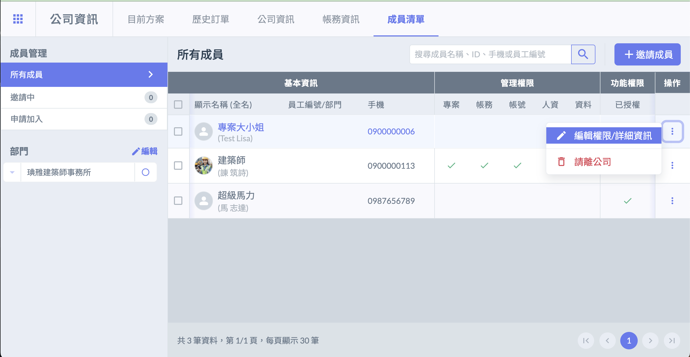

將捲軸滾到最下方，看到「企業版授權」時勾選此項。記得儲存。

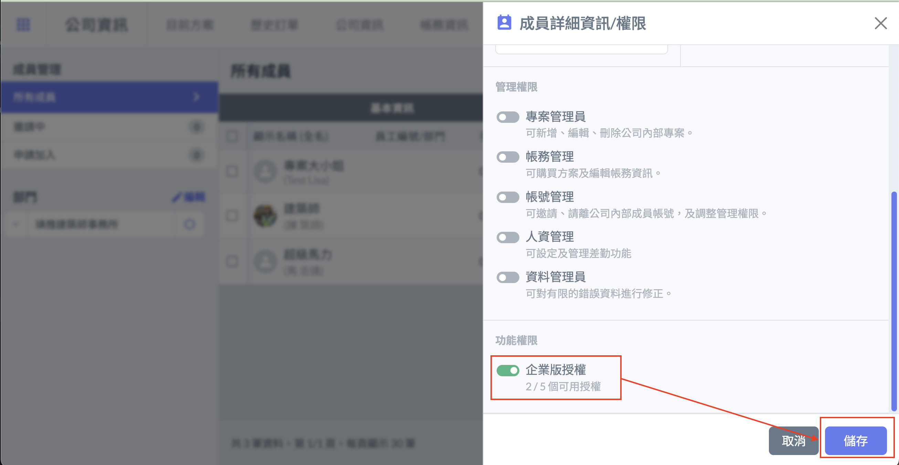

此時看到專案大小姐的「功能權限」已經被勾選。表示有權限可以使用專案功能。不過，要注意能否進入到專案內的權限，是由該專案的工地主任或者專案管理員將你邀請加入，你才會有權限可以進入專案。

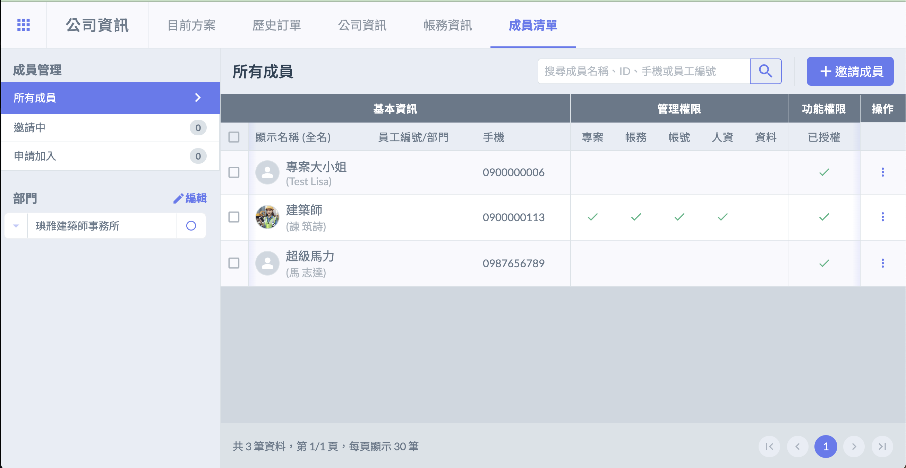

### 成員提交申請

#### 1. 尋找我的公司

欲加入的成員點擊 「 尋找我的公司 」 ，即可使用公司名稱、統一編號、開業證號搜尋並申請加入公司。

#### 2. 公司審核同意

公司登入有帳號管理權限的帳號，進入成員清單頁面，點選申請加入，可查看申請加入公司的使用者列表，並允許或拒絕加入申請。

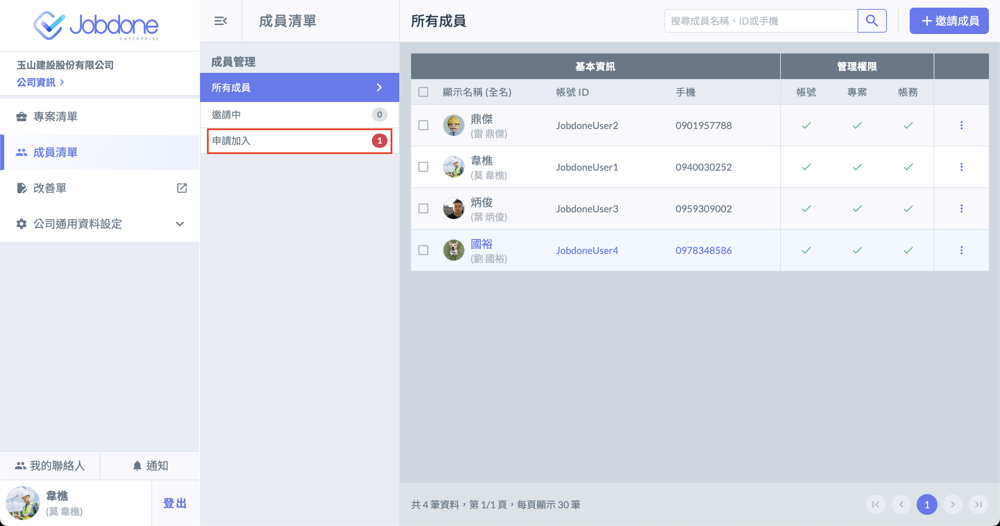

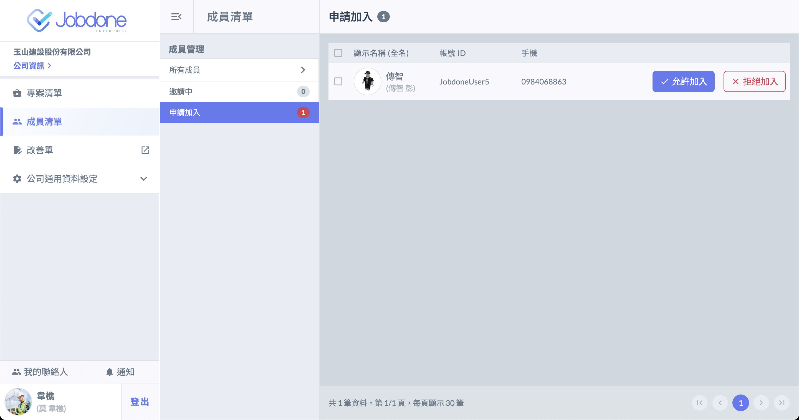

### APP上使用申請加入公司的功能

!!! info
    在App上可操作 「[申請加入公司](#shen-qing-jia-ru-gong-si)」、「[同意／拒絕邀請](#tong-yi-ju-jue-yao-qing)」 與 「[主動離開公司](#zhu-dong-li-kai-gong-si)」

### 申請加入公司

### 操作步驟

1. 點選首頁公司欄位的「＋」號，並點選 「尋找我的公司」。\
     \
   \
   或是點選左上設定按鈕，進入個人資訊設定頁面，點選 「加入公司」。\
     \
   \
    
2. 找到公司後，點選 「申請加入」。\
      
3. 申請加入後，如須取消，可點選 「取消申請」。\
    
4. 公司接受／拒絕申請後，App將收到通知。\
     

### 同意／拒絕邀請

### 同意

進入公司邀請／申請加入頁面頁面後，可同意公司邀請。\
  

### 拒絕

點選 「拒絕邀請」，即可拒絕該公司的邀請。\
  
