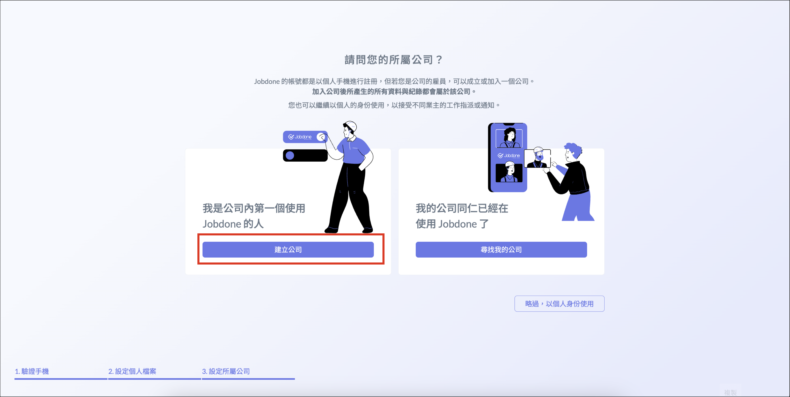
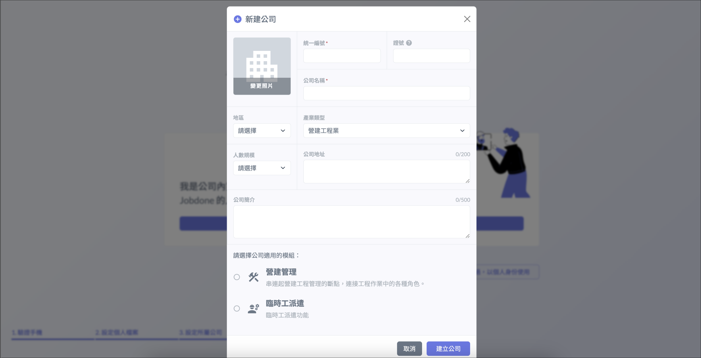
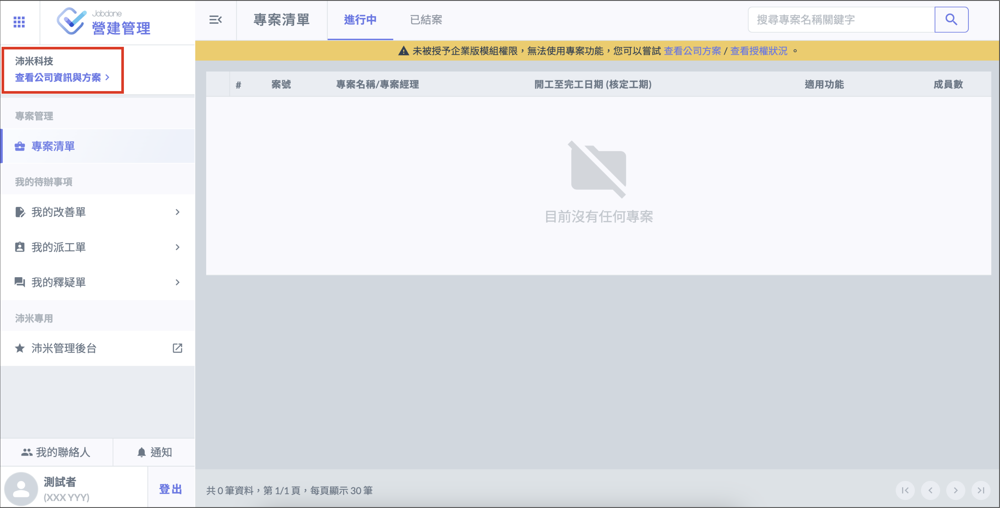
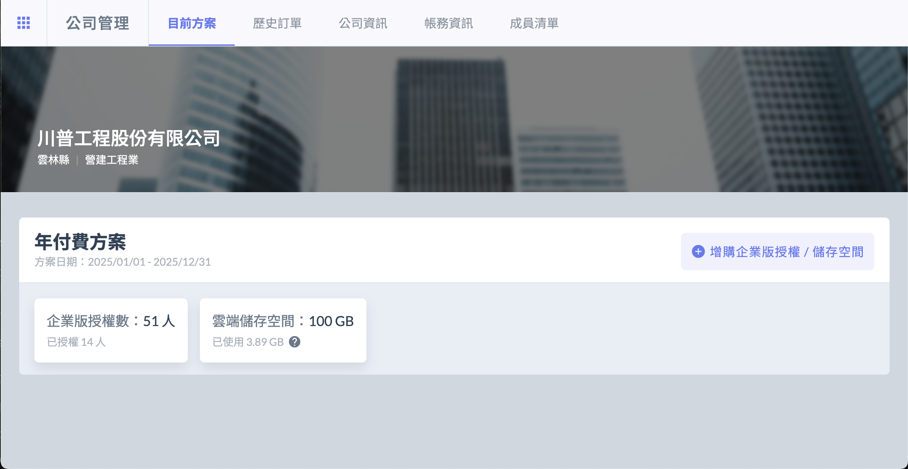
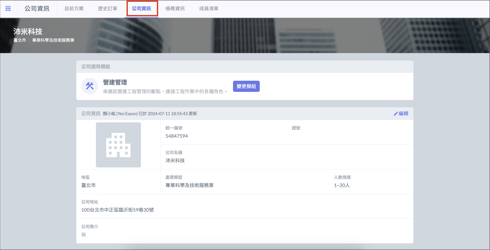
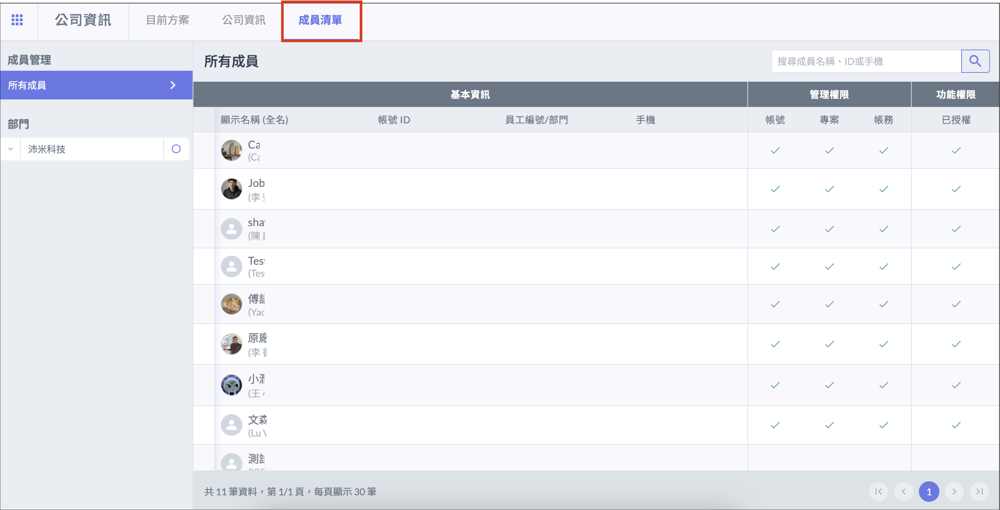

# 建立公司資訊

---
description: Register a Company
---

# 建立公司資訊

## 建立公司

註冊個人帳號後，若您是公司第一位使用 Jobdone 的用戶，可點選 「 建立公司 」 ，輸入相關資料並選擇[**適用模組**](../../mf#mo-zu)後，即可建立公司。

!!! danger
    **每個統編只能創建一個公司資料，您必須獲得公司的授權才可建立公司，切勿以他人公司的名義任意登記。若經發現或申訴，平台方有權逕行刪除。**

## 查看公司資訊

!!! info
    公司資料僅能以網頁方式查看與編輯。

登入後，點選左上角 「 查看公司資訊及方案 」，可進一步查看公司的詳細資料，分為 「 目前方案 」、「 公司資訊 」、「 成員清單 」

* 目前方案

目前方案可以查看公司的**授權數**及 **Blob 空間**，以及**方案到期日**。

如果臨時需要追加使用人數，也可以隨時擴充人數。如果空間不足，也可以隨時增購Blob儲存空間。

* 公司資訊

公司資訊可以查看公司目前使用的**功能模組**以及**詳細資料**。

如果您一開始選錯Jobdone版本，也可以點選「變更模組」來切換成正確的Jobdone版本。Jobdone版本目前有四種：分別為營建管理、施工製作、臨時工派遣、代客驗屋。每一種版本適用的客群都不一樣。

* 成員清單

成員清單可查看公司**所有成員**及**授權狀況**。

公司成員的管理權限都在這裡，尤其是「功能權限」如果沒有啟用，就無法使用專案相關的功能。

權限管理原則：以**最小授權**為原則，員工在工作上有必要使用到的功能才開放給他使用，這樣可以減少不必要的麻煩，詳細權限說明會在後面「成員權限管理」做介紹。

