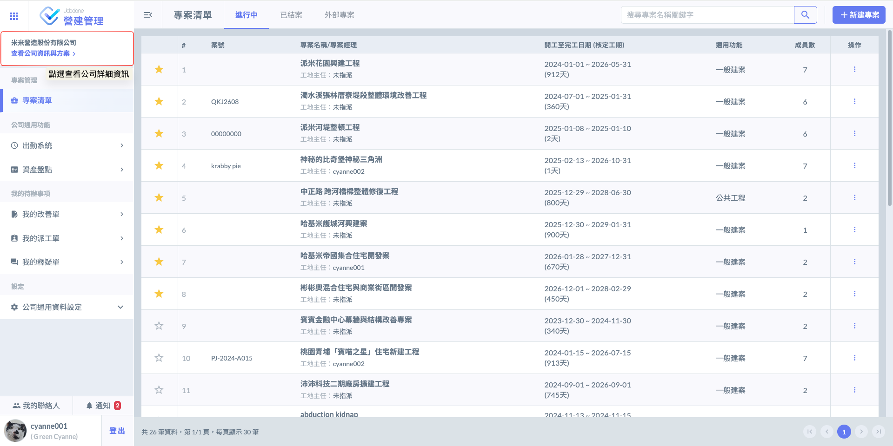
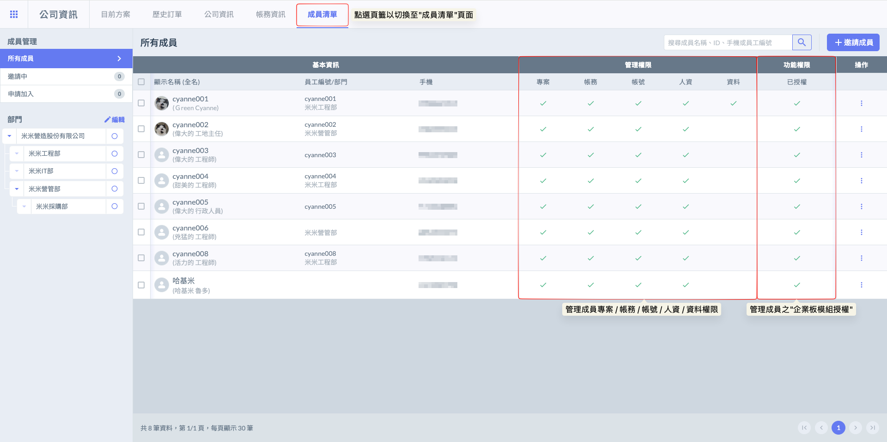
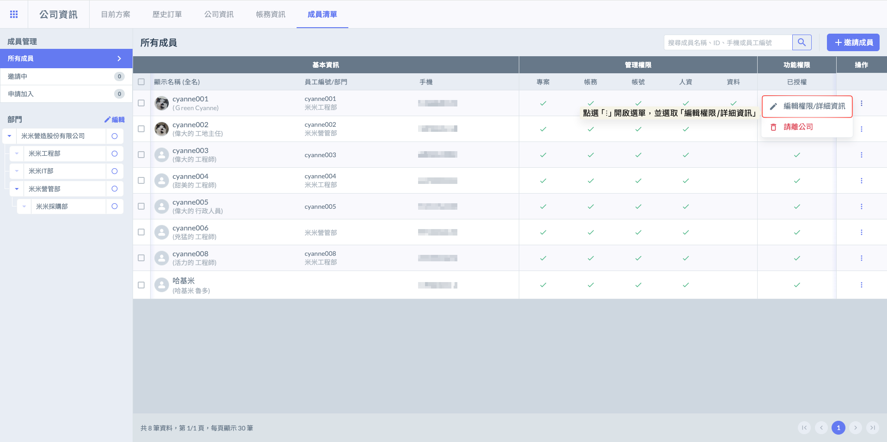
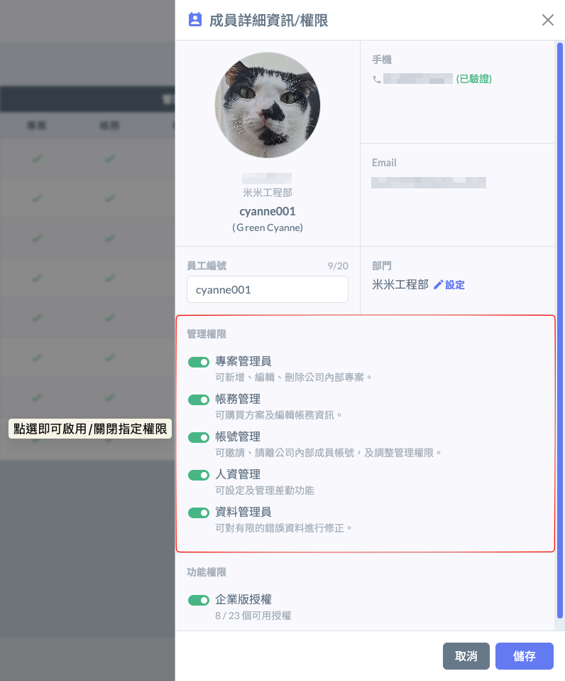
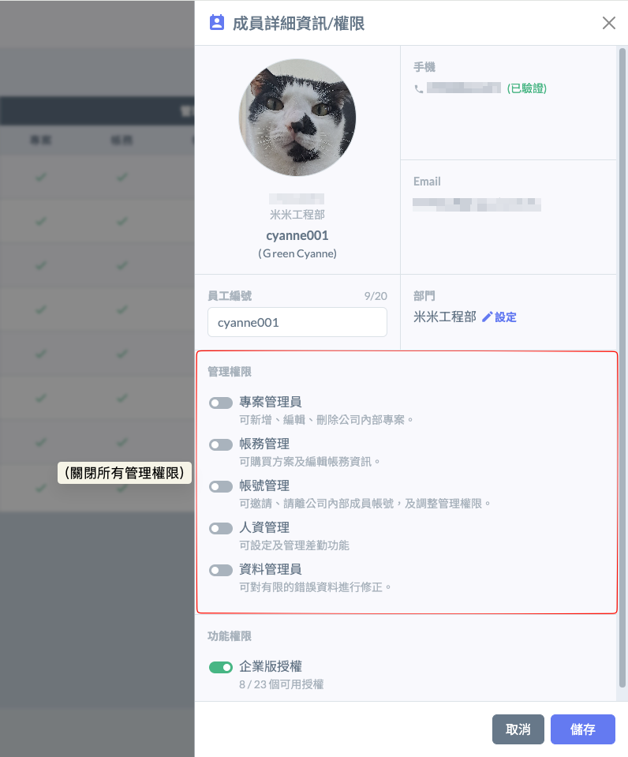
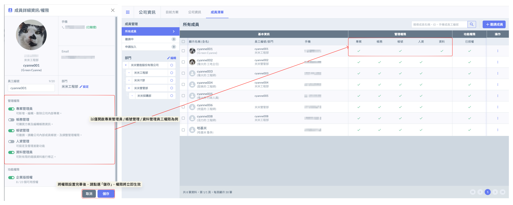
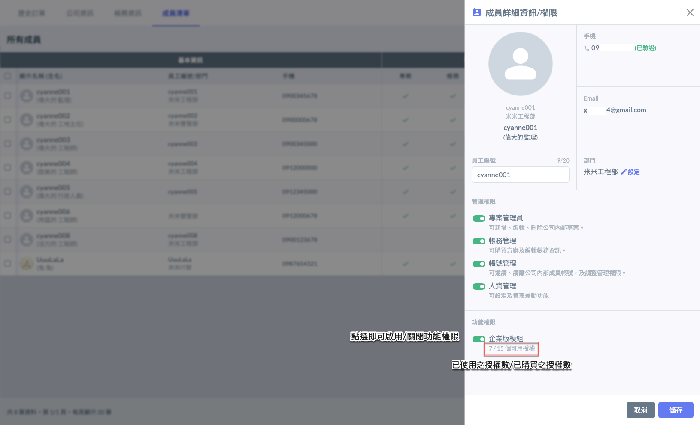
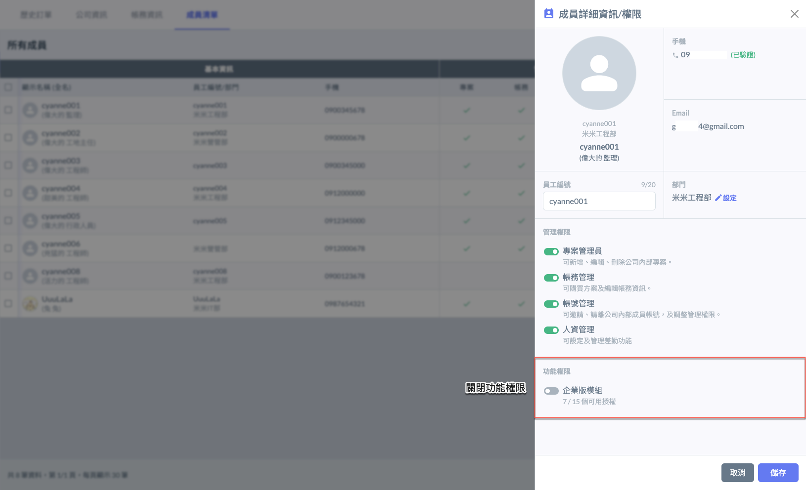
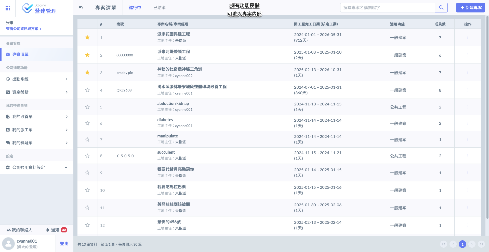
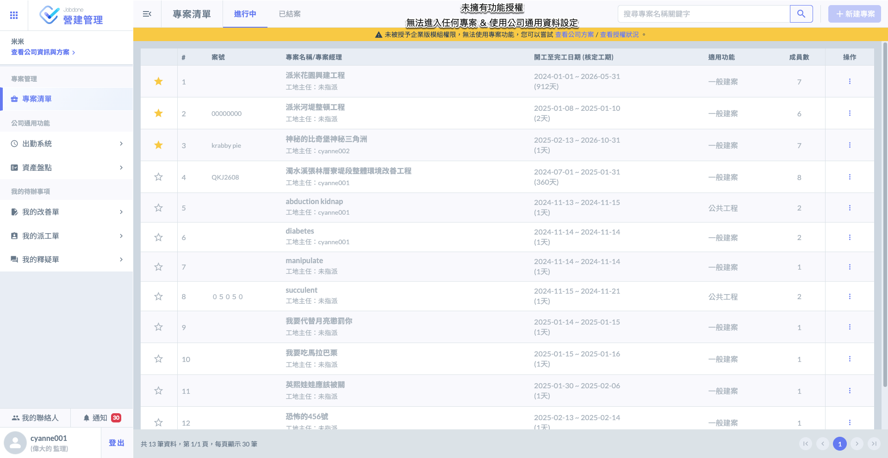

# 成員權限管理

系統中的成員權限功能，提供企業對內部帳號進行明確的角色分工與權限控管。每位公司成員可依實際職責分配一項或多項權限，並可於「成員清單」頁面中進行新增、調整與檢視權限設定。

目前系統提供以下五種主要權限分類：



適用對象：工地主任、專案管理人員、業管人員。

權限：可新增、編輯或刪除公司內部專案，包含設定專案成員、管理合約內容、追蹤施工進度等功能，以便統籌各專案執行進度。



適用對象：負責Jobdone PMIS系統管理者、財務人員、採購人員。

權限：可執行帳務相關操作等。

1. Jobdone PMIS訂閱、續約、增購使用人數、增購Blob雲端儲存空間。訂閱人數及儲存空間都可以隨時增購，並且會自動與原本訂閱的到期日期切齊。
2. 維護公司發票相關資料，線上訂閱之後可以收到電子發票。



適用對象：Jobdone PMIS系統管理員、人力資訊部。

權限：授權的規則以「＊**最小權限**＊」為原則。成員在工作上需要使用到什麼功能，才給予什麼權限。

1. 新成員加入：可邀請新成員加入公司帳號、或者核准新成員加入公司的申請。
2. 舊成員離職：將離職員工移除、暫停權限。
3. 權限設定：
   1. 功能權限＊：這是Jobdone企業版授權，必須開啟此權限，才能使用專案功能。如果有員工暫時留職或請長假，也可以將他的企業版授權停用，移轉給其他人使用。
   2. 專案管理員：可新增、編輯、刪除公司內部專案。
   3. 帳務管理：可購買方案及編輯帳務資訊。
   4. 帳號管理：可邀請、請離公司內部成員帳號，及調整管理權限。
   5. 人資管理：可設定及管理差勤功能。



適用對象：人力資源部、單位主管。

權限：主要負責公司成員之出勤與假勤紀錄管理。擁有人資管理權限者，可審核員工的加班申請、休假申請、調休安排等，並決定是否核發特定假別。



目前『資料管理員』權限主要應用於檢查表模組。不同於一般成員僅能刪除狀態為<kbd><mark style="color:purple;">**待檢查**<mark style="color:purple;"></kbd>的檢查工作，管理員具備「撤回與清理」的最高權限：

* **全階段強制刪除：** 不論檢查表目前處於哪一個階段（執行中、複驗中），甚至是已經結案完成的紀錄，資料管理員皆可將其移至系統內建的「垃圾桶」。
* **誤刪防護機制（回收站）：** 系統具備完善的容錯設計。丟入垃圾桶的檢查表並非立即永久消失，而是進入 30 天的緩衝保留期。
* **復原功能：** 在 30 天的保存期限內，資料管理員隨時可以從垃圾桶中將檢查表「復原」，資料將完整回到原先的狀態與階段。



!!! danger
    #### ⚠️ 注意事項
    
    僅具有專案管理權限之人員可查看且編輯 [company\_configuration](../company_configuration "mention")

如圖二，進入『公司資訊』頁面後，請點選頁面上方的頁籤，切換至<kbd><mark style="color:purple;">**成員清單**<mark style="color:purple;"></kbd>介面。

***

## 01｜調整權限

僅擁有「帳號管理」權限之使用者，可執行以下操作，協助管理公司帳號成員結構與權限配置：

### 01 - 1｜管理權限

於欲調整權限之成員右側點&#x9078;**「⋮」**&#x5716;示 (於操作欄位)，即可開啟功能選單，並選擇。

如圖四至圖五所示，表示該成員擁有該項管理權限，則表示未擁有該權限。

 

操作流程與完成畫面如圖六：

***

### 01 - 2｜功能權限

**功能授權為該成員是否具進入專案並使用內部功能的權限，如檢查表、專案改善單、驗收單、施工日誌等。**

於欲調整功能權限之成員右側點&#x9078;**「⋮」**&#x5716;示 (於操作欄位)，即可開啟功能選單，並選擇。

如圖六至圖七所示，表示該成員擁有功能授權，則表示未擁有功能授權。

 

下圖為擁有與未擁有功能授權之示意圖：

!!! info
    如何購買企業版模組 (功能授權)？請參閱 ➙ [payment](payment "mention")

 

