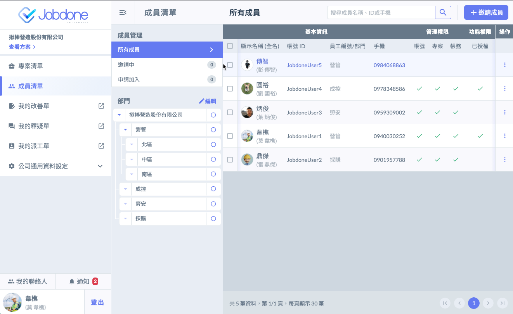
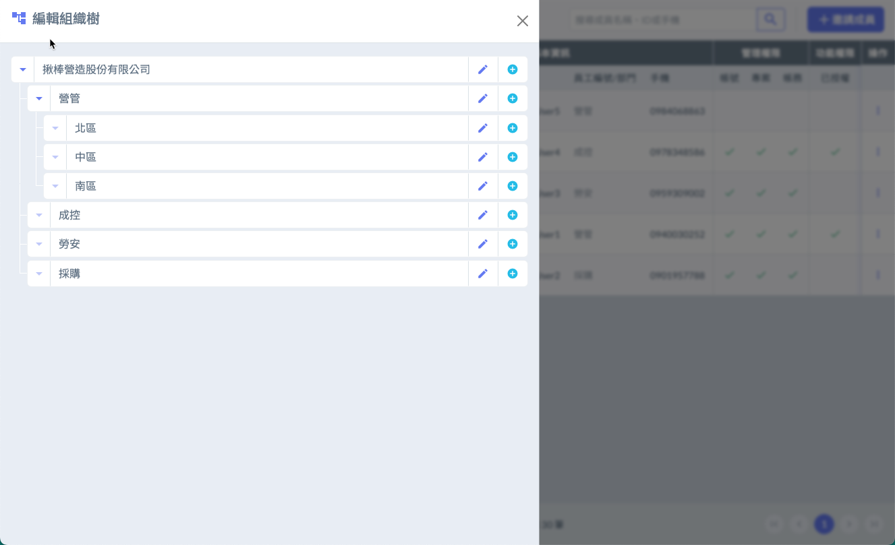
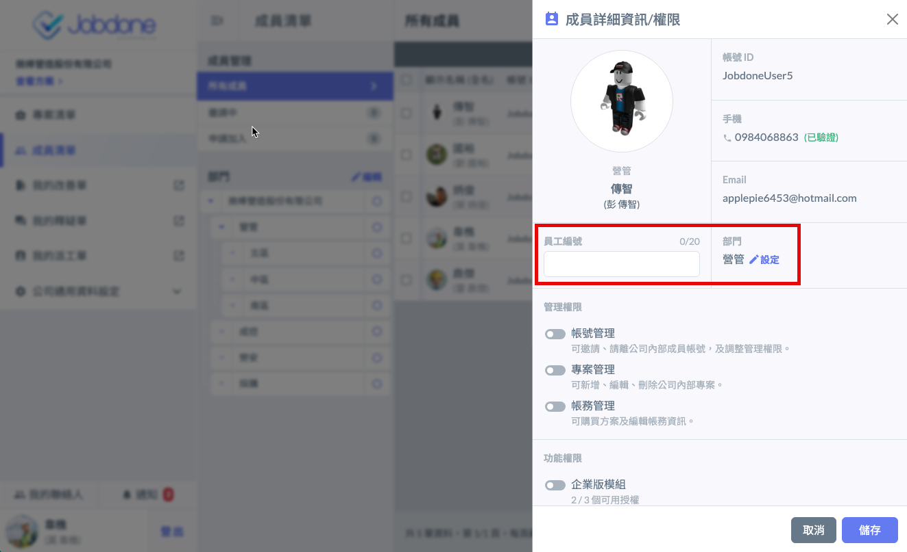

# 部門管理

---
description: Department
---

# 部門管理

大型的公司客戶可使用部門管理的功能，分類並管理部門成員。

!!! info
    本功能僅用於部門分類及管理，與簽核流程無關

## 編輯部門

進入成員清單後，點選部門旁的 「 編輯 」 按鈕，在編輯組織樹的頁面開始新增其他部門和子部門。

## 指定部門

點選成員帳號右方的選單鈕，選擇 「 查看詳細資訊 / 權限 」，即可為員工設定部門，也為員工輸入編號。

