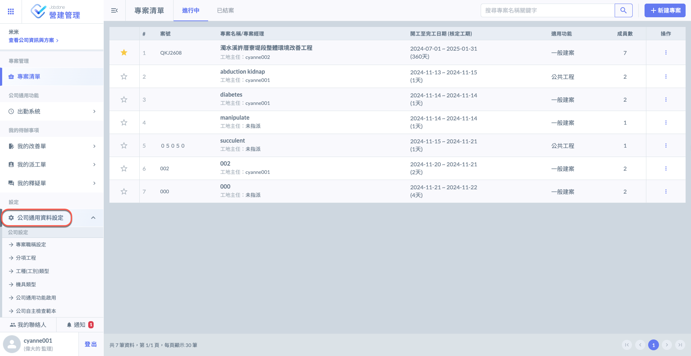

# 公司通用資料設定

---
description: Company-Wide Configuration Settings
---

# 公司通用資料設定

公司通用資料設定：屬於全公司層級的系統資料設定，例如：「自主檢查表範本」在每一個專案內都會使用到，在公司層級將「公司自主檢查表範本」一次設定好之後，未來新增專案時就可以直接選用，不需要重新建立自主檢查表內容。

建立專案之前，請先充分填&#x5BEB;**「公司通用資料設定」**，以利後續專案建立與設定。

!!! warning
    公司通用資料設定之資料僅能&#x7531;**「專案管理員」**&#x586B;寫，亦僅能&#x65BC;**「網頁版」**&#x64CD;作。
    
    有關專案管理員之設置，請參閱 ➙ [member](company_level/member "mention")

公司通用資料設定的內容：

1. 公司通用功能啟用設定：『資產盤點』、『出勤系統』這兩套功能，可以讓企業選擇是否要使用。
2. 專案職稱設定：專案職稱會影響到可以使用的「檢查表範本」與「檢查流程」。
3. 工種工別：與施工日誌的工種工別之出工概況有關。
4. 機具類型：與施工日誌的機具使用概況有關。
5. 分項工程：與檢查表、影音日誌的類別有相關。
6. 協力廠商類別管理：設定協力廠商的類別。
7. 資產設備管理：工務所的設備、工具、料材的資產盤點管理。（可選用）
8. 公司自主檢查範本：公司層級的自主檢查表範本，可供不同的專案選用。
9. 檢查表檢查項目分析屬性選項管理：設定檢查表的分類。
10. 根本原因設定：設定缺失發生的根本原因類型，以便做後續的檢討與改善。
11. 點工扣工原因管理：扣工原因設定。
12. 會議議題分析屬性選項管理：議題分類設定。
