# 公司自主檢查範本

匯入範本公司檢查範本分為兩種類型：**條列型範本**與**檔案型範本**。



可由使用者自行新增欄位，自由編列檢查項目與檢查標準，適用於需要彈性調整的檢核內容。



可上傳既有的檢查表格檔案，提供公司其他成員日後下載使用，適用於標準化或固定格式的表單。



!!! warning
    請注意：
    
    建立範本前，須先完成「分項工程」及「專案職稱」之設定，以利後續範本項目與檢查人員角色的正確對應與指派。
    
    有關<kbd>**分項工程**</kbd>與<kbd>**專案職稱設定**</kbd>之詳細操作流程，請參閱 ➙ [project-role](project-role "mention") & [subdivision](subdivision "mention")

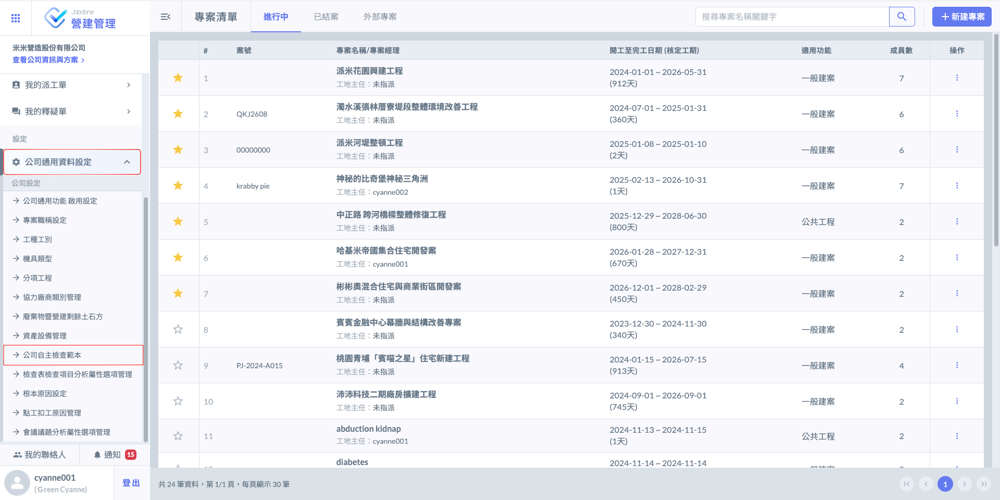

***

## 01｜建立範本

系統提&#x4F9B;**「線上建立」**&#x7BC4;本&#x53CA;**「Excel匯入」**&#x5169;種方式編列您的檢查範本。

 

### 01 - 1｜線上建立

如圖三所示，開啟功能選單後，請點選<kbd>**匯入本機檔案**</kbd> ，即可開啟新增視窗 (圖四)。

 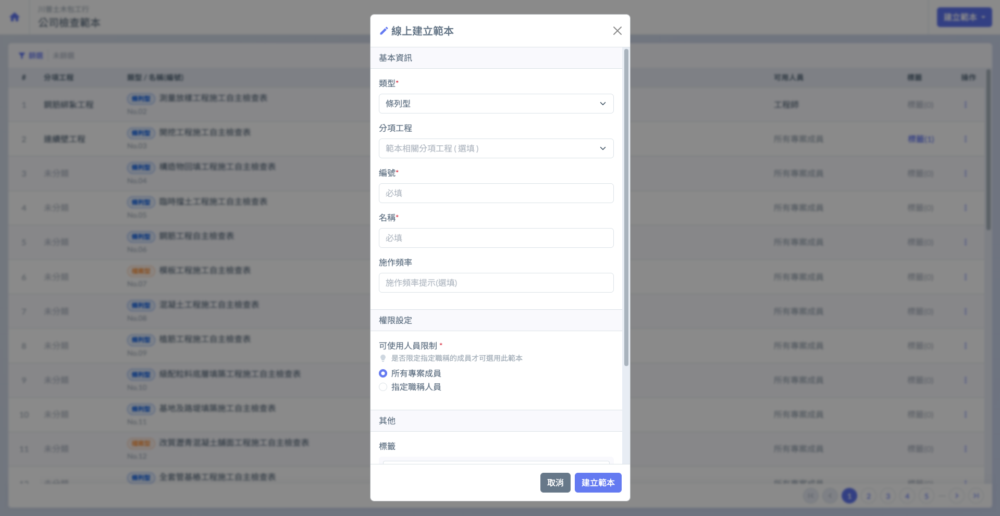

詳細操作如下 (圖五)：

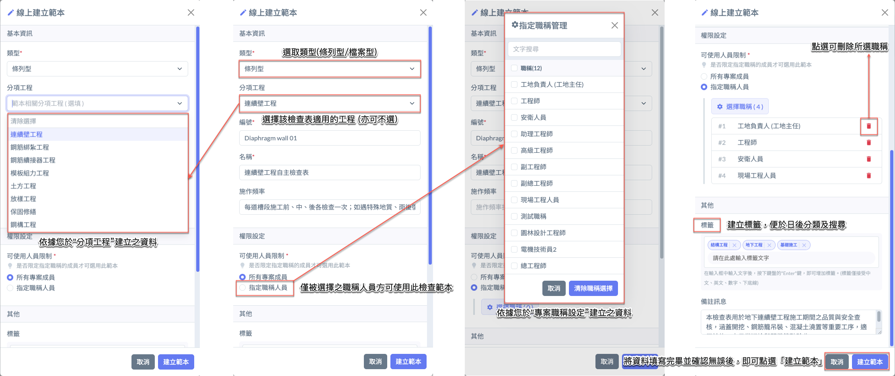

***

### 01 - 2｜Excel 匯入

如圖一所示，開啟功能選單後，請點選<kbd>**匯入本機檔案**</kbd> 。

!!! warning
    請注意：
    
    &#x50C5;**「條列型範本」**&#x652F;援透過檔案匯入的方式建立檢查項目，檔案型範本僅供上傳完整檢查文件，無法進行欄位匯入。

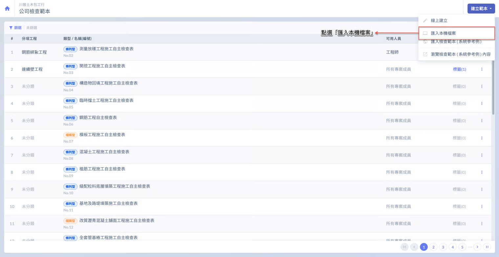



### 下載範本模板

如圖二所示 (點選<kbd>**匯入本機檔案**</kbd>後之畫面)，點選右上方&#x7684;**「範例下載」**，即可下載 Excel 範本。

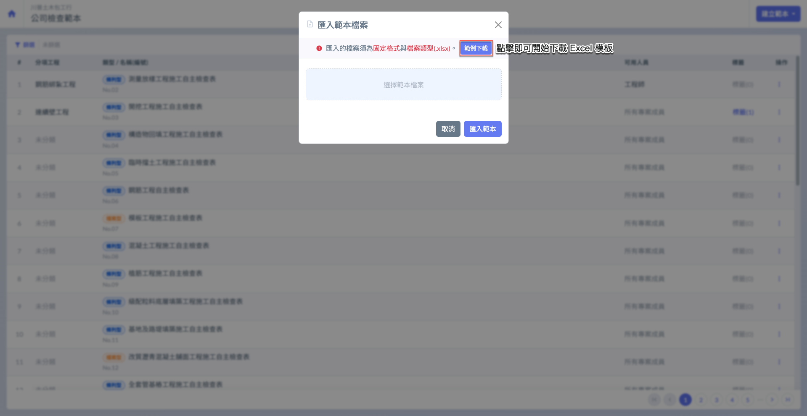

模板格式如下圖所示，請您依據表格填寫<kbd>**範本編號**</kbd>、<kbd>**範本名稱**</kbd>、<kbd>**分類名稱**</kbd>、<kbd>**項目名稱**</kbd>、<kbd>**標準值**</kbd>、<kbd>**備註訊息**</kbd>等。

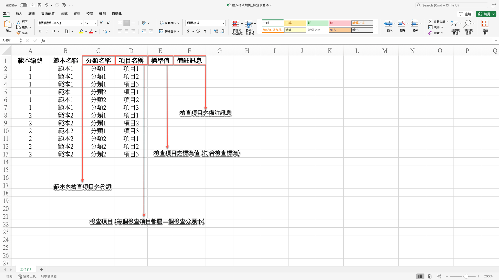



### 填寫Excel 模板

!!! warning
    請注意：由於系統需依格式判讀資料，務必使用上述提供的模板，並確實依照指定格式正確填寫。

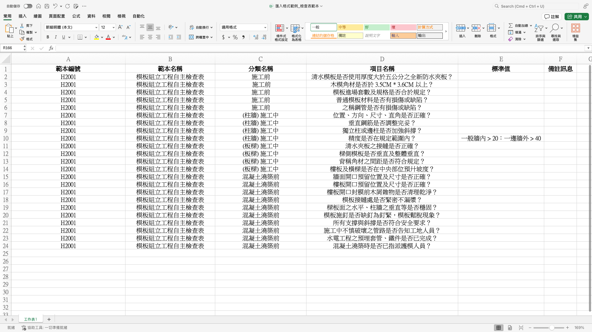



### 上傳自主檢查範本

如圖五 \~ 圖六所示，進入檔案上傳視窗後，請在上傳區域中選擇您欲上傳的檔案。

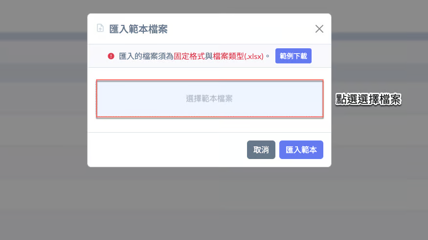 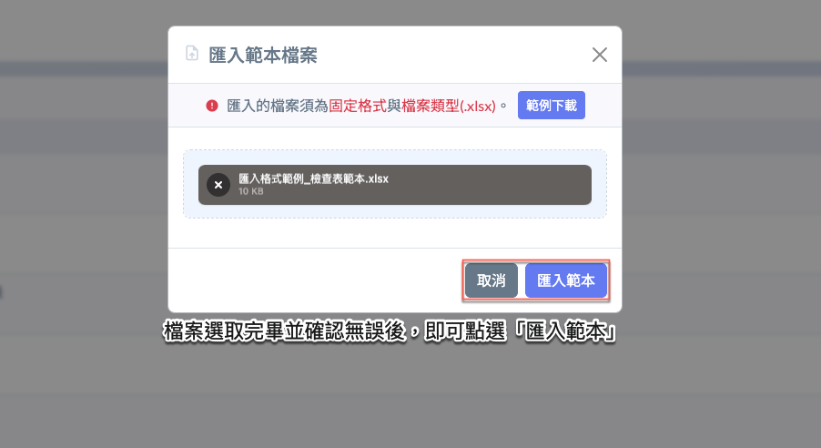




### 完成畫面

如圖七所示，檔案上傳成功後，範本即會顯示於公司檢查範本列表中。

!!! warning
    請注意：若需修改資料、設定範本標籤或指定範本可使用人員等，請進入手動編輯進行調整。

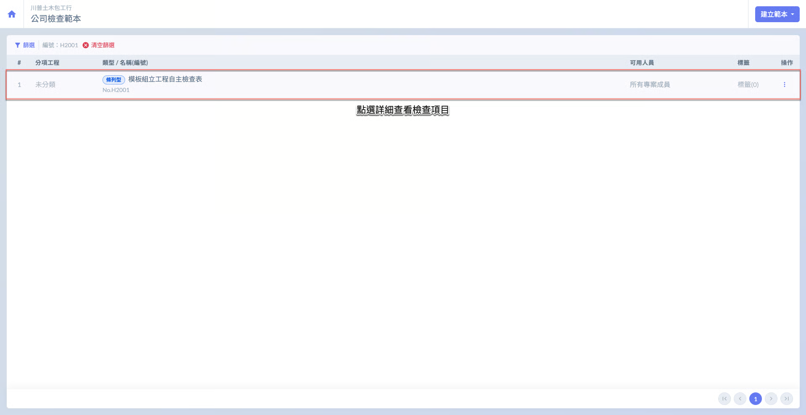

如圖八所示，進入後您即可查看透過 Excel 匯入之範本內容，包括分類、檢查項目與檢查標準等欄位，均已如實匯入並呈現於系統中。

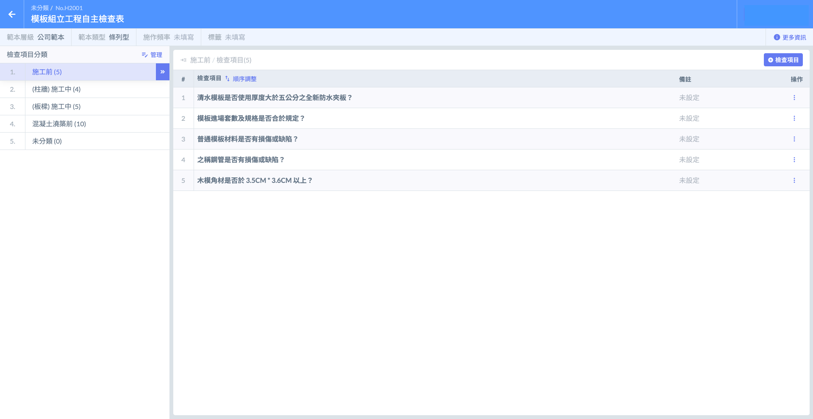



***

## 02｜匯入/瀏覽檢查範本 (系統參考例)

符合工程會（公共工程委員會）對公共工程品質管理的要求，Jobdone 提供多達 200 種以上的自主檢查表範例，涵蓋各類常見工項與檢查標準。

您可直接從範本庫中匯入所需的檢查範本，快速建立專案檢查流程，省去逐項手動新增的時間與繁瑣作業。匯入後，仍可依據實際施工內容進行調整與編輯，確保符合現場需求與工程規範。

!!! info
    範例內容僅供參考示意，實際檢查項目及標準請依各專案需求自行編輯與調整，以符合實務作業及檢核要求。

 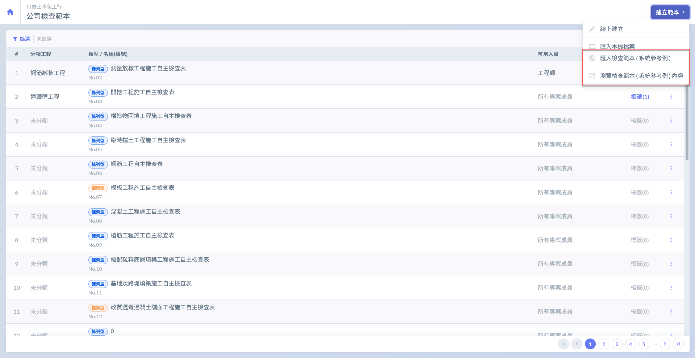

### 02 - 1｜匯入檢查範本

如圖三所示，開啟功能選單後，請點選<kbd>**匯入檢查範本 (系統參考例)**</kbd>。

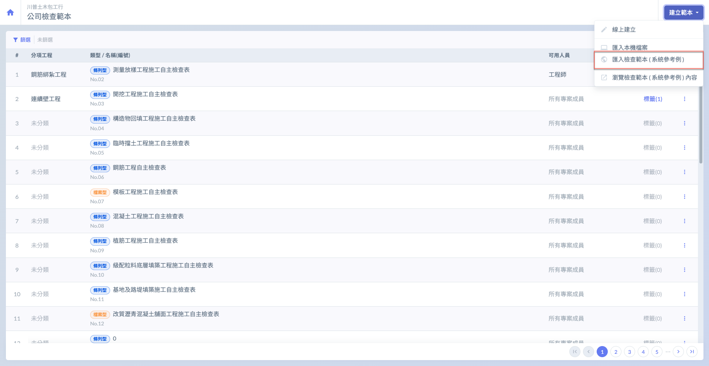

開啟範本篩選器後，您可依據檢查範本的**編號**、**名稱**、**類型**及**標籤**進行篩選，快速找出符合您需求的範本。

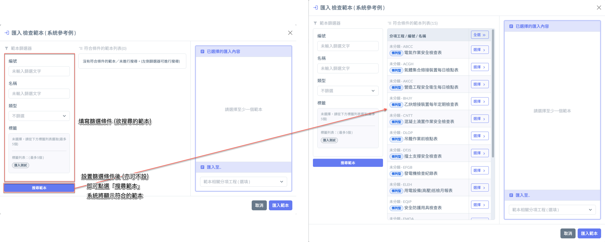

篩選完畢後，即可從符合條件的範本列表中**選擇**所需範本進行匯入，並將所選範本歸類至指定的分項工程。

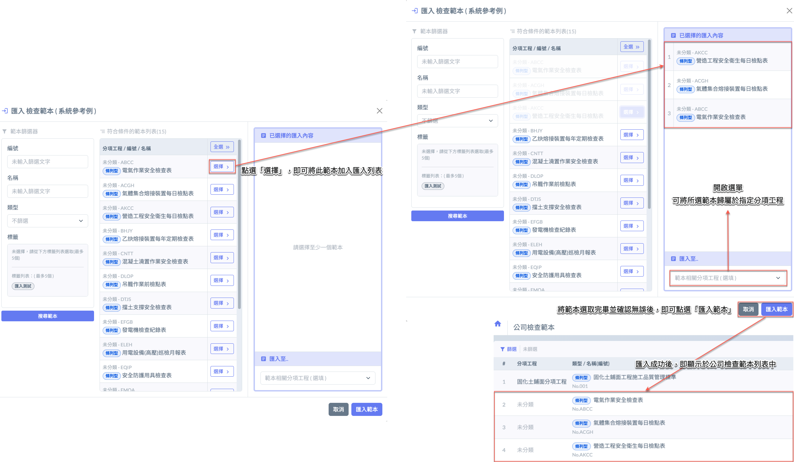

### 02 - 2｜瀏覽檢查範本

如圖六所示，開啟功能選單後，請點選<kbd>**瀏覽檢查範本(系統參考例)內容**</kbd>。

即可預覽系統提供的範本詳細項目與檢查標準，供您參考評估是否匯入使用。

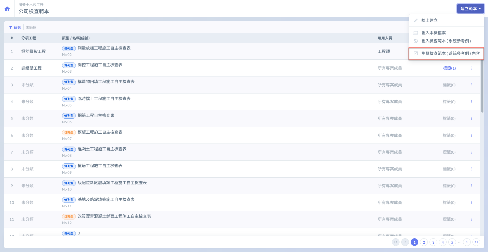

***

## 03｜檢查項目 & 分類

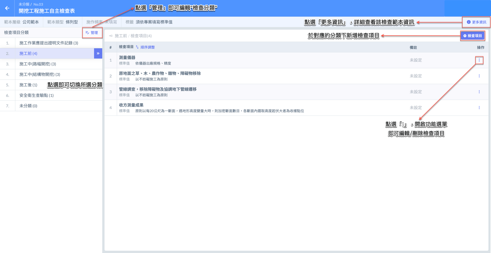

### 03 - 1｜新增檢查分類

如圖二 \~ 圖三所示，進入範本內部後，於檢查項目分類欄位右側點&#x9078;**「管理」**，即可開啟檢查分類管理頁面，進行分類的新增、編輯或刪除操作。

 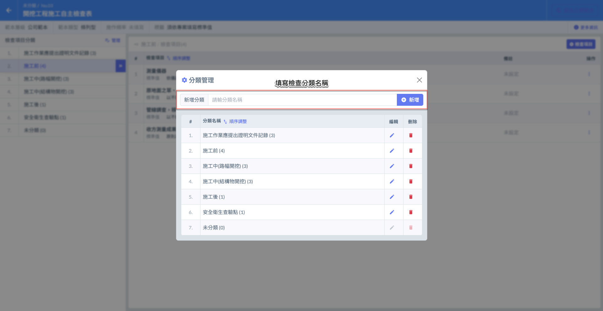

如圖四 \~ 圖五所示，於新增欄位輸入分類名稱後，點&#x9078;**「+新增」**，該分類即會顯示於分類列表中，之後即可針對該分類編列對應的檢查項目。

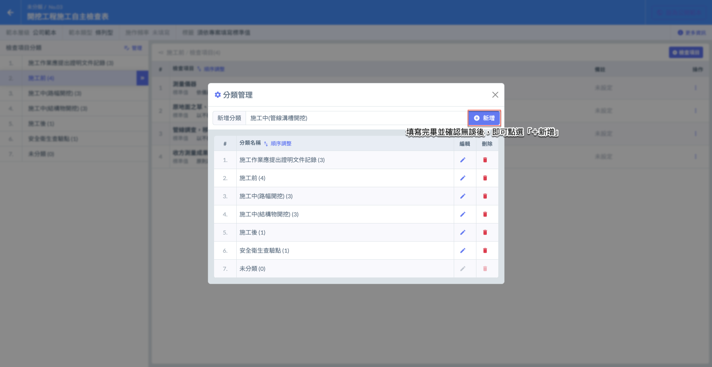 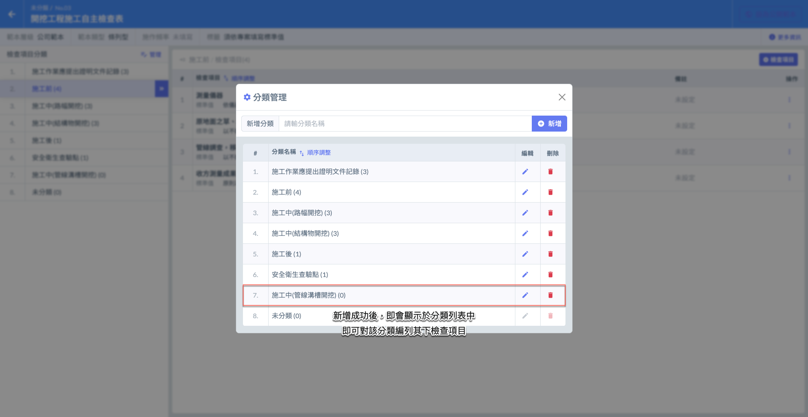

### 03 - 2｜編輯/刪除檢查分類

如圖六、圖七所示，您可點&#x9078;**「****」**&#x7DE8;輯檢查分類名稱，或點&#x9078;**「**」刪除不需要的檢查分類。

!!! warning
    若欲刪除之檢查分類下仍有檢查項目，系統將提供讓您選擇：<kbd>**是否一併刪除該分類下所有檢查項目**</kbd>，或將這些檢查項目自動移轉至「未分類」中。請依實際需求謹慎操作。

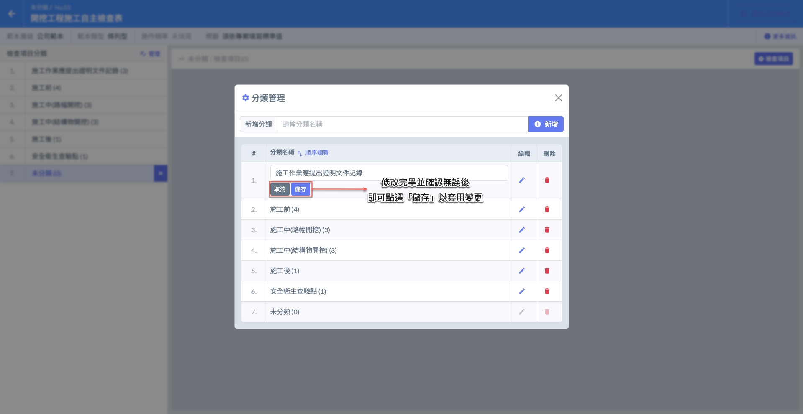 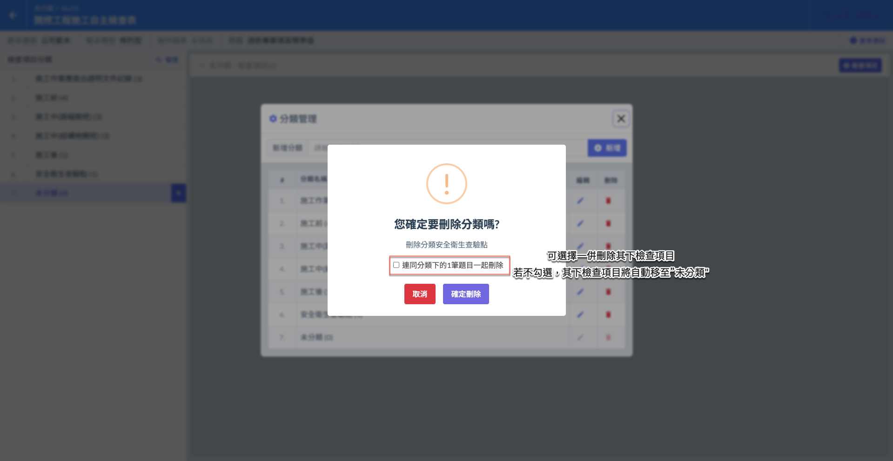

### 03 - 3｜檢查項目相關



### 切換檢查分類

在編輯檢查項目之前，請先選擇對應的檢查分類，系統將依所選分類顯示相關項目，您即可於該分類下進行新增、修改或刪除檢查項目的操作。

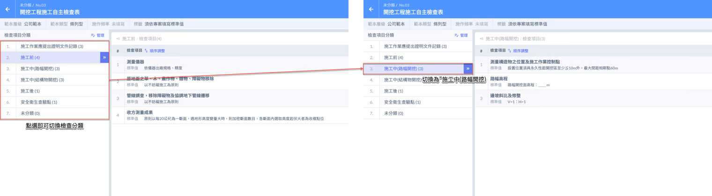



### 編輯檢查項目

如圖九，於欲編輯之檢查項目右側點&#x9078;**「⋮」**&#x5716;示 (於操作欄位)，即可開啟功能選單，並選擇<kbd>**編輯**</kbd> 。

如圖十，開啟選單後，點選<kbd>**編輯**</kbd>，即可進入編輯畫面，可修改檢查項目資料調整所屬檢查分類。

修改完畢並確認無誤後，請點&#x9078;**「儲存變更」**&#x4EE5;套用變更。

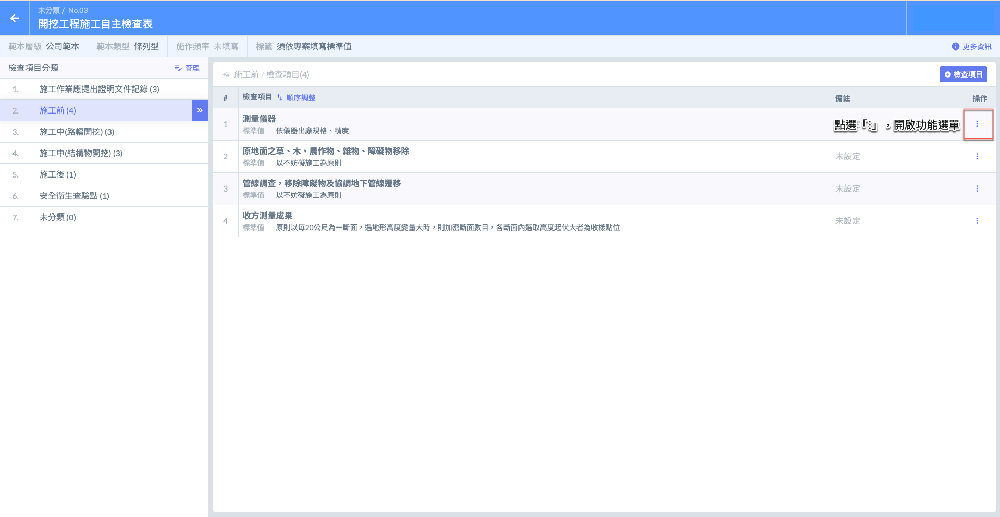 

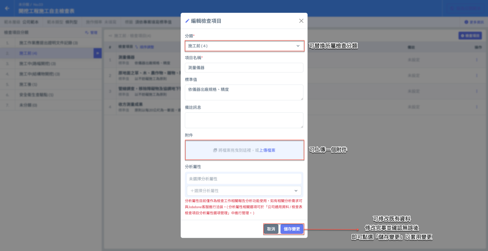



### 刪除檢查項目

於欲刪除之檢查項目右側點&#x9078;**「⋮」**&#x5716;示 (於操作欄位)，即可開啟功能選單，並選擇<kbd><mark style="color:red;">**刪除**<mark style="color:red;"></kbd>。&#x20;

 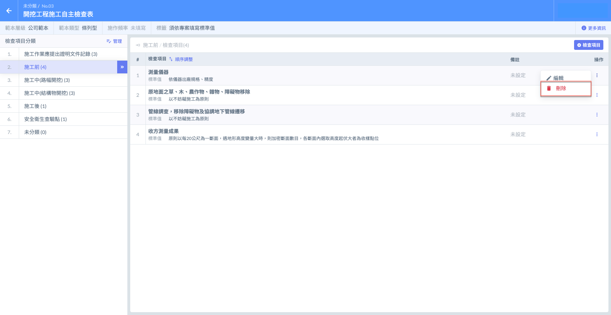



