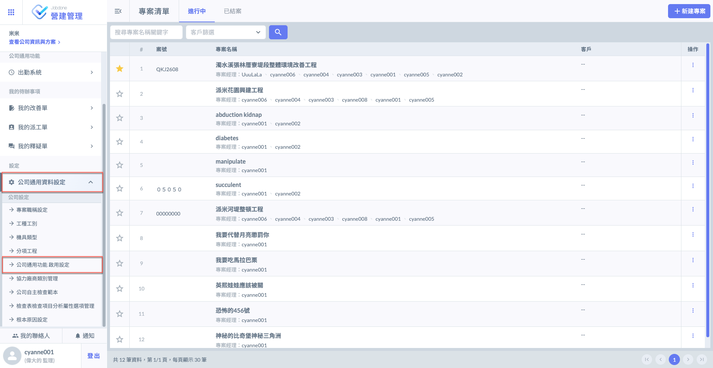
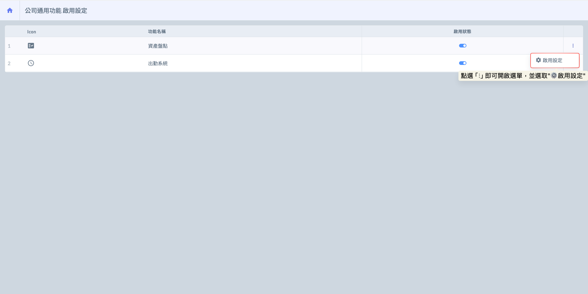
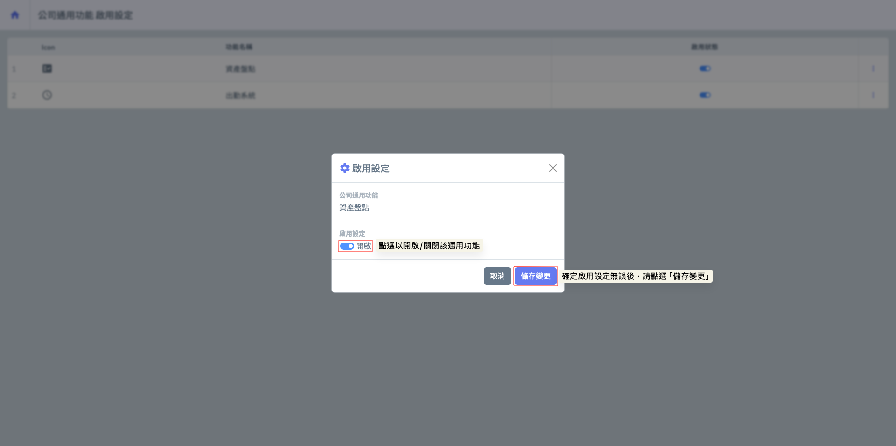
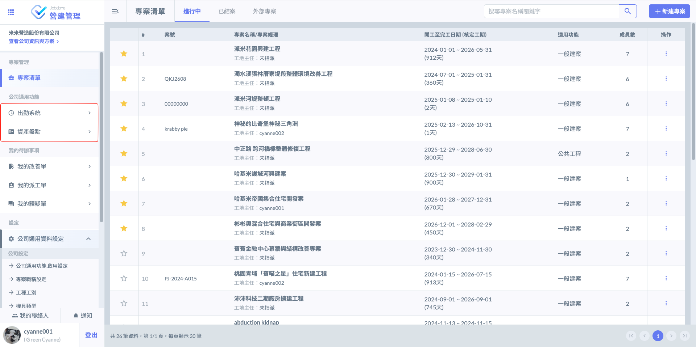

# 公司通用功能 啟用設定

公司通用功能屬公司層級設定，只有「**專案管理員**」權限的人員可以設定。

目前，各模組所支援的公司通用功能如下：&#x20;



可啟用<kbd>**出勤系統**</kbd>或<kbd>**資產盤點**</kbd> 。

<kbd>**出勤紀錄**</kbd> 統一管理所有工地及人員的出勤紀錄，方便稽核與報表彙整。

<kbd>**資產盤點**</kbd> 可對各工地的設備資產進行紀錄與盤點，以全面掌握資產狀況。



額外提供<kbd>**調度中心**</kbd>功能，協助廠區進行人力與物料的統籌調度與庫存管理，強化整體作業效率與透明度。



這些功能皆由公司層級統一管理與設定，確保所有部門與專案之間能無縫整合、協同運作。

***

## 01｜啟用/關閉

進入通用功能設定頁面後，選定欲變更的功能，於右側點選「⋮」開啟選單，並選取 ，即可開啟視窗設定想啟用的功能。

 

示意圖如下（將出勤系統、資產盤點皆啟用）：

!!! info
    即便後續關閉出勤系統或資產盤點等功能，先前已產生的歷史資料皆會妥善保留，不會因此消失或刪除。

