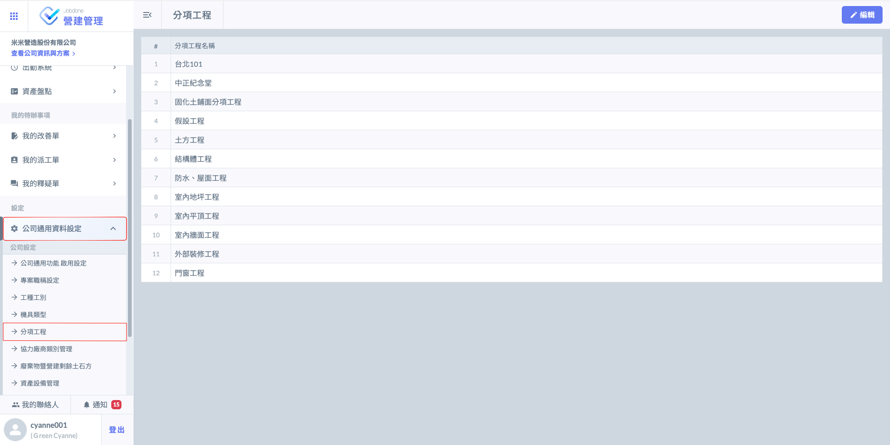
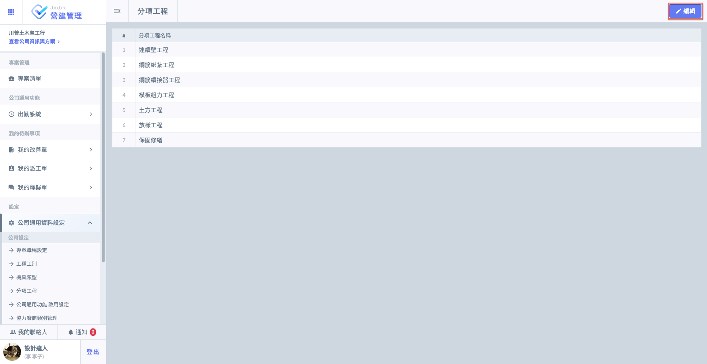
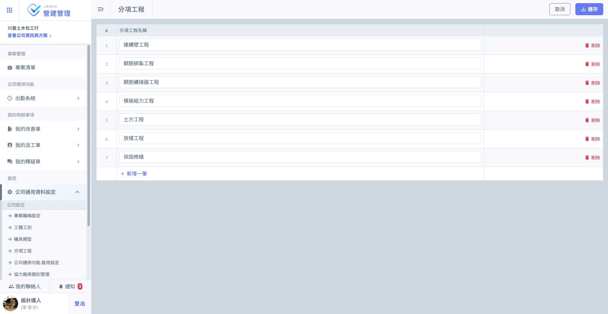
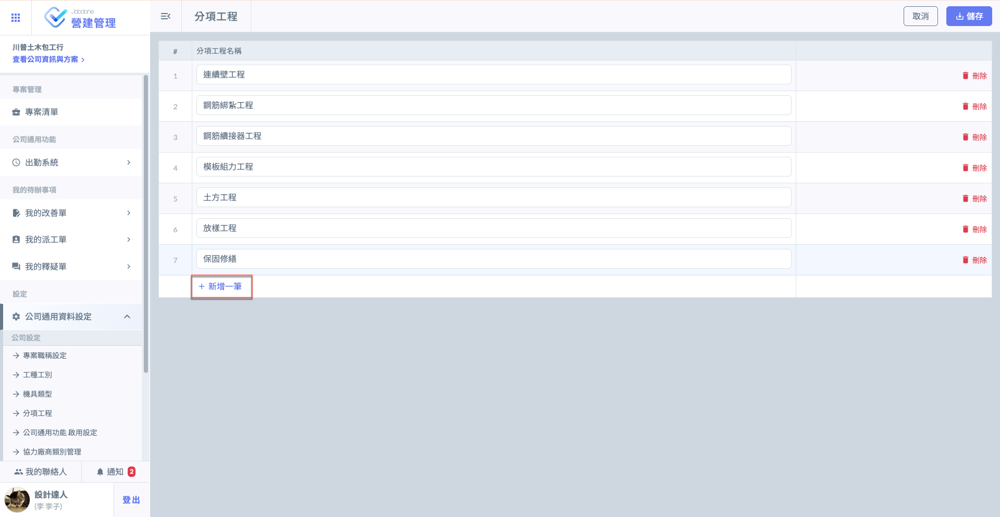
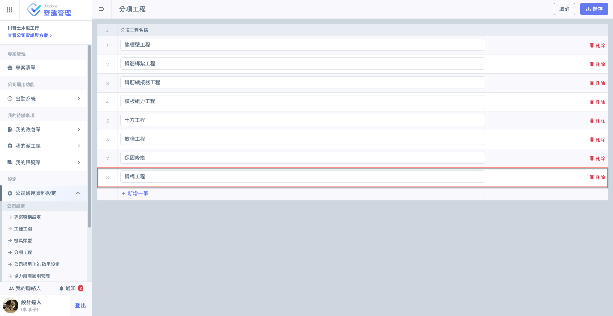
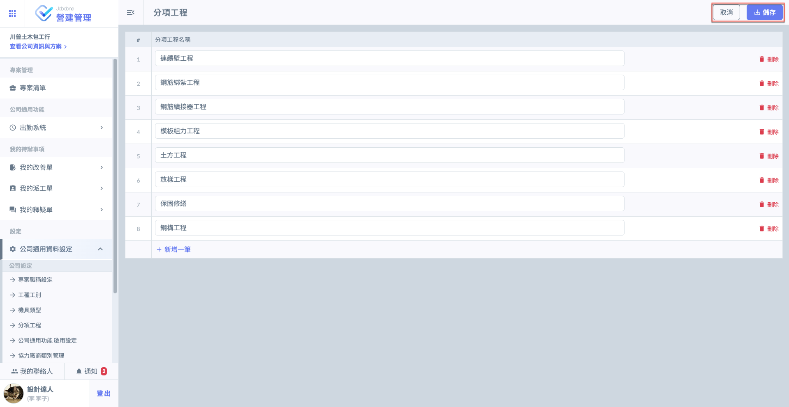

# 分項工程

點擊主頁面&#x4E4B;**「公司通用資料設定」**&#x5167;&#x7684;**「分項工程」**，開始編輯分項工程資料。

!!! tip
    專案內部&#x4E4B;**「專案分項工程」**，將自動預設為&#x65BC;**「公司通用資料設定」**&#x8A2D;立之分項工程資料。

如圖一，進&#x5165;**「分項工程」**&#x4E3B;頁面後，點選右上角&#x4E4B;**「編輯」**，即可開啟編輯模式(圖二)。

 

如欲新增分項工程，點&#x9078;**「+新增一筆」**&#x5373;可新增欄位，並填寫分項工程資料(圖四)。

 

如圖五，修改/新增資料完畢並確認無誤後，點&#x9078;**「儲存」**&#x5373;可完成新增/修改。

