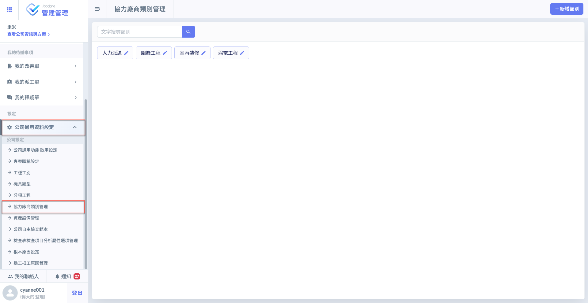
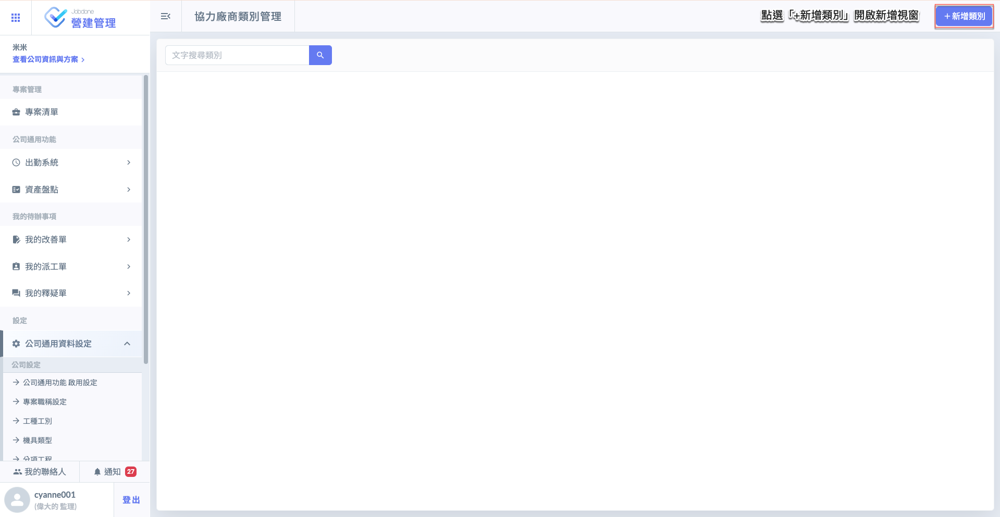
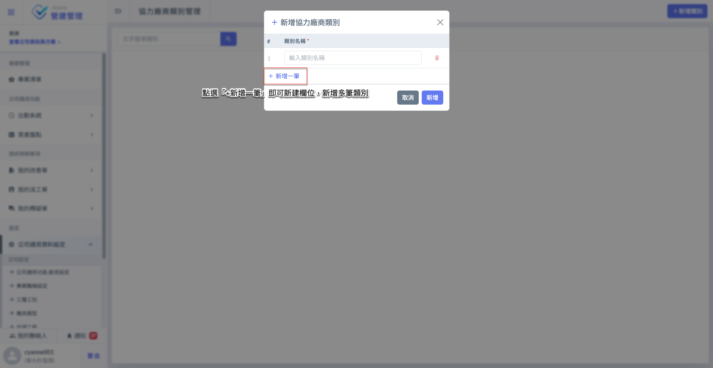
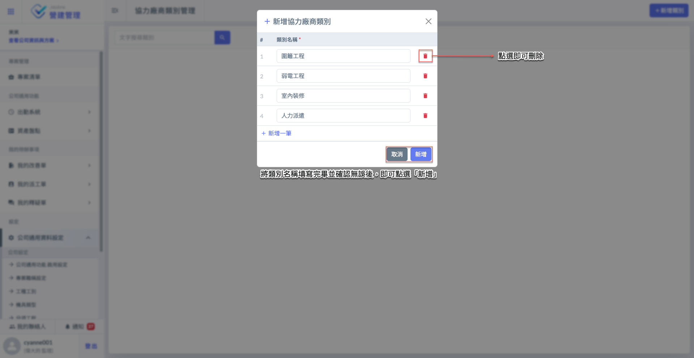
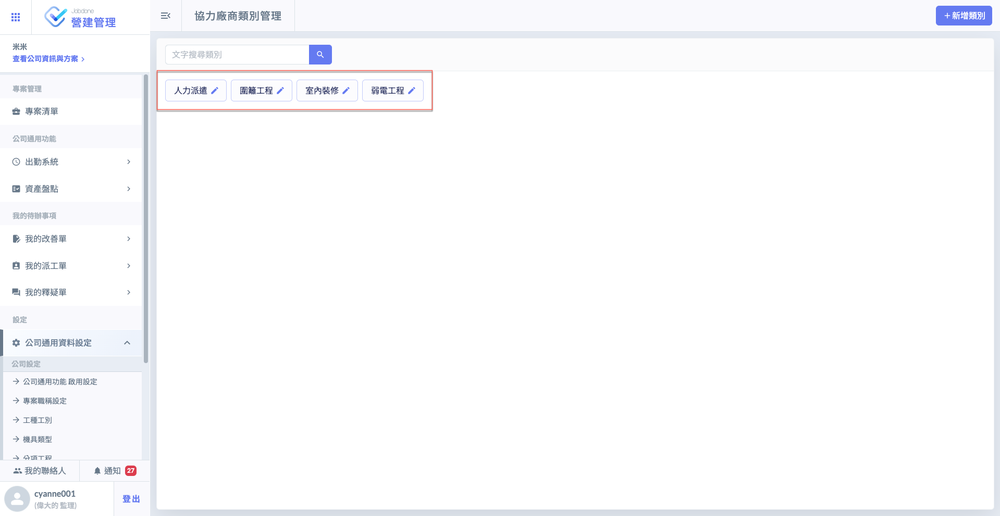
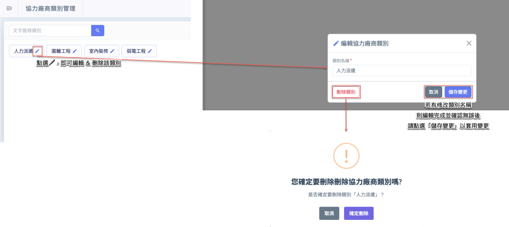
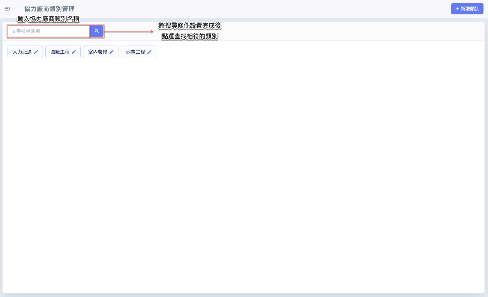

# 協力廠商類別管理

---
description: Vendor Category Management
---

# 協力廠商類別管理

**協力廠商類別**為公司層級的資料設定，使用者可在此處依實務需求，自行建立各類協力廠商的分類（如：模板工程、土方運輸、材料供應等）。在後續各專案內編列協力廠商資料時，即可選擇對應類別，作為該廠商屬性的輔助標記。

此分類主要提供管理上的輔助與辨識，方便使用者快速理解廠商所屬領域或合作範疇。請注意，協力廠商類別並不具任何權限或功能限制，僅作為參考分類使用。

***

## 01｜新增類別

如圖一 \~ 圖二所示，進入**協力廠商類別管理**頁面後，點選右上方&#x7684;**「+新增類別」**&#x6309;鈕，即可開啟視窗，並填寫欲新增的類別名稱。

 

如圖三 \~ 圖四所示，進入新增視窗後，點&#x9078;**「+新增一筆」**&#x5373;可新增欄位，讓您可依需求填寫多個協力廠商類別。完成所有分類名稱填寫並確認無誤後，請點&#x9078;**「新增」**，系統即會將所填資料儲存並顯示於類別列表中。

 

***

## 02｜編輯/刪除類別

於欲編輯或刪除的類別右側，點選，即可開啟編輯視窗。您可在此視窗中修改類別名稱/刪除此類別。

***

## 03｜搜尋類別

如圖六，當類別資料較多時，您可使用篩選器，輸入分類名稱，快速篩選並找到欲查詢的協力廠商類別。

輸入篩選條件並確認無誤後，點選「」即可查找相符的類別資料，實例畫面如圖七所示。

 

