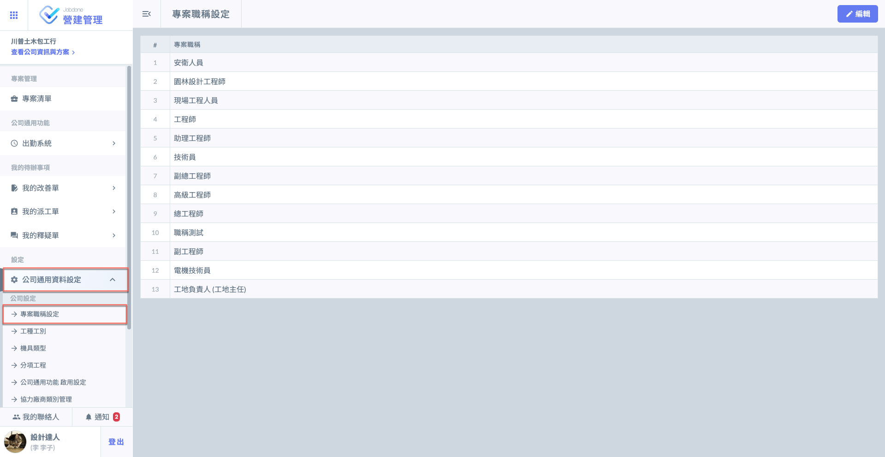
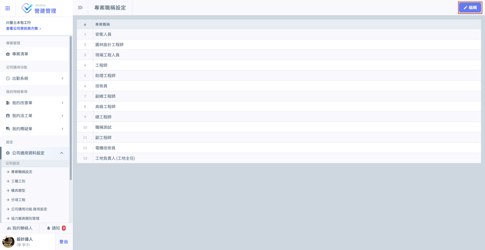
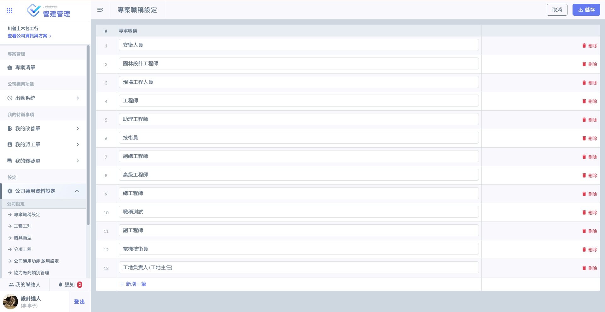
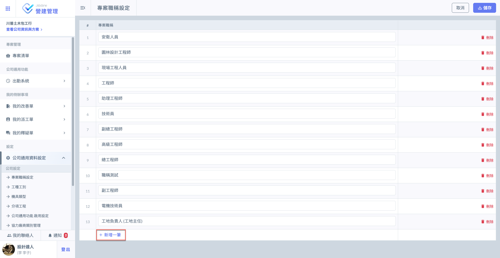
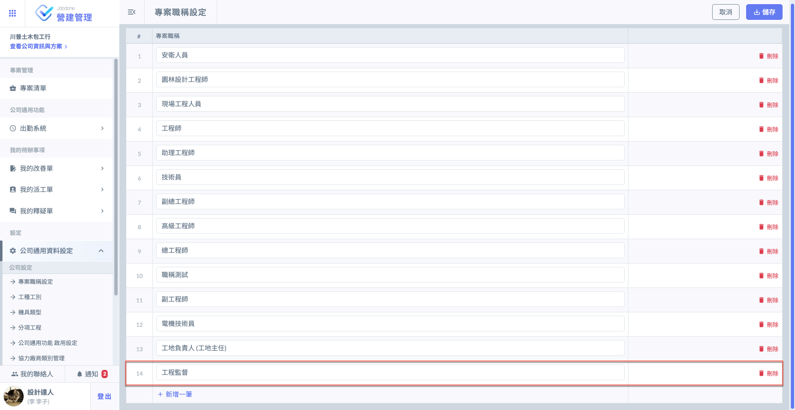
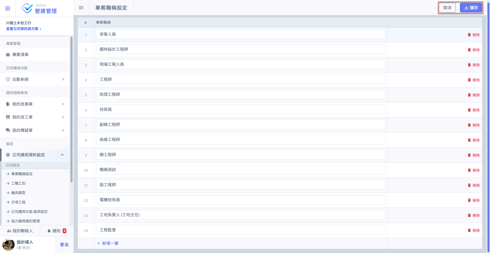

# 專案職稱設定

本功能允許專案管理人員針對團隊組織架構，自定義各類專業職務（如：工地主任、品管工程師、安衛人員、機電工程師、各類技師等），並以此作為系統權限控管的最小單元。

**影響核心：檢查表流程權限 (Inspection Workflow)**

這是職稱設定最重要的應用場景。透過職稱，您可以精準定義每一道品質門檻的執行者與審核者：

* 限定使用權：您可以設定特定檢查表（如：吊裝作業安全檢查表）僅限『安衛人員』發起；或鋼筋查驗僅限『土木技師』使用。這能防止非專業領域的人員誤用表單確保紀錄的專業權威。
* 階層審核權：在設定流程時，您可以指派特定的職稱（如：工地主任）為審核關卡。當現場工程師完成初驗後，系統會自動根據職稱篩選出具備審核資格的人員，落實層級管理。

***

進入 Jobdone 系統網頁版主頁面後，請點選左側的『公司通用資料設定』欄位以開啟子選單，隨後選取『專案職稱設定』，即可進入該功能的管理介面。

!!! info
    您在此所建立的這套職稱清單，其最終目的，是為了在進入特定專案內部進行『專案成員』設定時，供管理人員直接選取與賦予職權。

如圖一，進&#x5165;**「專案職稱設定」**&#x4E3B;頁面後，點選右上角&#x4E4B;**「編輯」**，即可開啟編輯模式(圖二)。

 

如欲新增職稱資料，點&#x9078;**「+新增一筆」**&#x5373;可新增欄位，並填寫專案職稱資料(圖四)。

 

如圖五，修改/新增資料完畢並確認無誤後，點&#x9078;**「儲存」**&#x5373;可完成新增/修改。

