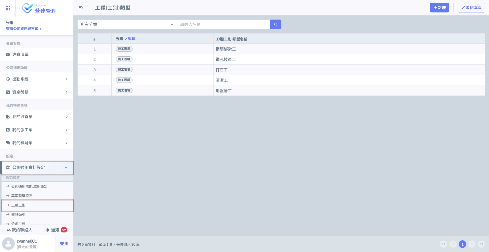
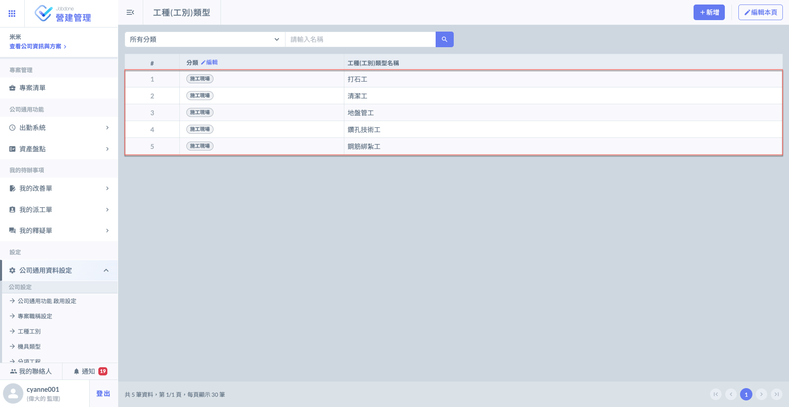
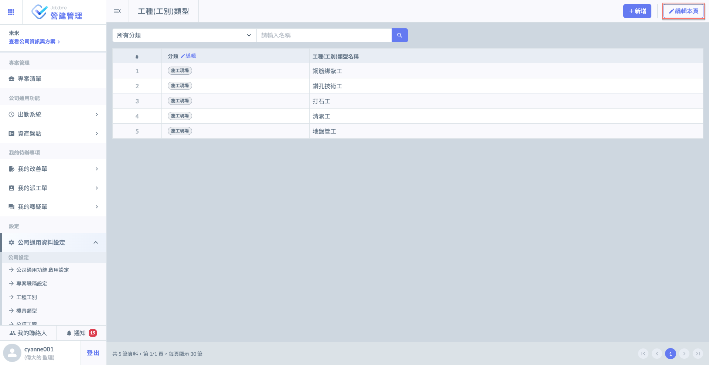
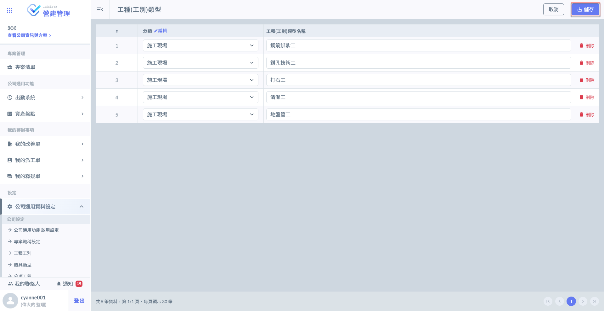
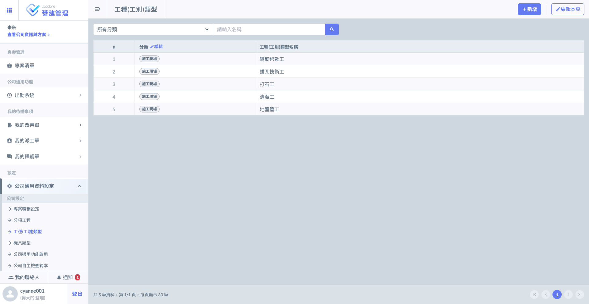

# 工種工別

在公司管理介面中，管理員可預先定義全公司通用的工種資料庫（例如：模板工、鋼筋工、水電工等）。這套標準化資料將作為所有新專案的基礎。

* 統一管理：確保不同案場對於工種名稱與分類的定義一致，便於後續跨案場的施工日誌出工分析與統計。
* 自動預設：當系統建立新專案時，會自動帶入公司層級設定好的工種資料，節省重複輸入的時間。

!!! info
    #### 專案層級：彈性調整機制
    
    雖然專案會預設載入公司層級的資料，但考量到不同地區或特殊案場的需求，系統保留了高度的調整空間：
    
    1. 專案專屬工種：若特定有特殊的技術需求，可針對該專案獨立新增或修改工種清單。
    2. 設定隔離：專案內部的工種調整僅會影響該專案，不會更動到公司層級的原生資料庫，確保全域資料的純潔性。
    
    有關專案工種設定之詳細說明，請參閱 ➙ [專案工種(工別)類型](../cpm/project_level/project_data/trade-category)

***

系統提&#x4F9B;**「手動新增」**&#x53CA;**「Excel匯入」**&#x5169;種方式編列您的工種(工別)資料。

***

## 01｜手動新增

點擊主頁面&#x4E4B;**「公司通用資料設定」**&#x5167;&#x7684;**「工種(工別)類型」**，開始編輯工種資料。

請根據以下流程操作：



### 進行分類設定

如圖一所示，點擊分類欄位旁&#x4E4B;**「編輯」**，開始新增您的工種分類。

若需新增或調整工種工別分類，請依循以下步驟操作：

1. 新增分類：進入編輯畫面，點選下方的  按鈕，系統將自動產生空白欄位。
2. 輸入名稱：於空白欄位中填入預計設定的工種分類名稱（如：鋼筋綁紮工程、機電工程等）。
3. 儲存設定：確認資料填寫無誤後，請務必點選  鍵，以確保設定生效並同步至後續專案。

!!! info
    請務必先完成大方向的分類設定（必填），後續在分類下新增具體『工種』時會更具條理。




### 新增工種資料

點選下圖紅框圈選處&#x4E4B;**「+新增」**&#x5F8C;，選擇先前已設立好之分類，並填寫您的工種資料。

進入新增視窗後，點&#x9078;**「+新增一筆」**，即可新增欄位，供您填寫多個工種資料並進行後續設定。

將工種資料填寫完畢並確認無誤後，即可點選「新增」。

充分填寫完畢後，畫面如下：




### 編輯工種資料

當您將工種資料建立完畢後，後續若有更動需求即可編輯先前的資料。

點選下圖紅框圈選處&#x4E4B;**「編輯本頁」**&#x5F8C;，您即可編輯先前建立的工種資料。

您可：**「變更分類」**、**「修改工種名稱」**、**「刪除工種資料」**。

依據您的需求修正完畢後，點&#x9078;**「儲存」**&#x66F4;新資料。




***

## 02｜Excel 匯入

點擊主頁面&#x4E4B;**「公司通用資料設定」**&#x5167;&#x7684;**「工種(工別)類型」**，開始編輯工種資料。

!!! warning
    Excel 匯入功能僅能在尚未新增任何工種（工別）資料時使用，匯入後則無法再匯入。
    
    因此，透過Excel匯入後，若您需要更動/增加工種資料，則需透過手動編輯。
    
    由於檔案僅能上傳一次，若您需要重新匯入Excel資料，則需先將原有資料全部刪除。
    
    ( 刪除 Jobdone 公司通用資料設定之工種資料，而非Excel。)

請根據以下流程操作：



### 下載 Excel 模板

點擊(圖一)紅框圈選處之<kbd><mark style="color:green;">**Excel匯入**<mark style="color:green;"></kbd>，進入(圖二)頁面後，開始下載Excel工種類型模板。

開啟 Excel 工種模板 視窗後，於畫面中的『Excel 模板下載』欄位，點選  圖示，即可將標準範本儲存至您的電腦。

1. 填寫資料：開啟下載的 Excel 檔案，依據格式填入案場預計派出的工種列表。

檔案畫面如下所示，依據模板表格填&#x5BEB;**「工種分類」**&#x8207;**「工種類型名稱」**。




### 填寫 Excel 模板

!!! warning
    由於系統判讀資料之因素，**「務必使用」**&#x4E0A;述提供的模板填寫，並依照格式妥善填寫。




### 上傳 Excel 檔案

系統將在送出時給予提醒(圖六)，上傳成功後，系統匯入&#x65BC;**「步驟二」**&#x6240;填寫之資料(見圖七)。

!!! warning
    如上提示所述：
    
    由於檔案僅能上傳一次，若您需要重新匯入Excel資料，則需先將原有資料全部刪除
    
    ( 刪除 Jobdone 公司通用資料設定之工種資料，而非Excel )。



