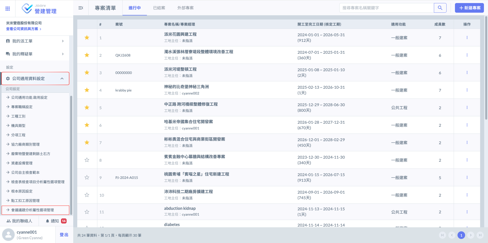
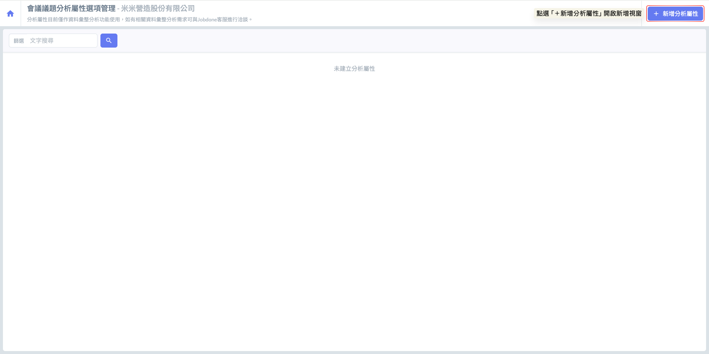
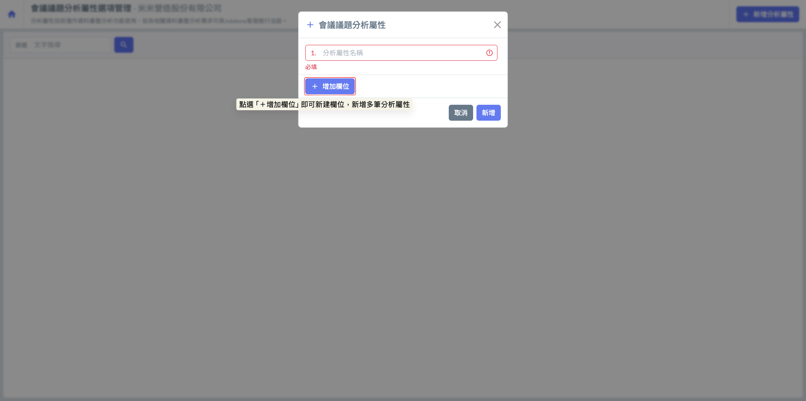
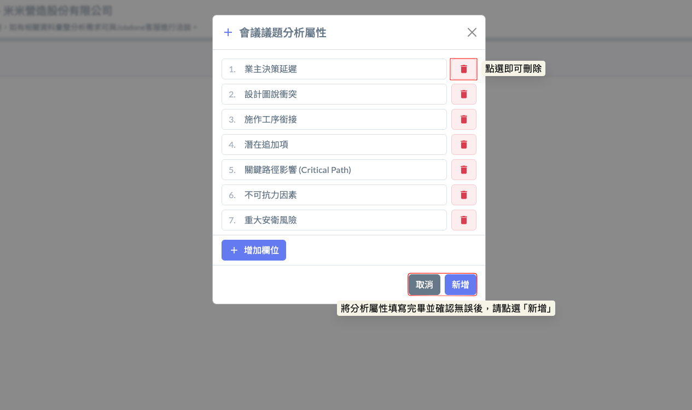
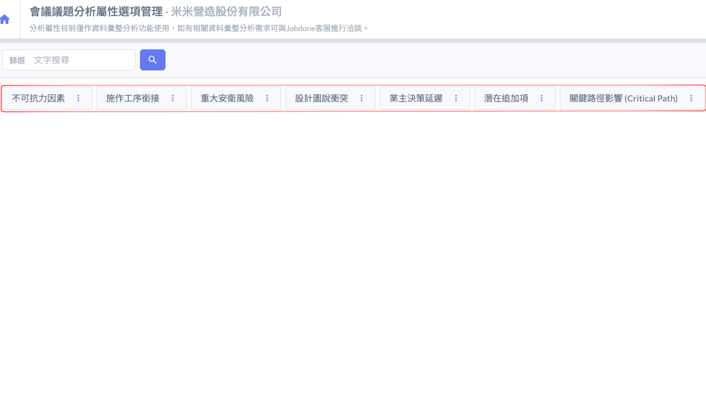
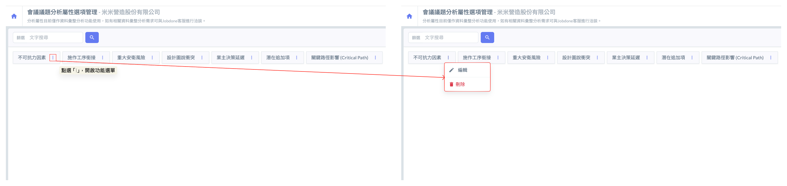
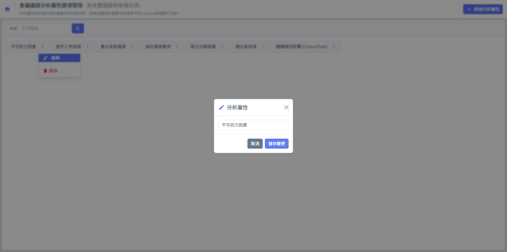
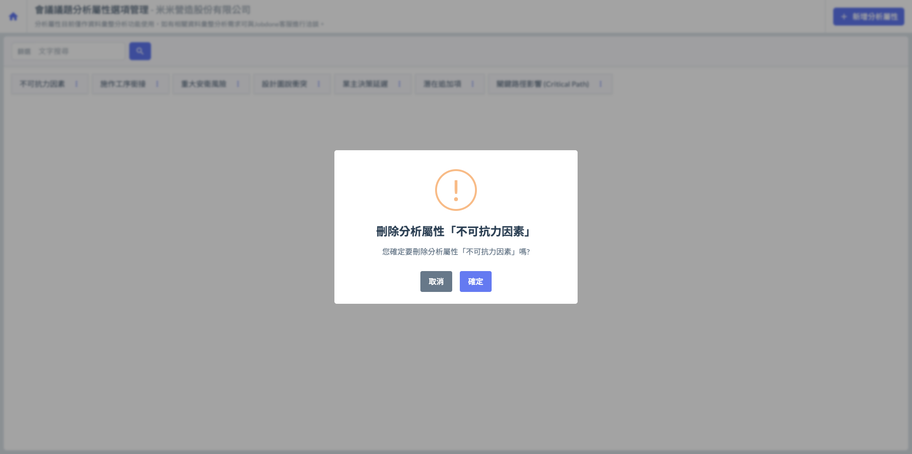
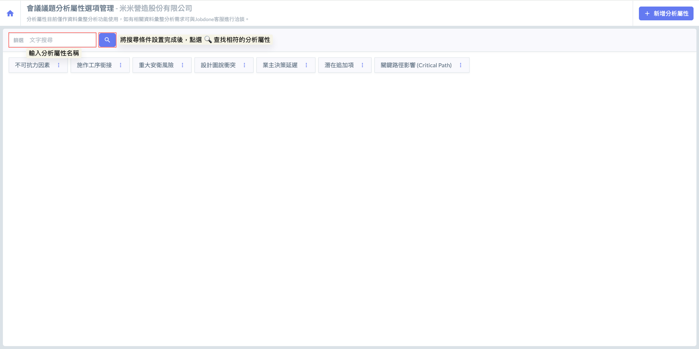
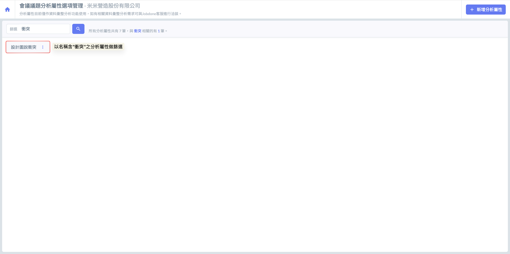

# 會議議題分析屬性選項管理

在 Jobdone 系統中，雖然「議題標籤」已能提供快速的關鍵字分類，但『會議議題分析屬性選項管理』則進一步提供了更嚴謹的結構化定義。標籤通常具備隨機性與彈性，而「分析屬性」則是企業級的分類規範。雖然目前此屬性主要作為精準標註使用，暫無實質運算或自動報表功能，但它是實現「工程履約標準化」的關鍵基石。提前依據公司管理需求建置規則，能確保所有會議紀錄在產出時具備一致的專業分類，並為日後系統升級「自動化統計」與「大數據分析」功能時，預先埋下高品質的數據種子。

<kbd>**為什麼需要分析屬性？（與議題標籤的區隔)**</kbd>&#x20;



用於「快速檢索」與「橫向標記」。例如：`#1F天花`、`#臨時水電`。屬性較隨機，方便現場人員隨手分類。



&#x20;用於「本質歸類」與「管理定位」。這是由公司預先定義的標準化選項（如：責任歸屬、合約影響），用於界定該議題在管理流程中的定位，是未來大數據統計的底層基礎。



!!! info
    #### 資料使用與客製化說明
    
    目前分析屬性****在會議紀錄畫面上並不直接顯示****，主要儲存於資料庫中，若貴公司有以下進階管理需求：
    
    * 欲將分析屬性應用於「議題列表」或「待辦事項」進行跨會議的深度篩選或彙整。
    * 自訂報表須根據分析屬性分類。
    * 建立以分析屬性為依據的議題權責或紀錄分組
    
    👉 請聯絡 Jobdone 客服，我們將為您進行客製化服務評估與功能擴充建議，協助您將會議紀錄在具備決策參考價值的專業大數據更上一層樓。

***

### 01｜新增分析屬性

如圖一 \~ 圖二所示，進入會議議題分析屬性選項管理頁面後，點選上方之  按鈕，即可開啟視窗，並填寫欲新增的分析屬性名稱。

 

在 Jobdone 的數位管理架構中，單一會議紀錄可能衍生出多項會議議題，而這些議題往往與後續的「派工單」、「釋疑單 (RFI)」或「界面協調」深度關聯。分析屬性的編列可完全依據公司內部管理需求自定義。以下提供四種營建管理最常見的維度範例，供管理員建置選項時參考：

**範例一：責任歸屬（Liability Analysis）**

處理「工期展延 (EOT)」或法律爭議時，釐清議題根源的關鍵。



針對發包延誤、變更需求確認緩慢、地權徵收不當等。



針對圖面不符、法規檢討錯誤、設計遺漏等。



針對承商工法錯誤、材料品質不符、施作順序不當。



針對天候異常、鄰房抗爭、發現古蹟等外部因素。



**範例二：界面衝突類別 (Interface Classification)**

針對頻繁發生的「界面協調（Interface Management）」進行標註，方便未來統計工序衝突熱點。



如機電風管、排水管與天花板高度、大樑位置的干涉。



如土建牆面漏開恐、機電套管位置偏移。



如防水層未完成即進行貼磚、泥作未進場導致水電無法配合。



如大型設備進場時，與現場結構或裝修時程的衝突。



**範例三：合約與成本風險 (Contractual & Cost Risk)**

在變更設計（VO）正式成案前進行預警分類，控管成本風險。



單純施工協調，不涉及費用增減。



現場提出更省時省錢的工法，可能涉及價金變更。



明確屬於合約需求，預警需進行報警。



因應消防或建管法規變更，需強制性修改。



**範例四：議題急迫與影響性 (Criticality & Impact)**

標註議題對專案主路徑的威脅程度。



若此議題未解，將直接影響整體竣工日期。



僅為文件收送或程序溝通。



涉及停工處分或人員傷亡風險的議題。



針對長交期設備（如電梯、發電機）的到場時程追蹤。



!!! tip
    #### 同樣地，以上範例也很建議同步應用於「標籤」功能！
    
    標籤能在前端介面提供直觀的視覺辨識，並方便人員進行跨會議的快速檢索與橫向關聯，與分析屬性相輔相成，建構出更完整的專案追蹤體系。

如圖三 \~ 圖四所示，進入新增視窗後，點選  即可新增欄位，讓您可依需求填寫多個會議議題分析屬性。

 

***

### 02｜編輯/刪除分析屬性

於欲編輯或刪除的分析屬性右側，點&#x9078;**「⋮」**，即可開啟功能選單，並選擇<kbd>**編輯**</kbd>分析屬性/<kbd><mark style="color:red;">**刪除**<mark style="color:red;"></kbd>分析屬性。

 

***

### 03｜篩選分析屬性

如圖一，當資料較多時，您可使用篩選器，輸入屬性名稱，快速篩選並找到欲查詢的檢查項目分析屬性。

輸入篩選條件並確認無誤後，點選  圖示，即可查找相符的分析屬性，實例畫面如圖二所示。

 

