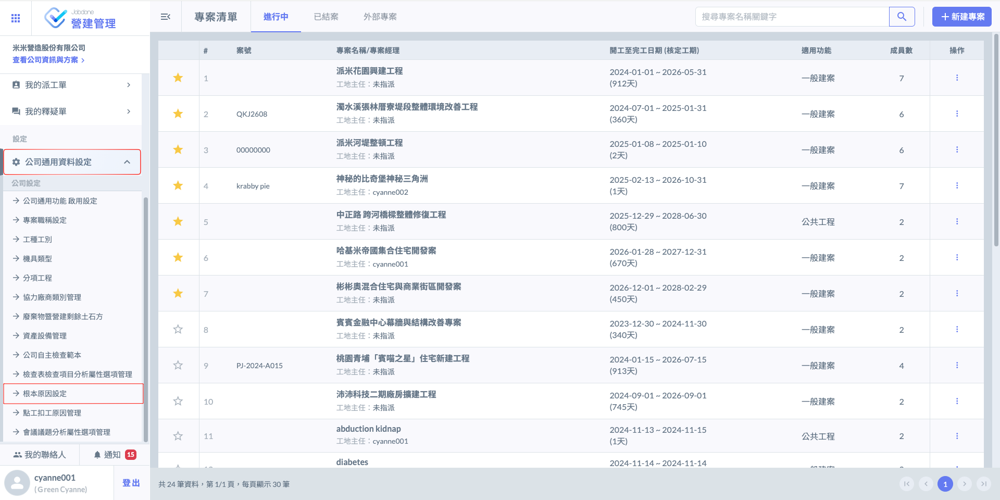
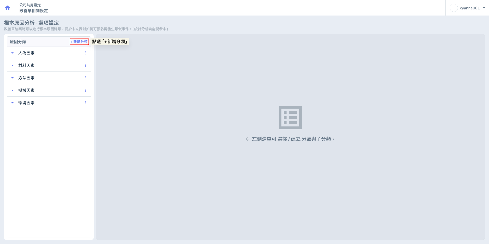
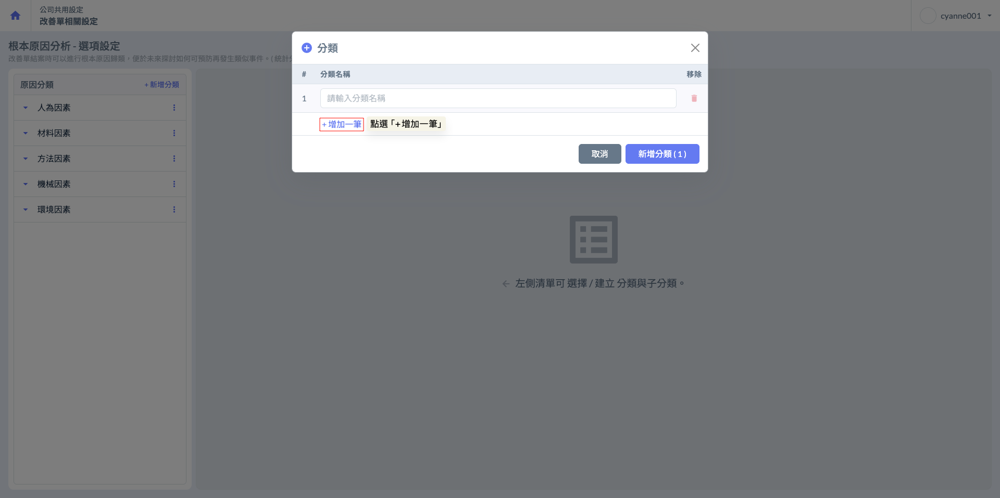
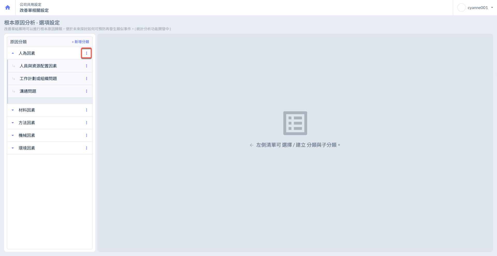
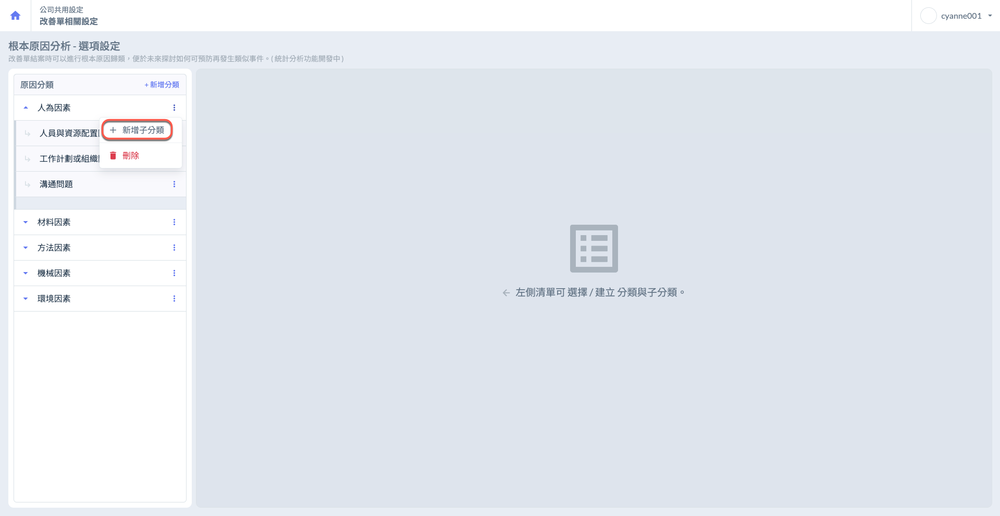
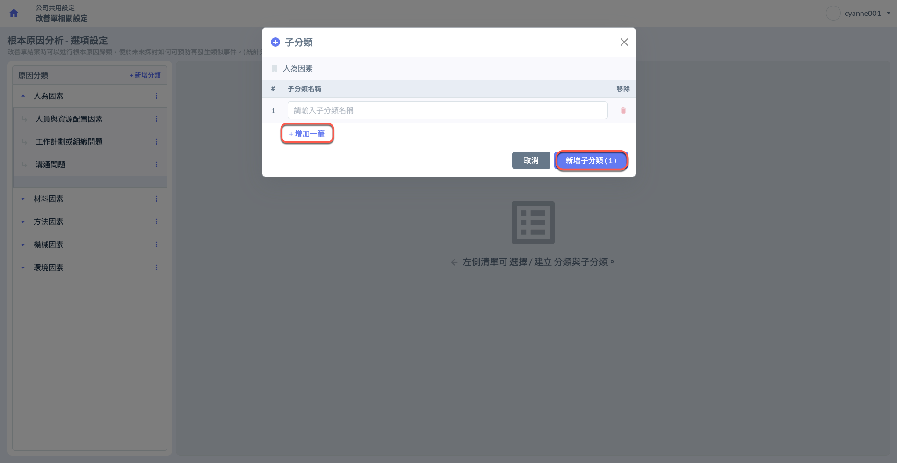
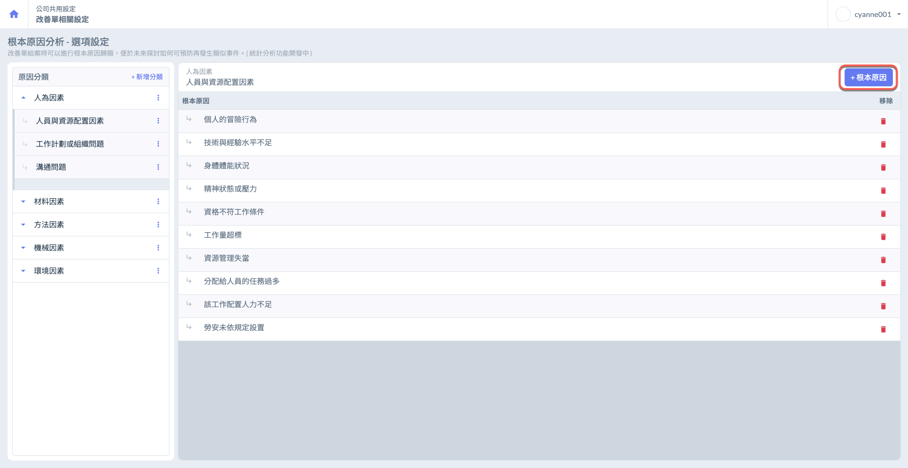
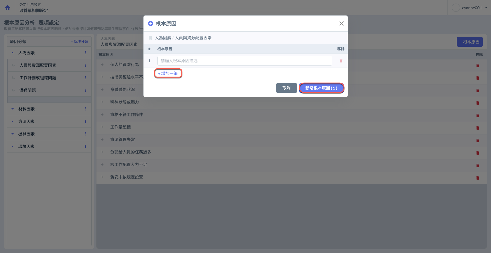

# 根本原因設定

**「根本原因分析」**&#x65E8;在協助專案團隊&#x5728;**「缺失問題之改善結案」**&#x904E;程中，對已發生的問題或偏差進行深入分析，識別出問題發生的根本原因。通過對問題的系統性歸類與分析，為未來類似情境提供可操作的預防措施，降低重複問題的發生概率。

!!! tip
    **「根本原因分析」**&#x529F;能搭&#x914D;**「改善單」**&#x4F7F;用，協助使用者在審核改善回報時，深入分析缺失根本原因。

***

## 01｜新增分類

進入主頁面後，點選  建立您的第一層分類。如圖一：**人為因素**、**材料因素**、**方法因素**等等。

!!! tip
    Jobdone 根據多筆營建機構之研究，已於系統內先行建立多筆可能的根本原因分析。
    
    您可再針對個體需求，新增專屬於您的RCA。

如圖二，開啟設定視窗後，點選  即可建立新欄位。請輸入您欲定義的分類名稱，協助系統將資料進行系統化歸類。

***

## 02｜新增子分類

點選圖三之紅框圈選處，再點選圖四之「新增子分類」，新增第一層分類其下的子分類。

如下圖所示：人為因素下之**人員與資源配置因素**、**工作計畫或組織問題**、**溝通問題**等。

點&#x9078;**「增加一筆」**，開始填寫您欲增加的分類名稱。

***

### 02 - 1｜新增子分類下的根本原因

點擊圖六&#x4E4B;**「根本原因」**，開始新增各子分類下的根本原因。

如圖六所示，人員與資源配置因素下之**個人的冒險行為**、**技術與經驗水平不足**、**身體體能狀況**等等。

點&#x9078;**「增加一筆」**，開始填寫您欲增加的根本原因。

