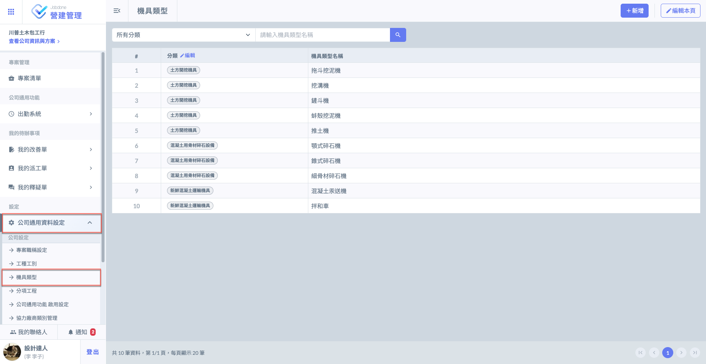
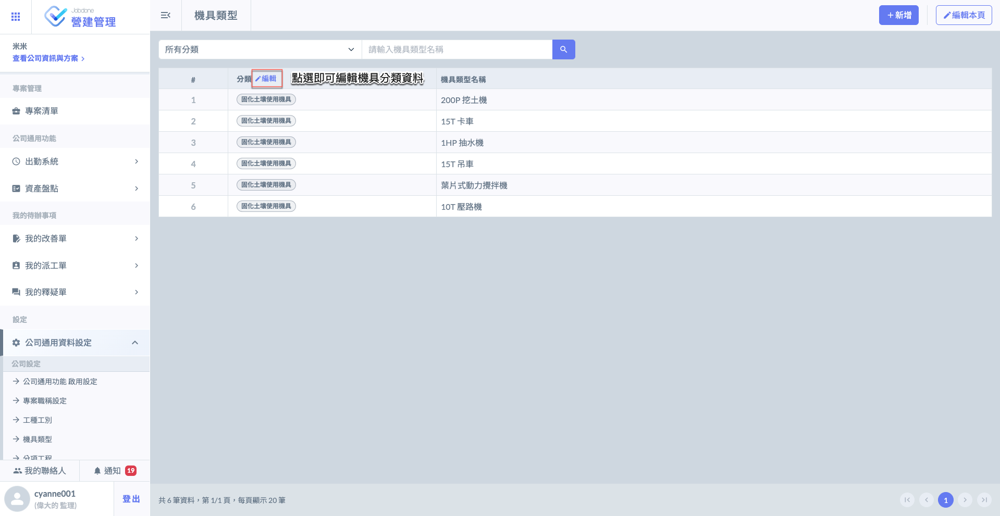
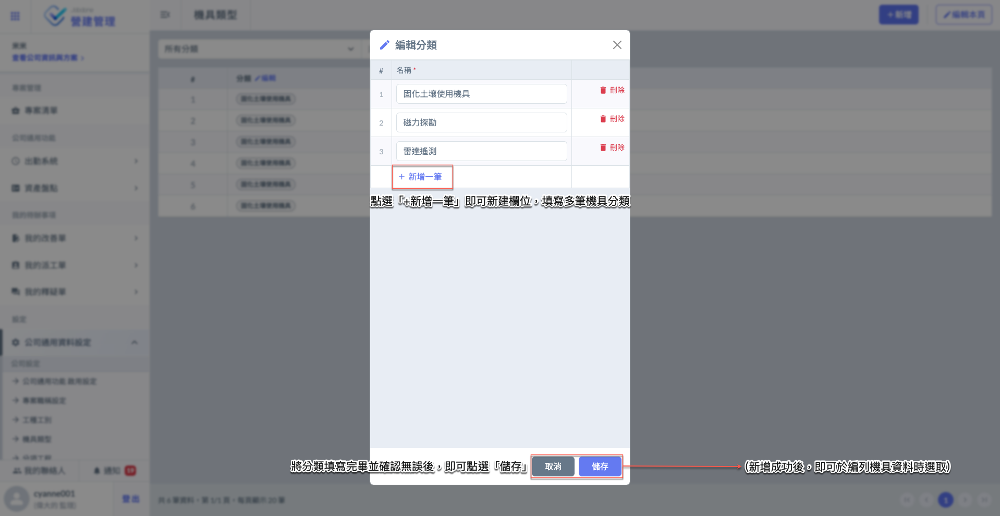
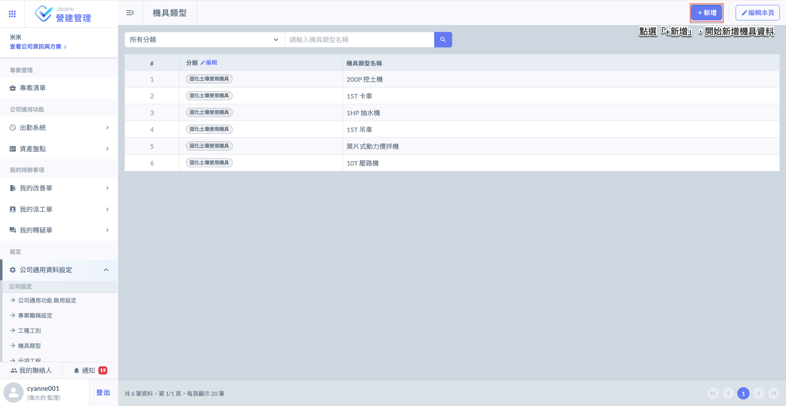
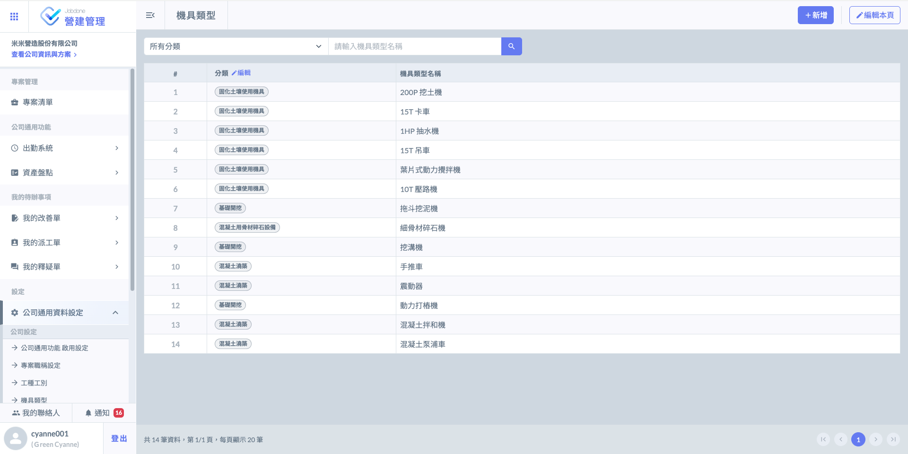
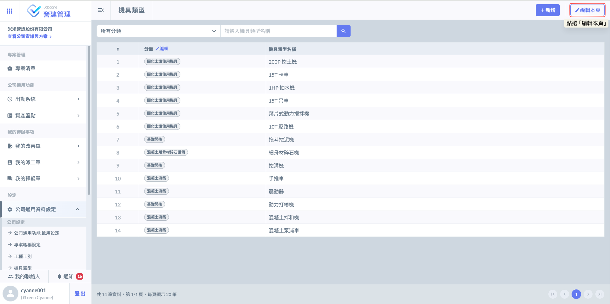
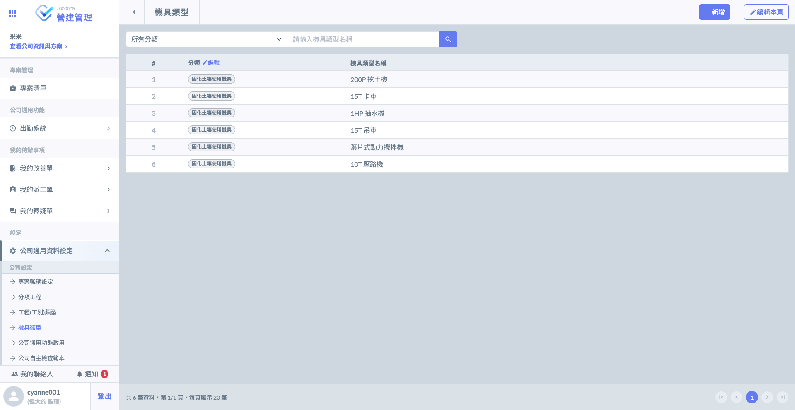

# 機具類型

---
description: Equipment Type
---

# 機具類型

系統提&#x4F9B;**「手動新增」**&#x53CA;**「Excel匯入」**&#x5169;種方式編列您的機具類型資料。

此功能用於設定後續案場實際會用到的施工機具清單（例如：挖掘機、吊車、發電機等）。

* 預設機制：在公司層級設定好機具類型後，系統會自動將這些資料預設為各專案內部的機具清單。
* 專案彈性：雖然各案場會自動套用公司層級的資料，但進入特定專案後，仍可根據該案場的實際需求進行個別調整。

!!! warning
    &#x65BC;**「施工日誌」**&#x6240;選用之機具，都將以此處資料為依據，務必確認您的機具資料已妥善填寫。

***

## 01｜手動新增

點擊主頁面&#x4E4B;**「公司通用資料設定」**&#x5167;&#x7684;**「機具類型」**，開始編輯機具資料。

請根據以下流程操作：



### 進行分類設定

點擊下圖分類旁&#x4E4B;**「編輯」**，開始新增您的分類。

於建立施工機具前，務必先建立機具分類，請依照以下步驟進行：

1. 開啟編輯：進入機具類型管理畫面，點選下方的  圖示，即可新增空白欄位。
2. 填寫資訊：在產生的空白欄位中，填入機具分類名稱。
3. 完成儲存：確認名稱正確後，點選  鍵即可完成設定。




### 新增機具資料

點選下圖紅框圈選處之  後，即可選擇先前已設立好之分類，並填寫您的機具資料。

如圖四，開啟機具類型填寫視窗後，點選  即可建立新欄位並輸入機具名稱。若有多項設備，請重複此步驟進行批量新增，完成後即可在填報日誌時直接下拉選取。

完成畫面如下：




### 編輯機具資料

當專案機具清單建立完成後，系統仍保有極高的調整彈性，以應對不同施工階段的變動需求：

若後續需調整機具資訊，請點選頁面中的  按鈕。進入編輯模式後，您可以針對現有資料進行以下操作：



重新歸類機具所屬類別，優化統計邏輯。



修正名稱或補充更精確的規格資訊（如：將「挖土機」更名為「PC200 挖土機」）。



移除該專案已不再使用的機具項目，保持選單精簡。



依據您的需求修正完畢後，點&#x9078;**「儲存」**&#x66F4;新資料。




***

## 02｜Excel 匯入

點擊主頁面&#x4E4B;**「公司通用資料設定」**&#x5167;&#x7684;**「機具類型」**，開始編輯機具資料。

!!! warning
    Excel 匯入功能僅能在尚未新增任何機具類型資料時使用，匯入後則無法再匯入。
    
    透過Excel匯入後，若您需要更動/增加機具資料，則需透過手動編輯。
    
    由於檔案僅能上傳一次，若您需要重新匯入Excel資料，則需先將原有資料全部刪除。
    
    ( 刪除 Jobdone 公司通用資料設定之工種資料，而非Excel。)

請根據以下流程操作：



### 下載 Excel 模板

點擊(圖一)紅框圈選處之「Excel匯入」，進入(圖二)頁面後，開始下載Excel機具類型模板。

開啟 Excel 機具模板 視窗後，於畫面中的『Excel 模板下載』欄位，點選  圖示，即可將標準範本儲存至您的電腦。

1. 填寫資料：開啟下載的 Excel 檔案，依據格式填入案場預計使用的機具清單。

檔案畫面如下所示，依據模板表格填&#x5BEB;**「機具分類」**&#x8207;**「工種類型名稱」**。




### 填寫 Excel 模板

!!! warning
    由於系統判讀資料之因素，**「務必使用」**&#x4E0A;述提供的模板填寫，並依照格式妥善填寫。




### 上傳 Excel 檔案

系統將在送出時給予提醒(圖二)，上傳成功後，系統匯入&#x65BC;**「步驟二」**&#x6240;填寫之資料(見圖三)。

!!! warning
    如上提示所述：
    
    由於檔案僅能上傳一次，若您需要重新匯入Excel資料，則需先將原有資料全部刪除
    
    ( 刪除 Jobdone 公司通用資料設定之機具資料，而非Excel )。



