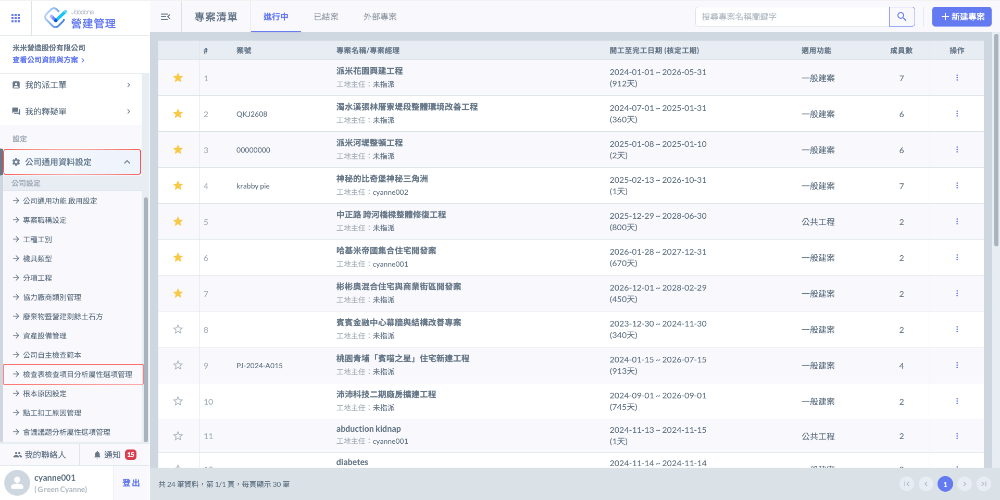
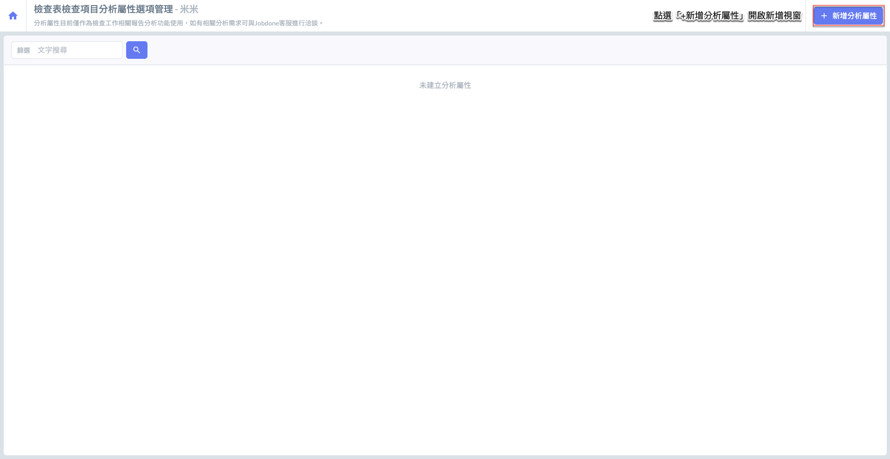
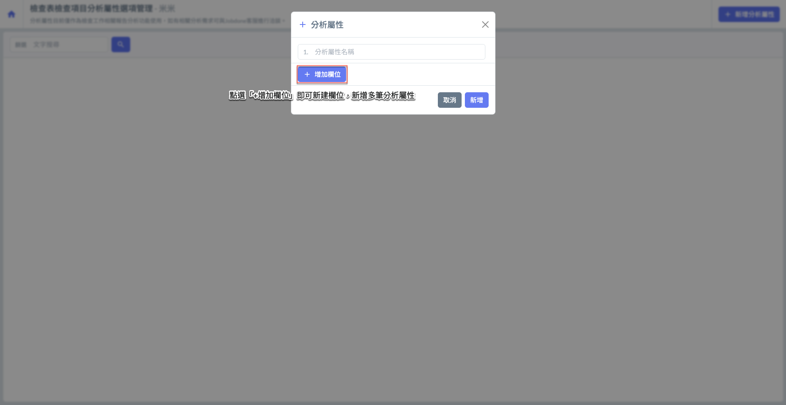
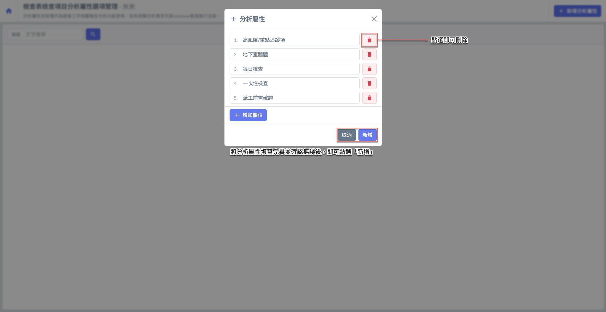
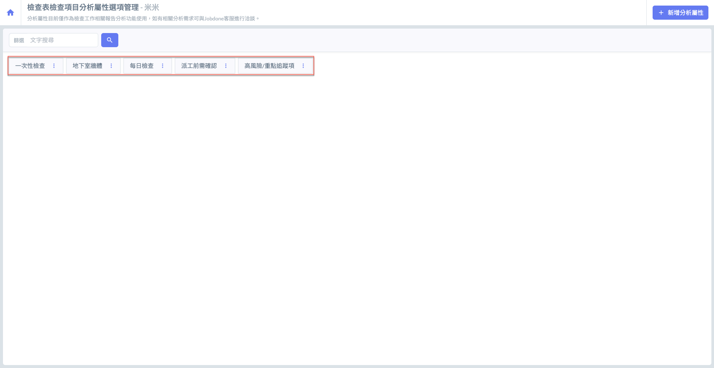
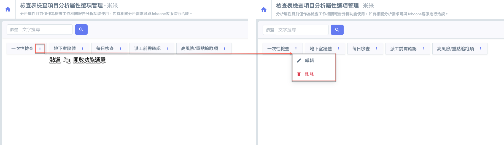
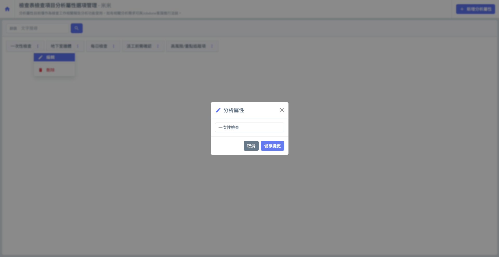
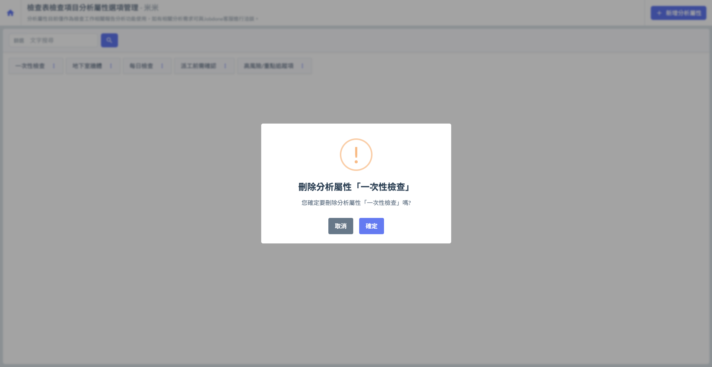
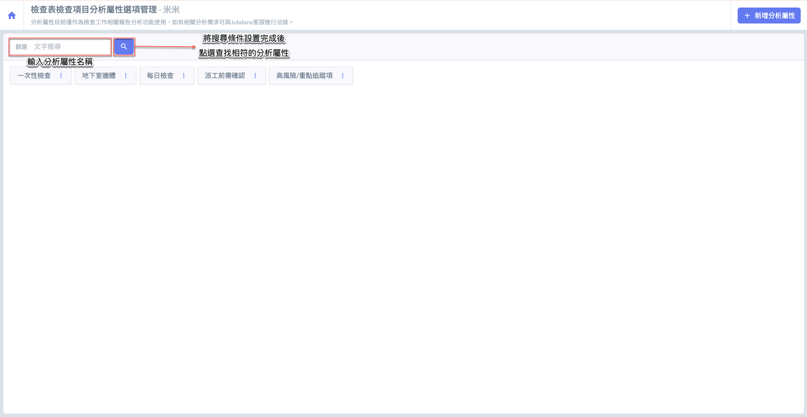
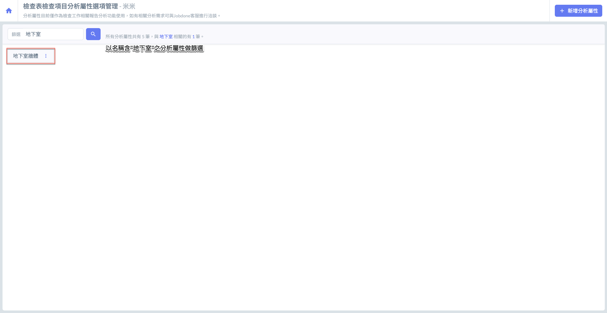

# 檢查表檢查項目分析屬性選項管理

---
description: Inspection Item Attribute Option Management
---

# 檢查表檢查項目分析屬性選項管理

本功能提供使用者自訂檢查表中檢查項目的「分析屬性選項」，以利於後續建立檢查範本時，針對各項目標註更多元的屬性資訊。這些屬性選項可用來標示檢查條件、類別或其他補充資料，協助您在檢查流程中進行更細緻的分類與規劃。

雖然目前分析屬性尚無對應實質運算或報表功能，主要作為標註用途使用，但建議使用者仍可依據公司檢查需求先行建置規則與選項，以利檢查流程標準化與日後擴充報表、統計功能時更為便利。

!!! info
    #### 🗃️ 資料使用與客製化說明
    
    目前分析屬性**在檢查畫面上並不直接顯示**，但實際上會對應並儲存在各個檢查項目之資料庫欄位中。若貴公司有以下需求：
    
    * 將分析屬性應用於檢查作業中進行篩選或彙整
    * 自訂報表需根據分析屬性分類
    * 建立以分析屬性為依據的檢查規範或紀錄分組
    
    👉 **請聯絡 Jobdone 客服，進行客製化服務評估與功能擴充建議。**

***

## 01｜新增分析屬性

如圖一 \~ 圖二所示，進入檢查表檢查項目分析屬性選項管理頁面後，點選右上方之<kbd><mark style="color:purple;">**+新增分析屬性**<mark style="color:purple;"></kbd>按鈕，即可開啟視窗，並填寫欲新增的分析屬性名稱。

 

如圖三 \~ 圖四所示，進入新增視窗後，點&#x9078;**「+增加欄位」**&#x5373;可新增欄位，讓您可依需求填寫多個檢查項目分析屬性。

完成所有分析屬性填寫並確認無誤後，請點&#x9078;**「新增」**，系統即會將所填資料儲存並顯示於分析屬性列表中。

 

***

## 02｜編輯/刪除分析屬性

於欲編輯或刪除的分析屬性右側，點&#x9078;**「⋮」**，即可開啟功能選單，並選擇<kbd>**編輯**</kbd>分析屬性/<kbd><mark style="color:red;">**刪除**<mark style="color:red;"></kbd>分析屬性。

 

***

## 03｜篩選分析屬性

如圖八，當資料較多時，您可使用篩選器，輸入屬性名稱，快速篩選並找到欲查詢的檢查項目分析屬性。&#x20;

輸入篩選條件並確認無誤後，點選「」即可查找相符的分析屬性，實例畫面如圖九所示。

 

