# 資產設備管理

---
description: Asset & Equipment Management
---

# 資產設備管理

## 何謂資產？

* [x] 掌握公司資產流向與使用狀態的核心管理機制

在營建與工程管理中，凡具備**重複使用價值**、會歷經**折舊、報修、淘汰**等生命週期的物品，皆屬於公司資產範疇。為有效追蹤資產位置、狀態與流轉紀錄，**Jobdone 提供「資產設備盤點」功能**，協助使用者建構統一且可執行的資產管理制度。

有關<kbd><mark style="color:blue;">**資產盤點**<mark style="color:blue;"></kbd>之詳細操作說明，請參閱 ➙ [asset\_inventory](../asset_inventory "mention")

!!! info
    #### 資產定義與管理層級
    
    * **資產設備**：包含施工機具、工具設備、量測器材、安全設施、辦公設備等
    * **資產屬公司層級資料**：所有專案共享同一筆資產資料，統一管理、集中盤點
    * **資產位置管理**：主要以「案場 (專案現場)」作為資產所在位置標的，便於追蹤調用與流向控管

***

#### 📂 資產資料欄位

<table><thead><tr><th width="128.314697265625">欄位名稱</th><th>說明</th></tr></thead><tbody><tr><td>分類 (兩階層)</td><td>
資產具固定分類架構

如：檢測設備 / 全站儀；焊接設備 / 電焊機；消防設備 / 滅火器；辦公用具 / 電腦等
</td></tr><tr><td>資產設備名稱</td><td>實際物品名稱 (如：伸縮梯、混凝土震動器、手持探測器等)</td></tr><tr><td>財產編號</td><td>每項資產之唯一識別碼，需手動填寫。</td></tr><tr><td>狀態</td><td>標示資產目前狀況，如：正常使用、**保養中**、**維修中**、**已報廢**等</td></tr><tr><td>所在位置</td><td>目前資產所屬地點，主要標記為「案場」 (如為公司資產，則可不選擇)</td></tr></tbody></table>

***

#### &#x20;📱 功能操作與應用場景 (搭配 App)

**資產調用**：可透過 App 指派資產至指定案場或人員

**盤點登錄**：現場以 App 對資產進行QR code掃描或清單勾選，登錄數量與狀態

**報修與淘汰回報**：資產異常可由現場直接於 App 中標記報修或淘汰原因

!!! danger
    #### ⚠️ 注意事項
    
    * 請由具備權限之管理人員 (專案經理) 新增或修改資產資料，確保分類與編號一致性
    * 所有盤點記錄 (狀態、人員、備註、時間等) 皆具留存紀錄，建議定期複查
    * 建議依據實際需求事先建置好資產分類，利於後續查詢與維護

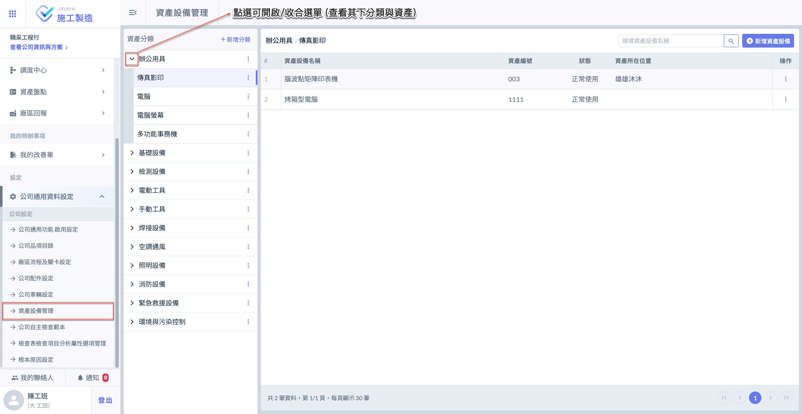

***

## 01｜操作流程說明



### 新增大分類

進入資產設備管理頁面後，點選資產分類欄位右側的<kbd><mark style="color:purple;">**+新增分類**<mark style="color:purple;"></kbd>，即可開啟視窗進行分類設定。

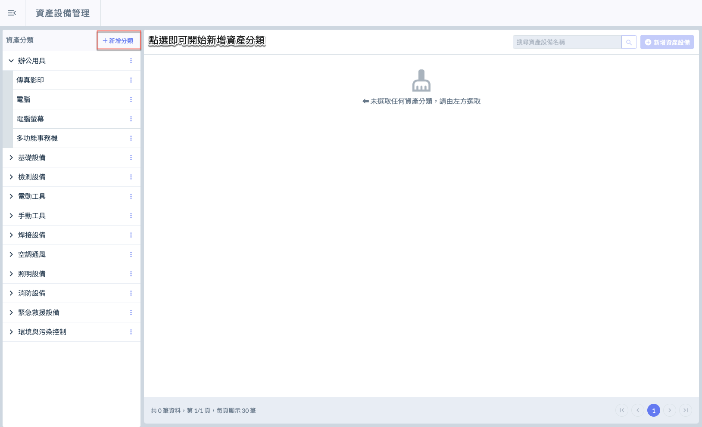 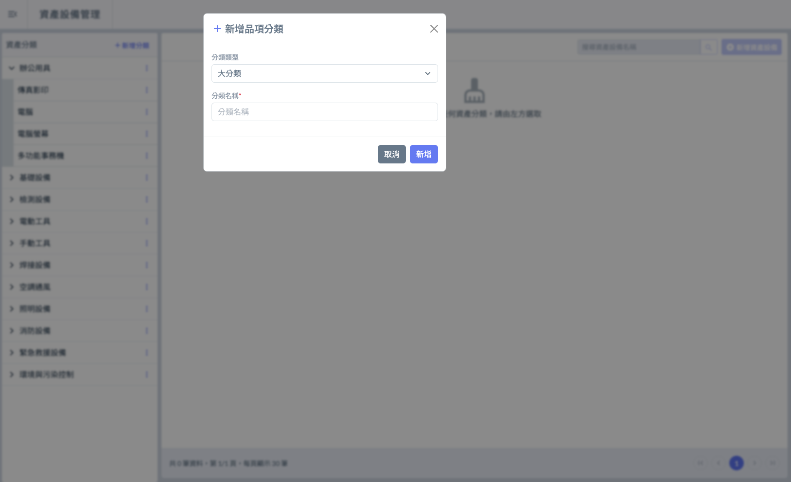

將大分類資料填寫完成並確認無誤後，點&#x9078;**「新增」**，該大分類即會顯示於資產分類列表中。

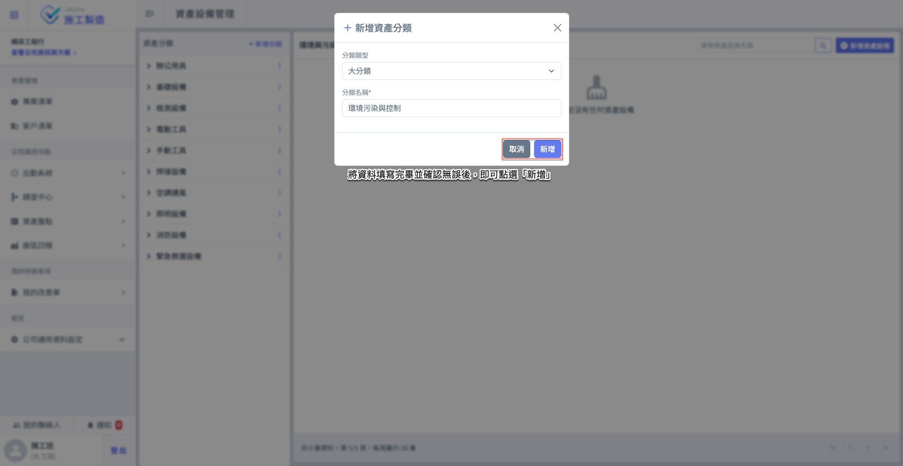 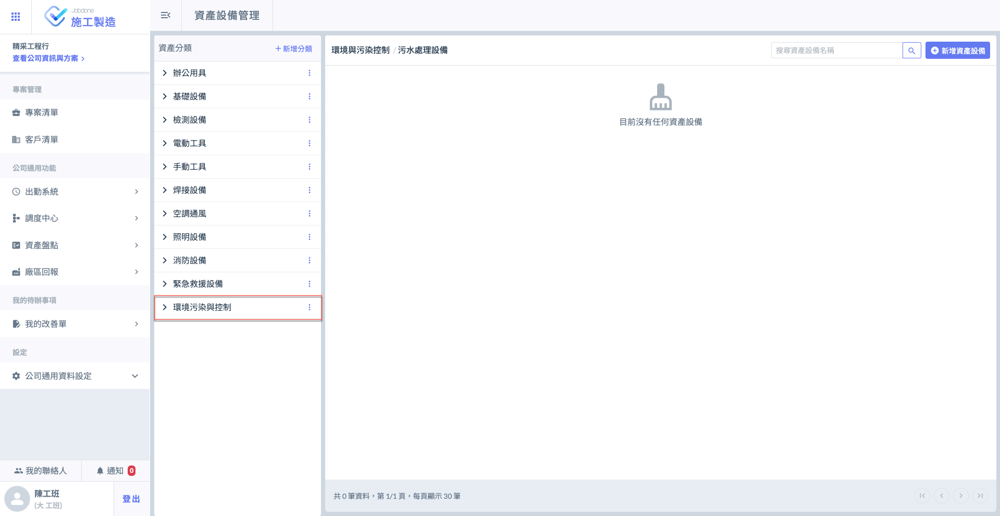




### 新增子分類

系統提供兩種方式新增子分類，分別為：



可直接於資產分類頁面中新增子分類，並選擇對應的大分類。



於特定大分類下點選「+新增子分類」，系統將自動套用所屬大分類，僅需填寫子分類名稱。



#### 透過<kbd><mark style="color:purple;">+新增分類<mark style="color:purple;"></kbd>

進入資產設備管理頁面後，點選資產分類欄位右側的<kbd>**+新增分類**</kbd>，即可開啟視窗進行分類設定。

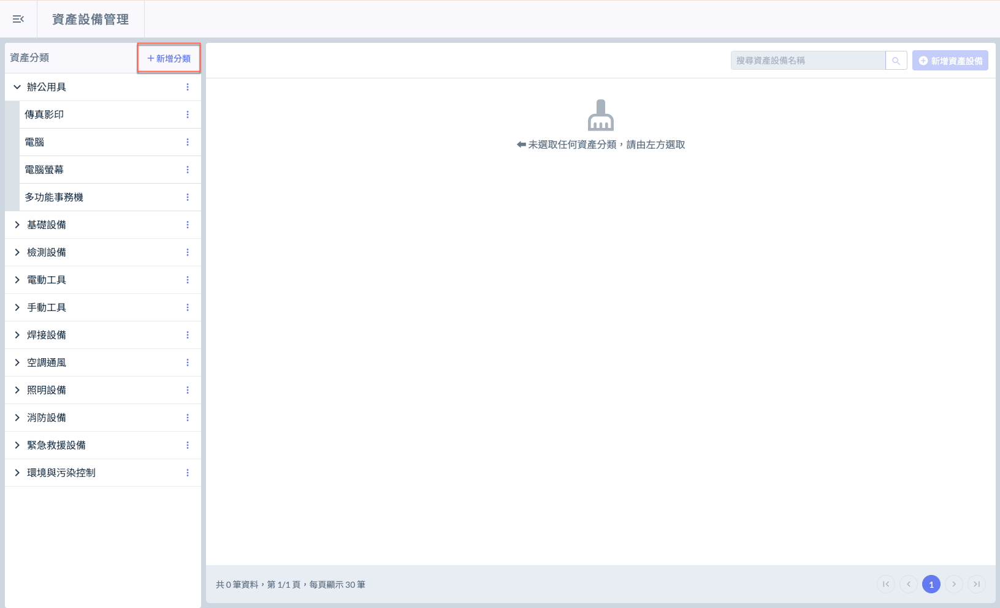

如圖六所示，請點選分類類型欄位，開啟功能選單，並將類型設定&#x70BA;**「次分類」**。

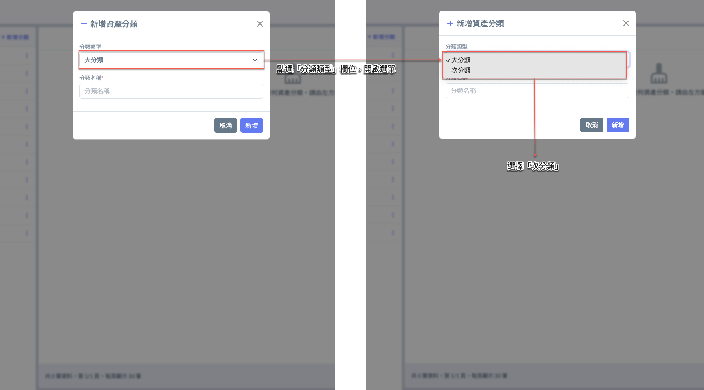

將分類類型設為次分類後，即會顯&#x793A;**「所屬大分類」**&#x6B04;位，點擊即可開啟下拉選單進行選擇。

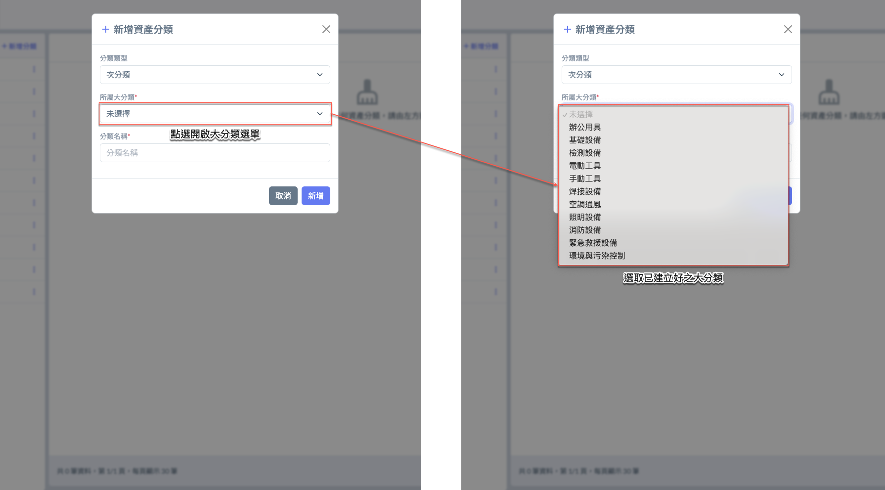

如圖八 \~ 九所示，將資料填寫完畢並確認無誤後，點&#x9078;**「儲存」**，該子分類即顯示於所屬的大分類下。

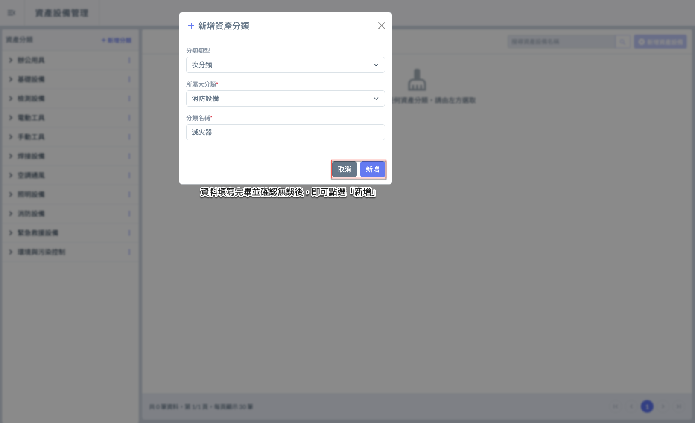 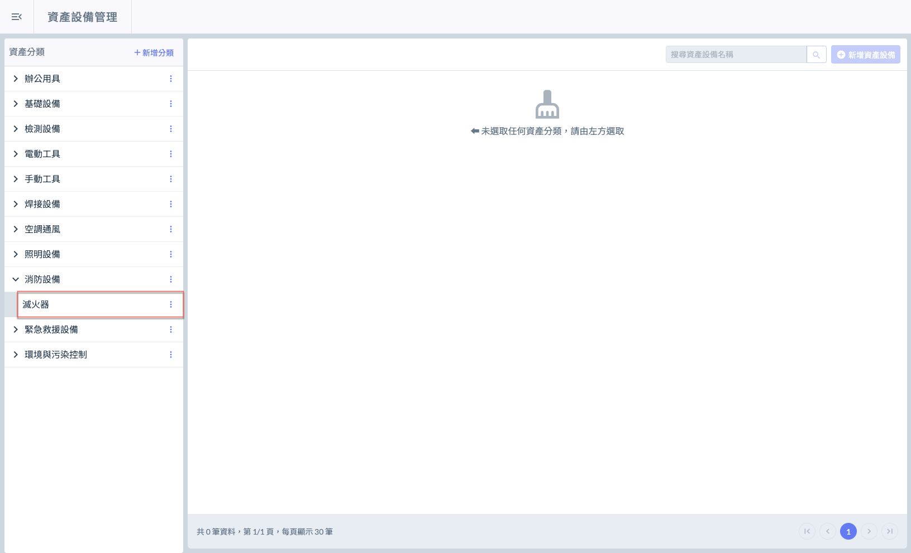

#### 透過大分類新增

於欲新增子分類之大分類右側點&#x9078;**「⋮」**&#x5716;示，即可開啟功能選單。選&#x64C7;**「新增子分類」**&#x9032;行新增操作。

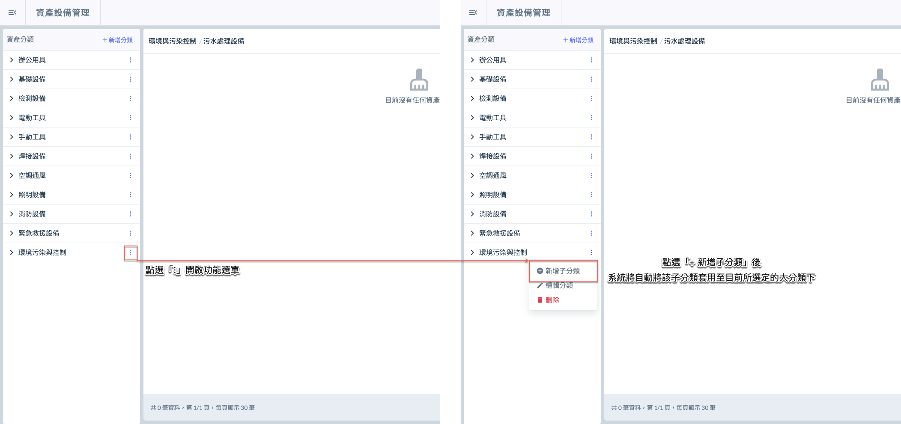

如圖十一 \~ 十二，將資料填寫完畢並確認無誤後，點&#x9078;**「儲存」**，該子分類即顯示於所屬的大分類下。

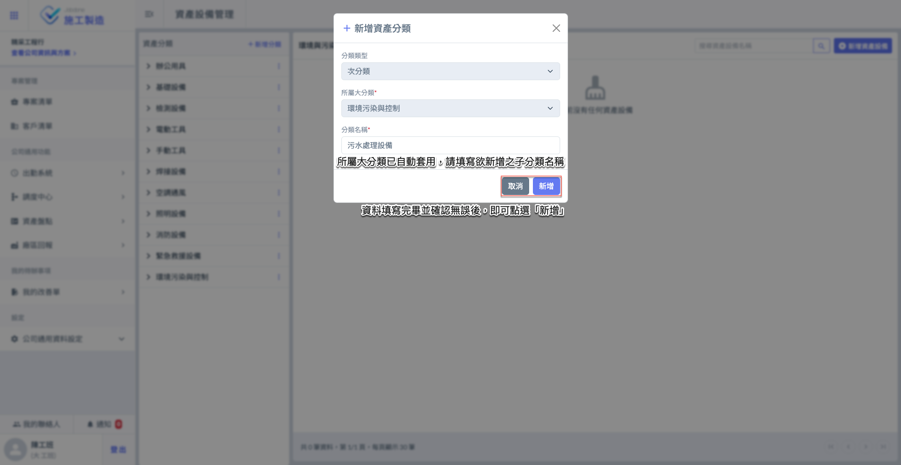 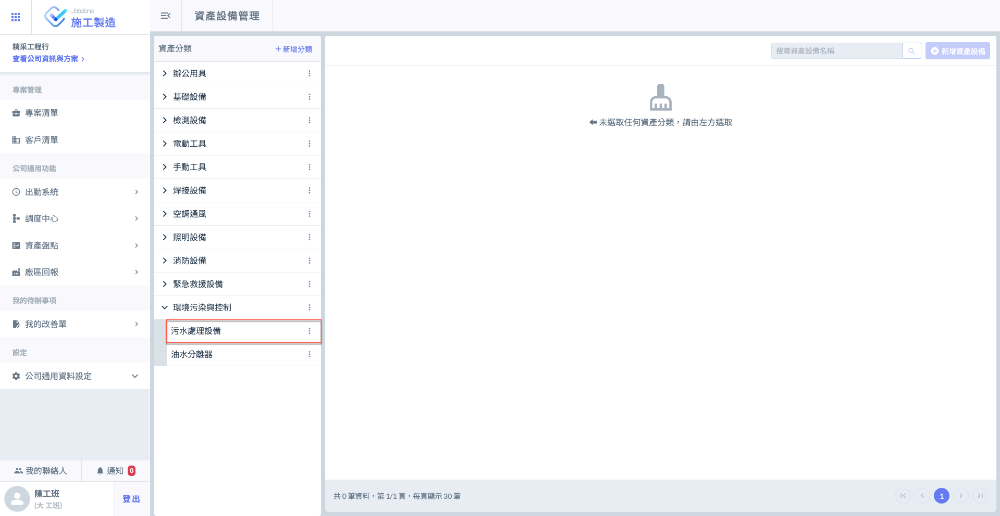




### 新增資產設備

請於新增資產設備前，先選取欲新增的分類，方可啟&#x7528;**「新增資產設備」**&#x529F;能，並將資產新增至所選分類下。

!!! danger
    #### 注意事項
    
    1. 資產分類採固定兩階層結構，因此****僅能在第二階層 (子分類) 下建立資產設備****，不可直接於大分類下新增資產設備。
    2. 已建立的資產設備可隨時進行編輯，亦可移動至其他子分類。
    3. 編輯資產設備資料前，務必確認您目前所在的分類正確無誤，以避免將資產誤設於錯誤的分類下。

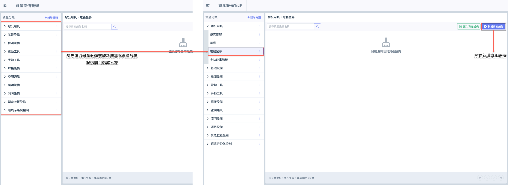

如圖十四所示，開啟新增視窗後，請點選「+ 新增一筆」，以新增欄位。接著依序填寫以下資訊：

**資產設備名稱**、**資產編號**、**使用狀態** (如：正常使用、保養中、維修中、已報廢等) 及**所在位置**等。

完成填寫並確認無誤後，即可點選「新增」，將資料新增至對應分類下。

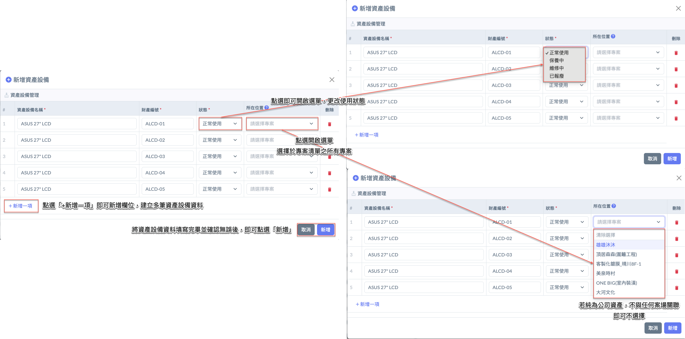

如圖十五所示，將資產設備資料填寫完畢後，點&#x9078;**「新增」**&#x5B8C;成設定，該資產即會顯示於資產設備列表中。

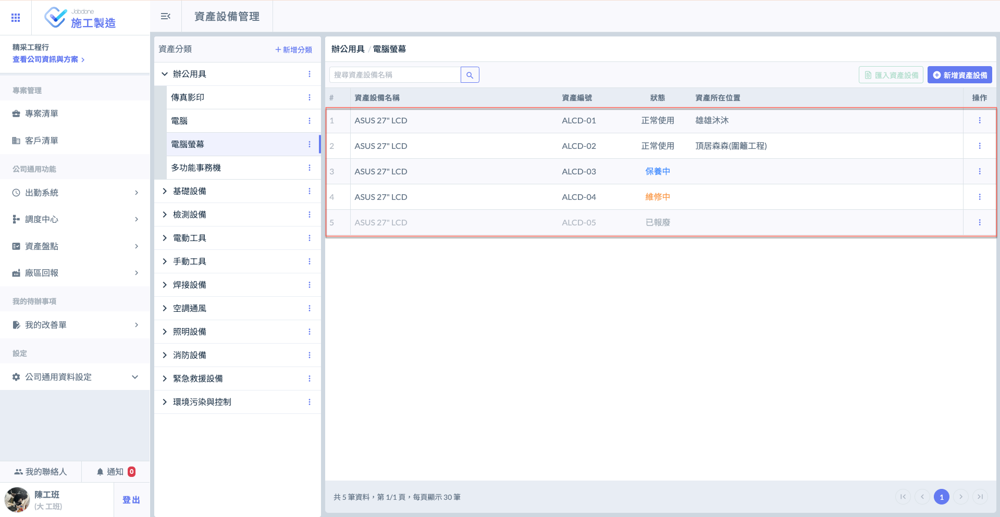



***

## 02｜編輯/刪除大分類

於欲編輯或刪除的大分類右側點&#x9078;**「⋮」**&#x5716;示，即可開啟功能選單，並選擇 <kbd>**編輯分類**</kbd> / <kbd><mark style="color:red;">**刪除**<mark style="color:red;"></kbd>。

!!! warning
    請注意：
    
    此操作將**連同所屬的所有子分類一併刪除**，也就是該分類下的**所有資產設備資料將同時被移除且無法復原**。 請務必在確認不再需要該分類及其內容時再執行，避免造成資料遺失。

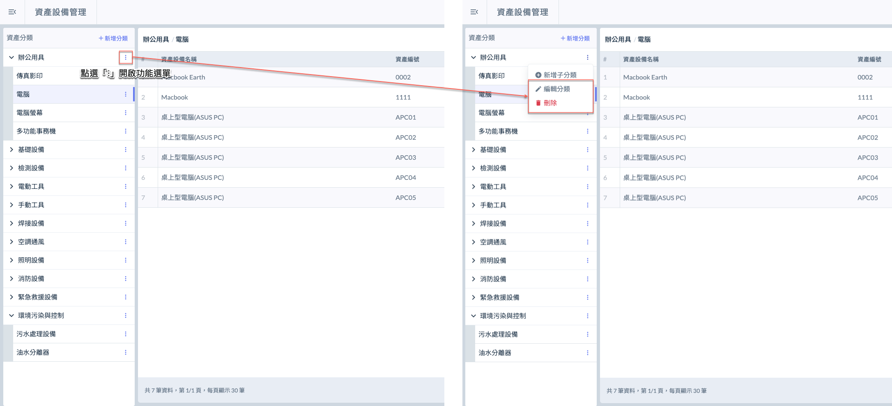

***

## 03｜次(子)分類相關

### 03 - 1｜編輯次分類

如圖一所示，於欲編輯之次分類右側點&#x9078;**「⋮」**&#x5716;示，即可開啟功能選單，並選擇 <kbd>**編輯分類**</kbd> 。

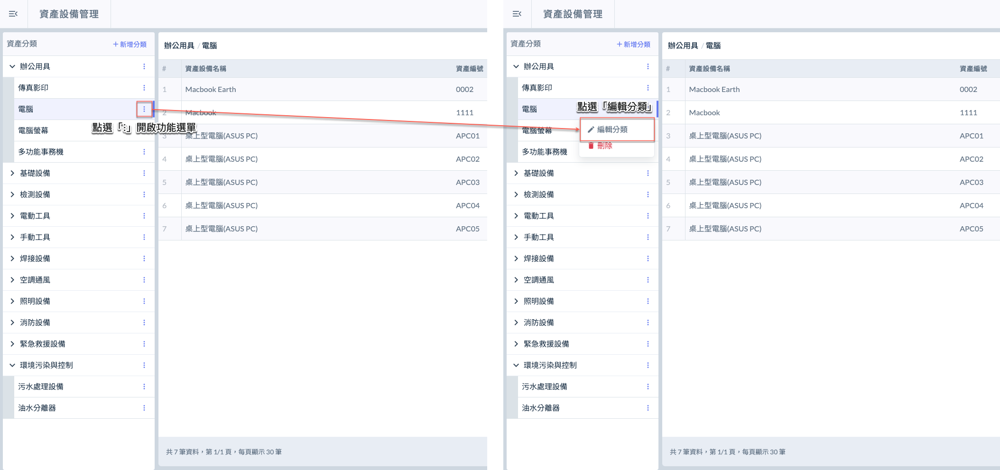

如圖二所示，開啟選單後，點選<kbd>**編輯分類**</kbd>，即可進入編輯畫面，可修改(次)分類名稱並調整所屬大分類。

完成填寫後，請點&#x9078;**「儲存」**&#x4EE5;套用變更。

!!! tip
    當更動指定子分類的所屬大分類時，該子分類下的所有資產設備也會**一併移動**至新的大分類架構下，請確認變更正確以維持資料組織一致性。

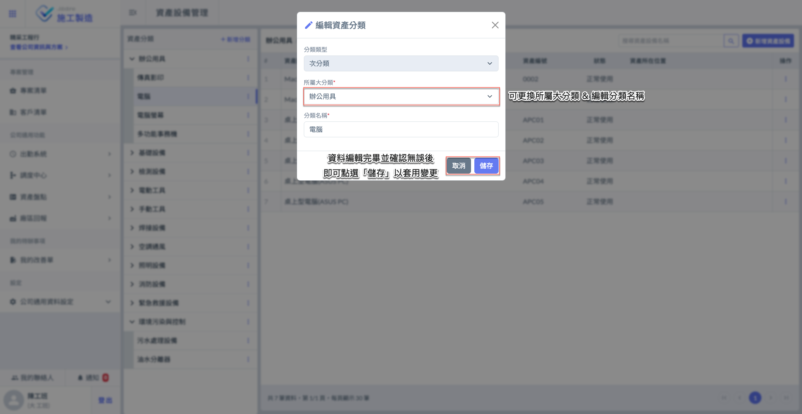

***

### 03 - 2｜刪除次分類

如圖三所示，於欲刪除之次分類右側點&#x9078;**「⋮」**&#x5716;示，即可開啟功能選單，並選擇 <kbd><mark style="color:red;">**刪除**<mark style="color:red;"></kbd>。

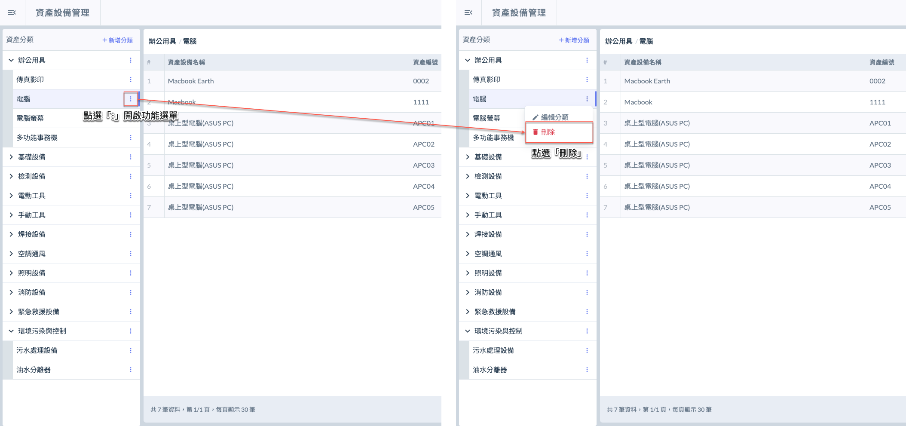

***

## 04｜資產設備相關

您可於資產設備列表中的操作欄位進行資產設備資料的修改或刪除作業。

### 04 - 1｜編輯資產設備

如圖一所示，於欲編輯之資產右側點&#x9078;**「⋮」**&#x5716;示 (於操作欄位)，即可開啟功能選單，並選擇 <kbd>**編輯資產設備**</kbd> 。

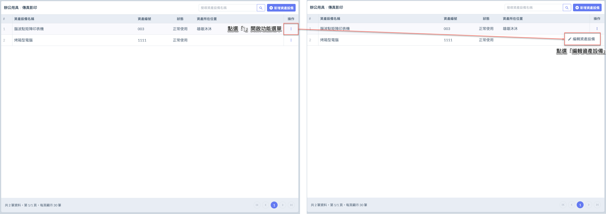

如圖二所示，開啟編輯視窗後，即可修改**資產名稱**、**資產編號**、**使用狀態**及**所在位置**等欄位。

更新完成並確認無誤後，請點&#x9078;**「儲存」**&#x4EE5;套用變更。

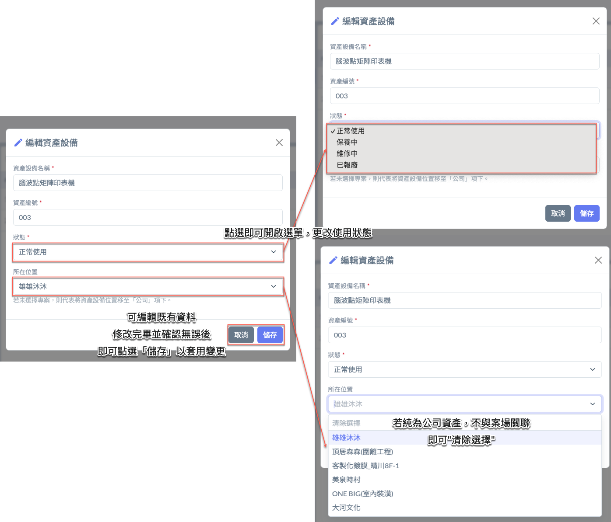

***

### 04 - 2｜刪除資產設備

如圖四 \~ 圖五所示，開啟選單後，請點選<kbd><mark style="color:red;">**刪除**<mark style="color:red;"></kbd>，系統將跳出確認視窗，請再次確認是否刪除。

!!! danger
    #### ⚠️ 注意事項
    
    1. **僅限已標記為「報廢」狀態**的資產設備才可執行刪除操作。
    2. 為確保資產歷程完整與追蹤紀錄，系統將禁止刪除仍處於「正常使用」、「保養中」或「維修中」等狀態的資產。請在執行刪除前，先確認該資產已正確標示為報廢，並確認無任何掛載於案場或未完成之調用紀錄。
    3. 刪除操作一旦執行即**無法復原**，請務必審慎操作。

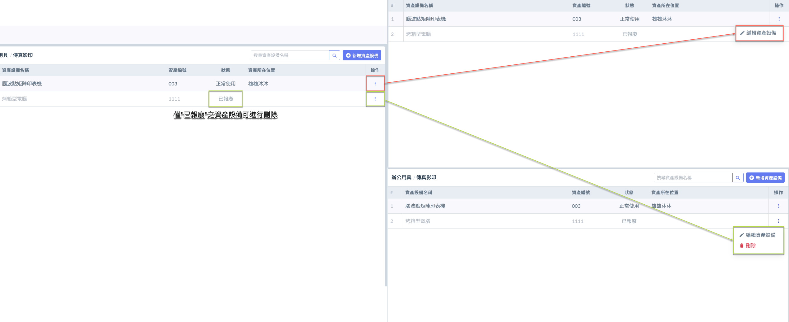

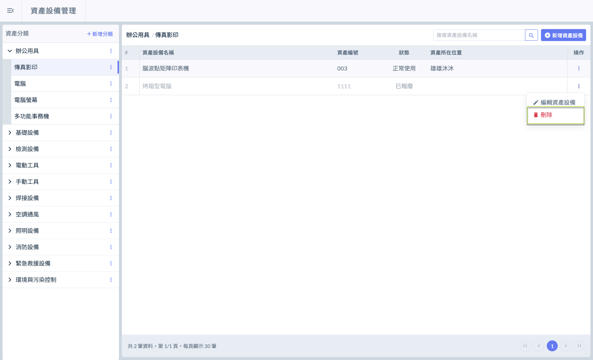 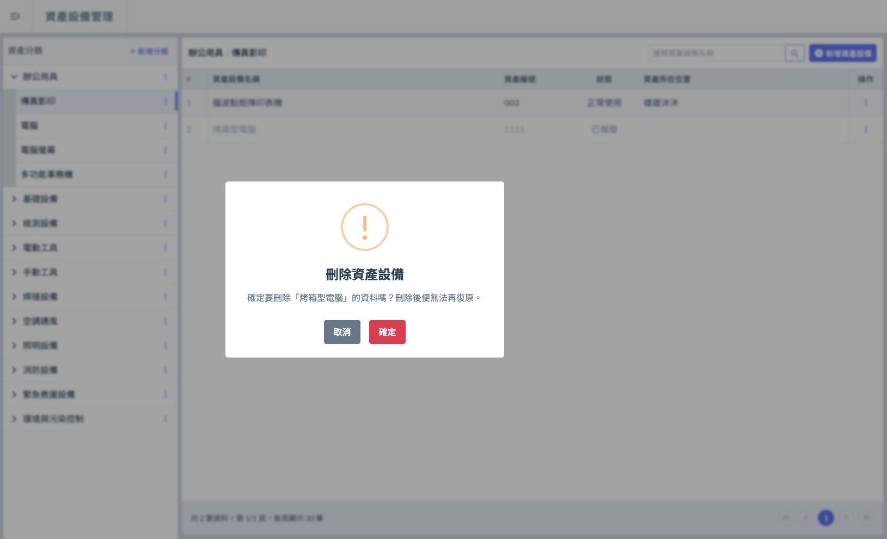

