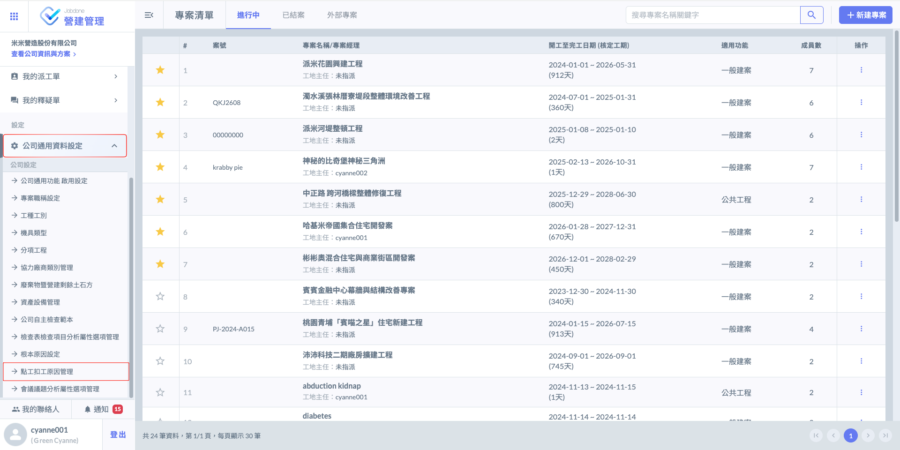
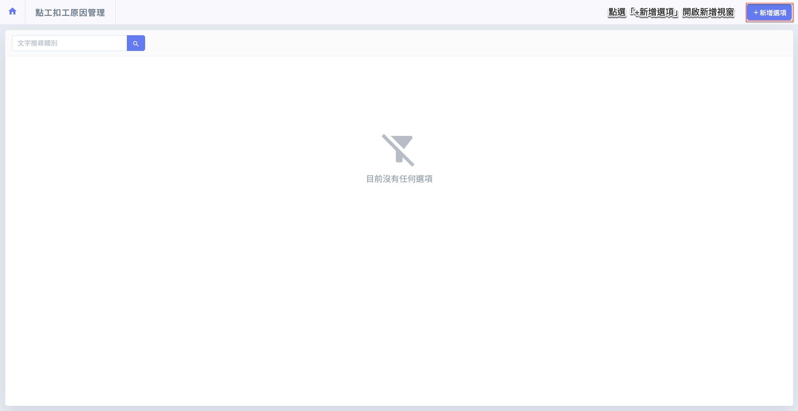
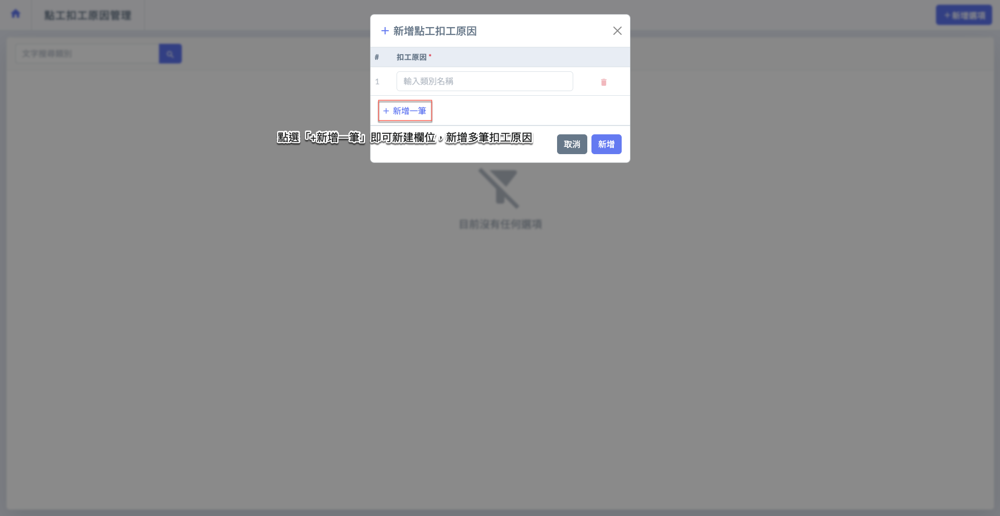
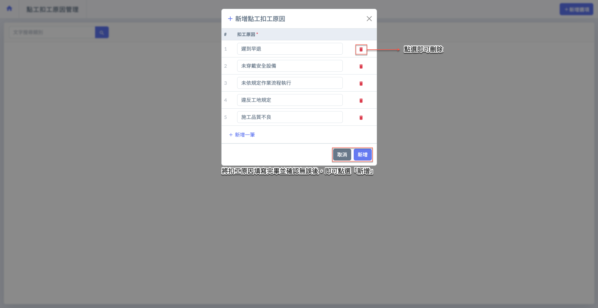
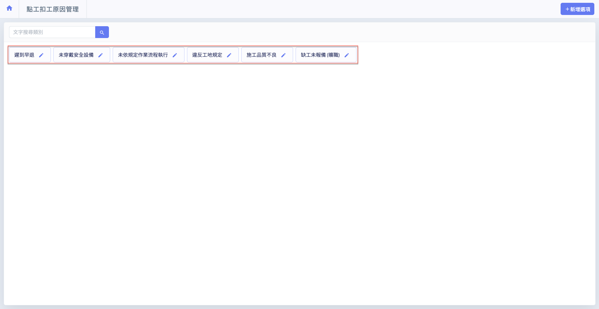
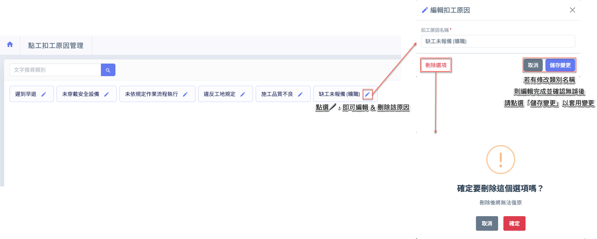
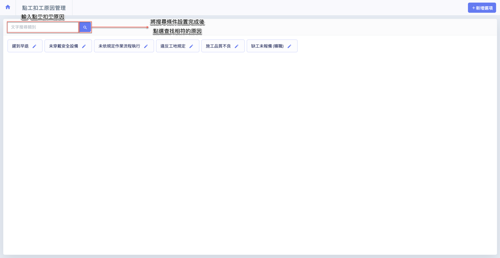
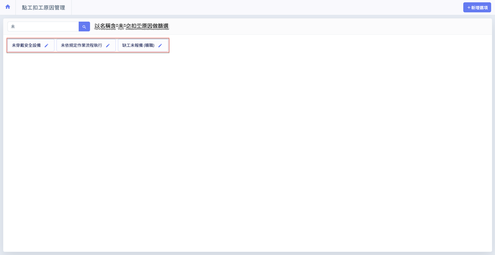

# 點工扣工原因管理

---
description: Temporary Labor Deduction Reason Settings
---

# 點工扣工原因管理

**點工扣工原因管理**為營建商於 App 端執行「點工功能」時所使用之設定項目，適用於營建商向派遣商提出臨時工需求後，針對實際出勤人員進行簽到、簽退等管理之用途。

此功能主要提供營建商在 App 上記錄臨時工工作表現、違規情形或施工異常狀況，透過事先定義的「扣工原因」，於現場快速選取並回報，以利後續勞務對帳與績效記錄。

有關點工功能說明，請參閱 ➙ [contractor](../twa/contractor "mention")

***

## 01｜新增扣工原因

如圖一 \~ 圖二所示，進入**點工扣工原因管理**頁面後，點選右上方&#x7684;**「+新增選項」**&#x6309;鈕，即可開啟視窗，並填寫欲新增的扣工原因。

 

如圖三 \~ 圖四所示，進入新增視窗後，點&#x9078;**「+新增一筆」**&#x5373;可新增欄位，讓您可依需求填寫多個點工扣工原因。完成所有扣工原因填寫並確認無誤後，請點&#x9078;**「新增」**，系統即會將所填資料儲存並顯示於列表中。

 

***

## 02｜編輯/刪除扣工原因

於欲編輯或刪除的原因右側，點選，即可開啟編輯視窗。您可在此視窗中修改類別名稱/刪除此類別。

***

## 03｜搜尋扣工原因

如圖六，當扣工原因較多時，您可使用篩選器，輸入扣工原因，快速篩選並找到欲查詢的點工扣工原因。

輸入篩選條件並確認無誤後，點選「」即可查找相符的扣工原因，實例畫面如圖七所示。

 

