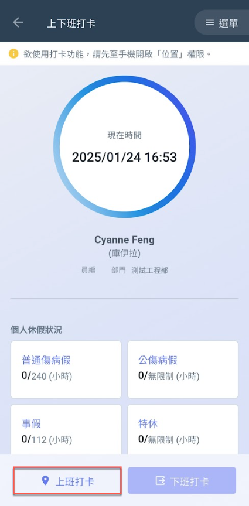
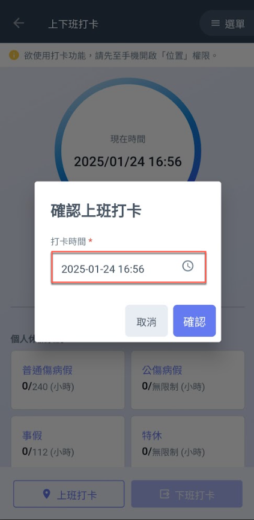
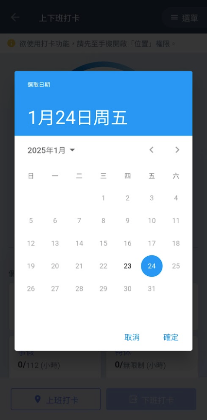
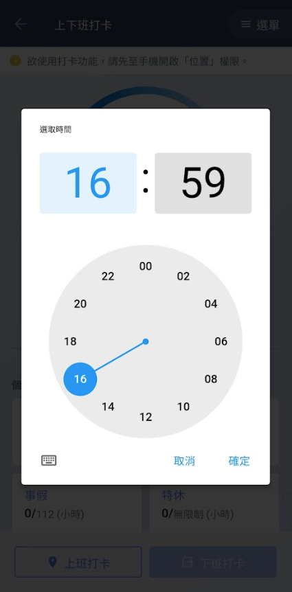
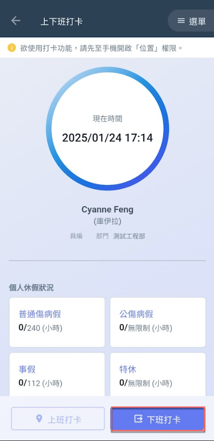
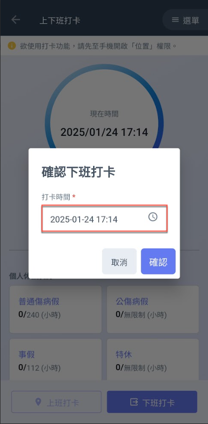
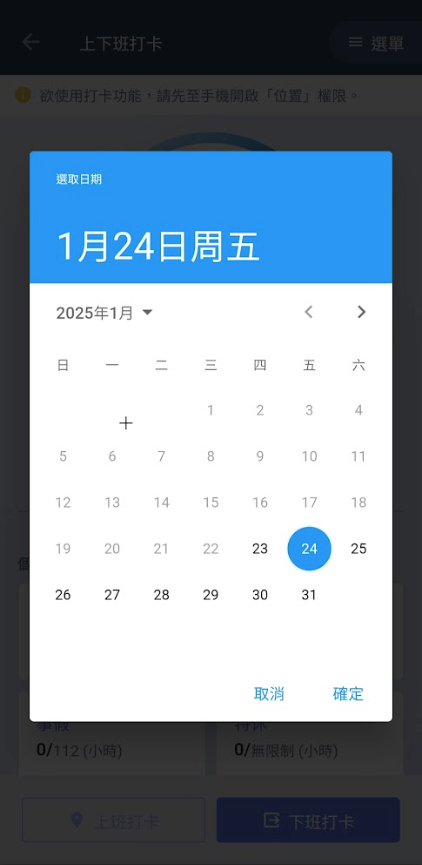
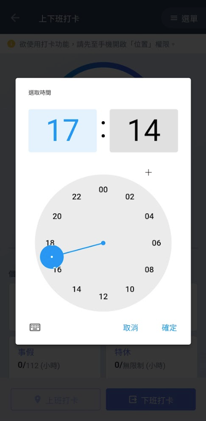

# 上下班打卡

## 上班打卡

進入出勤系統主頁面後，如圖一紅框圈選處，點選下方&#x4E4B;**「上班打卡」**&#x5373;可開啟打卡頁面(圖二)。

!!! warning
    請注意，請確保您手機&#x7684;**「位置」**&#x529F;能已開啟，再進行打卡。

進入圖二頁面後，由於系統會自動當日當前標準時間，將有更改時間與無需更改兩種操作：



請直接點&#x9078;**「確認」**，系統即會保留此次打卡紀錄（即打卡完成）。



點選圖二紅框圈選處 **➙** 進入圖三頁面選取日期 **➙** 進入圖四畫面選取打卡時&#x9593;**。**



   

***

## 下班打卡

進入出勤系統主頁面後，如圖一紅框圈選處，點選下方&#x4E4B;**「下班打卡」**&#x5373;可開啟打卡頁面(圖二)。

!!! warning
    請注意，請確保您手機&#x7684;**「位置」**&#x529F;能已開啟，再進行打卡。

進入圖二頁面後，由於系統會自動當日當前標準時間，將有更改時間與無需更改兩種操作：



請直接點&#x9078;**「確認」**，系統即會保留此次打卡紀錄（即打卡完成）。



點選圖二紅框圈選處 **➙** 進入圖三頁面選取日期 **➙** 進入圖四畫面選取打卡時&#x9593;**。**



   

