# 審核申請

---
description: Approve Application
---

# 審核申請

進入出勤系統主頁面後，如圖一紅框圈選處，點選右上角&#x4E4B;**「選單」**，即可見圖二畫面並點&#x9078;**「審核申請」**。

!!! tip
    僅人資成員能夠查看並使用此功能。

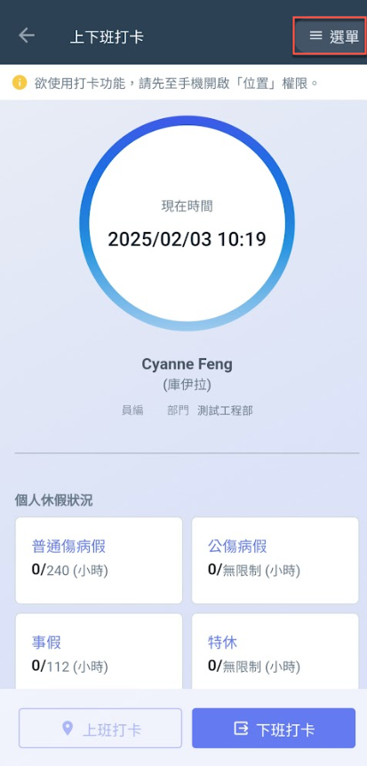 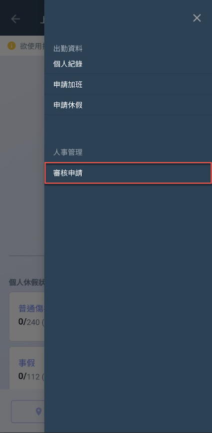 

***

## 💪 01｜加班申請

進入審核申請頁面後，如圖一點選<kbd>**加班申請**</kbd>頁籤，即可依**狀態**及**日期**查看加班申請紀錄。

系統預設顯示之加班申請紀錄為**待審核**狀態，若欲修改篩選條件即可點選(圖二)紅框圈選處，由此進入圖三篩選列表。

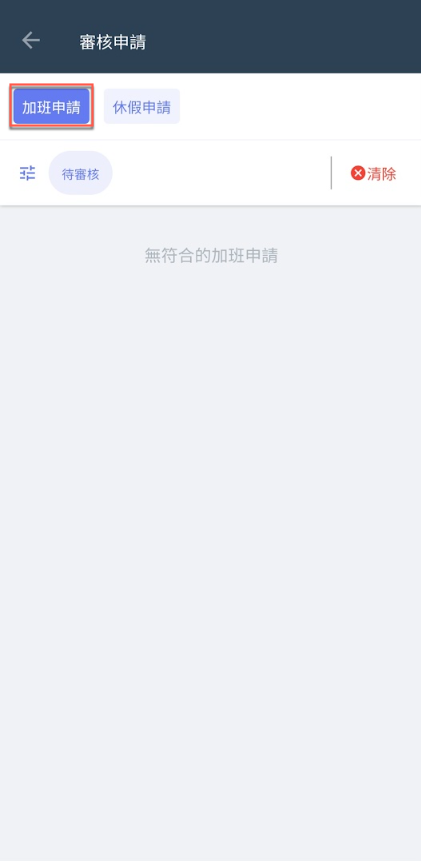 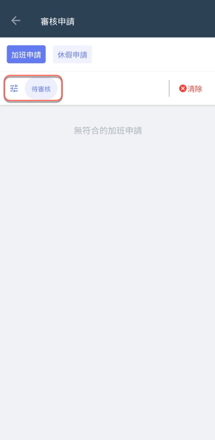 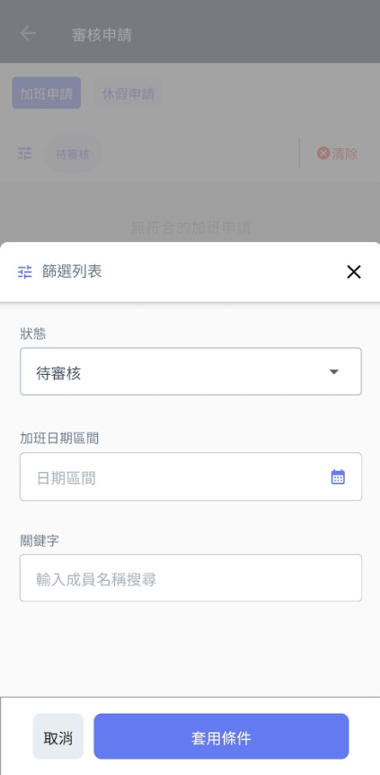

以篩選**全部**狀態之加班申請為例，如圖四您可看到所有加班申請紀錄。

如圖五，點選一加班申請紀錄，即可進入(圖六)頁面查看該紀錄之詳細資料，包括**加班時間**、**加班時數**、**專案名稱**、**加班原因**及**審核備註**等等。

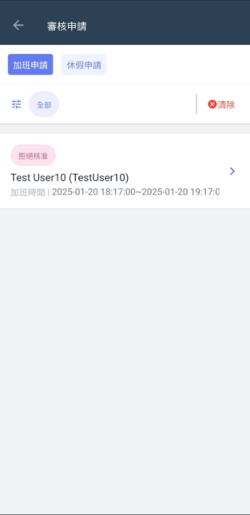 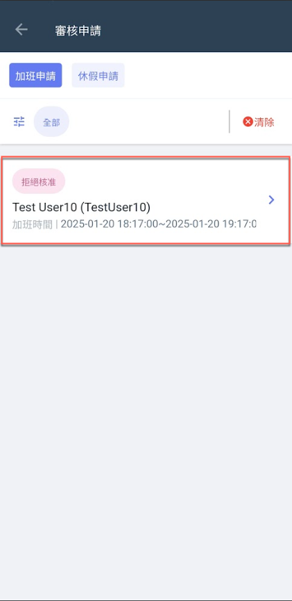 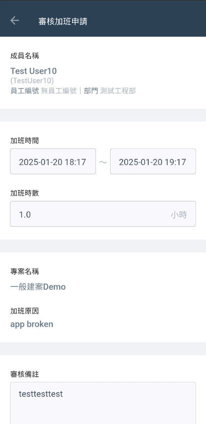

***

## ✈️ 02｜休假申請

進入審核申請頁面後，如圖一點選<kbd>**休假申請**</kbd>頁籤，即可依**狀態**及**日期**查看休假申請紀錄。

系統預設顯示之加班申請紀錄為**待審核**狀態，若欲修改篩選條件即可點選(圖二)紅框圈選處，由此進入圖三篩選列表。

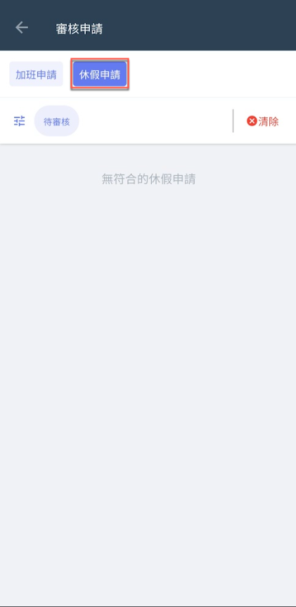 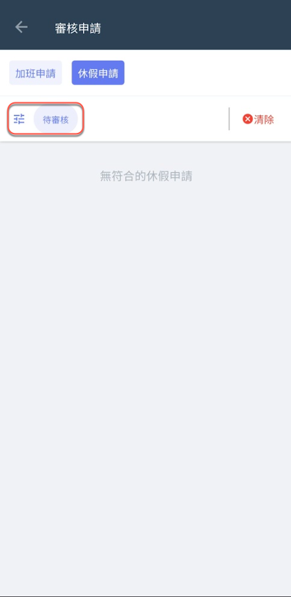 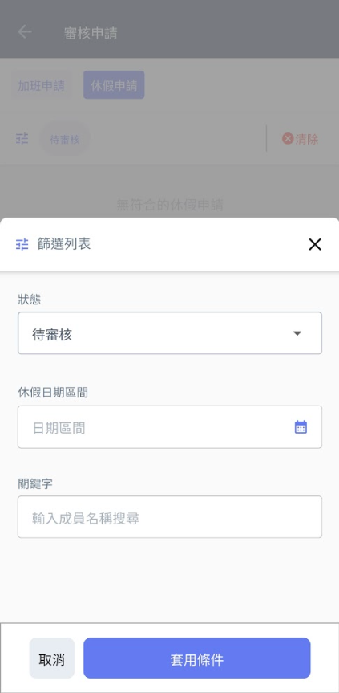

以篩選**全部**狀態之休假申請為例，如圖四您可看到所有休假申請紀錄。

如圖五，點選一加班申請紀錄，即可進入(圖六)頁面查看該紀錄之詳細資料，包括**休假時間**、**休假時數**、**假別**、**休假原因**及**審核備註**等等。

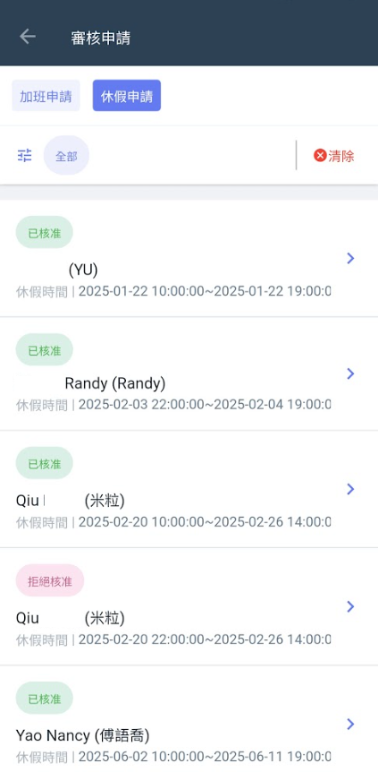 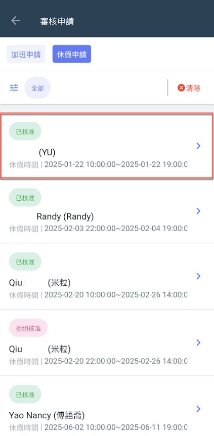 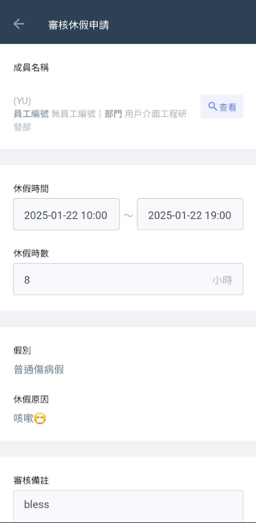

