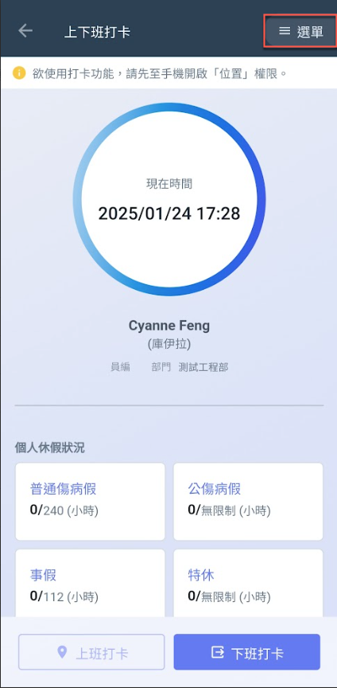
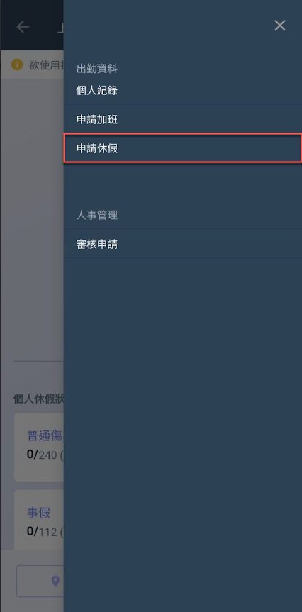
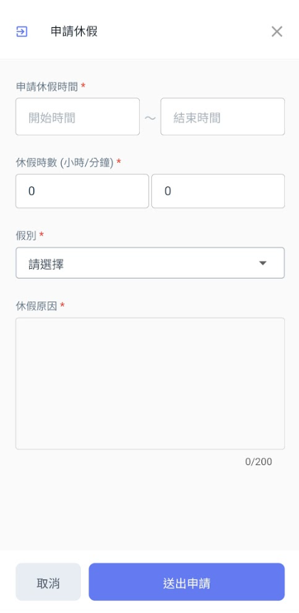
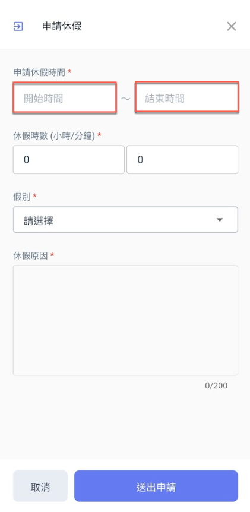
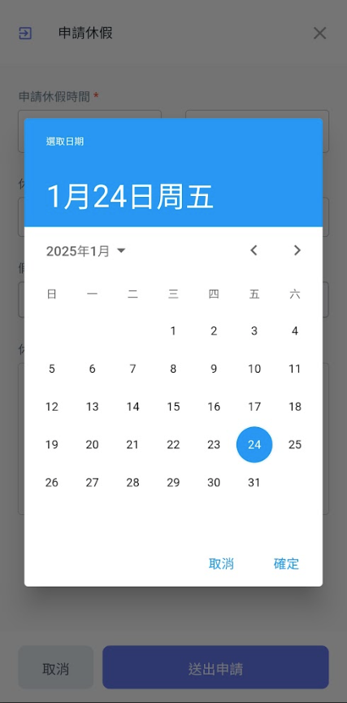
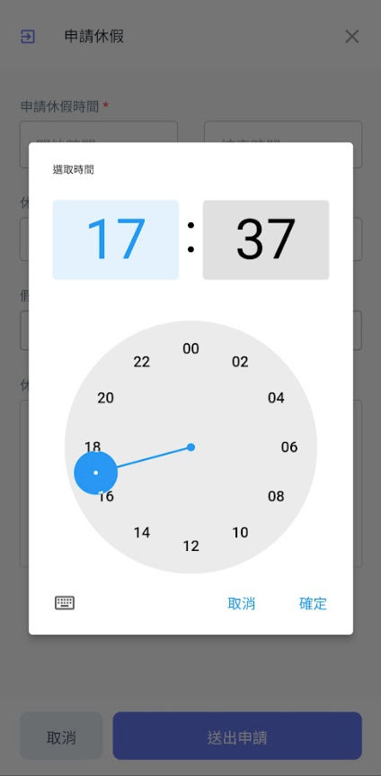
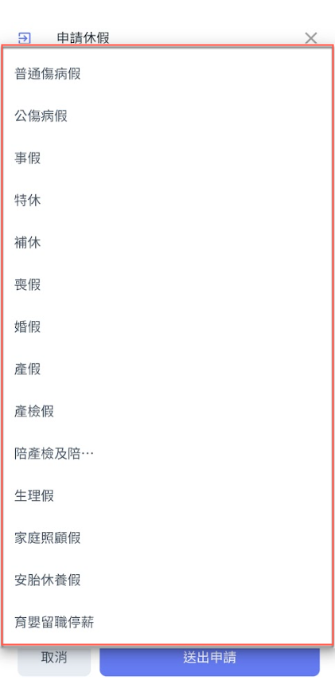
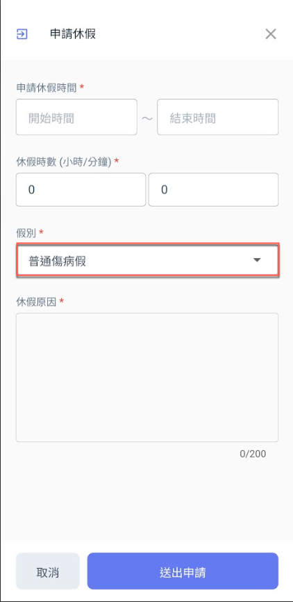

# 申請休假

進入出勤系統主頁面後，如圖一紅框圈選處，點選右上角&#x4E4B;**「選單」**，即可見圖二畫面並點&#x9078;**「申請休假」**。

即可進入圖三畫面開始填寫休假申請資料（包括：**休假時間**、**休假時數**、**假別**與**休假原因**）。

!!! tip
    個人申請的休假紀錄，都可於個人紀錄頁面的<kbd>**休假紀錄**</kbd>頁籤查看。

  

#### 填寫休假時間

點選圖四之紅框圈選處，分別填寫**休假開始時間**與**結束時間**。

點選圖四紅框圈選處 **➙** 進入圖五頁面選取**休假日期 ➙** 進入圖六畫面選取**休假申請時間。**

  

#### 填寫假別

點選圖七之紅框圈選處，開始選擇假別(圖八)，選取完畢畫面即如圖九。

  

