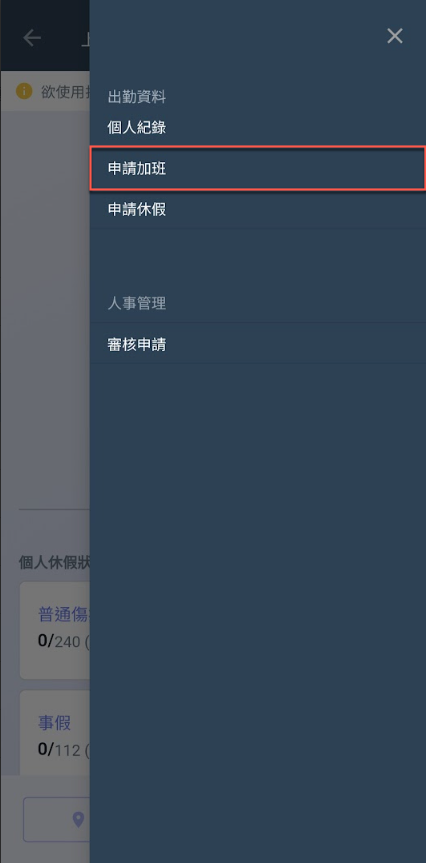
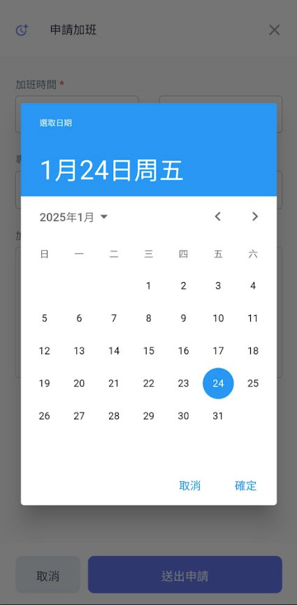
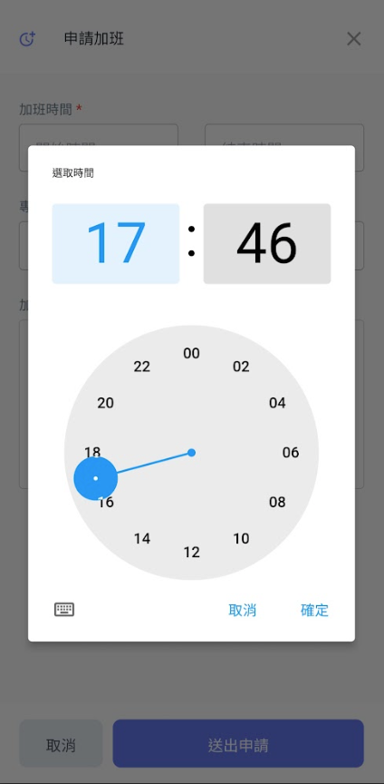
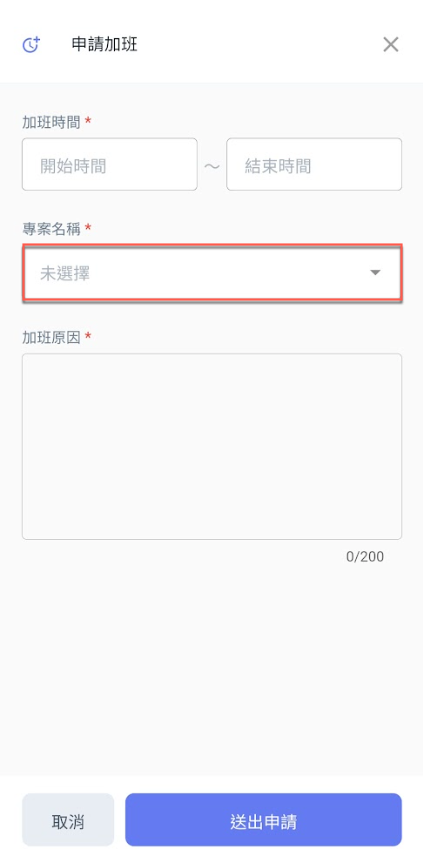
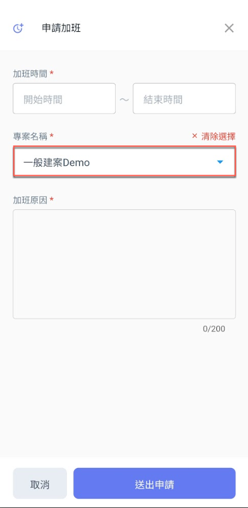

# 申請加班

---
description: Overtime Application
---

# 申請加班

進入出勤系統主頁面後，如圖一紅框圈選處，點選右上角&#x4E4B;**「選單」**，即可見圖二畫面並點&#x9078;**「申請加班」**。

即可進入圖三畫面開始填寫加班申請資料（包括：**加班時間**、該加班事項所**對應的專案**及**加班原因**）。

!!! tip
    個人申請的加班紀錄，都可於個人紀錄頁面的<kbd>**加班紀錄**</kbd>頁籤查看。

  

#### 填寫加班時間

點選圖四之紅框圈選處，分別填寫**加班開始時間**與**結束時間**。

!!! tip
    系統會根據您所輸入加班時間，自動計算加班時數。

點選圖四紅框圈選處 **➙** 進入圖五頁面選取加班日期 **➙** 進入圖六畫面選取加班申請時&#x9593;**。**

  

#### 填寫專案名稱

點選圖七紅框圈選處，開啟專案列表並選擇專案(圖八)，選取完畢畫面即如圖九。

  

