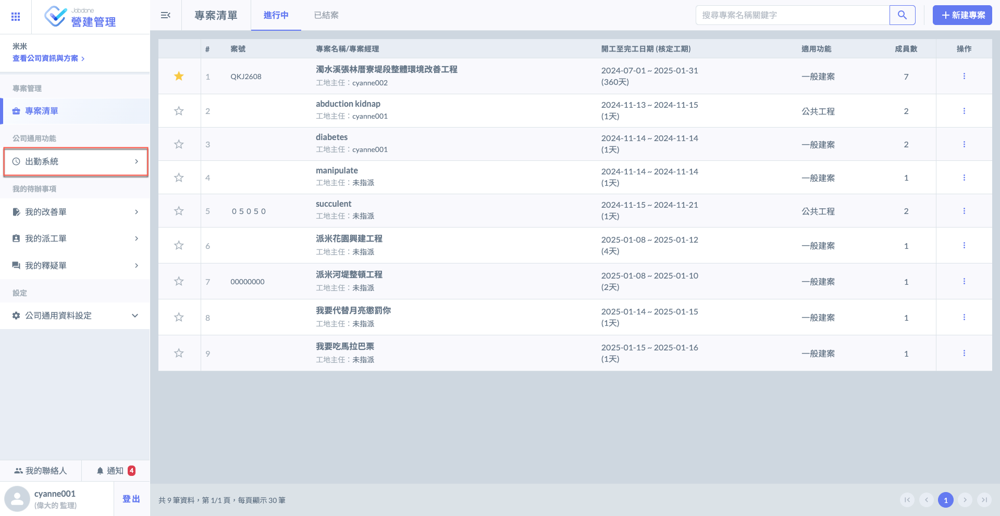

# 網頁版

---
description: Web-based Version
---

# 網頁版

以下說明於網頁版中，**人資**與**非人資**使用功能之差異。

<table><thead><tr><th width="336">功能</th><th>人資</th><th>非人資</th></tr></thead><tbody><tr><td>個人出勤</td><td>✔</td><td>✔</td></tr><tr><td>公司出勤資料 - 匯出 Excel</td><td>✔</td><td>𒉽</td></tr><tr><td>公司出勤資料 - 查看各成員今日出勤概覽</td><td>✔</td><td>𒉽</td></tr><tr><td>假別管理</td><td>✔</td><td>𒉽</td></tr><tr><td>人員時數管理</td><td>✔</td><td>𒉽</td></tr><tr><td>審核申請</td><td>✔</td><td>𒉽</td></tr></tbody></table>

## 進入出勤系統

