# 人員時數管理

---
description: Employee Hours Management
---

# 人員時數管理

人資成員可與此處查看所有公司成員之以任一個月之**出勤狀況**（包括：打卡紀錄、加班紀錄及休假紀錄）。

除可查看各成員**假別列表**（各假別之**發放時數**及**已使用時數**），亦可針對不同的成員，給予特定的假別發放時數。

!!! warning
    請注意，僅具有人資權限之成員可使用人員時數管理功能。

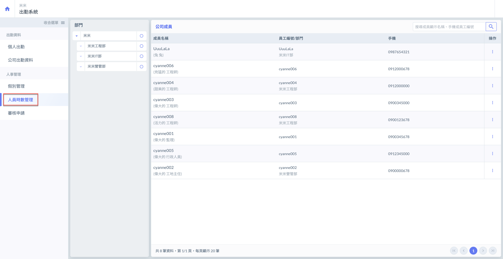

***

## 🏢 01｜選取部門 / 搜尋成員

### 01 - 1｜選取部門

進入人員時數管理頁面後，如下圖紅框圈選處，於部門欄位點選欲查看的部門 (例如查看米米工程部)。

即可查看該部門下之所有成員及其員工資訊。

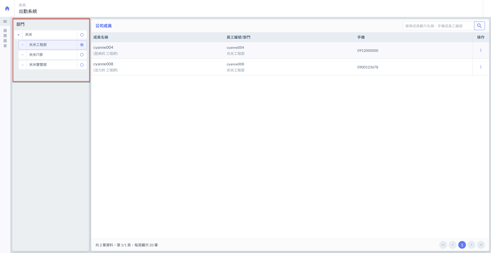

***

### 01 - 2｜搜尋成員

進入人員時數管理頁面後，於下圖紅框圈選處，輸入欲查找員工之**員工名稱**、**手機**及**員工編號**，即會自動幫您找到該成員。

!!! warning
    員工名稱請&#x7528;**「帳號ID」**&#x67E5;找，不可用姓名查找。
    
    若您已選取部門再查找，則只能查找部門內成員；若剛進入頁面，尚未選取部門，則可查找全公司成員。

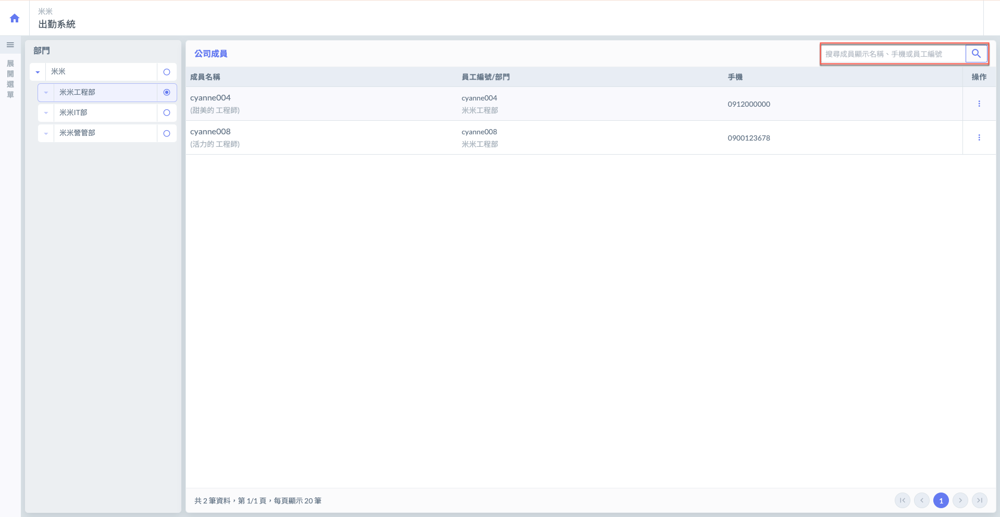

***

## 📋 02｜查看人員出勤紀錄

如左圖紅框圈選處，於欲查看的成員右側操作欄位點&#x9078;**「⋮」**&#x4E4B;**「人員出勤紀錄」**，即可查看該人員出勤紀錄。

包括：打卡記錄、加班紀錄與休假紀錄。

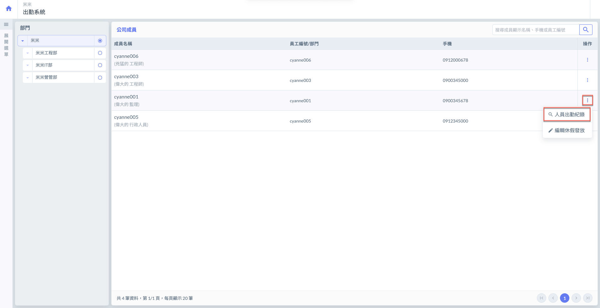 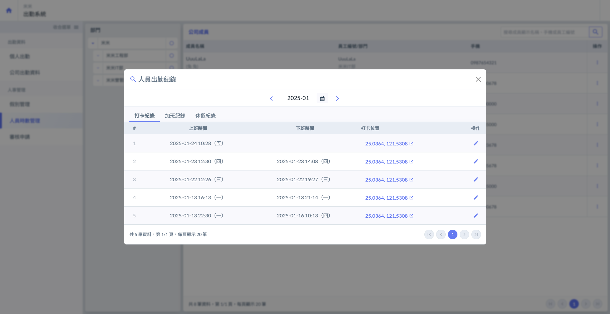

可參考下方影片：

{% embed url="https://files.gitbook.com/v0/b/gitbook-x-prod.appspot.com/o/spaces%2FEqUCL3D5WQfpxJw8NL3P%2Fuploads%2F5axJfiySyzVsPDIy5XsV%2F%E6%93%8D%E4%BD%9C%E6%96%B9%E5%BC%8F.mp4?alt=media&token=fa3868e4-0f45-48fa-a86d-bad25600a1c4" %}

***

### &#x20;02 - 1｜更改打卡時間

!!! warning
    人資成員只能更改員工的打工時間，**無法**替員工打第一次上班/下班卡。

點選「人員出勤紀錄」後，選擇<kbd>**打卡紀錄**</kbd>頁籤。

如圖一紅框圈選處，於該成員的一筆打卡記錄右側，點&#x9078;**「****」**，即可修改其打卡記錄。

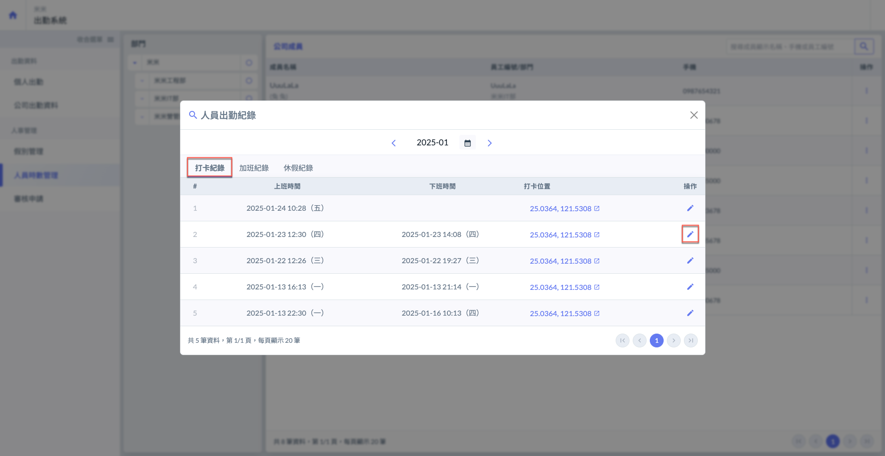 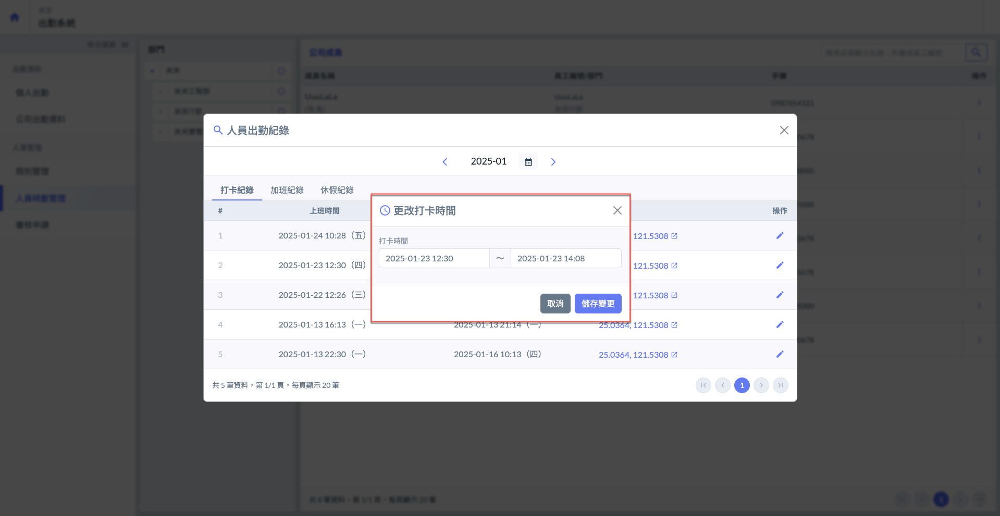

點選圖三紅框圈選處，您即可開啟圖四月曆表，並修改打卡（上班 / 下班）日期與時間。

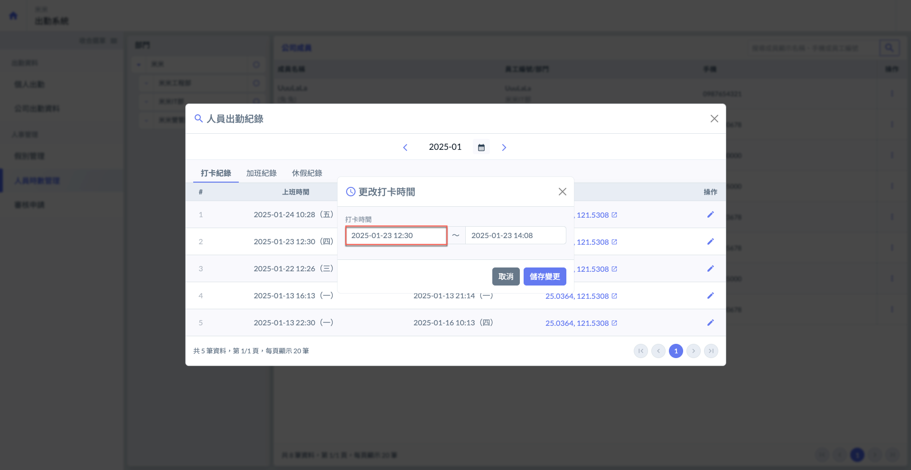 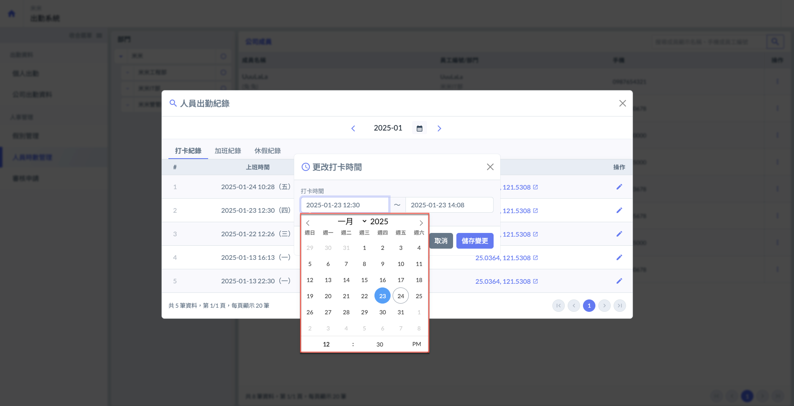

***

### 02 - 2｜查看加班 / 休假紀錄

#### 查看加班紀錄

於<kbd>**加班紀錄**</kbd>頁籤，可查看該成員指定月份所有加班申請，亦可如左圖點&#x9078;**「****」**，詳細查看加班申請紀錄。

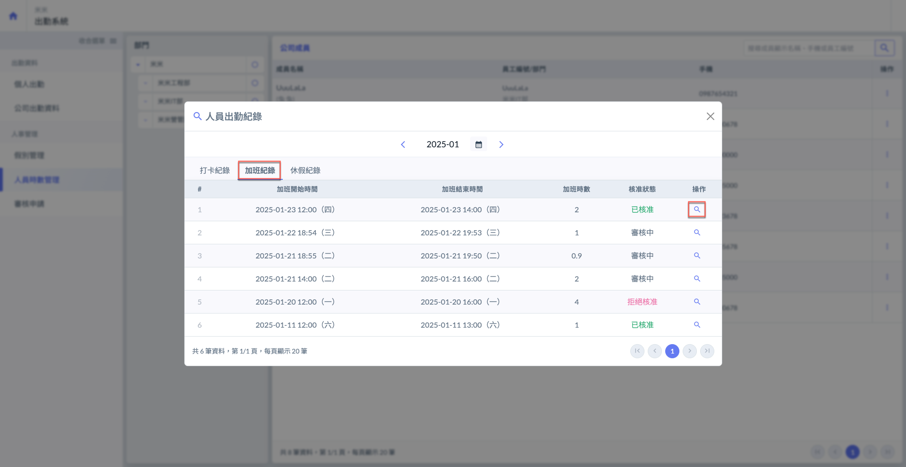 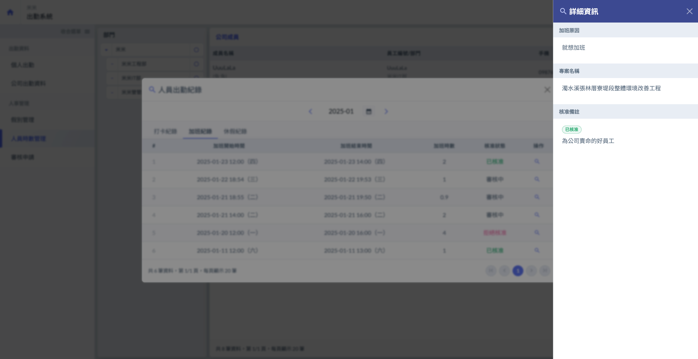

#### 查看休假紀錄

於<kbd>**休假紀錄**</kbd>頁籤，可查看該成員指定月份所有休假申請，亦可如左圖點&#x9078;**「🔍」**，詳細查看休假申請紀錄。

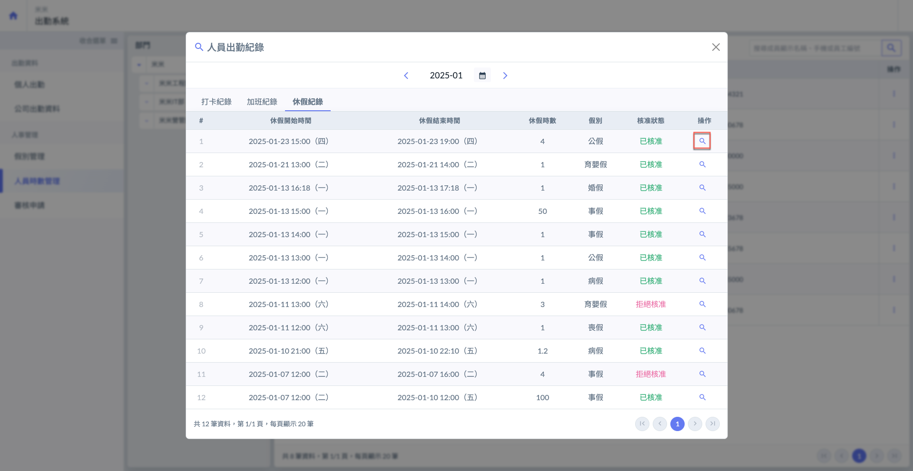 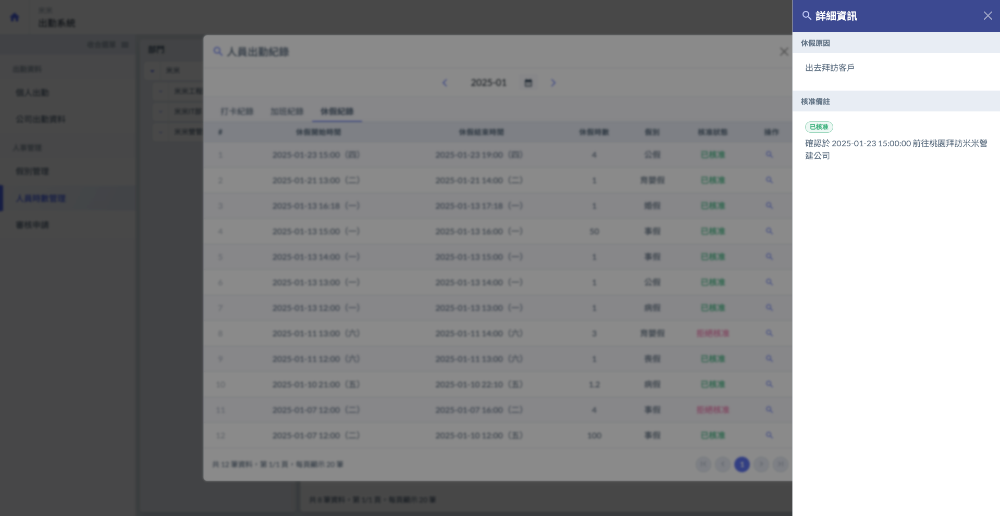

***

## 🏖️ 03｜編輯休假發放

如圖一紅框圈選處，於欲編輯的成員右側操作欄位點&#x9078;**「⋮」**&#x4E4B;**「編輯休假發放」**，即可個別管理每位成員的假別發放時數。

如圖二，您可查看該成員之**成員名稱** (包括：員工編號及部門）、**假別列表**（包括：各假別之發放時數與該成員使用時數）。並編輯該成員各假別之發放時數。

!!! tip
    除公司統一的**假別管理**，亦可於**人員時數管理**給予個別成員不同的假別時數。

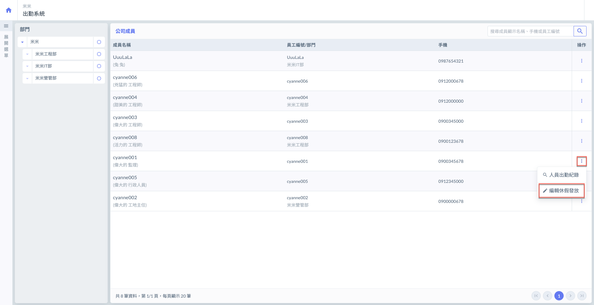 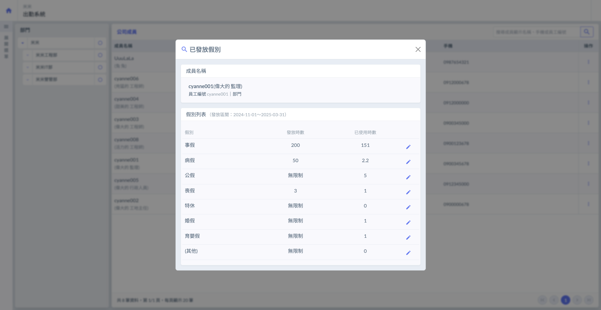

如圖三，於欲編輯的假別右側點&#x9078;**「****」**，即可進入圖四畫面，編輯**發放假別**及**備註**。

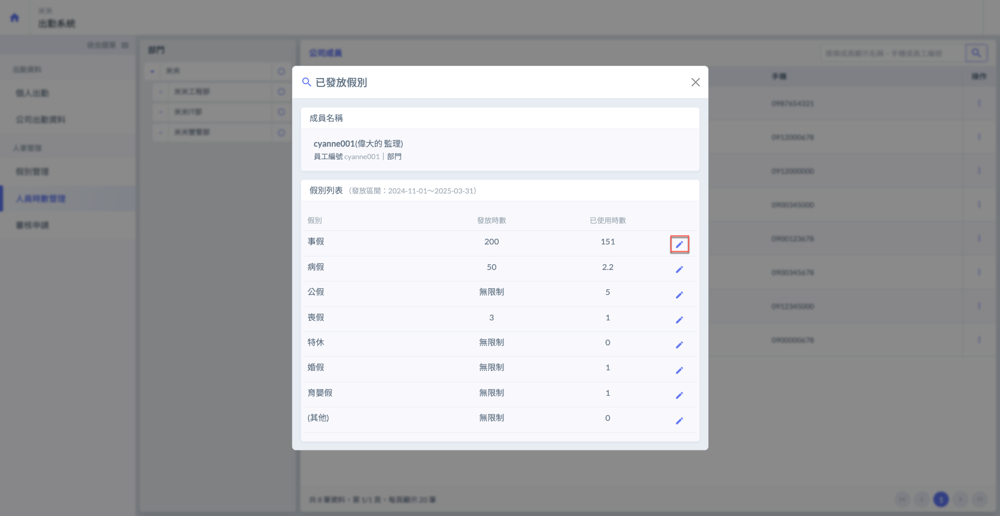 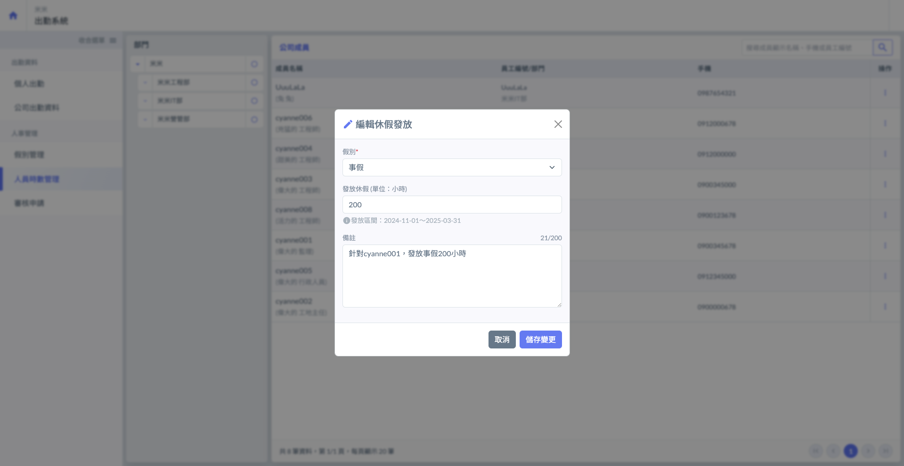

