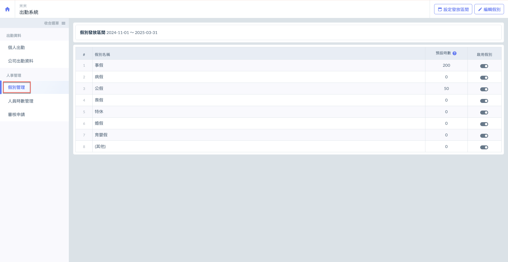
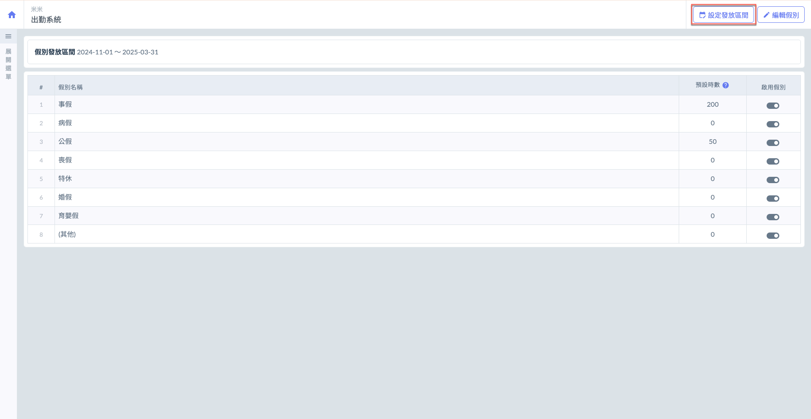
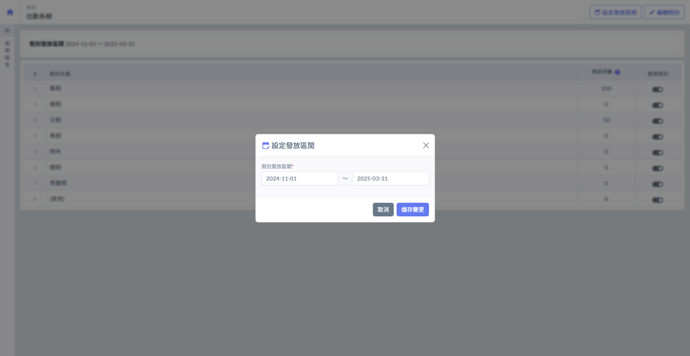
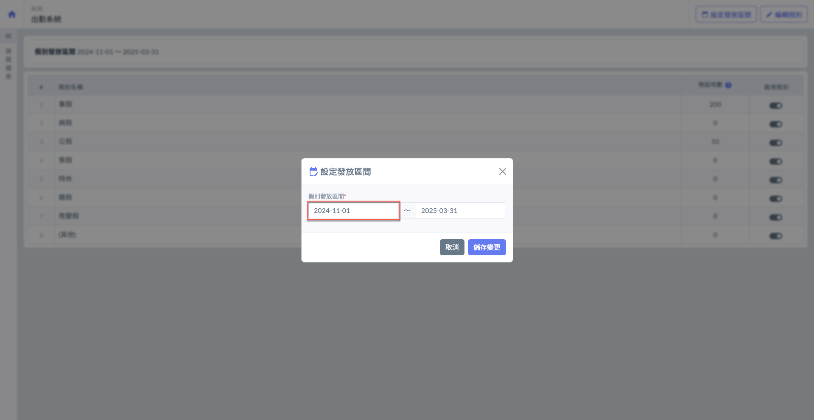
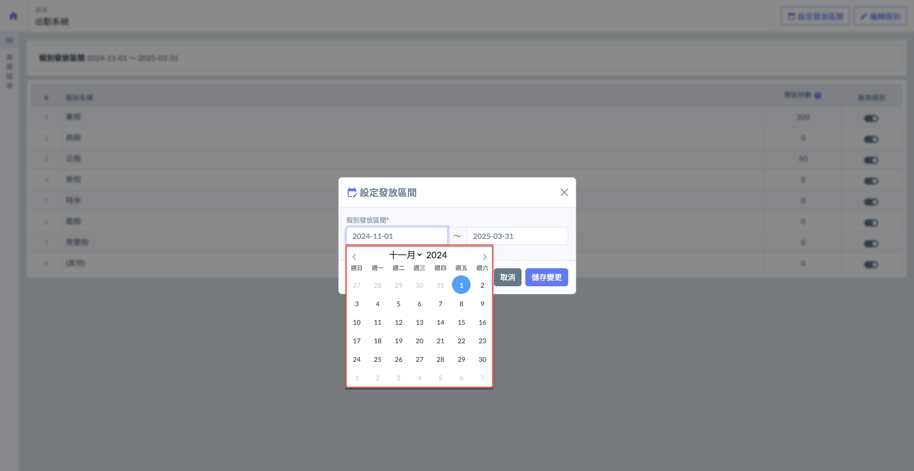
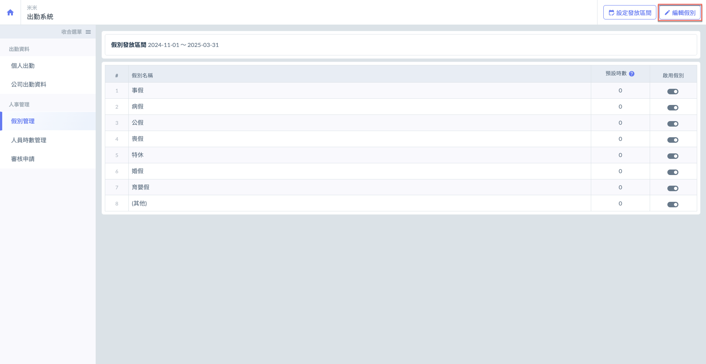
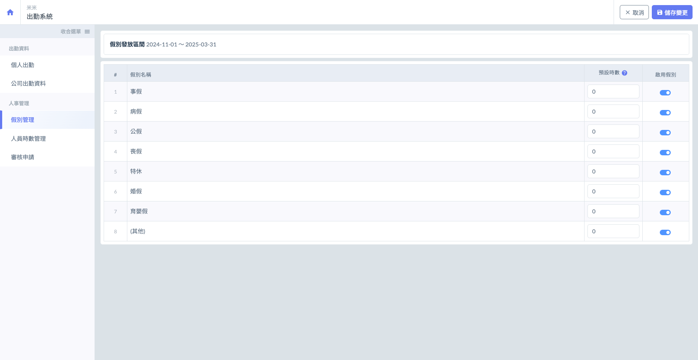

# 假別管理

---
description: Leave Allocation Management
---

# 假別管理

人資成員可於此處**設定假別發放區間**及**編輯假別**（包括各假別可用時數&是否啟用該假別)。

此功能為整個公司層級之假別設定，亦可對各成員給予不同之假別時數。詳細說明請參閱 **➙** [人員時數管理](employee-hours)

!!! warning
    請注意，僅具有人資權限之成員可使用假別管理功能。

***

## 👨‍💼 01｜設定假別發放區間

進入假別管理頁面後，如圖一紅框圈選處，點選右上角&#x4E4B;**「設定發放區間」**&#x5373;可開啟(圖二)畫面。

 

如圖三、圖四，點選該區間起始/結束時間框，即可開啟月曆表自行選擇發放時間。

 

***

## 👨‍💼 02｜編輯假別

進入假別管理功能頁面後，如圖一紅框圈選處，點&#x9078;**「編輯假別」**&#x5373;可如開啟(圖二)畫面。

如圖二，您即可開始啟用/關閉假別、編輯各假別給予時數。(關閉假別後，成員即無法申請此假別之休假)

 

