# 個人出勤

---
description: Individual Attendance
---

# 個人出勤

使用者可於此處查看您個人的出勤資料，包括：**打卡記錄**、**加班紀錄**、**休假紀錄**等。

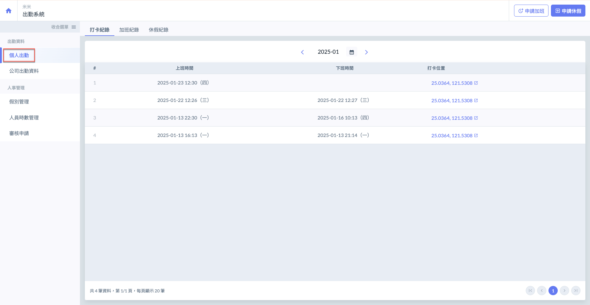

***

## 🕒 01｜打卡記錄

如圖一紅框圈選處，進入出勤系統之個人出勤頁面後，點選<kbd>**打卡記錄**</kbd>頁籤。

即可查看您一個月內的所有打卡記錄，包括：**上班時間**、**下班時間**及**打卡位置**。

!!! info
    紀錄顯示以一個月為單位呈現。

### 01 - 1｜篩選日期

如圖二紅框圈選處，您可調整日期至欲查看的月份，點&#x9078;**「****」**&#x7BAD;頭符號與點&#x9078;**「****」**&#x65E5;曆符號有不同作用：



以一個月為單位，可向前選擇至上個月或向後選擇至下個月。



可開啟選擇欄位，快速選擇所需的年份與月份。



#### 點選 

點選日曆符號(左圖)後，即可進入右圖開始選擇所需的年份與月份。

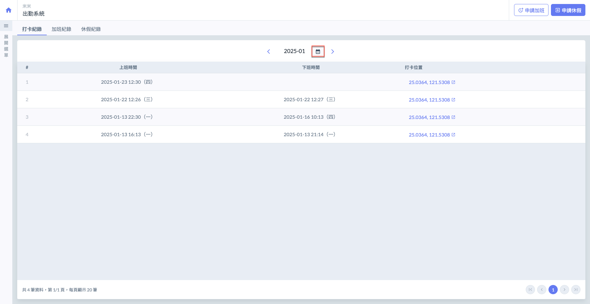 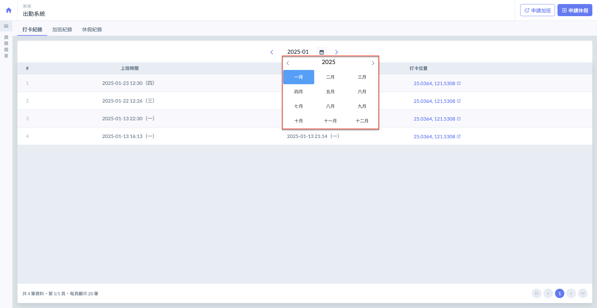

***

### 01 - 2｜查看打卡位置

如下圖紅框圈選處，於打卡位置欄位，點選下方的經緯度資料，即可進入**Google 地圖**詳細查看位置。

!!! tip
    使用App進行打卡時，系統即會自動依據您的所在位置儲存經緯度資料。

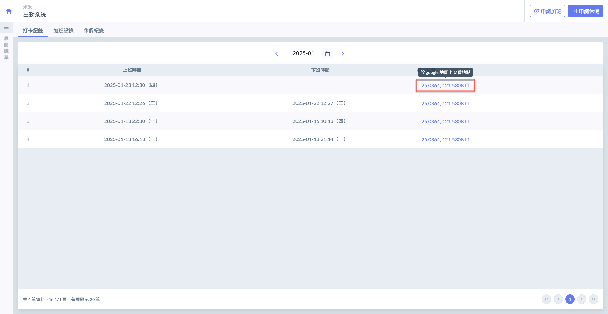

***

## 🔥 02｜加班記錄

如圖一紅框圈選處，進入出勤系統之個人出勤頁面後，點選<kbd>**加班紀錄**</kbd>頁籤。

即可查看您一個月內的所有加班記錄，包括：**加班開始/結束時間**、**加班時數**及**核准狀態**。

!!! info
    紀錄顯示以一個月為單位呈現。

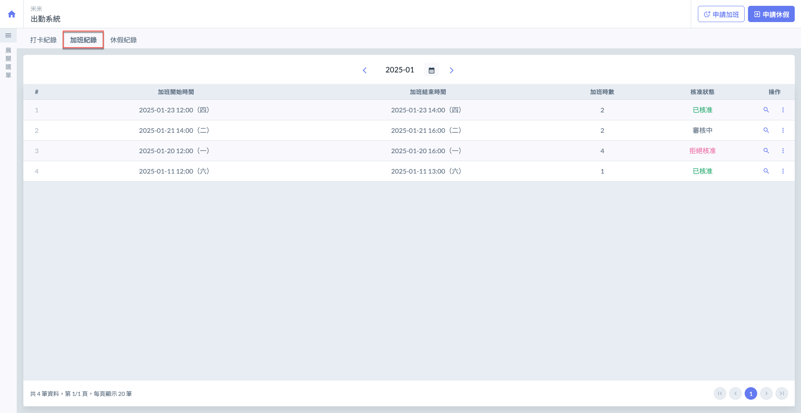

***

### 02 - 1｜核准狀態說明

共有**審核中**、**已核准**及**拒絕核准**三種狀態，可於各加班紀錄之核准狀態欄位查看。

!!! warning
    僅具有<kbd>**人資**</kbd>權限之公司成員，才能審核加班申請。



人資成員**尚未審核**加班申請。



人資成員已審核並**核准**該加班申請。



人資成員已審核並**拒絕**該加班申請。



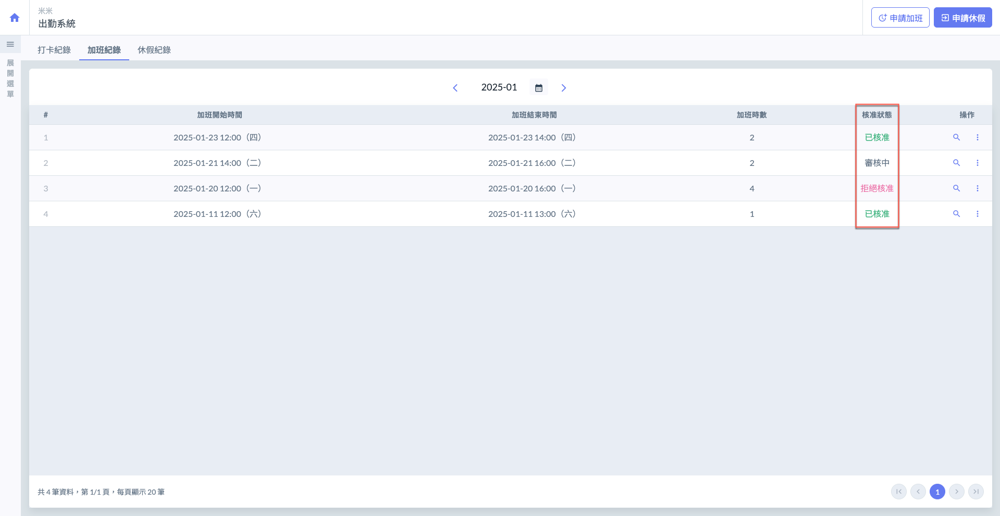

***

### 02 - 2｜查看與撤回申請

您可於各加班申請紀錄之**操作**欄位，**查看**您的加班紀錄或**撤回**您的加班紀錄。

#### 查看加班紀錄

如左圖紅框圈選處，於欲查看的加班紀錄右側操作欄位，點&#x9078;**「**&#xD83D;&#xDD0D;**」**&#x5373;可進入右圖畫面查看加班資訊。

如右圖，即可查看**加班原因**、加班所對應的**專案名稱**及**審核備註**。

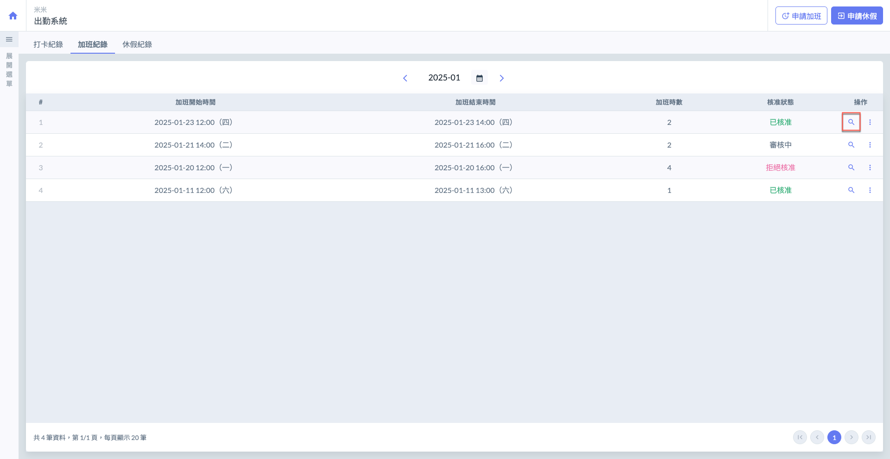 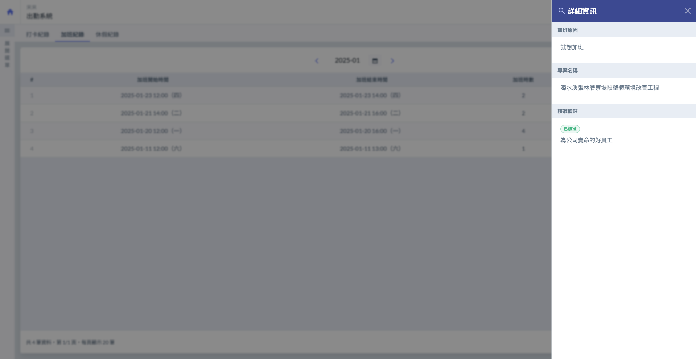

#### 撤回加班申請

!!! warning
    僅**審核中**的加班紀錄可以撤回申請。

如下圖紅框圈選處，於欲撤回的加班紀錄右側操作欄位，點&#x9078;**「⋮」**&#x5373;可選&#x64C7;**「撤回加班申請」**。

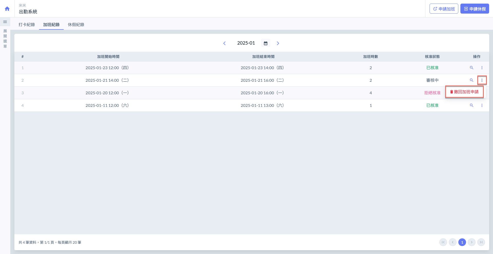

***

### 02 - 3｜篩選日期

如下圖紅框圈選處，您可調整日期至欲查看的月份，點&#x9078;**「****」**&#x7BAD;頭符號與點&#x9078;**「****」**&#x65E5;曆符號有不同作用：



以一個月為單位，可向前選擇至上個月或向後選擇至下個月。



可開啟選擇欄位，快速選擇所需的年份與月份。



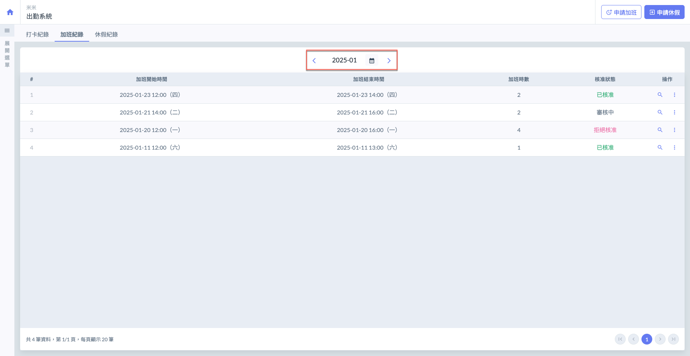

#### 點選 

點選日曆符號(左圖)後，即可進入右圖開始選擇所需的年份與月份。

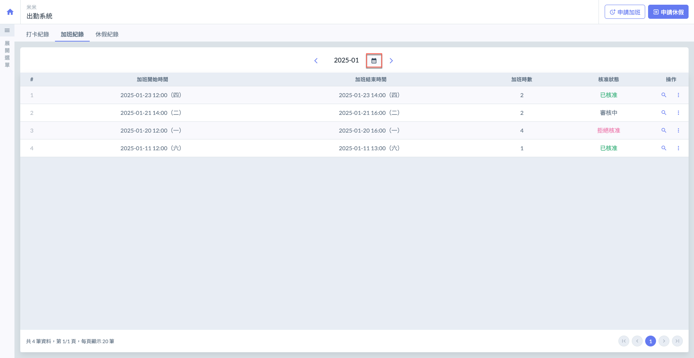 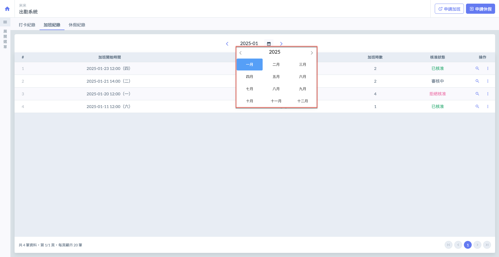

***

## 🌴 03｜休假記錄

如圖一紅框圈選處，進入出勤系統之個人出勤頁面後，點選<kbd>**休假紀錄**</kbd>頁籤。

即可查看您一個月內的所有休假記錄，包括：**休假開始/結束時間**、**休假時數**、**假別**及**核准狀態**。

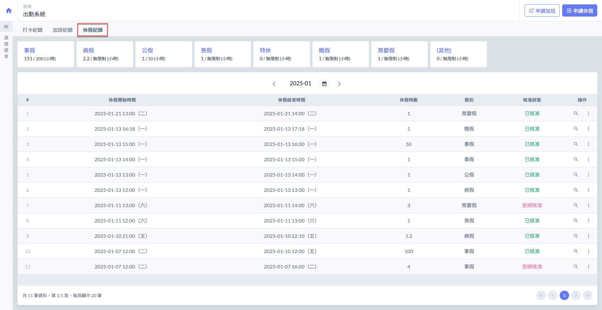

如圖二紅框選處，系統會統計您目前使用的所有假別總時數(各假別)，並以(休假總時數)/(給予假別時數)呈現。

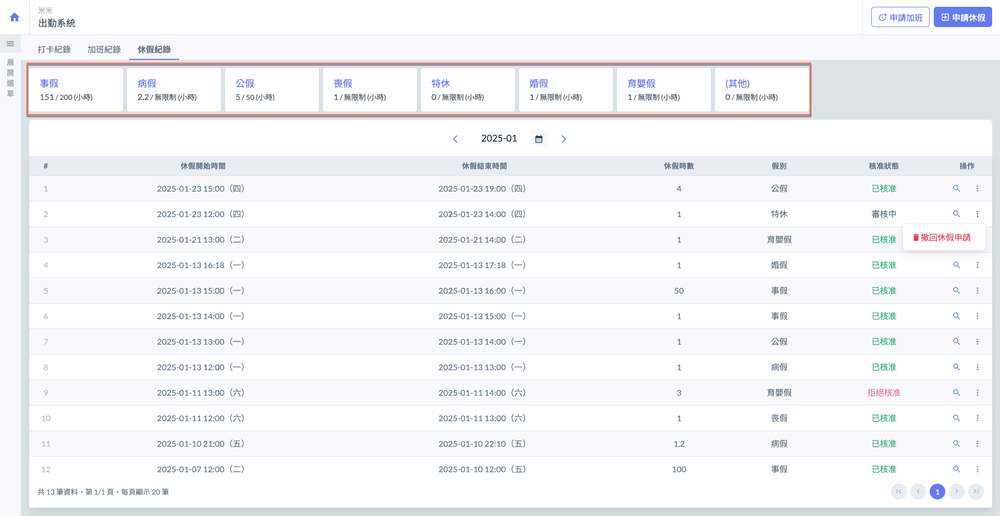

***

### 03 - 1｜核准狀態說明

共有**審核中**、**已核准**及**拒絕核准**三種狀態，可於各休假紀錄之核准狀態欄位查看。

!!! warning
    僅具有<kbd>**人資**</kbd>權限之公司成員，才能審核休假申請。



**尚未審核**加班申請。



人資成員已審核並**核准**該加班申請。



人資成員已審核並**拒絕**該加班申請。



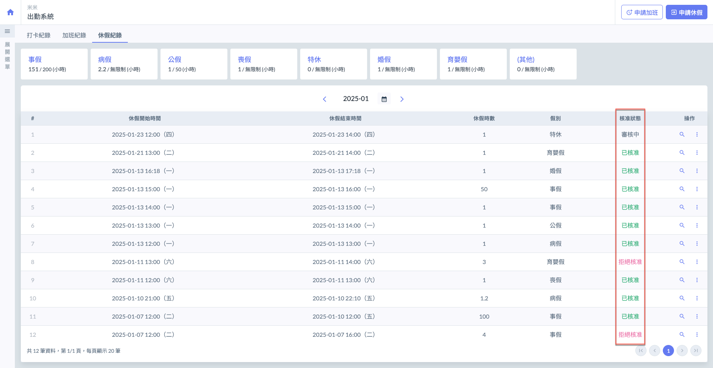

***

### 03 - 2｜查看與撤回申請

您可於各加班申請紀錄之**操作**欄位，**查看**您的休假紀錄或**撤回**您的休假紀錄。

#### 查看加班紀錄

如左圖紅框圈選處，於欲查看的休假紀錄右側操作欄位，點&#x9078;**「**&#xD83D;&#xDD0D;**」**&#x5373;可進入右圖畫面查看休假資訊。

如右圖，即可查看**休假原因**及**核准備註**。

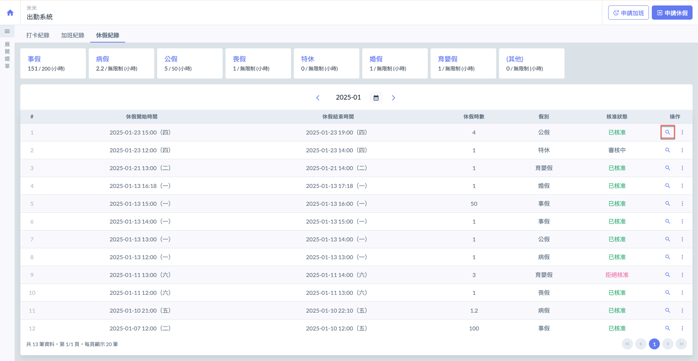 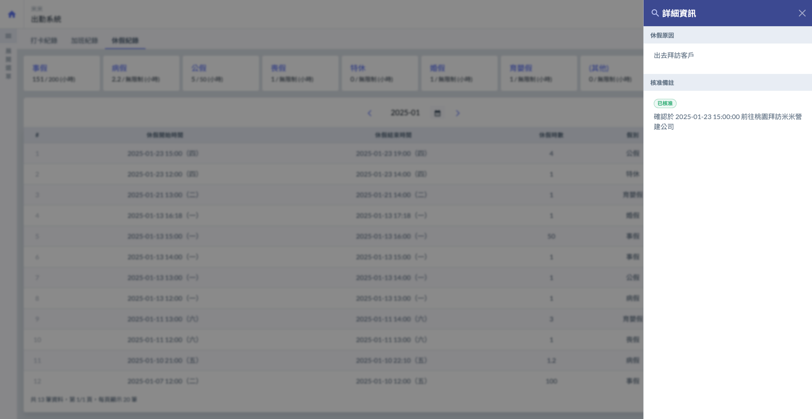

#### 撤回休假申請

!!! warning
    僅**審核中**的休假紀錄可以撤回申請。

如下圖紅框圈選處，於欲撤回的休假紀錄右側操作欄位，點&#x9078;**「⋮」**&#x5373;可選&#x64C7;**「撤回休假申請」**。

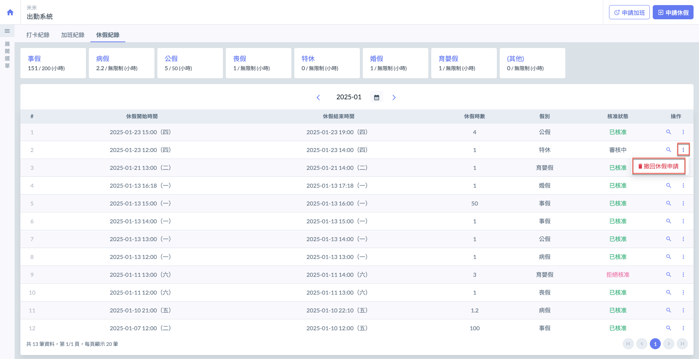

***

### 03 - 3｜篩選日期

如下圖紅框圈選處，您可調整日期至欲查看的月份，點&#x9078;**「****」**&#x7BAD;頭符號與點&#x9078;**「****」**&#x65E5;曆符號有不同作用：



以一個月為單位，可向前選擇至上個月或向後選擇至下個月。



可開啟選擇欄位，快速選擇所需的年份與月份。



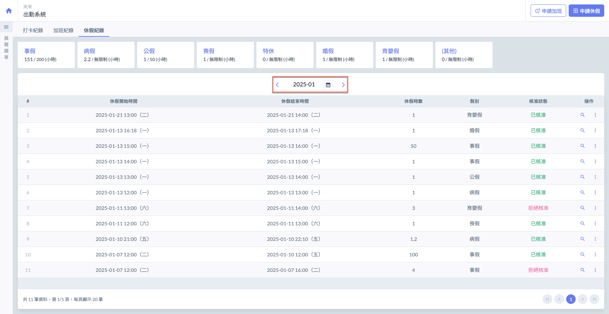

#### 點選 

點選日曆符號(左圖)後，即可進入右圖開始選擇所需的年份與月份。

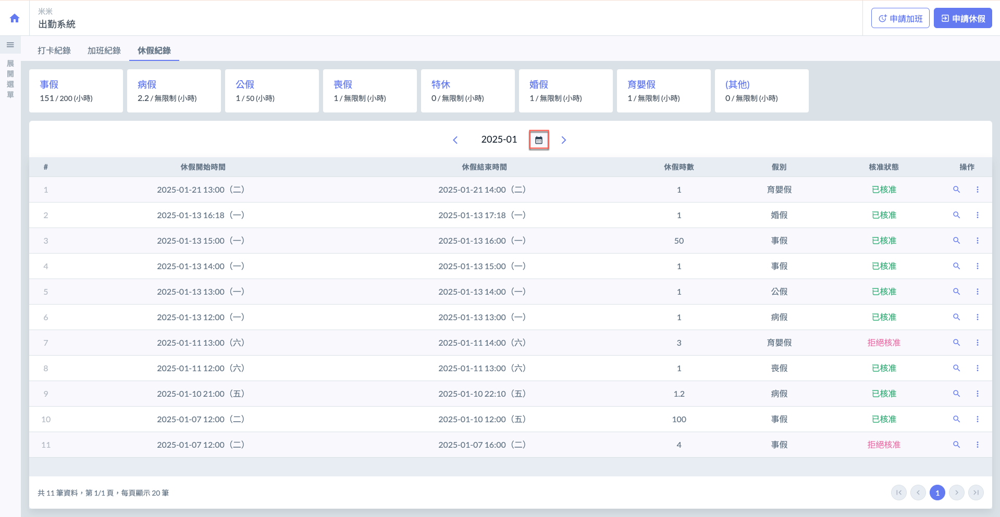 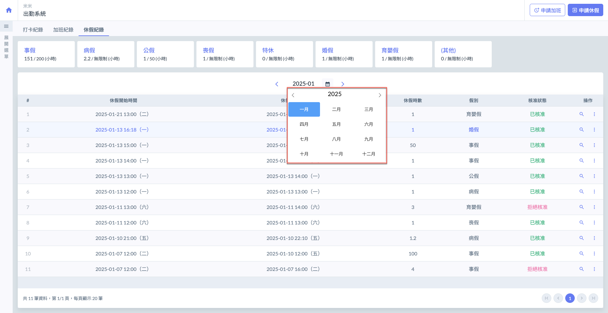

