# 申請加班 / 休假

個人申請的加班/休假紀錄，都可於個人出勤頁面的<kbd>**加班紀錄**</kbd>頁籤、<kbd>**休假紀錄**</kbd>頁籤查看。

欲查看更多詳細說明，請參閱 **➙** [個人出勤]()

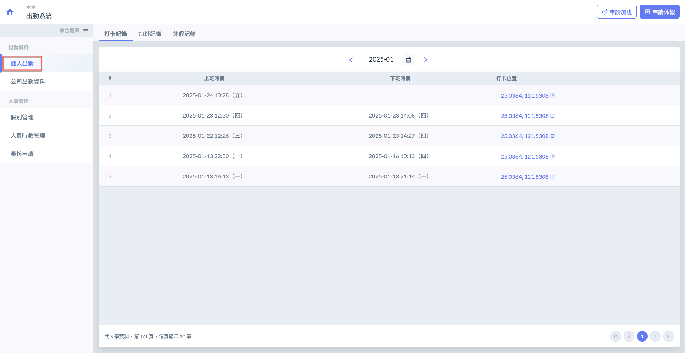

***

## 💪 01｜申請加班

進入個人出勤頁面後 (不限頁籤)，如圖一紅框圈選處，於右上角點&#x9078;**「申請加班」**&#x5373;可進入圖二頁面。

欲申請加班，會需要您填寫**加班時間**、該加班事項所**對應的專案**及**加班原因**。

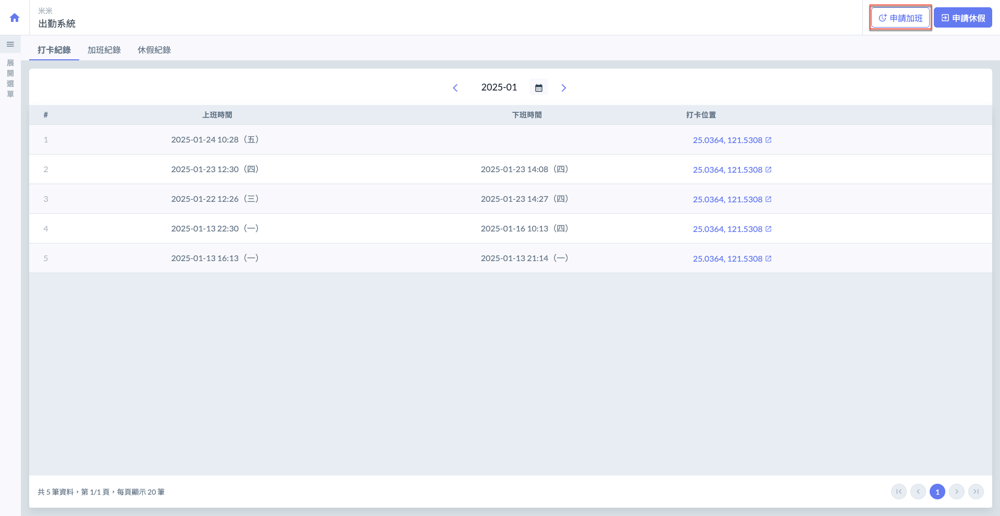 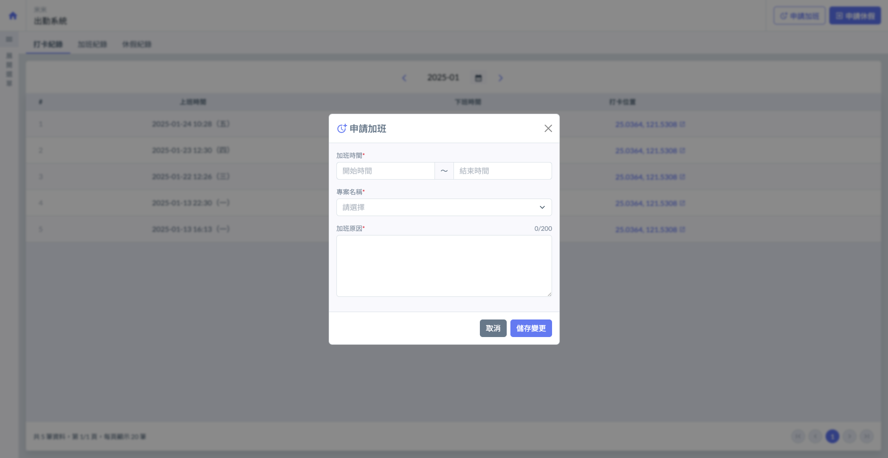

#### 選取加班時間

點選圖三紅框圈選處 (結束時間相同)，開啟月曆表選擇**日期**與**時間**，以填寫加班的**開始時間**與**結束時間**。

!!! tip
    系統會根據您輸入的加班時間，自動計算加班時數。

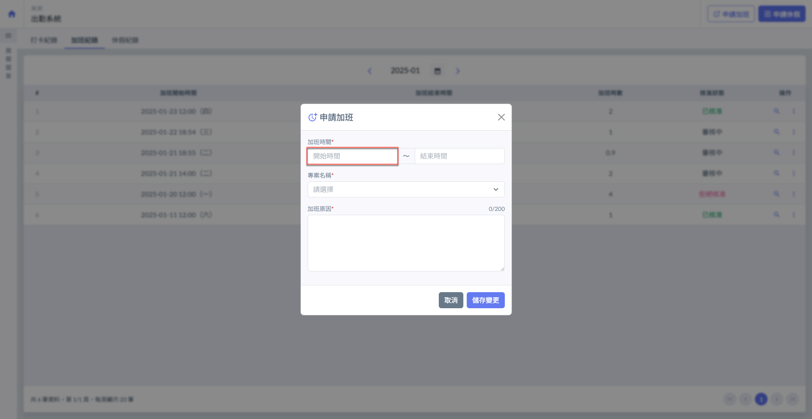 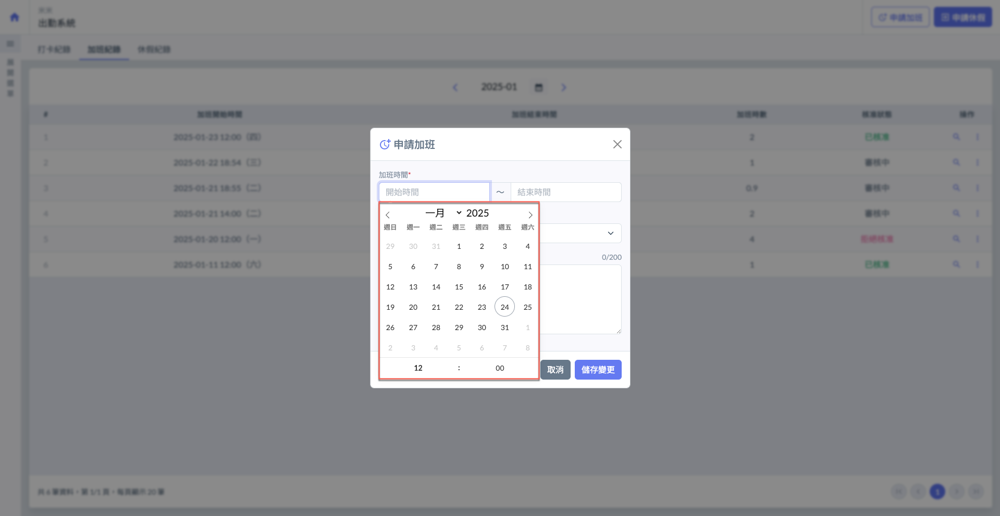

#### 選取專案

點選圖五紅框圈選處，即可展開選單選取該加班紀錄對應的專案(圖六)。

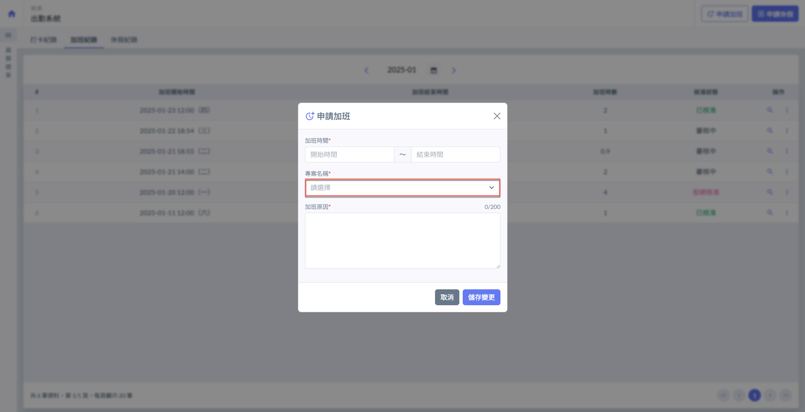 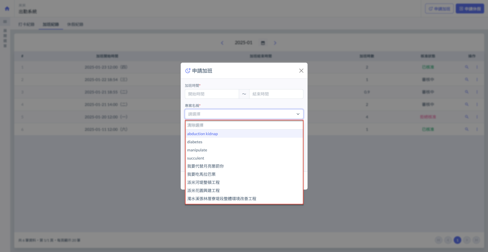

***

## ✈️ 02｜申請休假

進入個人出勤頁面後 (不限頁籤)，如圖一紅框圈選處，於右上角點&#x9078;**「申請休假」**&#x5373;可進入圖二頁面。

欲申請休假，會需要您填寫**休假時間**、**休假時數**、**假別**及**休假原因**。

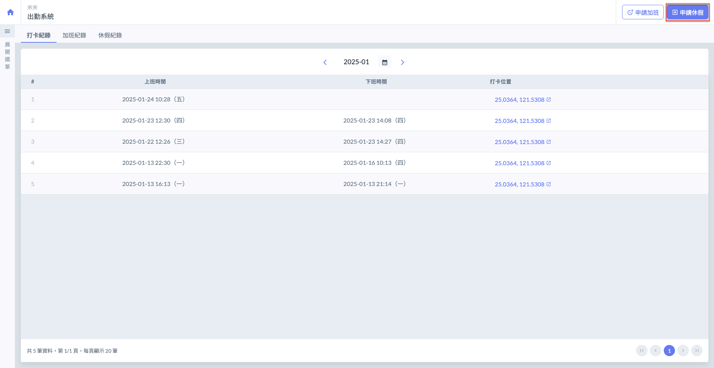 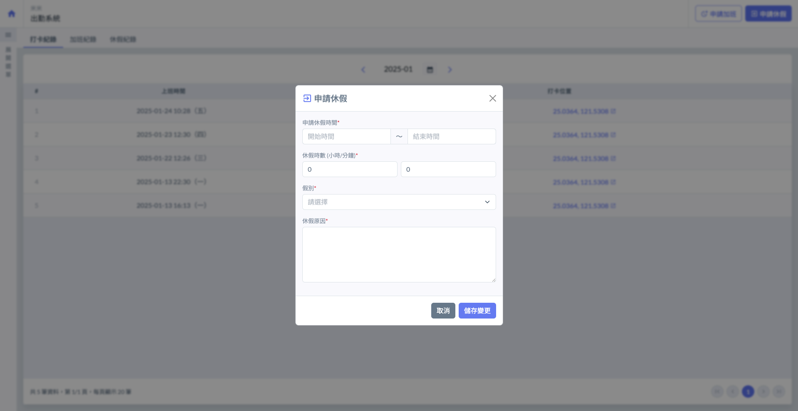

#### 選取休假時間

點選圖三紅框圈選處 (結束時間相同)，開啟月曆表選擇**日期**與**時間**，以填寫休假的**開始時間**與**結束時間**。

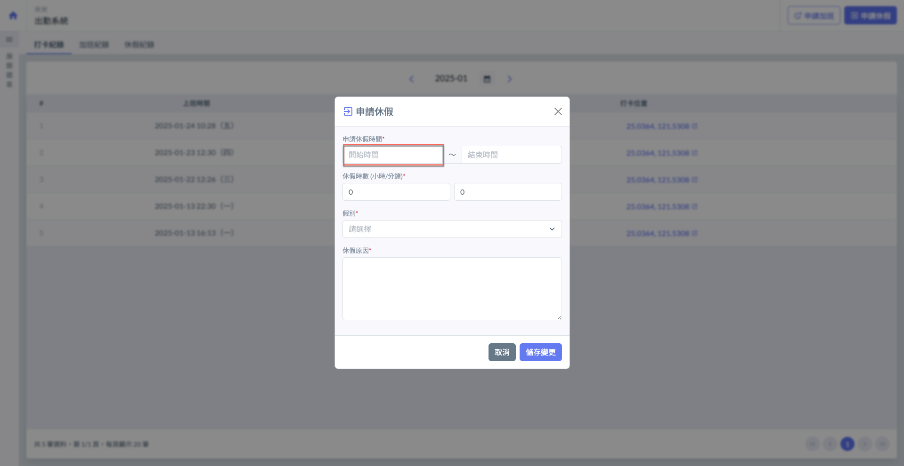 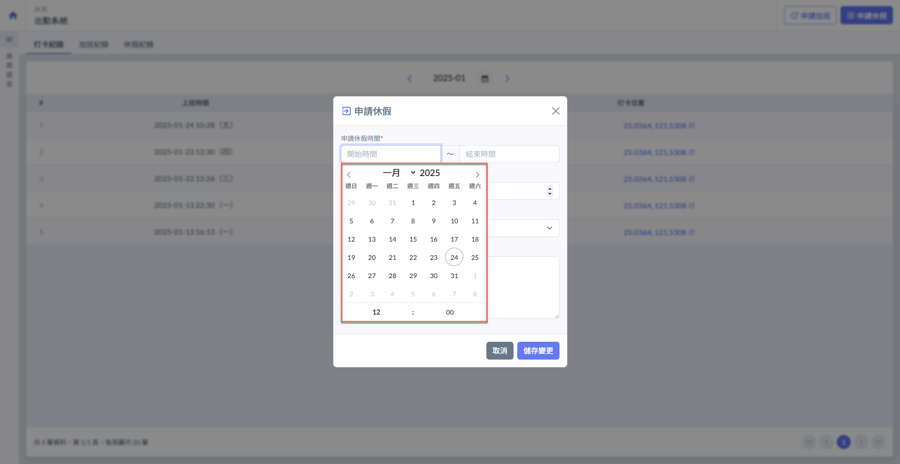

#### 選取假別

點選圖五紅框圈選處，即可開啟選單選取欲申請的假別(圖六)。

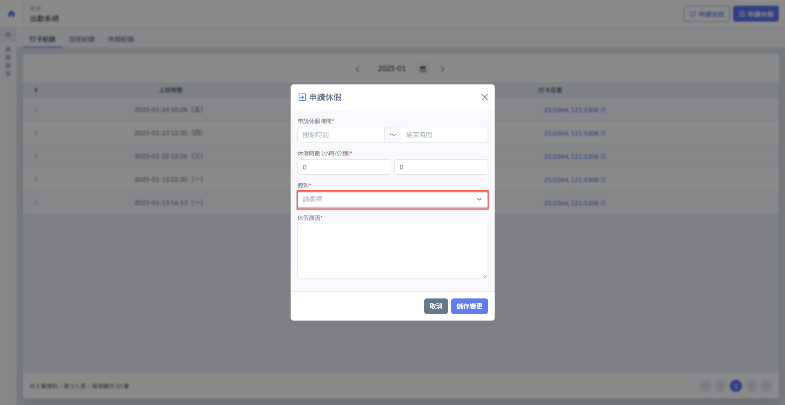 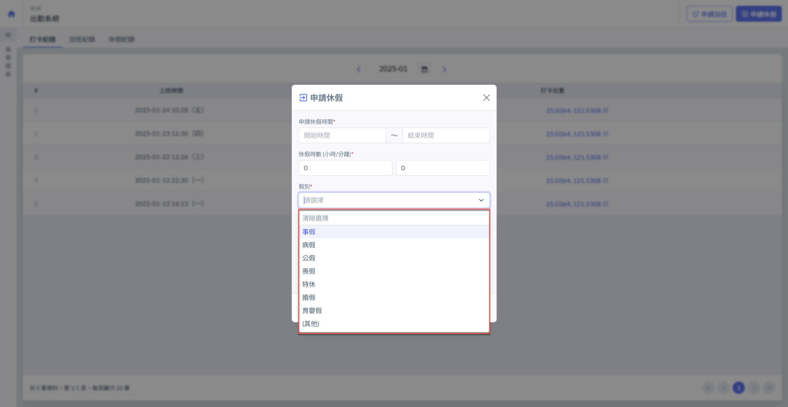

