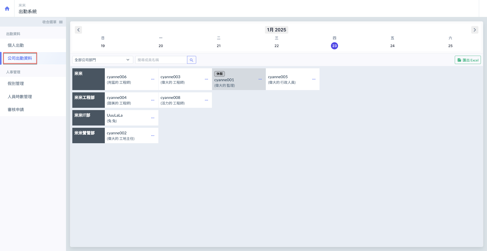
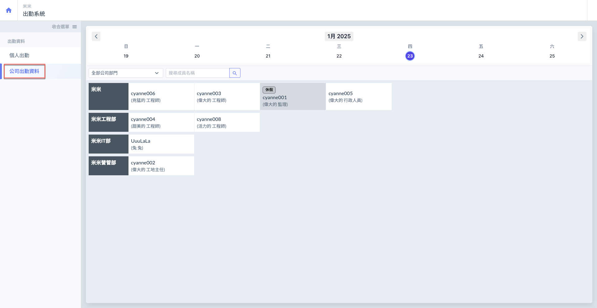
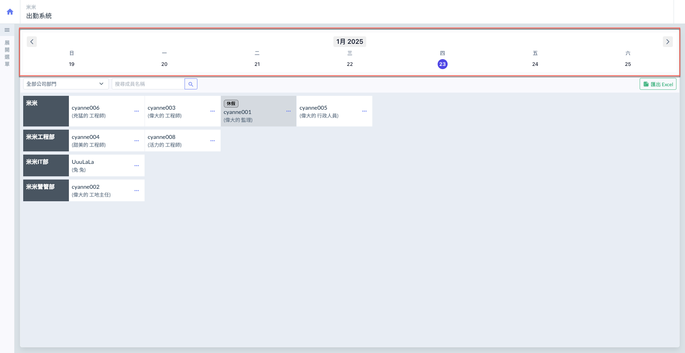
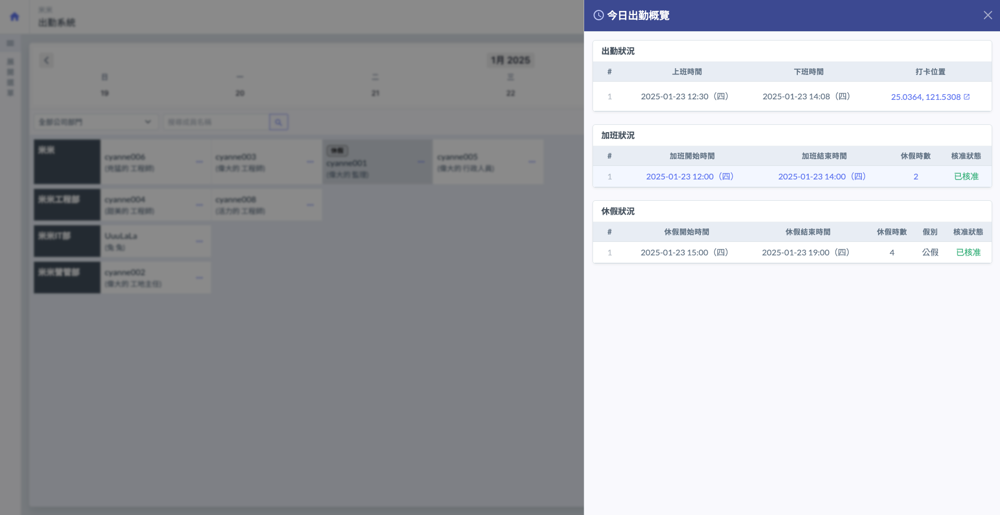
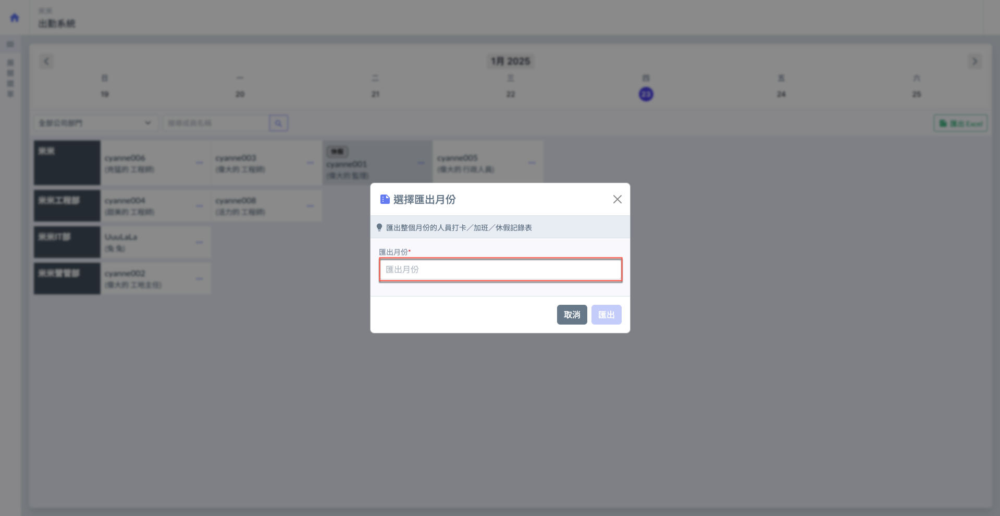
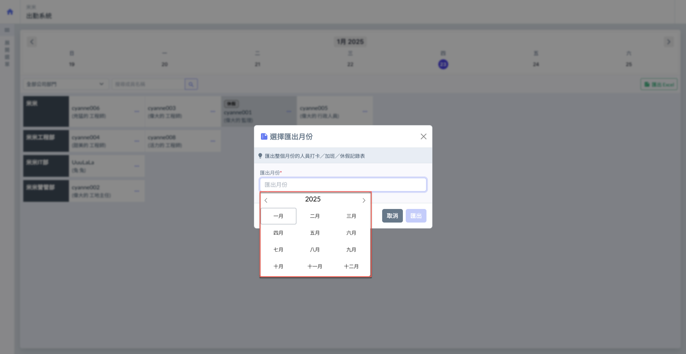
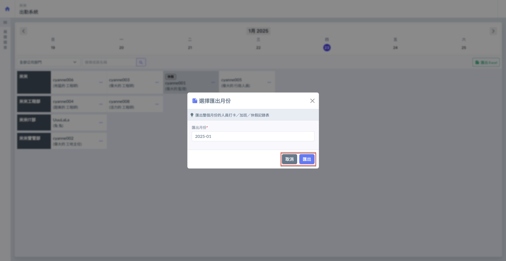

# 公司出勤資料

僅有人資成員可於此處查看所有成員&#x4E4B;**「今日出勤概覽」**，以及將一個月內的所有出勤狀&#x6CC1;**「匯出Excel」**。

可參考下圖，對比**人資成員**與**非人資成員**之畫面差異。

!!! tip
    如下圖，如該成員今日有核准通過的休假申請，系統將醒目標示以提醒所有成員。        &#x20;

 

***

## 👨‍💼 01｜今日出勤概覽

進入主頁面後，於下圖紅框圈選處選取日期，即可查看該天所員工之出勤紀錄（包括：打卡、加班及休假）

日期選擇完畢後，如左圖紅框圈選處。於欲查看的成員點&#x9078;**「…」**，再點&#x9078;**「今日出勤概覽」**。

即可查看該成員「當天」的**今日出勤狀況**、**加班狀況**及**休假狀況** (右圖)。

!!! tip
    加班/休假狀況亦會顯示當日該成員所有加班/休假申請（包括審核中、拒絕核准）。

 

***

## 📊 02｜匯出 Excel

進入公司出勤資料頁面後，如下圖紅框圈選處，於右上角點&#x9078;**「匯出 Excel」**，即可選擇年月份(圖二、三)。

點&#x9078;**「匯出 Excel」**&#x5F8C;，即可匯出該月份所有公司之**打卡情況**、**加班狀況**及**休假狀況**。

 

點&#x9078;**「匯出」**&#x5373;會開始下載 Excel 檔。

