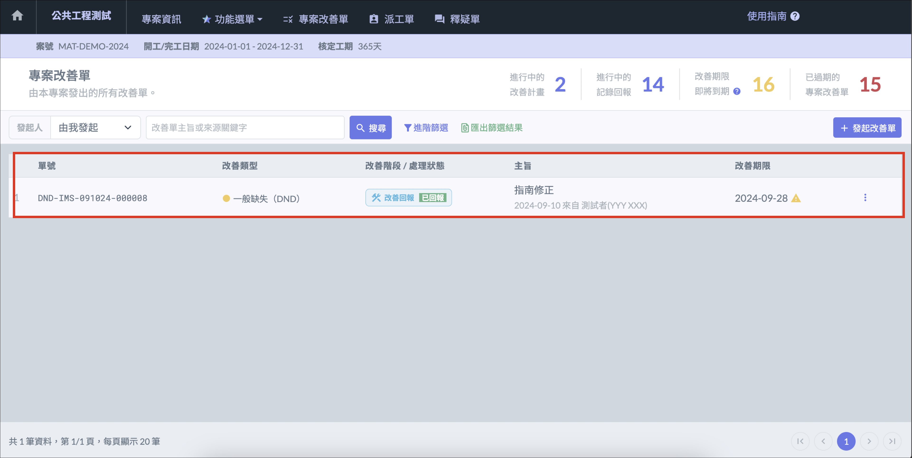
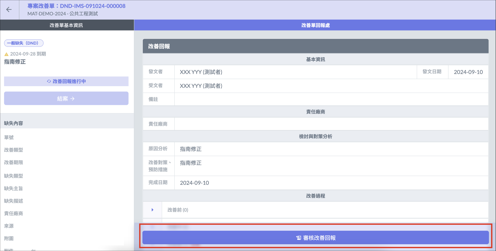
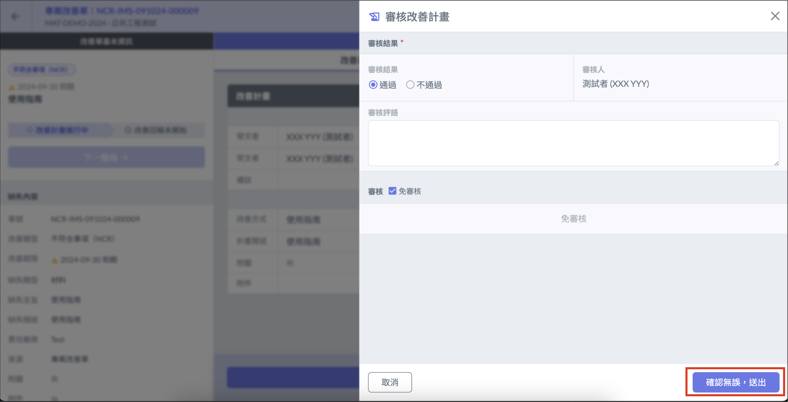
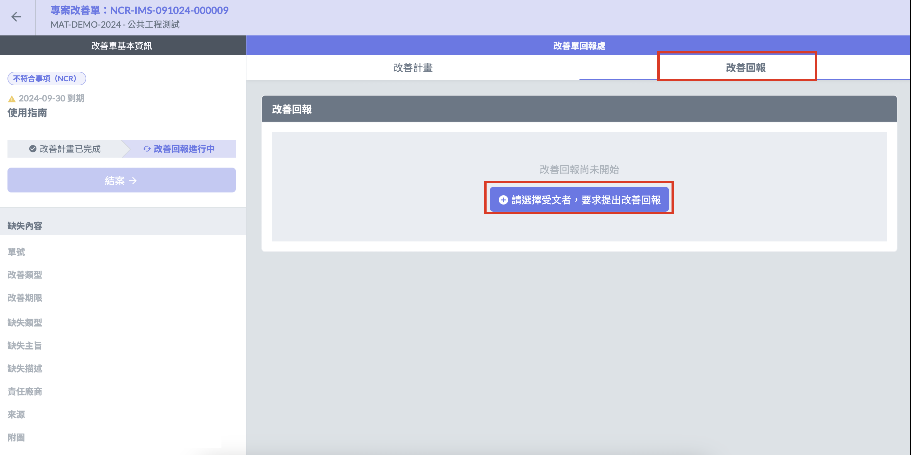
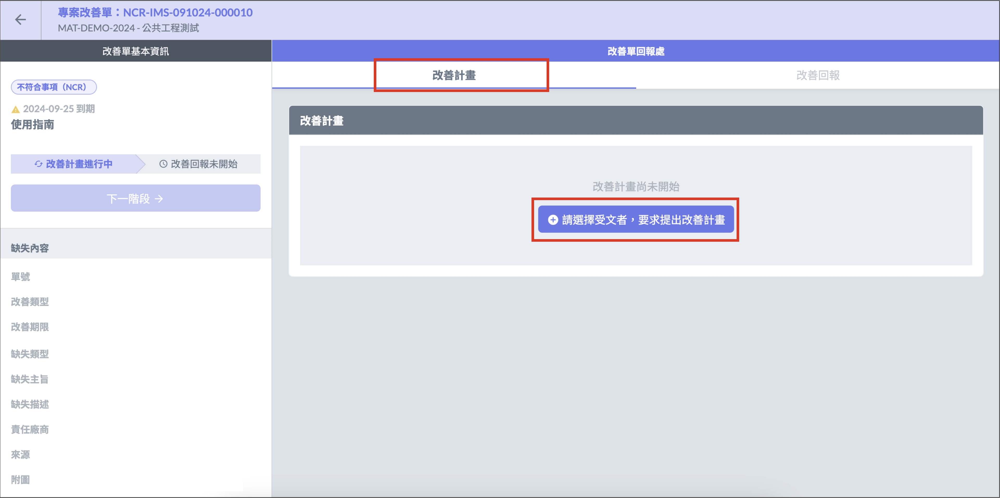
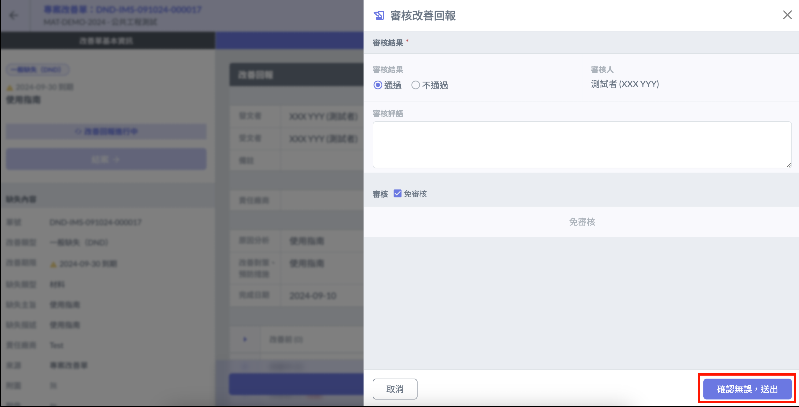
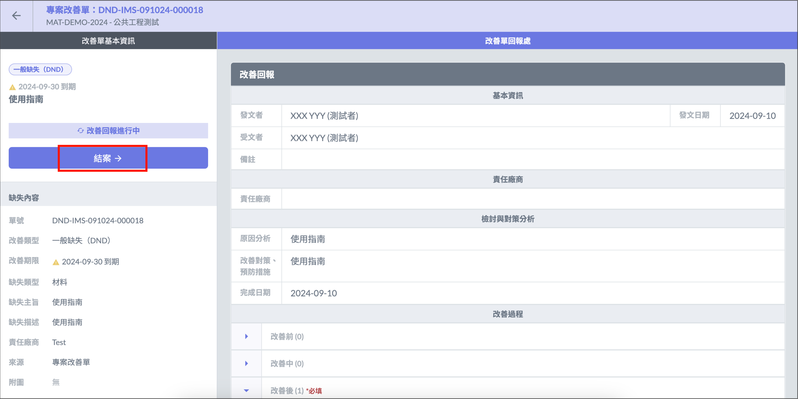
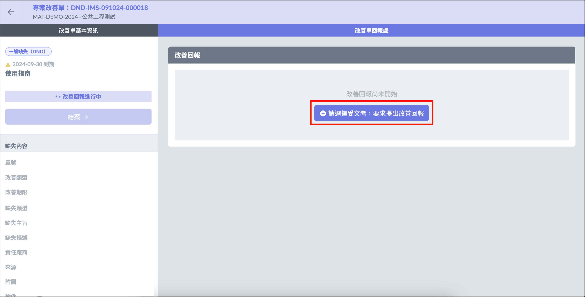

# 改善單審核

收到回報的改善單後，發文方即可開始進行改善單的審核。

***

## 改善單審核

進入專案改善單頁面後，找到需審核的改善單。點選改善單即可查看內容，並按下 「 審核改善計畫／審核改善回報 」 進行審核。

## 改善計畫審核（NCR)

### 通過

若是改善計畫審核通過，可進一步選擇公司成員進行內部審核，或是選擇免審核。選擇完畢後點擊 「 確認無誤，送出 」 ，即可進入改善回報階段，繼續發送改善回報改善單給受文者。

### **不通過**

若發文者審核改善計畫不通過，改善計畫將退回 「 待處理 」 狀態，可重新選擇受文者發送。

## 改善回報審核（DND） 

### **通過**

若是改善回報審核通過，可選擇選擇免審核，公司成員進行內部審核，公司內部成員審核完畢後，可按下結案按鈕，讓改善單正式結案。

### **不通過**

若改善回報未通過審核，將回到 「 待處理 」 狀態，可重新選擇受文者發送。原受文者可進入 「 我的改善單 」 查看審核評語。

