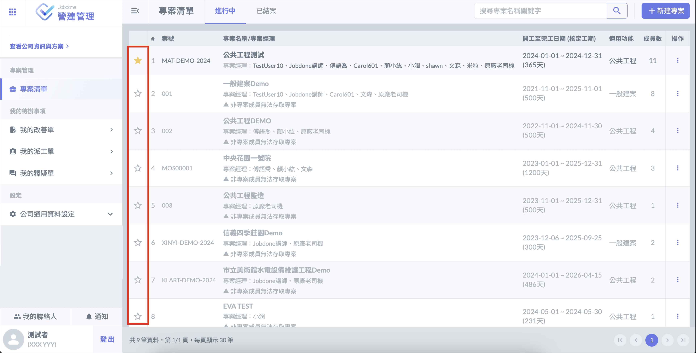
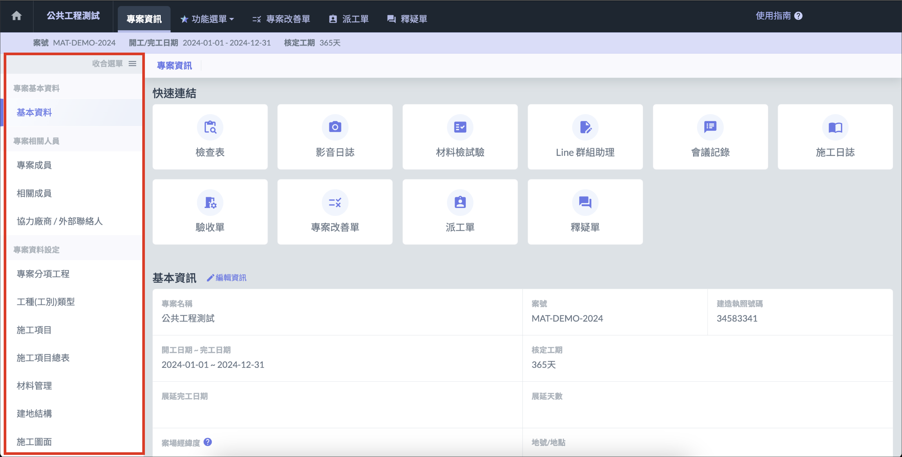
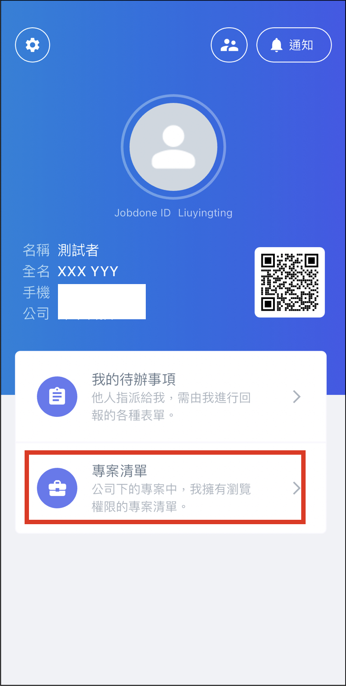
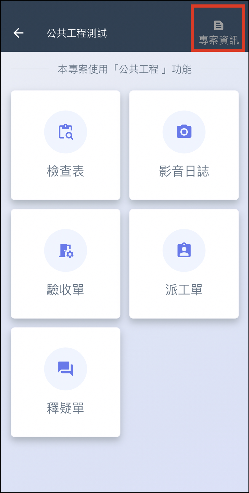

# 專案清單/專案頁面

## 網頁版

### 專案清單

登入主畫面即可查看專案清單，點選專案左側星號，可將專案釘選至頂端。

* 若帳號**擁有**專案管理權限，可以查看所有公司正在執行中的專案，並可新增、編輯、刪除。
* 若帳號**沒有**專案管理權限，僅能查看自己為專案成員的專案，且無法針對專案進行進一步操作。

### 專案頁面

點選其中一個專案，即可進入該專案頁面。頁面會顯示專案基本資訊及功能，亦可點選左側的 「 展開選單 」，查看專案相關的資料設定。

***

## APP

!!! info
    APP 內無論是否擁有 「 專案管理權限 」 ，都只能看到**自己是成員**的專案。

### 專案清單

在 APP 畫面點選 「 專案清單 」，即可查看自己加入的專案。

.     

### 專案頁面

選擇其中一個專案後會顯示 APP 可使用的功能，亦可點選左側的 「 專案資訊 」，查看專案相關的資料設定。

.     

