# 專案資訊

!!! info
    1. 僅有該專案的成員才能進入專案，且只有該專案的「專案經理」才可編輯基本資訊。
    2. 專案資料編輯僅能在網頁版操作。

## 網頁版

### 基本資訊

1.  使用專案經理帳號進入基本資料頁面，點選編輯按鈕，可修改基本資訊。 

    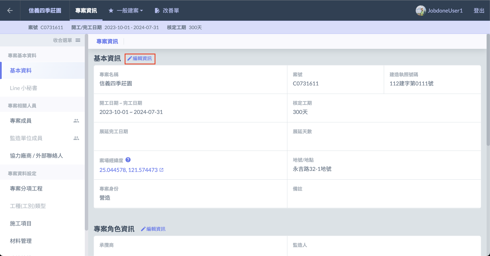

2.  修改完成後，按下儲存可完成修改；按下取消可恢復原有資料。 

    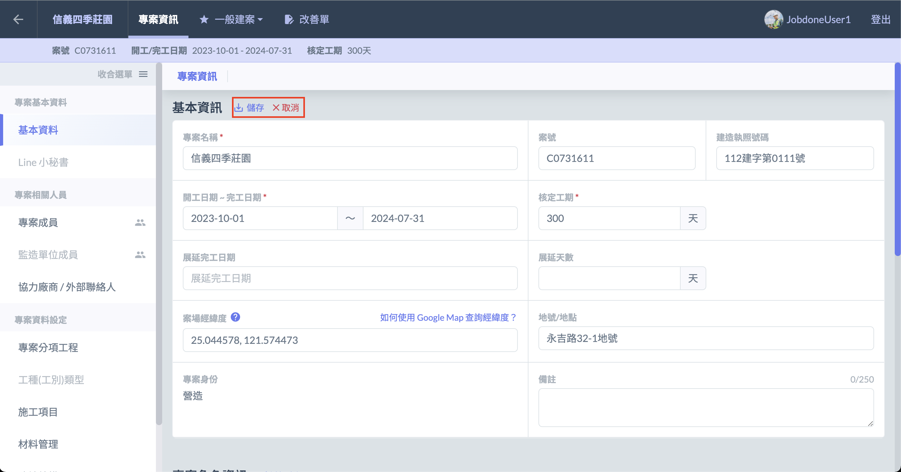

### 專案角色資訊

1.  在專案角色資訊點選「編輯資訊」，可編寫資訊。 

    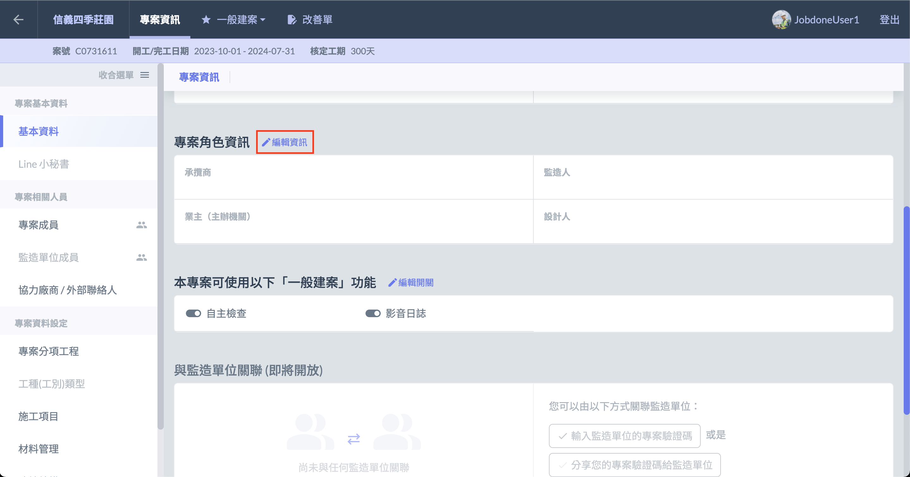
2.  完成後，按下儲存可完成修改；按下取消可恢復原有資料。 

    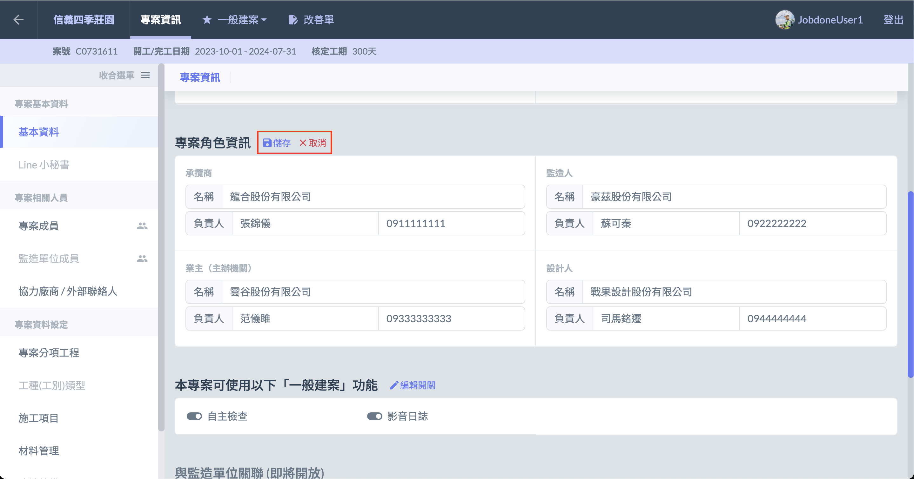

### 功能開關

1.  點選「編輯開關」按鈕，可調整該專案可使用之功能。 

    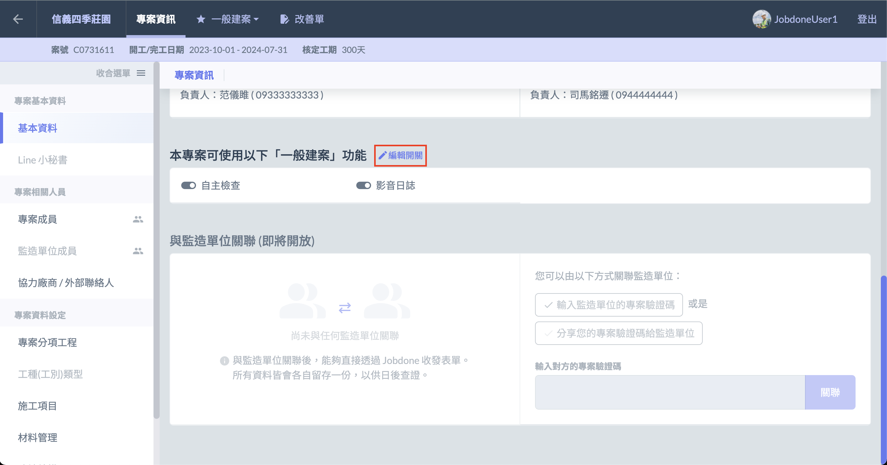
2.  按下儲存可完成修改；按下取消可恢復原有功能設定。

    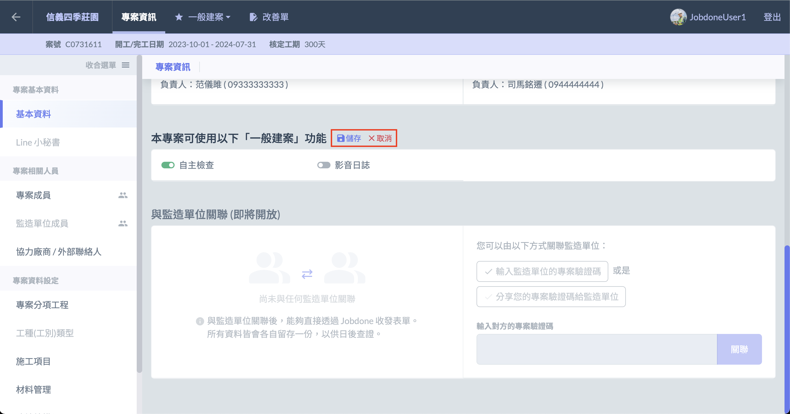

### 與監造 / 營造單位的專案關聯 

與監造 / 營造單位的專案關聯後，能夠直接透過 Jobdone 分享表單，協助您們更方便地進行工地現場管理。

有兩種方式可以關聯監造 / 營造單位的專案，您可於下圖紅框圈起處自行切換，分別為：

1. 產生專案驗證碼給監造 / 營造單位
2. 輸入監造 / 營造單位的專案驗證碼

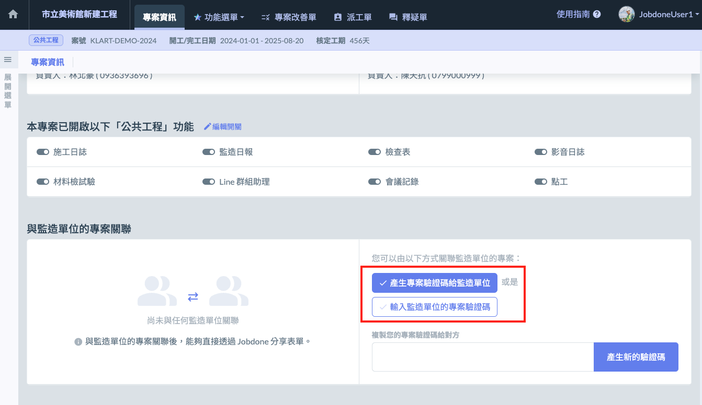

### └ 產生專案驗證碼

點選「產生新的驗證碼」按鈕（如下左圖紅框圈起處），由系統產生一組具有時效性的驗證碼（右圖），並將這組代碼複製並分享給監造 / 營造單位。

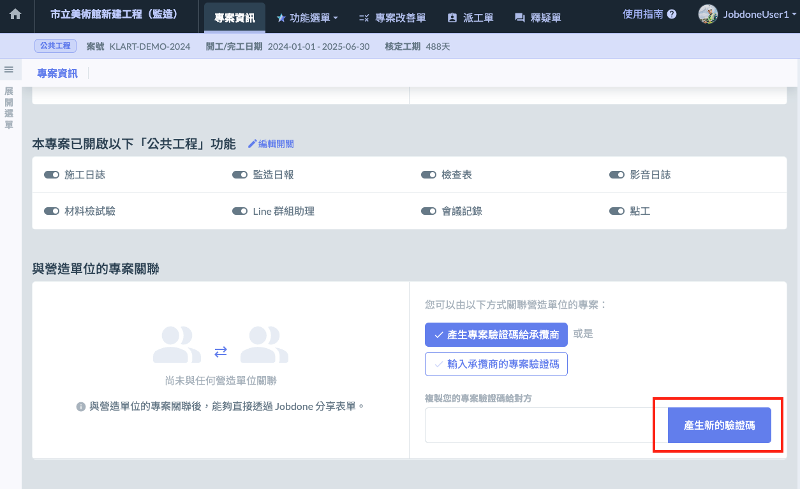 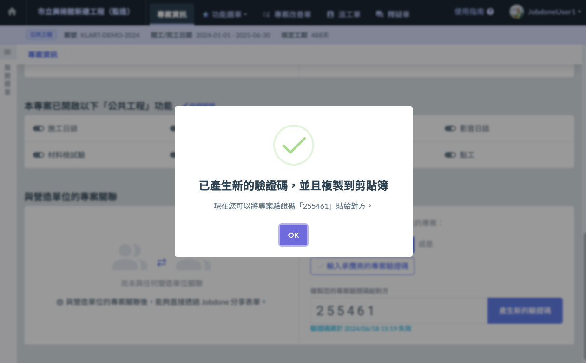

### └ 輸入專案驗證碼

收到來自監造 / 營造單位的驗證碼，您可於下圖的輸入框輸入或貼上該代碼，並點選「關聯」。

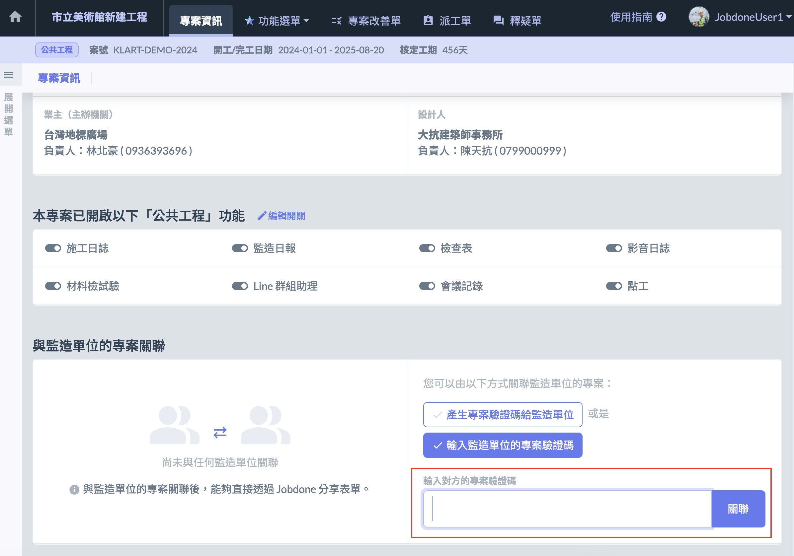

關聯成功後，畫面會長這個樣子：

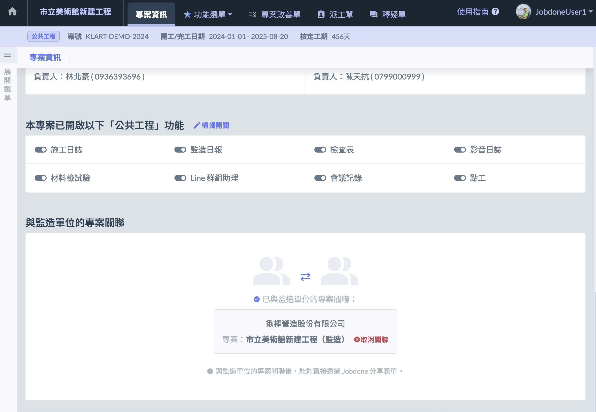

***

## APP

!!! info
    App上僅能查看專案資訊，無法編輯。

1. 登入後，點選專案清單，並選擇要查看的專案。\
     
2. 點選專案資訊\
     
3. 即可查看專案的基本資料。\
   

使用請登入  【 [**https://www.jobdone.cc**](https://www.jobdone.cc) 】
