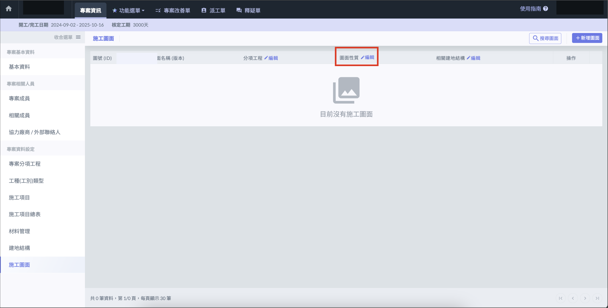
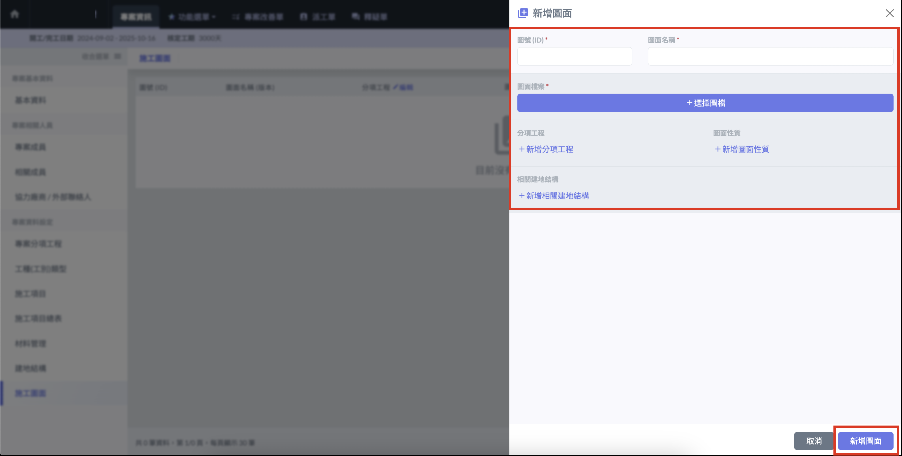
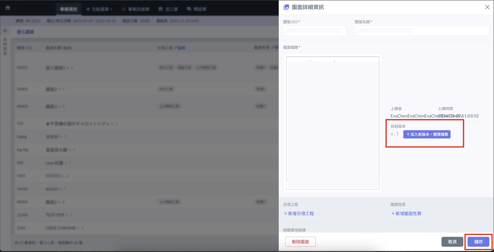
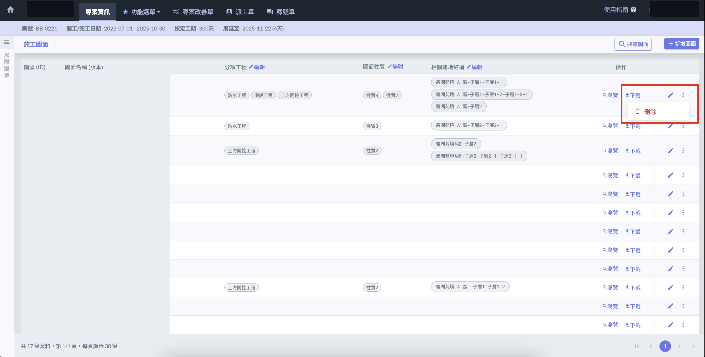

# 施工圖面

## 新增圖面性質 

進入施工圖面頁面後，點選圖面性質旁的 「 編輯 」，即可新增或刪除圖面性質。

## 新增施工圖面 

點選右上角 「 新增圖面 」 ，輸入**圖號、圖面名稱**等資訊後，即可點選 「 選擇圖檔 」，上傳施工圖面。並可選擇分項工程、圖面性質及建地結構。

!!! info
    若尚未設定分項工程及建地結構，請參[**專案分項工程**](subdivisional)[**建地結構**](construction_structure)設定。

!!! info
    圖檔可使用 PDF 及 JPG 檔

## 更新施工圖面 

若施工圖面改版，可以在既有紀錄上直接更新施工圖面。

點選施工圖面紀錄後方 「 🖊️  」 圖示 ，開啟詳細資訊頁面，點選 「 添加新版本，選擇檔案 」，即可上傳並更新圖面資訊。

## 刪除施工圖面 

點選施工圖面紀錄後方 「 **⋮** 」 ，點選刪除，即可移除施工圖面。

