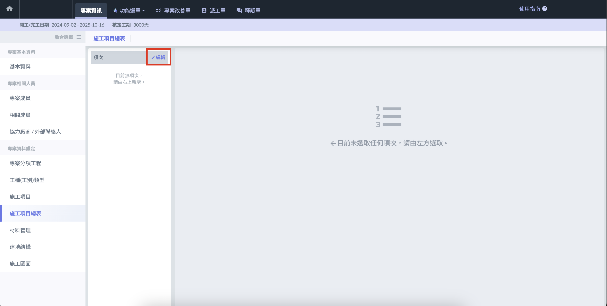
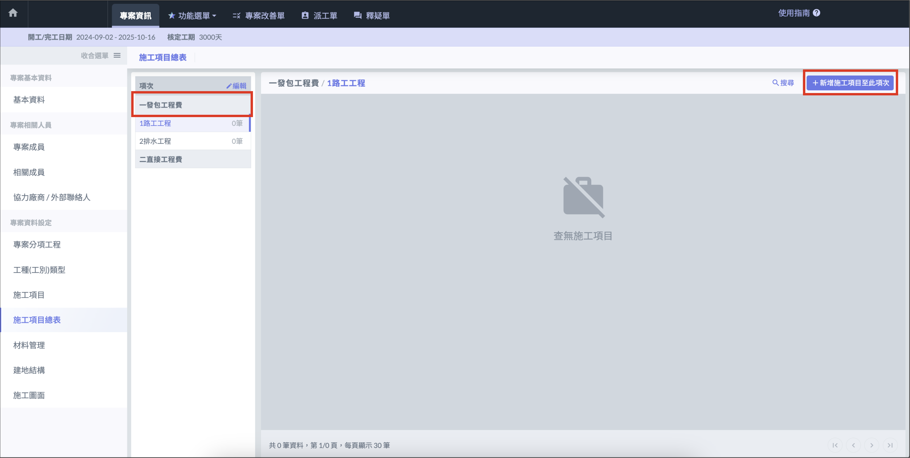
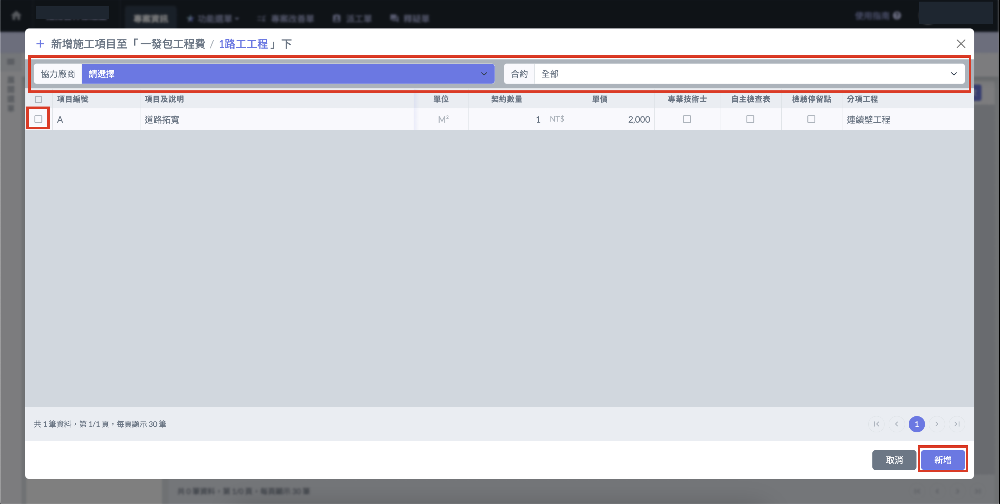
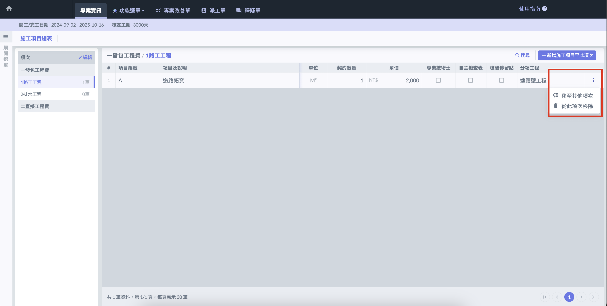

# 施工項目總表

施工項目總表可依據**項次**及**子項次**分層管理施工項目，須先完成[**建立施工項目**](construction_item)。

***

## 項次/子項次 

### 編輯項次 

於左側欄位選擇 「 編輯 」，即可新增 / 刪除 / 移動項次及子項次，編輯完成後點選 「 儲存 」。

***

## 施工項目管理 

### 新增施工項目 

選擇子項次後，點選右上角 「 新增施工項目至此項次 」。使用協力廠商及合約篩選後，即可使用勾選的方式添加一個或多個施工項目。

### 移動/移除施工項目 

點選施工項目區域，將畫面移到最右側，點擊 「 ⋮ 」 即可移動 / 刪除施工項目。

