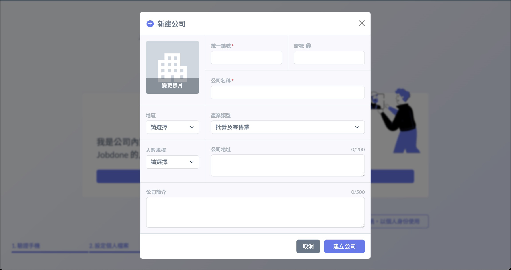
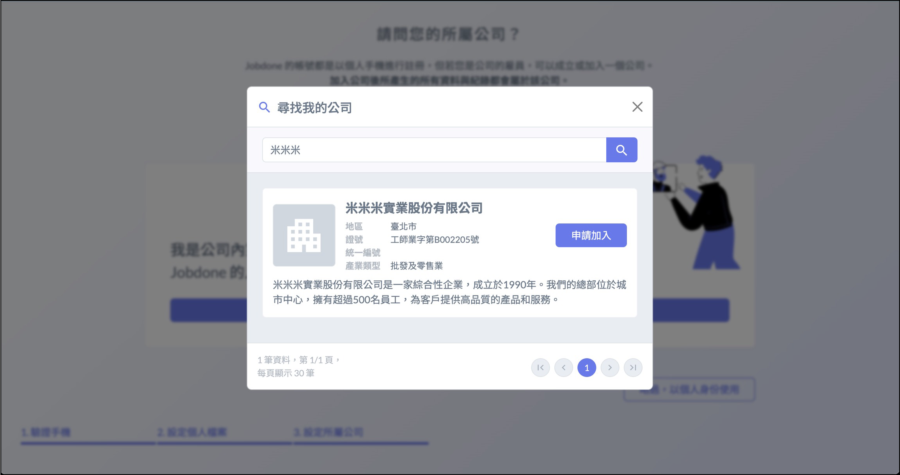
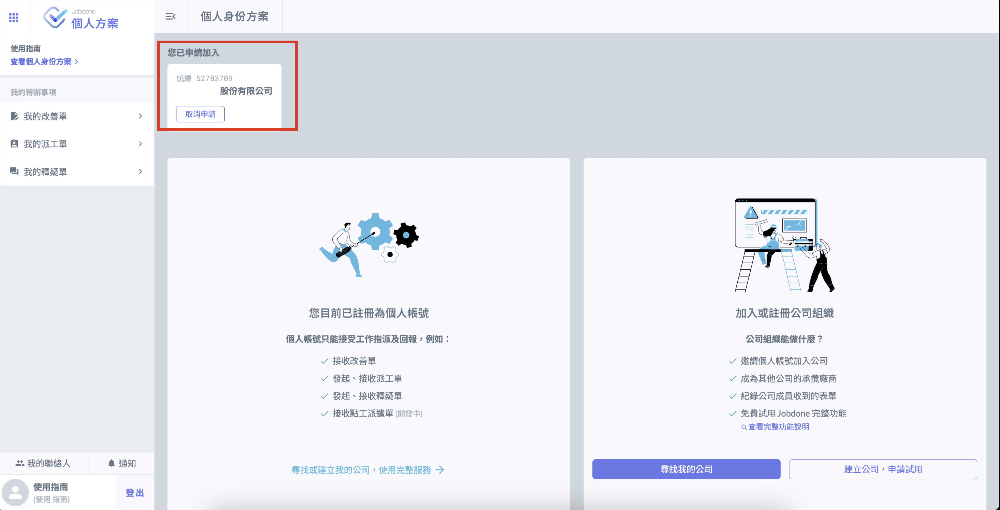

# 建立 / 加入公司

## 建立公司

帳號創建完成後，若您是公司第一個使用者，請點選 「 建立公司 」，輸入公司資料後即可建立公司。

### 尋找我的公司

如果您的公司已經正在使用 Jobdone 系統，請點選 「 尋找我的公司」，搜尋公司後申請加入。申請後可在畫面上看到申請狀態，請聯繫公司內擁有 [**帳號管理**](../../company_level/member)[**權限**](../../company_level/member) 的人通過您的申請。

